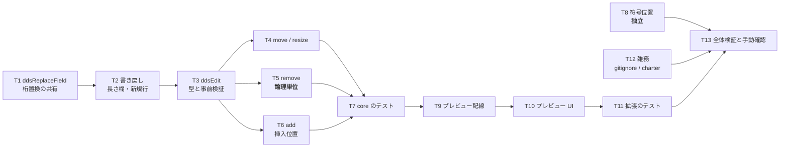

# 計画: DDS 編集能力の統合

## subtask 分割の判定: **分割しない**

決定木（`aidev-docs/DESIGN.md`「5.」）の discriminator は「**そのピースは単独で検証・デリバリ可能か**」。

- 本 work は**既存基盤の上に 2 モジュールを足し、4 ファイルを変える**規模
  （新規 2 ＋ 変更 6 ＋ テスト 3 前後）。**spec ＋ plan で 1 PR に収まる。**
- 前回（`20260825-dds-visual-editor`）は 3 パッケージ新設・約 10 モジュール・実機採取を含む規模で
  分割が要ったが、**今回は土台が既にある**ぶん小さい。
- したがって**過剰分割にあたる**（`protocol.md`「2.8」: 小〜中規模 work では使わない）。
  単一 `tasks.md` ＋ walkthrough のコミット構成で進める。

> **2026-08-27 改訂（方針転換）**: 編集の器を**VSCode 非依存のビジュアルエディタ**に変えた
> （`requirement.md` 改訂 2 / `spec.md` D11〜D14）。T9〜T11 を差し替えている。

## 実装方針

**下から積む。** 桁の書き換え → 編集操作 → プレビューの配線 → UI、の順に、
**各段でテストが書ける形**を保つ。core は `vscode` に触らないので、**上に進む前に単体で固められる**。

```
① ddsReplaceField（桁の置換を 1 か所に）
     ↓
② ddsEditWriteBack（長さ欄の書き戻し・新規行の組み立て）
     ↓
③ ddsEdit（型・検証・4 操作の適用）      ⑧ 符号位置（AC10・独立）
     ↓
④ dspfRenderModel（描画モデル＋区切り。判定は dspfLayout のまま）
     ↓
⑤ protocol / bridge / geometry（契約・通信路・座標計算）
     ↓
⑥ ui（キャンバス UI・素の web）
     ↓
⑦ editorProvider（VSCode の器） ＋ dev/standalone（単独起動の器）
```

**器を 2 つ作るのは、継ぎ目が本物かを確かめるため。** 片方でしか動かさない継ぎ目は、
いつの間にか片方に依存する。**同じ UI を 2 つのホストで動かして初めて分離が保たれる。**

### 「触る範囲を型で限定する」を最初に作る

spec D1 の `DdsEditResult`（旧範囲＋新行）は、**AC4（対象行以外がバイト不変）を実装の注意深さではなく
型で守るための形**。ここを最初に固めてから操作を足す。**この順序を崩すと、AC4 の担保が
「気をつけて書く」に落ちる**——PR #108 が座標の取り違えで削除を壊したのはその状態だった。

### 符号位置（⑧）は独立して進められる

`dspfLayout` の `occupancy` / `dataEnd` の修正は編集操作と依存関係が無い。
**既存テストの期待値が動く可能性がある**ので、他と混ぜず単独のコミットにして影響を見る。

## 作業順序と依存関係



## リスク / 留意点

- **R1: 論理単位の境界を取り違えると AC5 が壊れる。** キーワード継続行は**直前**に付き、
  条件付けの行は**次**に付く（`research.md` F7）。**削除範囲を 1 行ずらすと、隣の項目の条件行を
  巻き込むか、自分の継続行を残す**。両方向をテストで固定する（T7）。
- **R2: 符号位置の修正で既存テストの期待値が動く。** `lintCorpus.test.ts` 等が
  重なり・はみ出しの件数を持っている可能性がある。**動いたら実機の事実（`research.md` F19）を正として
  期待値を更新し、経緯を `decisions.md` に残す**。黙って書き換えない。
- **R3: HTML5 DnD と pointer 操作が混ざる。** 既存の移動は `draggable="true"` ＋ dragstart/drop
  （`research.md` F12）。リサイズハンドルを同じ要素の中に置くと、**ハンドルを掴んだつもりが
  ドラッグ移動になる**。ハンドル上では `draggable` を切る／`dragstart` を止める。
- **R4: 再描画で選択が消える。** 文書が変わるたびに HTML を作り直す（F10）ので、
  **選択は拡張側が保持して渡す**（spec D8）。ここを実装し忘れると「削除したら選択が外れる」ではなく
  「1 回操作するたびに毎回外れる」になる。
- **R5: `showInputBox` は非同期。** 配置モード中に連続クリックすると入力ボックスが積み重なる。
  **1 度に 1 つ**（入力中は次の `place` を無視する）。
- **R6: プレビューは単一セッション**（F13）。別の `.dspf` でプレビューを開くと前のセッションが閉じ、
  選択も配置モードも失われる。**既知の制限として記録**する（本 work では直さない）。
- **R7: `contributes` を増やさない。** 操作は WebView 内で完結させる。コマンドやキーバインドを
  足すと languageId 連動の既存機能に波及しうる（AGENTS.md／`contributesSideEffects.test.ts` が見張り）。

## テスト方針

### 単体（`vscode` 不要・CI で回る）

- **`ddsEdit`**: 4 操作それぞれの `DdsEditResult`（`replaceFrom` / `replaceTo` / `lines`）。
  - **削除は論理単位**（継続行つき項目・条件行つき項目の両方）。
  - **追加は様式の最後の論理単位の直後**（様式が複数あるソースで、正しい様式に入ること）。
  - **拒否**: 6 つの理由コードそれぞれ。**拒否時は何も返らない**（`applyDdsEdits` が空）。
  - **バイト不変**: 適用後の全行を組み立て、**対象範囲の外が 1 文字も変わらない**こと。
  - **複数操作**: 行番号の降順で返り、順に適用しても行番号がずれないこと。
- **書き戻し**: 長さ欄が右詰めで入る／他の桁に触れない／行末の空白の扱いが `writeBackPosition` と同じ。
- **符号位置（AC10）**: 実機で確かめた 8 通りの表
  （`S`×`B`/`I`→+1、`S`×`O`→0、`Y`×`B`/`O`→0、`A`×`B`→0）を**そのままケースにする**。

### 拡張（`vscode-stub` 経由・CI で回る）

- `dspfPreviewHtml` が選択・ハンドル・配置モードのボタンを出すこと（HTML の検査）。
- `dspfPreview` の配線の到達性（既存 `dspfPreview.test.ts` の流儀。`research.md` F24）。
- **拒否時に文書が変わらないこと**（`applyDdsEdits` が空を返す経路）。

### 既存の門番（回帰）

- `npm test`（25 ファイル）と **`npm run verify`**（原典突き合わせ 10 本＋`verify-contributes.mjs`）。
- **`contributesSideEffects.test.ts`** が languageId 波及の見張り（R7）。
- **PRTF のテスト**（`prtfLayout` / `prtfPreviewHtml` / `prtfPreviewWiring`）が、
  共有モジュール（`ddsLogicalUnits` / `ddsPositionWriteBack`）を壊していないことの見張り。

### 手動（CI に載せない）

- F5 で拡張を起動し、`docs/src/CUSTMNT.dspf` を開いてプレビューから 4 操作を実行する。
  **相互作用の AC（AC-I1〜AC-I5）はここで確認する**——選択・ハンドル・`Delete`・矢印・`Esc`。
