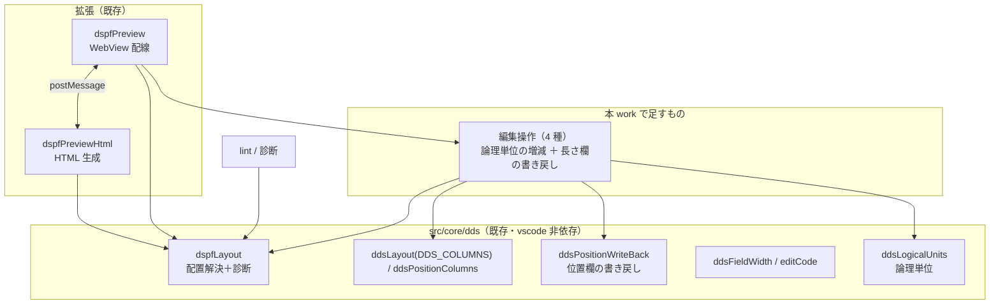

# 調査: main の DDS 基盤に編集能力を載せるための事実確認

対象は `main`（PR #107 時点）の実装と、`feature/dds-visual-editor`（PR #108・draft）の成果。
**PR #108 のコードは `git show feature/dds-visual-editor:<path>` で参照できる**（作業ツリーには無い）。

## 調査の問い

- **Q1**: main の DDS 基盤は、4 操作（移動 / 長さ変更 / 追加 / 削除）にどこまで足りているか。
- **Q2**: 「編集していない行がバイト不変」を、main の構造でどう保証するか。行を増減する操作の単位は。
- **Q3**: 既存プレビューの編集経路と UI 構造はどうなっていて、どこに操作を足すことになるか。
- **Q4**: 検証をどう繋ぐか。main は違反をどう扱っているか。
- **Q5**: PR #108 の**実機由来の知見**と main の**原典由来の規則**は一致するか。食い違うならどちらが正しいか。
- **Q6**: 追加（`addItem`）の挿入位置はどう決めるべきか。
- **Q7**: この種の UI（キャンバス上で項目を置く）の確立した操作規範は何か。
- **Q8**: テストと検証の作法（何をどこに置けば CI で守られるか）。

## 判明した事実

### Q1: 桁の定義と書き戻しは揃っている。足りないのは「行を増減する操作」

- **F1: 定位置欄の定義は 1 か所にある。** `src/core/ddsLayout.ts:14` `DDS_COLUMNS` —
  `name` 19-28 / `reference` 29 / `length` 30-34 / `dataType` 35 / `decimals` 36-37 /
  `usage` 38 / `position` 39-44。取り出しは `ddsField()`（`:38`、行が短くても空文字）。
  **長さ変更に必要な桁定義は既にある。**
- **F2: 位置欄は行/桁に分割済み。** `src/core/dds/ddsPositionColumns.ts` の
  `DDS_POSITION_ROW`(39-41) / `DDS_POSITION_COLUMN`(42-44)。
  `DDS_COLUMNS` に足さずここで**導出**しているのは、ルーラーのタブ位置の生成物と
  一致検査（`contributesSideEffects.test.ts`）が落ちるため（同ファイルのコメント）。
- **F3: 書き戻しは「桁範囲の局所置換」で、既に PR #108 と同じ流儀。**
  `src/core/dds/ddsPositionWriteBack.ts` `writeBackPosition()` は位置欄だけを差し替え、
  **他の桁に触れない**・短い行は必要分だけ空白で伸ばす・行末の余白は落とす。
  `vscode` を import しない（文字列 → 文字列）。
- **F4: 幅の解決は原典準拠で、PR #108 より進んでいる部分がある。**
  `src/core/dds/ddsFieldWidth.ts:37` `constantWidth`（`printWidth` = DBCS 込み）、
  `:47` `fieldWidth`（参照フィールドは `undefined` ＋理由、**EDTCDE の編集後幅**を
  `editCode.ts` で解決）。PR #108 に EDTCDE の解決は無い。
- **F5: 配置と診断は `resolveDspfLayout` が返す。** `src/core/dds/dspfLayout.ts:153`。
  `DspfPlacedItem`（`:70`）は kind / name / text / row / column / width / **sourceLine** /
  usage / conditioning / occupancy を持つ。**編集の宛先として `sourceLine` がそのまま使える。**
- **F6: 足りないのは行の増減。** 追加・削除に相当する関数は `core/dds` に無い
  （`git grep -l 'insert\|remove' src/core/dds` が該当なし）。長さ欄の書き戻しも無い
  （`writeBackPosition` は位置欄のみ）。

### Q2: 行の増減は「論理単位」で行う必要がある（PR #108 はここを踏み外している）

- **F7: DDS の項目は 1 行とは限らない。** `src/core/dds/ddsLogicalUnits.ts` が
  「論理単位」を定義している——**キーワードだけの行は直前の項目の続き**、
  **条件付けだけの行は次の項目への前置き**（原典「条件付け (7-16 桁目)」より、
  最後の標識と項目名は同じ行に書く＝先行行が条件の続き）。
- **F8: PR #108 の `removeItem` は代表行しか消さない。**
  `git show feature/dds-visual-editor:packages/dds-core/src/patch/ops.ts` の
  `case "removeItem"` は `removed.add(index)` のみ。継続行は `opaque` として別行に持つ設計
  （同 `dds/parse.ts:6`）なので、**削除すると継続行が孤児として残る**。
  main の論理単位を使えばこの欠陥は構造的に避けられる。
- **F9: バイト不変の保証手段は 2 つあり、main は「行単位の置換」を採っている。**
  main は `document.lineAt(index).range` を置換する（`dspfPreview.ts:85-91`）ので、
  **他の行に触れる経路がそもそも無い**。PR #108 はモデルに全行の `raw` を持ち、
  変更行だけを差し替える形（`changedLines`）。**行を増減しないなら main の方式で十分**で、
  増減するときだけ「どの範囲を置換するか」の計算が要る。

### Q3: プレビューは「サーバ側で HTML を作り直す」形。編集の入口は 2 種類だけ

- **F10: WebView は状態を持たない。** `src/language/dspfPreview.ts` は
  文書が変わるたびに `resolveDspfLayout` → `buildDspfPreviewHtml` で**HTML を作り直す**
  （同ファイル冒頭「ソースが唯一の真実」「WebView に配置状態を持たせない」）。
- **F11: 受け取るメッセージは `reveal` と `move` の 2 つだけ。** `dspfPreview.ts:114-140`。
  `move` は `sourceLine` / `row` / `column` を受け、`writeBackPosition` した 1 行を
  `WorkspaceEdit` で置換する（`:85`）。**確認も検証もしない**（`:63` のコメント:
  「帳票と違い確認を挟まない。DSPF の位置は常に絶対なので確認する内容が無い」）。
- **F12: UI 側はドラッグ＆ドロップ（HTML5 DnD）で移動する。**
  `src/language/dspfPreviewHtml.ts:183` `dataTransfer.setData`、`:212` で `move` を postMessage。
  セル寸法は**実測**（`:134` `cellSize()` — 探り要素の `dataset` から求める）。
  診断は一覧で表示（`:319` `renderDiagnostics`）、属性文字も描いている（`:230`）。
  目盛りは `ddsPreviewHtmlShared.ts` の `buildRuler`（SEU 流の `....+....1`）。
- **F13: プレビューは単一セッション。** `dspfPreview.ts` の `session` は 1 つで、
  開き直すと前のパネルを閉じる（`openPreview`）。

### Q4: main は「適用して、違反は診断で見せる」。拒否はしない

- **F14: 診断コードは 7 種。** `dspfLayout.ts:41` — `overlap` / `overflow` /
  `invalid-position` / `column-one-reserved` / `missing-position` /
  `relative-position-unresolved` / `invalid-screen-size`。
- **F15: 重なり判定は属性文字を含む占有で行い、端点の一致は重なりとしない**
  （`dspfLayout.ts:130`・`:144`）。はみ出し判定は**データ終端**で行う（`dataEnd`、
  原典「文字フィールドの最大桁数は表示画面サイズから 1 を引いた桁数」に従い、
  終了属性文字が画面外に出る配置を誤検出しない）。
- **F16: 移動は無検証で適用される**（F11）。**したがって requirement の AC6/AC7
  （違反を生む操作は適用前に拒否）は、既存の `move` の挙動と衝突する**。
  そのまま拒否を導入すると AC8（既存挙動の非後退）に反する。**spec で決着が要る**（申し送り）。

### Q5: 実機知見と原典由来の規則は、1 点を除いて一致する

- **F17: 属性文字の隣接規則は完全に一致する。**
  PR #108（実機 `CRTDSPF` の `CPD7866` 24 ケースで確定）: 違反 ⟺ `b1 < a2 + 2`。
  main（原典）: 占有は属性文字を含み、**端点の一致は重なりとしない**（`dspfLayout.ts:144`）
  → 許容は `b1 - 1 = a2 + 1`、つまり `b1 = a2 + 2` から OK。**同じ式**。
  桁 1 の扱いも一致（main は `column-one-reserved` として別診断、PR #108 は例外扱い）。
- **F18: DBCS 幅の求め方も一致。** main は `core/dbcs.ts` の `printWidth`（`ddsFieldWidth.ts:12`
  のコメント「幅は `.length` では求まらない」）。PR #108 は `displayWidth`（SO/SI 込み）。
  実機の "Expanded Source" が `'社員番号'` を `Field length = 10` と報告することで両者とも裏付け済み。
- **F19: 食い違い 1 件——`S` かつ入力可のフィールドの符号位置が main に無い。**
  PR #108 は実機で 8 通り確かめ、**35 桁が `S` かつ 38 桁が `B`/`I` のとき占有が +1 桁**
  （`git show feature/dds-visual-editor:.aidev/works/20260825-dds-visual-editor/06-cli/decisions.md` D4）。
  main の `fieldWidth`（`ddsFieldWidth.ts:47`）は長さと EDTCDE しか見ておらず、
  **符号位置を加算していない**。→ **符号付き入力フィールドの重なり・はみ出しが 1 桁ぶん甘い**。
  実機で確かめた事実なので、**main 側を直すべき**（本 work の範囲に入れるかは spec 判断）。
- **F20: 35 桁目の解釈は矛盾しない。** main は「データ・タイプ」と呼び、EDTCDE は
  「35 桁目が `S` またはブランクのときだけ有効」と原典どおり扱う（`editCode.ts:63`）。
  PR #108 は「キーボードシフト属性」と呼び、空白＋小数桁があれば数値と解釈した。
  **呼び名が違うだけで、扱いは同じ**（ブランクを数値として扱う点で一致）。

### Q6・Q7・Q8

- **F21: 挿入位置の手がかりは論理単位と `recordName`。** `DspfPlacedItem.recordName`（`dspfLayout.ts:82`）
  と論理単位（F7）から、**「その様式の最後の論理単位の直後」**が自然な挿入点になる。
  PR #108 も同じ考え方だが、単位が「行」なので継続行を跨げない（F8）。
- **F22: 既存 UI の操作は HTML5 DnD（移動）とクリック（reveal）だけ**（F12）。
  リサイズ・追加・削除に相当する UI は無く、キーボード操作も無い。
- **F23: この種の編集 UI の一般的な流儀**（複数の実装で共通・要出典レベルの一致）:
  クリックで選択 / ドラッグで移動 / **端のハンドルでリサイズ** / `Delete` で削除 /
  `Esc` でモード解除・選択解除 / **矢印キーで 1 単位ずつ移動**（PowerPoint・Figma・Visio 等）。
  WAI-ARIA APG に「キャンバス」パターンは無いため、キーボード操作は
  grid の考え方（矢印で移動・`Enter`/`Space` で操作）を借りるのが定石。
  **実機 SDA も「選んで動かす・消す」を キー操作で行う**ので、利用者の期待とも合う。
- **F24: 単体テストは `vscode` スタブ経由で動く。** `test/support/vscode-stub.js` を
  `mocha --require` で読み込む（`package.json` の `test`）。**`vscode` を import する
  モジュールでも単体テストが書ける**（`test/unit/dspfPreview.test.ts` が
  `registerDspfPreview` の配線まで検査している）。
- **F25: 検証スクリプトが CI 相当の門番。** `npm run verify` = `verify:defs`
  （原典との突き合わせ 10 本＋`verify-contributes.mjs`）＋ `verify:roundtrip`。
  **`contributesSideEffects.test.ts` が languageId 波及の見張り**（AGENTS.md の既知の罠）。
- **F26: 材料になる実サンプルがある。** `docs/src/CUSTMNT.dspf`（プレビューの単体テストが使用）。

## 影響範囲

- **触る**: `src/core/dds/`（編集操作の追加・符号位置の修正）、`src/language/dspfPreview.ts`（メッセージ追加）、
  `src/language/dspfPreviewHtml.ts`（操作 UI の追加）、`test/unit/`（テスト追加）。
- **触らない見込み**: `lint/*`（診断の出所は `dspfLayout` のまま）、`prtfPreview*`（PRTF は対象外）、
  `contributes`（コマンド・キーバインドを増やさないなら波及しない）。

## 実現性 / リスク

- **実現可能**。桁定義・書き戻し・配置解決・診断・論理単位・テスト基盤がすべて揃っており、
  本 work は**その上に「行を増減する操作」と「長さ欄の書き戻し」を足す**のが主。
- **リスク1: 既存 `move` は無検証で適用される**（F16）。AC6/AC7 をそのまま実装すると
  既存挙動が変わる。**spec で「拒否するのはどこまでか」を決める必要がある**。
- **リスク2: 論理単位を跨ぐ削除**（F7・F8）。継続行・条件行を巻き込む単位で消さないと、
  孤児のキーワード行が残る。**PR #108 のコードをそのまま移植すると踏む。**
- **リスク3: 符号位置の欠落**（F19）。main を直すと**既存の診断結果が変わる**
  （`lintCorpus.test.ts` 等の期待値に影響しうる）。範囲を spec で決める。
- **リスク4: HTML5 DnD と pointer 操作の混在**（F12・F23）。リサイズをハンドルの pointer 操作で
  足すと、既存の DnD 移動と 2 系統になる。**操作感の一貫性**を spec で決める。
- **リスク5: プレビューは単一セッション**（F13）。編集中に開き直すと状態が飛ぶ。
  「ソースが唯一の真実」なので実害は小さいが、選択状態は失われる。

## 実装アンカー

- **A1: 桁定義**（`src/core/ddsLayout.ts:14` `DDS_COLUMNS`、`:38` `ddsField`）— 長さ欄は `length: [30,34]`。
- **A2: 位置欄の書き戻し**（`src/core/dds/ddsPositionWriteBack.ts` `writeBackPosition`）—
  **長さ欄の書き戻しはここに並べるのが自然**（同じ流儀で桁範囲だけ置換）。
- **A3: 論理単位**（`src/core/dds/ddsLogicalUnits.ts`、`DDS_KEYWORD_AREA_START`）—
  追加・削除の単位はここから取る。
- **A4: 配置解決と診断**（`src/core/dds/dspfLayout.ts:153` `resolveDspfLayout`、`:70` `DspfPlacedItem`、
  `:41` `DspfDiagnosticCode`）— 編集の入力（`sourceLine` が宛先）と、適用後の検証の出所。
- **A5: 幅の解決**（`src/core/dds/ddsFieldWidth.ts:47` `fieldWidth`）— **符号位置を足すならここ**（F19）。
- **A6: プレビューの配線**（`src/language/dspfPreview.ts:114` `onDidReceiveMessage`、`:70` `moveItem`）—
  新しいメッセージ（resize / add / remove）を足す場所。
- **A7: プレビューの UI**（`src/language/dspfPreviewHtml.ts:32` `buildDspfPreviewHtml`、
  `:134` `cellSize`、`:183` dragstart、`:212` move の postMessage、`:248` `renderItem`）。
- **A8: テスト**（`test/unit/dspfPreview.test.ts`、`test/support/vscode-stub.js`、
  材料は `docs/src/CUSTMNT.dspf`）。
- **A9: PR #108 の移植元**（`git show feature/dds-visual-editor:packages/dds-core/src/patch/ops.ts` /
  `dds/serialize.ts` / `dds/parse.ts`）— **設計の考え方は使えるが、単位（行 vs 論理単位）と
  宛先（合成 ID vs `sourceLine`）は main に合わせて書き直す**。

## 実装時の注意

- **`DDS_COLUMNS` に桁を足さない**（`ddsPositionColumns.ts` のコメント）。
  ルーラーのタブ位置の生成物と一致検査が落ちる。**導出**して別ファイルに置く。
- **PR #108 の合成 ID（`REC#n`）を持ち込まない。** 再パースで振り直されるため、
  構造変更のあと**別の項目を指す**（PR #108 の review should-2 で実際に踏んだ）。
  main の `sourceLine` は**その問題が構造的に起きない**（行が消えれば宛先も消える）。
- **削除は論理単位で**（F7・F8）。継続行・条件行を巻き込む。
- **`writeBackPosition` は行末の空白を落とす**。長さ欄の書き戻しも同じ流儀に揃える
  （揃えないと「編集した行だけ行末の姿が変わる」）。
- **`vscode` を import する層と、しない層を分ける**（`src/core/` は文字列 → 文字列）。
  単体テストはスタブ経由で動く（F24）ので、**vscode 依存でもテストは書ける**。
- **診断の期待値を持つテストがある**（`lintCorpus.test.ts` 等）。符号位置を直すと動く可能性がある。

## spec への申し送り

1. ~~**拒否の方針を決める（最重要）。**~~ → **決着済み（2026-08-26・ユーザー判断）**:
   **書けないものだけ拒否**（長さ欄に収まらない・宛先の行が無い等）、
   **置けるが規則違反のものは適用して診断で見せる**。既存の移動（F16）と同じ扱いになり、
   AC8（非後退）と両立する。requirement の **AC6 / AC7 を改訂済み**。
2. **編集操作の単位は論理単位**（F7・F8）。宛先は `sourceLine`（F5・実装時の注意）。
3. ~~**符号位置（F19）を本 work で直すか。**~~ → **決着済み（2026-08-26・ユーザー判断）**:
   **本 work で直す**。`ddsFieldWidth.ts:47`（A5）に「`35 桁 = S` かつ `38 桁 = B`/`I` なら +1 桁」を入れ、
   **回帰テストの期待値更新まで**を範囲に含める（requirement の対象と AC10 に追加済み）。
   編集で重なり判定を使う以上、1 桁ずれたまま使うのは危うい。
4. **UI の操作は既存の DnD 移動を変えずに足す**（F12・F22・F23）。
   リサイズはハンドル、削除は `Delete`、追加はモード＋クリック、`Esc` で解除、矢印で 1 桁移動。
5. **EDTCDE の編集後幅（F4）は main が既に持っている**。編集操作でもこれを通す
   （長さを変えたら幅が変わる項目がある）。
6. **PRTF は対象外**だが、`ddsLogicalUnits` / `ddsPositionWriteBack` は PRTF と共有されている。
   **共有部分を壊さない**（PRTF プレビューのテストが回帰の見張りになる）。
