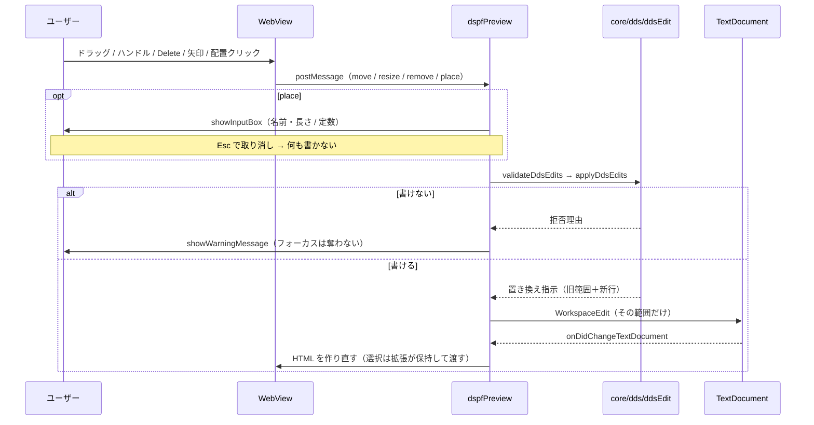

# 仕様: DDS 編集能力の統合

> **2026-08-27 改訂（方針転換・ユーザー判断）**: 編集の器を「既存プレビューの拡張」から
> **VSCode 非依存のビジュアルエディタ**に変えた。D8〜D10 を差し替え、D11〜D14 を足している。
> 既存プレビューには**手を触れない**（読むための器として残す）。

## 概要

`main` の DDS 基盤（`core/dds/*`）の上に **「行を増減する編集操作」と「長さ欄の書き戻し」**を足し、
既存の DSPF プレビューから**移動・長さ変更・追加・削除**の 4 操作を行えるようにする。

**新しい真実源を作らない**のが全体を貫く方針。桁定義・幅の解決・配置解決・診断・論理単位は
既にあるもの（`research.md` F1〜F7）を使い、本 work が足すのは**編集そのもの**に限る。

## 設計方針

### D1. 編集は `core/dds/ddsEdit.ts` に置き、「行の配列 → 置き換え指示」で完結させる

`vscode` を import しない（`src/core/` の規約・`research.md` F3）。入力は `resolveDspfLayout` と
**同じ `readonly string[]`** にして、呼び出し側が 2 つの形を持ち替えずに済むようにする。

戻り値は**新しい全行**ではなく **「旧行のどの範囲を、どの行で置き換えるか」**にする。

```ts
export interface DdsEditResult {
  /** 置き換える旧行の範囲。0 始まり・`replaceTo` は含まない。 */
  readonly replaceFrom: number;
  readonly replaceTo: number;
  /** 置き換え後の行。**空配列なら削除**。 */
  readonly lines: readonly string[];
}
```

**なぜこの形か。** PR #108 は「適用後テキスト」と「変更範囲」を返す設計で、
**その範囲を旧文書の座標として使う取り違え**を実際に踏んだ（削除で行が消えず後続行が複製された。
`git show feature/dds-visual-editor:.aidev/works/20260825-dds-visual-editor/07-editor-webview/review.md`）。
**旧範囲と新行を別々に返せば、座標の取り違えが起こりようがない。**
差分計算も要らず、呼び出し側は `Range` に写すだけになる。

### D2. 操作の宛先は `sourceLine`。合成 ID を導入しない

`DspfPlacedItem.sourceLine`（`dspfLayout.ts:70`）をそのまま使う。

PR #108 は `${様式}#${通番}` の合成 ID を持ったが、**再パースで振り直されるため構造変更のあと
別の項目を指す**（同 review の should-2）。`sourceLine` は行が消えれば宛先も消えるので、
**同じ事故が構造的に起きない**。

### D3. 編集操作は 4 種。ソース行に対する操作として定義する

```ts
export type DdsEdit =
  | { readonly kind: "move";   readonly sourceLine: number; readonly row: number; readonly column: number }
  | { readonly kind: "resize"; readonly sourceLine: number; readonly length: number }
  | { readonly kind: "remove"; readonly sourceLine: number }
  | { readonly kind: "add";    readonly recordName: string; readonly item: NewDspfItem };

export interface NewDspfItem {
  readonly kind: "field" | "constant";
  readonly name?: string;      // field
  readonly text?: string;      // constant（引用符は付けずに渡す）
  readonly length?: number;    // field
  readonly dataType?: string;  // 35 桁
  readonly decimals?: number;  // 36-37 桁
  readonly usage?: string;     // 38 桁
  readonly row: number;
  readonly column: number;
}
```

`sourceLine` は 1 始まり（`DspfPlacedItem` と揃える）。`replaceFrom` / `replaceTo` は 0 始まり
（配列の添字と揃える）。**境界で混ぜない**ために、型名と単位をコメントで明記する。

### D4. 追加・削除の単位は「論理単位」

DDS の項目は 1 行とは限らない（キーワードの継続行が続き、条件付けの行が前に付く。
`research.md` F7）。**削除は論理単位ごと**行い、継続行を孤児にしない。
**追加は様式の最後の論理単位の直後**に 1 行入れる。

移動・長さ変更は**代表行の桁範囲だけ**を置換するので、単位は代表行 1 行でよい。

> PR #108 の `removeItem` は代表行しか消さない（`research.md` F8）。**この点は移植せず、
> `ddsLogicalUnits` の単位に置き換える。**

### D5. 拒否するのは「ソースに書けないもの」だけ

`main` は移動を無検証で適用し、違反は診断で見せる（`research.md` F16）。**この思想を維持する。**

| 種別 | 例 | 扱い |
|---|---|---|
| **書けない** | 長さが 30-34 桁（5 桁）に収まらない／行・桁が 3 桁に収まらない／宛先の行が無い・項目行でない／追加先の様式が無い／定数に長さを指定 | **拒否**（何も書かない） |
| **規則違反** | 重なり・はみ出し・1 桁目・相対桁 | **適用して診断で見せる**（既存の移動と同じ） |

**元からある違反が編集を妨げない**（requirement US3）のは、この方針から自動的に従う——
そもそも違反を理由に止めない。

複数操作をまとめて適用する場合は**先に全件を検証**し、1 つでも拒否対象があれば**何も適用しない**。

### D6. 桁の書き換えは `ddsField` の対を 1 つ作って共有する

`core/ddsLayout.ts` に `ddsReplaceField(text, column, value)` を置く（`ddsField` の対）。
既存の `ddsPositionWriteBack.ts` の内部関数 `replaceColumns` はこれに置き換える
（**同じ処理を 2 か所に持たない**）。長さ欄の書き戻しも同じものを使う。

**桁欄の値の詰め方は既存に揃える**——数値は右詰め（原典「右寄せで指定しなければなりません」）、
書き換え後の行末の空白は落とす（`writeBackPosition` の既存挙動）。

### D7. 符号位置は `width` ではなく `occupancy` と はみ出し判定に入れる

実機で確定した規則（`research.md` F19）: **35 桁が `S` かつ 38 桁が `B`/`I` のとき、占有が +1 桁**。

**`ddsFieldWidth.fieldWidth` には足さない。** `DspfPlacedItem.width` は
**描画にも使われている**（`dspfPreviewHtml.ts:255`）が、符号位置は画面上は空白なので、
描画幅に含めると存在しない文字を描くことになる。

入れる場所は `dspfLayout.ts` の 2 か所:

- **`occupancy`**（`:130` 付近・属性文字を含む実効占有）に符号位置ぶんを足す。
- **`dataEnd`**（はみ出し判定）に符号位置ぶんを足す——画面の桁は実際に占有するため。

### ~~D8. 選択状態は拡張側が持つ~~ → **D11 に差し替え**（プレビューを触らないため不要）

<details><summary>差し替え前の記述（既存プレビューを拡張する前提）</summary>

### D8. 選択状態は**拡張側**が持つ。WebView は状態を持たない

既存は文書が変わるたびに HTML を作り直す（`research.md` F10）。選択を WebView に持たせると
**再描画のたびに消える**。`activeSourceLine` と同じ形で、拡張が `selectedSourceLine` を持ち、
HTML 生成に渡す。

- **クリックは reveal と選択の両方**を行う（既存の reveal を残したまま選択を足す）。
- 削除の直後は選択を**捨てる**（宛先の行が無くなるため）。追加の直後は**新しい行を選択**する。

</details>

### ~~D9. WebView → 拡張のメッセージを 3 つ足す~~ → **D12 に差し替え**

<details><summary>差し替え前の記述</summary>

### D9. WebView → 拡張のメッセージを 3 つ足す。拡張 → WebView は増やさない

```
webview → host : {type:"reveal", sourceLine}                 （既存）
                 {type:"move",   sourceLine, row, column}     （既存）
                 {type:"select", sourceLine}                  （新・選択のみ）
                 {type:"resize", sourceLine, length}          （新）
                 {type:"remove", sourceLine}                  （新）
                 {type:"place",  kind, row, column}           （新・追加の位置決め）
```

**拒否の理由は `showWarningMessage` で出す**（既存の `moveItem` が
「ソースが変わっています」で使っている流儀。`dspfPreview.ts:76`）。
VSCode の通知は**フォーカスを奪わない**ので requirement の AC-I4 を満たす。
これにより **拡張 → WebView のメッセージを増やさずに済み**、WebView は表示専用のまま保たれる。

</details>

### D10. 追加の内容は**ホストに聞く**（入力手段はホストが持つ）

`place` を受けたら、拡張側が `showInputBox` で内容を聞いて `add` を組み立てる。

- フィールド: 名前 → 長さ（既定 `10`）。
- 定数: 文字列。

**UI にフォームを持たせない。** 入力の作法はホストごとに違う——VSCode は `showInputBox`、
単独起動はダイアログ。UI は「聞いてほしい」と言うだけ（`askItem`）で、返事を待つ。
`Esc`（取り消し）なら**何も追加されない**（AC-I1）。

### D11. UI は素の web として書き、`acquireVsCodeApi` は bridge の 1 か所に閉じる

**この work の中核。** キャンバス UI（`src/dds/webview/ui.ts`）は `vscode` にも
`acquireVsCodeApi` にも触らない。ホストとは `protocol.ts` のメッセージだけで会話する。

| 層 | 置き場所 | 依存 |
|---|---|---|
| 描画モデル | `src/core/dds/dspfRenderModel.ts` | `dspfLayout`（判定は既存のまま） |
| 契約・ホスト能力 | `src/dds/webview/protocol.ts` | 型だけ |
| 通信路 | `src/dds/webview/bridge.ts` | **`acquireVsCodeApi` はここだけ** |
| セル座標の計算 | `src/dds/webview/geometry.ts` | 無し（純関数） |
| キャンバス UI | `src/dds/webview/ui.ts` | 上記 3 つ |
| VSCode の器 | `src/dds/editorProvider.ts` | `vscode` ＋ core |
| 単独起動の器 | `dev/standalone.ts` | core（`Bridge` の別実装） |

**同じ UI が 2 つのホストで動くことを、実際に動かして確かめる**（`dev/e2e.mjs`）。
「動くはず」で終わらせない——継ぎ目は使わないと腐る。

### D12. UI は文字を数えない。区切り（`segments`）は core が渡す

DBCS は SO/SI が桁を消費するので、**リテラルを開始桁にそのまま置くと 1 桁ずれる**。
かといって UI に全角判定を持たせると、桁の真実源が 2 つになる。
そこで `RenderItem.segments`（文字と占有桁数の対）を core が計算して渡し、
UI は `cols × セル幅` の箱に流すだけにする。区切りの合計は `printWidth` と一致する（テストで固定）。

### D13. 既定のエディタを奪わない。プレビューは触らない

`contributes.customEditors` は **`priority: "option"`**。`.dspf` をダブルクリックすれば
これまでどおりテキストエディタが開き、ルーラー / SOSI / lint / アウトラインが効く。
**既存プレビュー（`showDspfPreview`）は 1 行も変えない**——読むための器として残す。

### D14. セル幅は実測する。CSS の `ch` を使わない

`ch` は「`0` の文字送り幅」で、**日本語混在の等幅フォントで DBCS 幅と一致する保証が無い**。
起動時に測定用要素で実幅を測り、CSS 変数に入れる。**測定値は画面に出す**——
桁がずれたとき最初に見る場所を用意しておく。

## 対象範囲

### 追加

| パス | 内容 |
|---|---|
| `src/core/dds/ddsEdit.ts` | 4 操作の適用と事前検証（D1・D3・D4・D5） |
| `src/core/dds/ddsEditWriteBack.ts` | 長さ欄の書き戻しと新規行の組み立て（D6） |
| `src/core/dds/dspfRenderModel.ts` | 描画モデル＋区切り（D12）。判定は `dspfLayout` のまま |
| `src/dds/webview/protocol.ts` | 契約とホスト能力（D11） |
| `src/dds/webview/bridge.ts` | `acquireVsCodeApi` の唯一の呼び出し箇所（D11） |
| `src/dds/webview/geometry.ts` | セル座標の計算（純関数） |
| `src/dds/webview/ui.ts` / `ui.css` | キャンバス UI（素の web） |
| `src/dds/webview/main.ts` | VSCode 向けエントリ |
| `src/dds/editorProvider.ts` | `CustomTextEditorProvider`（仲介のみ） |
| `src/dds/webviewHtml.ts` | CSP つき HTML（純関数・テスト可能） |
| `esbuild.webview.mjs` / `tsconfig.webview.json` | WebView の型検査とバンドル |
| `dev/standalone.*` / `dev/e2e.mjs` / `dev/README.md` | 単独起動ハーネスと実操作 e2e |
| `test/unit/ddsEdit.test.ts` ほか 4 本 | 編集・描画モデル・契約・座標・HTML の単体テスト |

### 変更

| パス | 変更内容 |
|---|---|
| `src/core/ddsLayout.ts` | `ddsReplaceField` を追加（`ddsField` の対・D6） |
| `src/core/dds/ddsPositionWriteBack.ts` | 内部実装を `ddsReplaceField` / `ddsField` に寄せる |
| `src/core/dds/ddsLogicalUnits.ts` | `LogicalUnit.sourceLines`（削除の単位）と `unitItemKind` を追加 |
| `src/core/dds/dspfLayout.ts` | 符号位置を `occupancy` と はみ出し判定に反映（D7）／種別判定を共有／`dataType` を公開 |
| `src/language/registration.ts` | エディタの登録を 1 行足す |
| `package.json` | `contributes.customEditors`（`priority: "option"`）・esbuild・スクリプト |
| `.gitignore` / `.aidev/charter.md` | `.vscode-test/` の無視／DDS 視覚編集をゴールに追加 |

### 変更しない（明示）

- **`src/language/dspfPreview*.ts` / `prtfPreview*.ts`** — プレビューは読むための器のまま（D13）。
- `src/lint/*`・`src/cli/lint.ts` — 診断の出所は `dspfLayout` のままで、恩恵だけ受ける。
- `contributes.languages` / `grammars` / キーバインド — 増やさない（AGENTS.md の波及チェック）。

## インターフェース / データ構造

### `core/dds/ddsEdit.ts`

```ts
/** 適用できない理由。**「ソースに書けない」ものだけ**が並ぶ（D5）。 */
export type DdsEditRejectionCode =
  | "line-not-found"        // 宛先の行が無い／項目行でない
  | "length-out-of-range"   // 長さが 30-34 桁（5 桁）に収まらない・1 未満
  | "position-out-of-range" // 行/桁が 39-41・42-44 桁（各 3 桁）に収まらない・1 未満
  | "record-not-found"      // 追加先の様式が無い
  | "constant-has-length"   // 定数に長さを指定した（原典: 固定情報に桁数は指定しない）
  | "field-needs-name";     // フィールドに名前が無い

export interface DdsEditRejection {
  readonly code: DdsEditRejectionCode;
  readonly message: string;
  /** 1 始まり。宛先が行に紐づかない場合は undefined。 */
  readonly sourceLine?: number;
}

/** 事前検証。**何も書かない**。 */
export function validateDdsEdits(
  lines: readonly string[],
  edits: readonly DdsEdit[]
): readonly DdsEditRejection[];

/**
 * 適用する。**1 つでも拒否対象があれば空配列を返し、何も適用しない**（AC7）。
 * 返るのは「旧行のどの範囲を、どの行で置き換えるか」の列（D1）。
 * 複数の指示は**行番号の降順**で返す——先頭から適用しても後続の行番号がずれない。
 */
export function applyDdsEdits(
  lines: readonly string[],
  edits: readonly DdsEdit[]
): readonly DdsEditResult[];
```

### `core/ddsLayout.ts`（追加）

```ts
/** 桁範囲を置き換える。`ddsField` の対。行が短ければ必要分だけ空白で伸ばす。 */
export function ddsReplaceField(text: string, column: DdsColumn, value: string): string;
```

## 振る舞いの詳細

### 4 操作の適用結果

| 操作 | 置き換える範囲 | 置き換え後 |
|---|---|---|
| `move` | 代表行 1 行 | 位置欄（39-44）だけ書き換えた行 |
| `resize` | 代表行 1 行 | 長さ欄（30-34）だけ書き換えた行 |
| `remove` | **その項目の論理単位の全行** | **0 行**（削除） |
| `add` | 様式の最後の論理単位の**直後**（`replaceFrom == replaceTo`＝挿入） | 新しい 1 行 |

### 編集からプレビュー更新までの流れ



### キーボードと選択（requirement の相互作用 AC）

| 操作 | 挙動 |
|---|---|
| 項目をクリック | **選択** ＋ 該当行へジャンプ（既存の reveal を残す） |
| `Delete` / `Backspace` | 選択中の項目を削除（論理単位ごと） |
| 矢印キー | 選択中の項目を 1 行 / 1 桁動かす |
| リサイズハンドル（右端）をドラッグ | 長さ変更。**フィールドのみ**（定数は長さ欄を持たない） |
| ツールバー「フィールドを置く」「定数を置く」 | 配置モードに入る。カーソルは `crosshair` |
| 配置モード中にキャンバスをクリック | その桁を `place` として送る |
| `Esc` | 配置モードを抜ける／選択を外す。**何も書き換えない** |

### エッジケース

- **幅不明の項目**（参照フィールド・ユーザー定義 EDTCDE 等。`research.md` F4）:
  移動・削除はできる。**リサイズは長さ欄が無い／解決できないので拒否**（`length-out-of-range` ではなく
  `line-not-found` に落とさず、専用の理由を返す）。
- **定数のリサイズ**: 定数は桁数欄を持たない（原典）。ハンドルを出さない。要求が来たら
  `constant-has-length` で拒否する。
- **1 桁目への配置**: 規則違反（属性文字用に予約）だが**書ける**ので適用し、既存の
  `column-one-reserved` 診断で見せる（D5）。ドラッグ中のヒントは既存のまま出す。
- **相対桁（`+n`）の項目**: 位置欄が相対の項目に `move` を適用すると**絶対桁に変わる**。
  これは意図した挙動（動かした結果を書くしかない）。**適用前に警告を出す**。
- **削除後の選択**: 宛先が消えるので選択を捨てる。**追加後は新しい行を選択**する。
- **プレビューを開き直したとき**: 選択は失われる（セッションが作り直されるため。`research.md` F13）。

## ドメイン固有の考慮

- **桁の基準は 1 か所**（`DDS_COLUMNS`）。`ddsPositionColumns.ts` の先例に倣い、
  **`DDS_COLUMNS` に桁を足さない**——ルーラーのタブ位置の生成物との一致検査が落ちる（`research.md` F2）。
- **DBCS**: 定数の追加では、リテラルの表示桁は `printWidth` が求める（`core/dbcs.ts`）。
  **SO/SI をソースに書かない**（実機の変換で挿入されるため。PR #108 research F4）。
- **原典準拠**: 「固定情報フィールドに桁数を指定してはならない」「数値欄は右詰め」など、
  既にコードのコメントに原典引用がある。**新しい規則を足すときは同じ形で引用を添える**（AGENTS.md）。
- **符号位置は実機で確定した事実**（`research.md` F19）。原典に該当記述を見つけられていないため、
  **コメントに実機での確認手順（8 通りの表）を残す**。

## エラー処理 / 異常系

| 事象 | 扱い |
|---|---|
| 宛先の行が既に無い（ソースが変わった） | `line-not-found` で拒否し、既存と同じ文言で「プレビューを開き直してください」を出す |
| 長さ欄に収まらない値 | `length-out-of-range` で拒否。**何も書かない** |
| 追加先の様式が見つからない | `record-not-found` で拒否 |
| `showInputBox` の取り消し | 何も書かない。配置モードは抜ける |
| WebView からの不正メッセージ | 無視してログに残す（既存の型チェックの流儀を踏襲） |
| 複数操作の一部が拒否 | **何も適用しない**（AC7）。理由はまとめて 1 通の警告に出す |

## 受け入れ基準との対応

| AC | 満たし方 |
|---|---|
| **AC1** 長さ変更 → 30-34 桁 | `resize` が長さ欄だけを `ddsReplaceField` で置換（D6）。UI はつまみで送る |
| **AC2** 追加 → 行が 1 本増える | `add` が様式の最後の論理単位の直後に挿入（D4）。`replaceFrom == replaceTo` |
| **AC3** 削除 → 行が 1 本減る | `remove` が**論理単位ごと**削除（D4）。継続行を孤児にしない |
| **AC4** 対象行以外がバイト不変 | 戻り値が「旧範囲＋新行」なので、**触る範囲が型で限定**される（D1）。単体テストで 4 操作すべて固定 |
| **AC5** コメント・継続行・未対応キーワードの保持 | 論理単位の外は 1 行も触らない。移動・長さ変更は桁範囲のみ |
| **AC6** 書けないものだけ拒否 | `validateDdsEdits` の理由コードは**書けないものだけ**（D5）。規則違反は適用して診断で見せる |
| **AC7** 部分適用しない | `applyDdsEdits` は 1 件でも拒否があれば**空を返す**（I/F の記述） |
| **AC8** 既存挙動の非後退 | `contributes` を増やさない／移動の挙動を変えない／lint・アウトライン・補完は無変更。`npm run verify` と `npm test` を通す |
| **AC9** 判定を一本化 | 幅・重なり・はみ出しは `dspfLayout` / `ddsFieldWidth` のまま。`ddsEdit` は**判定を持たない**（書ける／書けないだけ） |
| **AC10** 符号位置 | `occupancy` と `dataEnd` に反映（D7）。実機 8 通りの表を回帰テストにする |
| **AC-I1** 開く / 閉じる | 配置モードは UI のボタンで開始、`Esc` で解除。ホストの入力を取り消せば何も書かない（D10） |
| **AC-I2** 確定 / 取り消し | リサイズはドラッグを離して確定。拒否されたら**ホストのモデルから描き直す**ので元の姿に戻る（UI は元位置を覚えない） |
| **AC-I3** キーボードだけで完結 | クリックで選択 → 矢印で移動 → `Delete` で削除（振る舞いの表） |
| **AC-I4** フォーカスの行き先 | 拒否理由はキャンバス上部の状態表示に出す（フォーカスを奪わない）。追加の入力はホストが受け、取り消せば元へ戻る |
| **AC-I5** 既存操作を妨げない | **別の器なので既存の操作に触れない**（プレビューは無変更）。エディタ内のキーは**選択がある時だけ**効き、外へ漏らさない |
