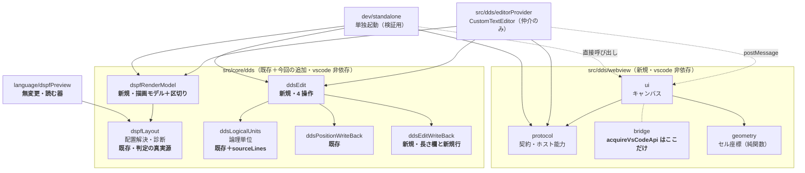
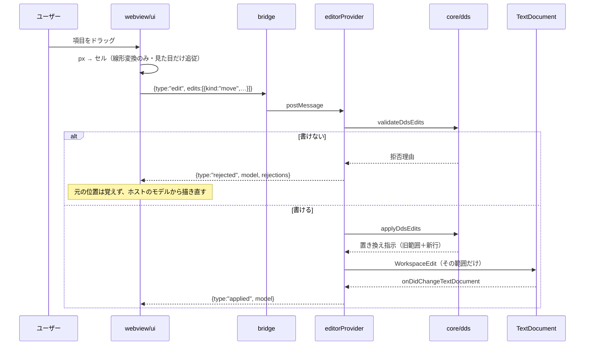

# レビューガイド: DDS 編集能力の統合

> 新規 12 ファイル・約 4,000 行。**どこを・なぜ見るか**に絞った案内。`path:line` はクリックで飛べる。

## 変更概要 / 目的

`.dspf` の配置を **GUI で「組み立てられる」**ようにする。既存のプレビューは
**移動しかできず**、書き戻しも位置欄（39-44 桁）に限られていた。ここに
**長さ変更・追加・削除**を足し、**触っていない行が 1 バイトも変わらない**ことを構造で保証する。

**器は新設した**（既存プレビューには 1 行も触れていない）。理由は
「**VSCode は埋め込み先の 1 つ**」という PJ の方針で、UI を `vscode` 非依存に保つため。
同じ UI が VSCode の外でも動くことを、**実際に動かして確かめている**（`dev/e2e.mjs` 15/15）。

## 全体像



**判定は 1 か所のまま。** 幅・重なり・はみ出し・DBCS 幅は `dspfLayout` / `ddsFieldWidth` /
`dbcs` が持ち、今回足した層は**それを使うだけ**。

## 重要ポイント（特に見てほしい所）

### 1. 戻り値の形が AC4（バイト不変）を型で守っている

`vscode-extension/src/core/dds/ddsEdit.ts:126`（`applyDdsEdits`）が返すのは
**「旧行のどの範囲を、どの行で置き換えるか」**であって、適用後の全文ではない。

```ts
{ replaceFrom: 5, replaceTo: 7, lines: ["…"] }   // 旧 5-6 行目 → 1 行に置換
{ replaceFrom: 5, replaceTo: 5, lines: ["…"] }   // 挿入
{ replaceFrom: 5, replaceTo: 7, lines: [] }      // 削除
```

**「適用後テキスト＋変更範囲」を返す設計は、その範囲を旧文書の座標として使った瞬間に
行数が変わる操作で壊れる**（別実装で実際に踏み、削除で後続行が複製された）。
旧範囲と新行を別々に返せば、取り違えが起こりようがない。

### 2. 削除は「論理単位」ごと

`vscode-extension/src/core/dds/ddsEdit.ts:171`（`removalRuns`）。DDS の項目は 1 行とは限らない——
**キーワード継続行は直前に付き、条件付けの行は次に付く**。代表行だけ消すと継続行が孤児になる。

単位は共有モジュールが持つ（`src/core/dds/ddsLogicalUnits.ts` の `sourceLines`）。
**注記行はどの単位にも属さないので消えない**——結果として範囲は連続とは限らず、
だから戻り値は配列になっている。

### 3. 拒否するのは「ソースに書けないもの」だけ

`vscode-extension/src/core/dds/ddsEdit.ts:74`（`validateDdsEdits`）。
長さが桁数欄に収まらない・宛先の行が無い・定数に長さ、などは拒否する。
一方で**重なり・はみ出し・1 桁目は通す**——既存のプレビューが移動を無検証で適用しているのと同じ扱いで、
**直すために動かしたい**という正当な操作を止めないため。違反は診断で見せる。

### 4. UI は文字を数えない（区切りは core が渡す）

`vscode-extension/src/core/dds/dspfRenderModel.ts:129`（`constantSegments`）。
DBCS は SO/SI が桁を消費するので、リテラルを開始桁にそのまま置くと**1 桁ずれる**。
かといって UI に全角判定を持たせると桁の真実源が 2 つになる。
そこで**文字と占有桁数の対**を core が渡し、UI は `cols × セル幅` の箱に流すだけにする。

区切りの合計が `printWidth` と一致することをテストで固定してある。

### 5. 符号位置は `width` ではなく `occupancy` に入れた

`vscode-extension/src/core/dds/dspfLayout.ts:155`（`signPositions`）/ `:168`（`occupancyOf`）。
**35 桁が `S` かつ 38 桁が `B`/`I` なら画面上 1 桁多く占める**（実機 8 通りで確認）。

`width` は**描画にも使われている**ので、そこに足すと**存在しない文字を描く**ことになる。
占有（重なり判定）とはみ出し判定にだけ効かせるのが正しい置き場所。

### 6. 継ぎ目が本物かを、2 つのホストで動かして確かめている

`vscode-extension/src/dds/webview/bridge.ts` が `acquireVsCodeApi` の唯一の呼び出し箇所。
UI（`ui.ts:57` `startEditor`）は `vscode` に触らない。

- VSCode の器: `src/dds/editorProvider.ts:39`（`registerDdsVisualEditor`）
- 単独起動の器: `dev/standalone.ts`（`Bridge` の別実装。`postMessage` ではなく直接呼び出し）

**片方でしか動かさない継ぎ目は、いつの間にか片方に依存する。** だから
「単独起動で 15 件の操作を通す」こと自体を検証手段にしている（`dev/e2e.mjs`）。

## 処理フロー（ドラッグ 1 回で何が起きるか）



`applied` は**変更イベントからだけ**送る（`editorProvider.ts:138` `applyEdits` の末尾コメント）。
テキスト側で直接編集された場合も同じ道を通るので、双方向同期に別経路を作らずに済む。

## 主要な変更箇所

| パス | 要点 |
|---|---|
| `src/core/ddsLayout.ts` | `ddsReplaceField`（`ddsField` の対）。**桁の置換を 1 か所に**寄せた |
| `src/core/dds/ddsLogicalUnits.ts` | `sourceLines`（削除の単位）と `unitItemKind`（種別判定の共有） |
| `src/core/dds/dspfLayout.ts:155` | 符号位置。`dataType` の公開。種別判定を共有へ |
| `src/core/dds/ddsEdit.ts` | 4 操作と事前検証。**判定は持たない** |
| `src/core/dds/ddsEditWriteBack.ts` | 長さ欄の書き戻しと新規行の組み立て（数値は右詰め・行末は落とす） |
| `src/dds/editorProvider.ts:183` | `applyResult`——挿入 / 削除 / 置換の 3 形を `WorkspaceEdit` に写す |
| `src/dds/webview/ui.ts:154` | `measure`——**セル幅は実測**（`ch` は使わない）。測定値は画面に出す |
| `src/dds/webview/ui.ts:510` | `recordAt`——**追加先の様式はクリックした行から選ぶ**（先頭固定にしない） |
| `package.json` | `contributes.customEditors`（**`priority: "option"`**）・esbuild・スクリプト |
| `.aidev/charter.md` | DDS の視覚的編集を第 4 の柱として明記（実態に合わせた） |

## リスク / 確認してほしい点

1. **`priority: "option"` を維持しているか。** 既定にすると `.dspf` をダブルクリックしたとき
   テキストエディタが開かなくなり、ルーラー / SOSI / lint / アウトラインが使えなくなる。
   `test/unit/ddsEditorWiring.test.ts` が `package.json` の値を検査している（番人）。
2. **既存プレビューは無変更**。読む器（`showDspfPreview`）と編集する器（カスタムエディタ）が
   並存する設計。使い分けの案内は未整備。
3. **VSCode 側の器は手動確認が残る**——`WorkspaceEdit` の適用・undo の連携・登録の実挙動。
   単体（492 件）は文書側まで、e2e（15 件）は GUI 操作を単独起動で確かめている。
4. **e2e は CI 非搭載**（`playwright-core` を devDependency にしない）。
   CI にブラウザが無く、入れると「CI に載っているのに走っていないテスト」が生まれるため。
5. **符号位置の修正で診断が変わりうる**。既存 448 件は 1 件も壊れなかったが、
   影響を受けるのは**符号付き入力フィールドの隣接・はみ出し**なので、実データで見ると増えることがある。
   実機 8 通りの実測に基づく（原典に記述を見つけられていないため、手順をコメントに残した）。
6. **PRTF は対象外**。ただし `ddsLogicalUnits` / `ddsPositionWriteBack` は PRTF と共有なので、
   PRTF のテスト（`prtfLayout` / `prtfPreviewHtml` / `prtfPreviewWiring`）が回帰の見張りになっている。

## 検証の全体像

| 層 | 件数 | 実行場所 |
|---|---|---|
| 単体（core・純関数・配線） | **492**（うち今回追加 **70**） | CI |
| 原典突き合わせ・往復（`npm run verify`） | **14 項目** | CI |
| GUI e2e（単独起動・実マウス操作） | **15** | 手元のみ |
