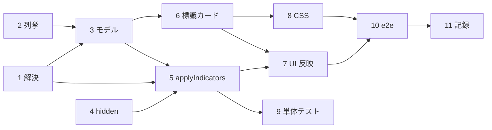

# 計画: 条件標識の解決と標識パネル

## 実装方針

**core を下から積む → UI は最後に 1 本の関数を通すだけ**、の順で進める。
`applyIndicators` が「モデル → モデル」の純関数なので、UI に触る前に**全部テストで固められる**。

分割（subtask）はしない。core と UI が同じ 1 つの機能を成しており、
**単独でデリバリできる切れ目が無い**（core だけ入れても誰も使えない）。1 PR に収まる規模。

## 作業順序と依存関係

1. 条件の解決（畳み込み・評価・表示文字列）— 依存なし
2. 標識の列挙 — 依存なし（1 と同じファイル）
3. モデルに条件と標識一覧を載せる — 依存: 1, 2
4. `HiddenReason` に `condition-off` を足す — 依存なし
5. `applyIndicators`（絞り込み・ツリーの理由・状態つき重なり）— 依存: 1, 3, 4
6. UI: 標識カード（ラジオグループ・キー操作・すべて未設定）— 依存: 3
7. UI: 状態の適用・ツリーの理由・プロパティの条件行 — 依存: 5, 6
8. 見た目（CSS）— 依存: 6
9. 単体テスト — 依存: 1-5（UI に触る前に core を固める）
10. GUI e2e — 依存: 6-8
11. 記録（設計文書・backlog）— 依存: 全部

## リスク / 留意点

- **既存の診断を動かさないこと**が最大の制約。`readConditioning` と `isMutuallyExclusive` は
  `resolveDspfLayout` の重なり抑制に効いているので、**触らない**（足すだけ）。
  `dspfOutline.test.ts` のドリフト検査が、既定の描画が変わっていないことを見張る。
- **7 桁目の二重の意味**（注記マーク / AND・OR）。列挙で注記行を除き損ねると `*` を読む。
- **再描画でのフォーカス喪失**。プロパティ欄で一度踏んでいる罠なので、同じ仕掛けを使う。
- **キーの衝突**。標識カードの矢印キーがキャンバスの項目移動に漏れると、
  標識を選ぶたびに項目が動く。`stopPropagation` と `isTypingTarget` 相当の防御を入れる。

## テスト方針

- **単体**（`test/unit/ddsConditioning.test.ts` 新規・`dspfRenderModel.test.ts` 追記）:
  - 畳み込みの表（spec の表をそのまま）。`O` が 1 行目にある場合を含む。
  - Kleene 3 値の真理値表（未設定を含む AND / OR）。
  - 列挙: キーワードだけの行の標識を拾うこと・注記行を読まないこと・画面サイズ条件名を読まないこと。
  - `applyIndicators({})` が**同一参照**を返すこと（AC7 を参照比較で固める）。
  - 不成立の項目が `items` から消え、`outline` に `condition-off` が付くこと。
  - 状態つき重なりが出ること／**両方無条件の組は二重に出ない**こと。
- **既存テストの回帰**: `npm run test:unit`（527 件）・`npm run verify`・`node out/cli/lint.js`。
- **GUI e2e**（`dev/e2e.mjs`・手元のみ）:
  - 標識を「オフ」にすると項目がキャンバスから消え、ツリーに `条件で非表示` が出る。
  - 「すべて未設定」で元に戻る（項目数が一致）。
  - 矢印キーで値が変わり、**キャンバスの選択項目は動かない**（AC-I5）。
  - 切替後もフォーカスがその標識に残る（AC-I4）。
- 検証用の DSPF に**条件付きの項目**が要る。`dev/` の題材（`CUSTMNT.dspf`）に条件行を足す。
