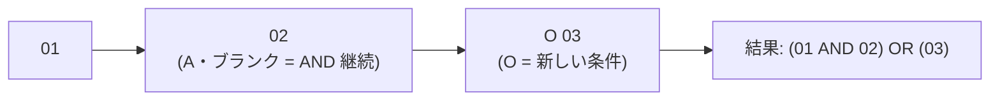

# レビューガイド: 条件標識の解決と標識パネル

## 変更概要 / 目的

DSPF の項目は**オプション標識（01-99）で表示が条件付けられる**が、これまでのデザイナは
条件付け欄を読むだけで**解決する手段が無かった**。結果、`01` のときだけ出る項目と
`N01` のときだけ出る項目が**同じ桁に重ねて描かれ**、実機での見え方が画面から読めなかった。

この変更で、標識を 3 値（未設定 / オン / オフ）で倒すと**その組み合わせでの見え方**が出る。

## 重要ポイント（特に見てほしい所）

### 1. 状態は UI、規則は core（`decisions.md` D1）

描画モデルは**ホストが組み立てて UI に送る**。標識の状態をモデルに載せると、
切り替えるたびにホストへ往復が要る。直前の PR #111 で引いた
「**表示の状態はホストへ送らない**」という境界をそのまま使い、
core には **`applyIndicators(model, states) → model` という純関数 1 つ**だけを足した。

**`protocol.ts` / `editorProvider.ts` / `dev/standalone.ts` は無変更**——
両ホストで自動的に同じ機能が使える。

### 2. 既定が変わらないことを「参照」で固定した（`decisions.md` D2）

`vscode-extension/src/core/dds/dspfRenderModel.ts` の `applyIndicators` は、
状態が空なら**引数のモデルをそのまま返す**（新しい配列も作らない）。
テストも `assert.strictEqual`（参照比較）で固定してある。

常に組み直す実装のほうが分岐は減るが、「指定していないのに何かが変わった」を
**以後ずっと検査で追いかける**ことになる。分岐 1 本で構造的に保証できるならそちらが安い。

### 3. 消すのは「不成立と決まった」項目だけ（Kleene 3 値）

未設定の標識を含む条件は `unknown` で、**描く**。偽に倒すと、標識を 1 つ倒しただけで
無関係な項目まで消え、1 つずつ確かめる使い方ができなくなる。

### 4. 標識の一覧は**生の行**から集める（`decisions.md` D3）

原典は条件が付く対象を「フィールド**または**キーワード」としている。
`toLogicalUnits` はキーワードだけの行（`30 DSPATR(RI)`）を直前の項目へ連結する際に
**その行の条件付け欄を捨てる**ので、単位から集めると `30` が一覧から消える。

### 5. 重なりは厳密化せず、**状態を明示したときだけ**足す（`decisions.md` D4）

既存の `isMutuallyExclusive`（「片方でも条件が付いていれば排他」）は**触っていない**。
静的に厳密化すると `01` と `02` の重なりまで報告することになり、原典が正当と認める
使い方に誤検出が出る。利用者が組み合わせを言い切ったときだけ、別のコード
`overlap-under-indicators` で足す。

## 処理フロー

```mermaid
flowchart TD
  L[ソース行] --> RC[readConditioning<br/>7-16 桁を読む]
  L --> CI[collectIndicators<br/>全行から標識を集める]
  RC --> PM[DspfPlacedItem.conditioning]
  PM --> RM[RenderModel<br/>items[].condition / indicators]
  CI --> RM
  RM -->|postMessage| UI[ui.ts render]
  ST[UI が持つ標識の状態<br/>01=on, 50=off] --> AP
  UI --> AP[applyIndicators]
  AP -->|状態が空| RM2[引数のモデルをそのまま返す]
  AP -->|不成立を除く| DR[キャンバスに描く]
  AP -->|理由を付ける| TR[様式ツリー: 条件で非表示]
  AP -->|同時に出る組だけ| DG[重なりの指摘]
```

条件の畳み込み（原典どおり）:



## 主要な変更箇所

- `vscode-extension/src/core/dds/ddsConditioning.ts:129` — `conditionGroups`（行 → 条件の畳み込み）。
  **1 行目は必ず新条件**（原典: 最初の条件の `O` はブランク扱い）。
- `vscode-extension/src/core/dds/ddsConditioning.ts:158` — `evaluateConditioning`（Kleene 3 値）。
- `vscode-extension/src/core/dds/ddsConditioning.ts:239` — `collectIndicators`（生の行から集める）。
- `vscode-extension/src/core/dds/dspfRenderModel.ts:159` — `applyIndicators`（**状態が空なら恒等**）。
- `vscode-extension/src/core/dds/dspfRenderModel.ts:212` — `overlapsUnderIndicators`
  （`unknown` は対象外・両方無条件の組は既存と二重に出さない）。
- `vscode-extension/src/dds/webview/ui.ts:531` — `renderIndicators` / `indicatorChoice`
  （APG のラジオグループ。**矢印キーを `stopPropagation` で止める**——止めないと選択中の項目が動く）。
- `vscode-extension/src/dds/webview/ui.ts:293` — `render()` が `applyIndicators` を 1 回通す。
  以降の描画・ツリー・診断のコードは**そのまま**。

## リスク / 確認してほしい点

- **`dspfOutline` の `HiddenReason` に 1 値足した**（`condition-off`）。
  生成側（`buildDspfOutline`）は付けず、`applyIndicators` だけが付ける。
  既存のドリフト検査（一覧の `hidden` と `layout.items` の食い違い）は
  **状態が空なら恒等**なのでそのまま意味を持つ。
- **WebView バンドルに core の実行時コードが入る**（これまで型だけだった）。
  単独起動バンドルは元から core を含んでいるので新しい問題ではないが、
  VSCode 用バンドルのサイズは増える。
- **GUI e2e は CI で走らない**（`playwright-core` は devDependency にしていない）。
  手元で 55/55 PASS。CI に載せる件は backlog に起票済み。
- **実機での見え方は未確認**。解決は原典の記述に基づく実装で、`CRTDSPF` での突き合わせはしていない。
- **条件の編集（付け外し）は入っていない**。プロパティの `条件` 行は読み取り専用。
  backlog に「条件標識の編集（付け外し）」として分けて残した。
