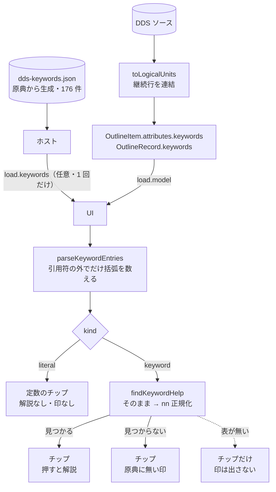

# レビューガイド: キーワード欄のチップ表示と原典ヘルプ

## 変更概要 / 目的

DSPF の実質的な記述は **45-80 桁のキーワード欄**に集中するのに、デザイナはそれを
**生テキストの 1 本の入力欄**に出しているだけだった。`CHECK(RZ)` の `RZ` が何かは
知っている人にしか分からず、**原典の解説はリポジトリにあるのにデザイナからは辿れなかった**。

キーワードごとのチップに分け、選ぶと**原典の解説**（和名・使用レベル・構文・説明）が出る。

## 重要ポイント（特に見てほしい所）

### 1. 解析は core、データはホスト、表示は UI

- **どこで切れるか**は規則なので core（`ddsKeywords.ts`）。UI に文字を数えさせない。
- **解説の表**（日本語 140KB）は UI から読めないので、`load` に**任意フィールド**として載せる。
  渡せないホストでも**チップの並びは出る**（解説だけが出ない）。
  `applied` / `rejected` には載せない——**編集のたびに 140KB を送り直す**ことになる。

### 2. 引用符の外でだけ括弧を数える

`EDTWRD('   0. ')` は引用符の中に**空白**、`DFT('(A)')` は引用符の中に**括弧**を持つ。
素朴に空白や括弧を数えると壊れる。`''` は引用符の中のエスケープなので、そこで閉じない。

**閉じない括弧・引用符も捨てない**（行末までを 1 区切り）。捨てると
「書いたのに画面に無い」が起き、原因が掴めなくなる。

### 3. `CF03` は原典の総称 `CFnn` に当たる

原典は `CAnn` / `CFnn`（`CA01`-`CA24` の総称）と書き、ソースには `CF03` と書かれる。
**そのまま引く → 見つからなければ末尾 2 桁を `nn` に替えて引く**の 2 段。

この 2 件は**直前まで表から丸ごと落ちていた**（PR #113 で修正）。
表を 24 件に展開しないのは、原典との 1:1 対応を崩さないため。

### 4. 定数のリテラルはキーワードではない

定数の固定情報（`'顧客保守'`）は**キーワード欄の先頭**にあり、同じ文字列に入っている。
区別しないと、**定数を選ぶたびに「原典に無いキーワード」の印が付く**。

同じ理由で、**表そのものが渡らないときは印を出さない**——表が無ければ全部が引けないので、
印は必ず全部に付き、「このソースは全部間違っている」と読めてしまう。

### 5. 様式（レコード・レベル）も選べるようにした

実装後に実データで確かめて気付いた点。`CUSTMNT.dspf` の項目レベルのキーワードは
**2 つだけ**で、`OVERLAY` / `CF03` は様式宣言の行にしか無い。
項目しか選べないと**この work の目的が半分しか満たせない**ので、
`OutlineRecord.keywords` を足して見出しを選べるようにした（`decisions.md` D4）。

**ファイル・レベル**（`DSPSIZ` / `REF` / `INDARA` / `PRINT`）は依然として読めない。
`toLogicalUnits` が論理単位にしないためで、backlog に分けて残した。

## 処理フロー

## 主要な変更箇所

- `vscode-extension/src/core/dds/ddsKeywords.ts:65` `parseKeywordEntries`（切り分け）
- `vscode-extension/src/core/dds/ddsKeywords.ts:158` `findKeywordHelp`（2 段の引き当て）
- `vscode-extension/src/core/dds/dspfOutline.ts:87` `OutlineRecord.keywords`（**レコード・レベル**）
- `vscode-extension/src/dds/webview/protocol.ts:59` `load.keywords`（任意）
- `vscode-extension/src/dds/editorProvider.ts:121` `keywordHelp`（言語ごとに保持）
- `vscode-extension/src/dds/webview/ui.ts:797` `keywordSection` / `onKeywordKey`
- `vscode-extension/dev/standalone.ts:22` 束ねた表（日本語固定）

## リスク / 確認してほしい点

- **`protocol.ts` を変えた**（直前 2 つの work では変えずに済ませた）。
  これは表示の状態ではなく**ホストが持つ参照データ**なので、モデルと同じ扱いにした。
  互換のため**任意フィールド**にしてある。
- **WebView バンドルが太る**（単独起動側は 140KB の JSON を束ねる）。
  VSCode 側は同梱ファイルを読むので束ねない。
- **AC5 / AC6 / AC7 は自動検証していない**（言語切替・原典に無い綴りの実例・表が渡らないホスト）。
  理由は `test.md` の「未検証の穴」。
- **編集は入っていない**。チップに `✕` も `＋ 追加` も出していない
  ——押せないボタンは「壊れている」と読まれる。
