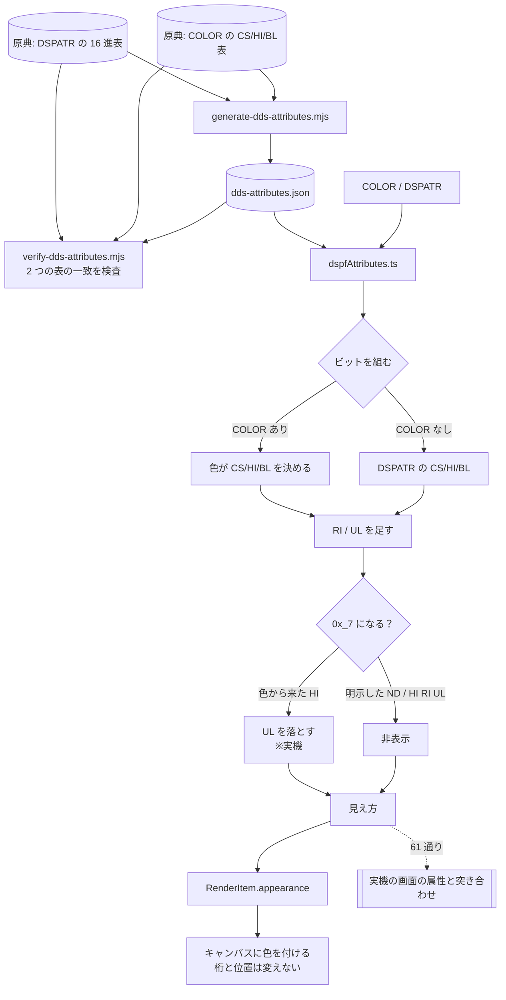

# レビューガイド: 5250 の配色

## 変更概要 / 目的

DSPF の見え方は `COLOR` と `DSPATR` で決まる。キャンバスは**すべて同じ色**で描いていたので、
「`DSPATR(HI)` を書いたら白になる」「`COLOR(YLW)` に `RI` を足すと下線が消える」といったことが
**実機に出すまで分からなかった**。

特に原典が明記している落とし穴——**`UL` ＋ `HI` ＋ `RI` は `ND`（非表示）と同じ結果になる**——は、
コンパイルも通り警告も出ないまま「書いたのに出ない」になる。

## 重要ポイント（特に見てほしい所）

### 1. 表は原典から生成し、**原典の 2 つの表の一致まで検査する**

`docs/origin/generate-dds-attributes.mjs` / `verify-dds-attributes.mjs`（`npm run verify` の 15 項目目）

原典には表が 2 つある——`DSPATR` の 16 進表と、`COLOR` ページの `CS`/`HI`/`BL` → 色の表。
**同じことを 2 か所が書いている**ので、片方が変わったら気づけるようにした。

抽出は **`<tr>`/`<td>` の構造のまま**読む。平文化すると列が消えて対応が取れない。

### 2. 散文の「無視されます」を**実装していない**

原典は `COLOR` と `DSPATR` の組み合わせで無視されるものを散文で 10 行以上並べている。
実装したのは**ビットの組み立てだけ**（`RI=0x01` / `HI=0x02` / `UL=0x04` / `BL=0x08` / `CS=0x10`）。

色は `CS`/`HI`/`BL` の 3 ビットそのものなので、**`COLOR` を書けばその 3 ビットは色が決める**
——散文の規則は自然に出る。実装は 30 行ほどで済んだ。

### 3. **実機で規則を確定させた**（UI を作る前に）

`verify/verify-attributes.mjs` が、7 色 × {なし, RI, UL, RI+UL} と
`COLOR` なしの全 32 通りと `ND` の**計 61 通り**を実機に出し、
画面のセルの属性と突き合わせる。

**最初の実装（原典の散文どおり）では 13 件が食い違った。** そこから 3 点を直して 61/61 一致:

| 直したところ | 根拠 |
|---|---|
| 桁区切り線を**モデルに入れない** | 原典の 2 表で扱いが食い違う。見た目は文字間の細い点で、原典自身が「行間隔縮小モードにすると消える」と書いている |
| **`COLOR` ＋ `RI` ＋ `UL` は `UL` が落ちる** | 原典は「**RI** は無視されます」と書くが、実機は `UL` を落とす（`decisions.md` D2） |
| 非表示なら他の属性を立てない | 何も出ないので意味が無い。実機の画面もそう報告する |

**`COLOR` を書かずに `DSPATR(HI RI UL)` と明示した場合は原典どおり非表示**になる
（こちらも実機で確認）。落とすのは**色から来た `HI`** のときだけ。

### 4. 明滅は点滅させない / 非表示は枠を残す

- 明滅は上辺の細い線で**静的に**示す（編集画面で点滅は目に障る）。
- 非表示は文字を透明にし、**点線の枠を残す**——消すと直すために選べなくなる。

### 5. 色の値は利用者のエミュレータと同じ

`ts5250` の既定テーマの値を使っている。**同じ画面が別物に見えない**ようにするため。

## 処理フロー

## 主要な変更箇所

- `docs/origin/generate-dds-attributes.mjs` — 原典の 2 表 → JSON
- `docs/origin/verify-dds-attributes.mjs` — **2 表の一致**まで検査（`npm run verify`）
- `vscode-extension/src/core/dds/dspfAttributes.ts:105` `resolveAppearance` /
  `:162` `appearanceOf`
- `vscode-extension/src/core/dds/dspfRenderModel.ts:85` `RenderItem.appearance`
- `vscode-extension/src/dds/webview/ui.ts` — `5250 配色` の切替と描き分け
- `.aidev/works/20260827-dds-5250-colors/verify/verify-attributes.mjs` — 実機で 61 通り

## リスク / 確認してほしい点

- **既定が変わる。** 配色は**既定で入**にした（実機の見え方を出すのが目的で、
  桁だけを見たい人が切る）。いままでの見え方とは変わる。
- **桁区切り線を描かない**（`decisions.md` D1）。実機では空色・黄色に細い点が出る。
- **条件つきの `COLOR` / `DSPATR`**（`50 COLOR(RED)`）は**条件を見ない**。
  条件に関係なく効いてしまう。backlog に起票した。
- **実機の突き合わせは CI で走らない。**
