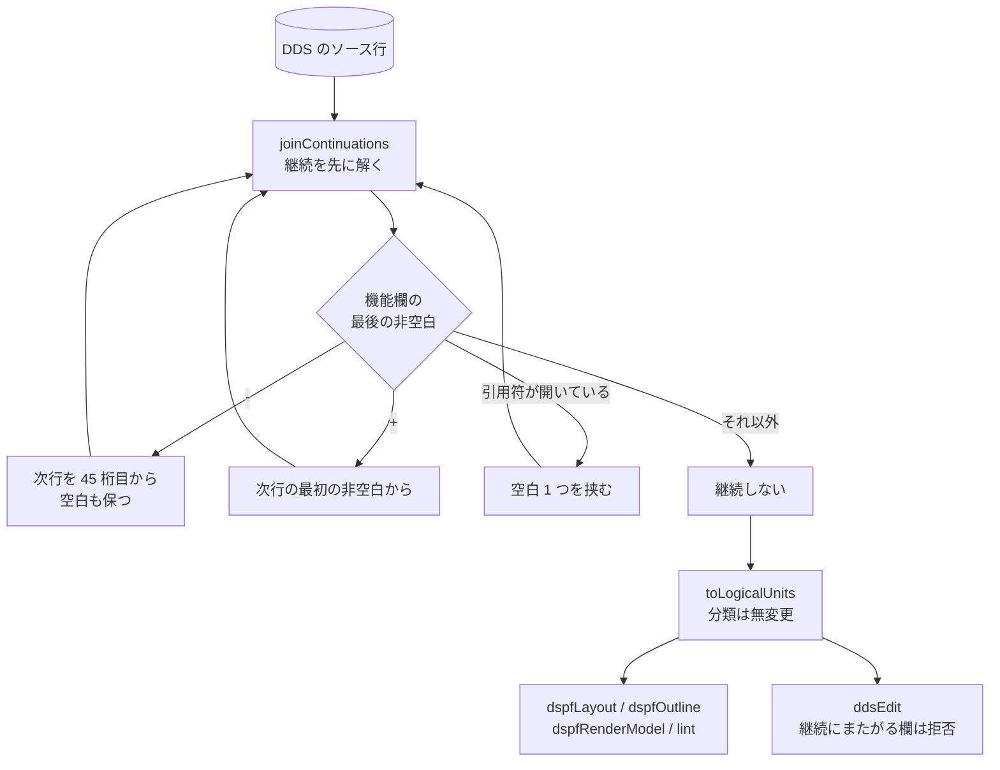

# レビューガイド: キーワード欄の継続行を実機どおりに読む

## 変更概要 / 目的

DDS のキーワード欄は 36 桁（45-80）しかないので、収まらない値は**次の行へ継続**する。
本 PJ はその規則を知らず、継続行を**空白 1 つで連結**しているだけだった。

結果、**継続を含む項目がキャンバスから丸ごと消えていた**——継続元の行は引用符が閉じていないので
`readConstant` が読めず、名前欄も空なので「キーワードだけの行」と誤判定され、
直前の様式に吸収されていた。実機で通る DSPF の定数 5 個のうち、描かれたのは 1 個だけだった。

## 重要ポイント（特に見てほしい所）

### 1. 規則の出所は**実機**（原典のスナップショットに無い）

`docs/origin/dds/` に継続規則のページが無いため、**IBM i 7.3 のコンパイラに判定させた**。
`CRTDSPF` のリストの `Expanded Source` には**解決後の定数が長さつき**で出るので、
それを期待値にしてある。

| 機能欄の最後の非空白 | 次行の取り方 | 実測 |
|---|---|---|
| `-` | `-` を捨て、**45 桁目ちょうど**から（空白も保つ） | `'ABC-` ＋ `   DEF'` → `ABC   DEF` |
| `+` | `+` を捨て、**最初の非空白**から | `'ABC+` ＋ `   DEF'` → `ABCDEF` |
| どちらでもなく引用符が開いている | **空白 1 つ**を挟む | `'ABC` ＋ `DEF'` → `ABC DEF`（長さ 7） |

リテラルの外でも切れ（`COLOR(-` ＋ `RED)` → `COLOR(RED)`）、3 行以上も連鎖する。
**`-` / `+` は引用符が開いていても優先される。**

### 2. 結合は**分類より先**（`decisions.md` D2）

分類の規則そのものは 1 行も変えていない。結合してしまえば、継続元の行は
**普通の定数行**になるため。おかげで `dspfLayout` / `dspfOutline` / `dspfRenderModel` /
`prtfLayout` / lint は**無変更で直った**。

### 3. 「キーワードだけの行」は継続ではない

`OVERLAY` を別の行に書く形は普通で、**空白 1 つで連結する従来の扱いのまま**。
継続と判定するのは上表の 3 条件だけ。ここを変えると既存のソースが壊れる。

### 4. 書き換えは拒否する（`decisions.md` D4）

継続でつながった値を代表行だけ書き換えると、**継続行が取り残されて壊れる**。
`setAttributes` の `text` だけを `keyword-continuation` で拒否し、
**位置・長さ・型・用途は従来どおり変更できる**（代表行の桁しか触らないため）。

判定は `startsContinuation(unit.line)`——**代表行自身が次行へ続くか**。
`sourceLines` の長さで見ると、`OVERLAY` を別行に書いただけの項目まで拒否してしまう。

### 5. 実機との突き合わせが**再現できる形**で残っている

`verify/verify-continuation.mjs` が、同じソースを実機でコンパイルして
`Expanded Source` を読み、`buildDspfRenderModel` の結果と突き合わせる。

**直す前に戻すと 4 件で落ちる**ことを確認済み（`test.md`）。

## 処理フロー

## 主要な変更箇所

- `vscode-extension/src/core/dds/ddsLogicalUnits.ts` — `functionsArea`（45-80 に限る）/
  `hasOpenQuote` / `continuationOf` / `startsContinuation` / `joinContinuations`
- 同 `toLogicalUnits` — 結合結果の上で走る。`sourceLines` に継続行を含める（削除がまとめて消える）
- `vscode-extension/src/core/dds/ddsEdit.ts` — `keyword-continuation` の拒否
- `.claude/skills/ibmi-remote/SKILL.md` — **DBCS の未確認事項を解消**し、
  コンパイル・リストの取り出し手順を追加

## リスク / 確認してほしい点

- **PRTF / PF・LF は実機で確かめていない。** 同じ `toLogicalUnits` を通るので同じに
  直っているはずだが、確認したのは DSPF だけ。
- **`keywordAreaOf` は 80 桁で切っていない**（`decisions.md` D3）。いまのサンプルに
  80 桁超の行が無いので差は出ないが、読ませると実機と食い違う。backlog へ。
- **実機の突き合わせは CI で走らない**（実機と ts5250 の道具が要る）。
- `hasOpenQuote` は `ddsKeywords.ts` の `skipQuoted` と**同じ規則の別実装**。
  共通化しなかった理由は `review.md` に書いた。
