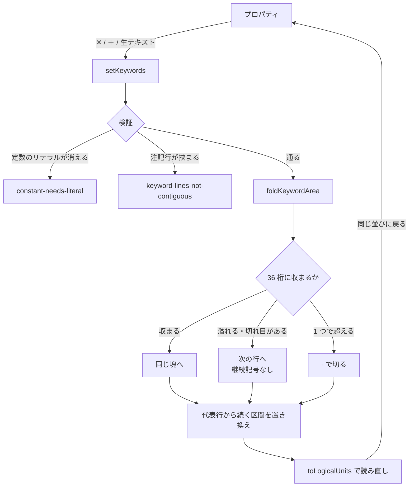

# レビューガイド: キーワード欄の編集

## 変更概要 / 目的

DSPF の見た目と入力規則のほとんどは **45-80 桁のキーワード欄**にある。
デザイナは**読める**ようになっていた（チップ ＋ 原典の解説）が、**書けなかった**。
キーワードを 1 つ足すだけでテキストエディタに戻り、45 桁目を数えることになっていた。

書き出しには**折り返し**が要る。欄は 36 桁しかなく、`DSPATR` と `COLOR` を並べただけで溢れる。

## 重要ポイント（特に見てほしい所）

### 1. 折り返しは「切れ目で折る」を第一に、`-` は最後の手段

`vscode-extension/src/core/dds/ddsEditWriteBack.ts:55` `foldKeywordArea`

キーワードの区切りで次の行へ置けるなら**継続記号を使わない**——`toLogicalUnits` が
「キーワードだけの行」を空白 1 つで連結するので、読み直せば同じになる。
`-` を使うのは**1 つのキーワードが 36 桁を超えるときだけ**。
そうしないと普通の並びが `-` だらけになり、SEU で開いた人が読めない。

### 2. `+` は**書き出さない**（実機で確かめた理由がある）

実機は `+` も継続記号として受けるが、**継続行の先頭の空白を捨てる**。
`'WITH SPACES  INSIDE  KEPT'` のような二重の空白を含むリテラルを折ると**値が変わる**。

実機の検証（`verify/verify-keyword-fold.mjs`）で、この定数の解決後の長さが
**25 のまま**であることを確認している。`+` を使っていたら 24 になっていた。

### 3. `setKeywords` は `setAttributes` と**宛先が違う**

`vscode-extension/src/core/dds/ddsEdit.ts:244`

- `setAttributes` … 代表行 **1 本**
- `setKeywords` … 代表行から続く行の**区間**（継続行 ＋ キーワードだけの行）

1 つの操作で置き換え範囲が変わると、**拒否されたときの状態が説明できない**ので分けた。
`setAttributes.text` は**継続にまたがるときだけ** `setKeywords` と同じ経路へ回る
——これで前 work の `keyword-continuation` の拒否が解けた。

### 4. 拒否は 2 つだけ。どちらも「黙って壊れる」類

`vscode-extension/src/core/dds/ddsEdit.ts:282` `validateKeywords`

- **`constant-needs-literal`** … 定数からリテラルが消えると、`unitItemKind` が項目と認めず
  **キャンバスからも一覧からも消える**（一覧も同じ判定を使う）。UI はリテラルのチップに `✕` を付けない。
- **`keyword-lines-not-contiguous`** … 項目とキーワード行の間に注記行があると、
  区間で置き換えたときに**注記が消える**。

**引数の中身も使用レベルも検証しない**（意図的）。`DSPATR(ZZZ)` は書ける——コンパイラが弾く。
レベルの判定を誤ると**正しい記述を拒否する**ので、候補の並びにだけ効かせる。

### 5. 様式のキーワードも編集できる（レビューで見つけて直した）

`OVERLAY` / `CFnn` は**様式（`R XXXX`）にしか書けない**。
最初の実装は `itemUnitAt`（項目だけ）で引いていたため、様式を選ぶと `line-not-found` で
拒否されていた——**前 work で「様式も選べる」ようにした意味が消えていた**。
`unitAt`（種別で絞らない）を足し、**キーワードの編集だけ**がそれを使う。

**UI からしか踏めない不具合**で、core の単体テストだけでは出なかった。

## 処理フロー

## 主要な変更箇所

- `vscode-extension/src/core/dds/ddsEditWriteBack.ts:55` `foldKeywordArea` / `:99` `buildKeywordLine`
- `vscode-extension/src/core/dds/ddsEdit.ts:244` `setKeywords` の適用 / `:282` `validateKeywords` /
  `:307` `keywordRunOf`（区間と連続性）
- `vscode-extension/src/dds/webview/ui.ts:897` `addKeywordButton`（`<datalist>`）/ `:957` `removeKeyword`
- `vscode-extension/src/dds/webview/protocol.ts` — `setKeywords` を通す（型だけ）
- `.aidev/works/20260827-dds-keyword-edit/verify/` — 実機での折り返しの検証

## リスク / 確認してほしい点

- **再レイアウトが起きる。** キーワード欄を編集すると、後ろのキーワード行は**まとめ直される**
  （利用者が触っていない行が動く）。`setKeywords` は「欄全体を編集する」操作なので筋は通るが、
  差分は 1 行に収まらないことがある。
- **候補は絞るが検証はしない。** フィールドに `OVERLAY` を書けてしまう（コンパイラが弾く）。
- **PRTF では確かめていない。** `foldKeywordArea` は種別に依らないが、実機で見たのは DSPF だけ。
- **実機の検証は CI で走らない。**
