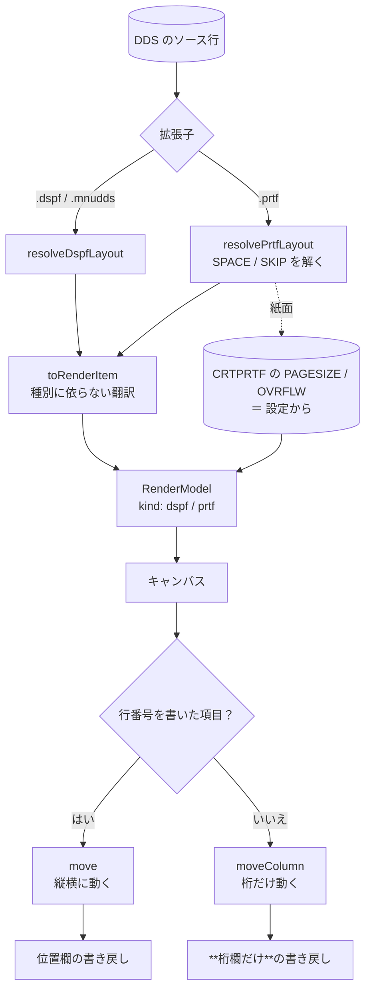

# レビューガイド: PRTF をビジュアルエディタで開く

## 変更概要 / 目的

ビジュアルエディタは **DSPF だけ**を開いていた。帳票（PRTF）は読む側までしか対応しておらず、
**桁を数えて位置欄を直す**という SEU 時代の作業のままだった。

`prtfLayout` は既に `SPACEA`/`SPACEB`/`SKIPA`/`SKIPB` を解いて絶対の行を出しており、
編集エンジンも位置欄と長さ欄しか触らない——**種別に依存していない**。繋げば動く。

## 重要ポイント（特に見てほしい所）

### 1. 翻訳を切り出し、解決だけを種別ごとに持つ

`vscode-extension/src/core/dds/ddsRenderItem.ts:108` `toRenderItem`

描画に要るのは「文字と、それが何桁を占めるか」で、**画面か紙かに依らない**。
違うのは配置解決だけ。写さずに切り出したのは、**SO/SI の桁勘定を 2 か所に持たない**ため
——ここは実機と突き合わせて合わせ込んだところで、写せば必ず片方だけ直る日が来る。

`dspfRenderModel` から再輸出しているので、**既存の import 元 8 か所は変えていない**。

### 2. **行送りで決まる行は書き換えない**（`decisions.md` D2）

実務の PRTF は位置欄に**行番号を書かない**（リポジトリのサンプルは 4 項目すべて空）。
行は `SPACE` / `SKIP` で決まり、そこへ行番号を書き込むと**行送りが無効になる**。

- `vscode-extension/src/core/dds/ddsEdit.ts:228` — 桁だけを動かす `moveColumn`
- `vscode-extension/src/core/dds/ddsEdit.ts:346` — `move` は `row-from-spacing` で拒否
- UI は**縦のドラッグを起こさない**（`cursor: ew-resize`）

「拒否で返す」ではなく「**操作そのものを起こさない**」を選んでいる——掴むたびに拒否が出ると使えない。

### 3. 一覧の「位置なし」を帳票の見方に直す

`vscode-extension/src/core/dds/prtfRenderModel.ts:101` `placedOutline`

`buildDspfOutline` は**位置欄しか見ない**ので、行番号を書かない帳票の項目をすべて
「位置なし」と判定していた。**キャンバスには描かれているのに一覧では位置なし**という食い違い。

### 4. 帳票に無いものは**切替ごと出さない**

属性文字（項目の前後 1 桁）も 5250 の配色も表示装置のもの（PRTF に `DSPATR` は無い）。
描かないだけでなく、ツールバーの切替を `hidden` にする——
**押しても何も起きないボタンは「壊れている」と読まれる**。

### 5. 実機の印刷結果で確かめた

`verify/verify-prtf-rows.mjs` が、帳票と固定長 RPG を実機でコンパイルして呼び、
**スプールをテキストとして読んで**行・桁を突き合わせる。

| ソース | 実機 | 本 PJ |
|---|---|---|
| `SKIPB(1)` ＋ `SPACEA(2)` / 10 桁 | 1 行 10 桁 | ✓ |
| `SPACEA(1)` / 5 桁・20 桁 | 3 行 | ✓ |
| `SKIPB(10)` / 1 桁 | 10 行 | ✓ |

**`resolvePrtfLayout` はこの work が触っていない既存コード**で、それまで原典から起こしたまま
実機で確かめていなかった。裏取りができた。

## 処理フロー

## 主要な変更箇所

- `vscode-extension/src/core/dds/ddsRenderItem.ts` — 切り出した翻訳（**新規**）
- `vscode-extension/src/core/dds/prtfRenderModel.ts:39` `buildPrtfRenderModel`（**新規**）
- `vscode-extension/src/core/dds/prtfLayout.ts` — `PlacedItem` に翻訳に要る欄（**足すだけ**）
- `vscode-extension/src/core/dds/ddsEdit.ts:228` `moveColumn` / `:346` `validateRowMove`
- `vscode-extension/src/core/dds/ddsPositionWriteBack.ts:42` `writeBackColumn`
- `vscode-extension/src/dds/editorProvider.ts` — 種別でモデルを選ぶ / 紙面を設定から
- `vscode-extension/package.json` — `customEditors` に `*.prtf`

## リスク / 確認してほしい点

- **`RenderModel.kind` を広げた**。UI の出し分け漏れがあると、帳票に効かない切替が残る
  （e2e で `hidden` を見ている）。
- **`PlacedItem` を広げた**。プレビューと lint が同じ型を使うので**足すだけ**にしてある。
- **複数ページを見ていない**。`resolvePrtfLayout` は 1 ページ分。backlog へ。
- **CPI / LPI は反映していない**（紙面の比率）。**次の work**。
- **VSCode 側で `.prtf` を開く手動確認をしていない**（統合テストが main でハングする既知の不具合）。
