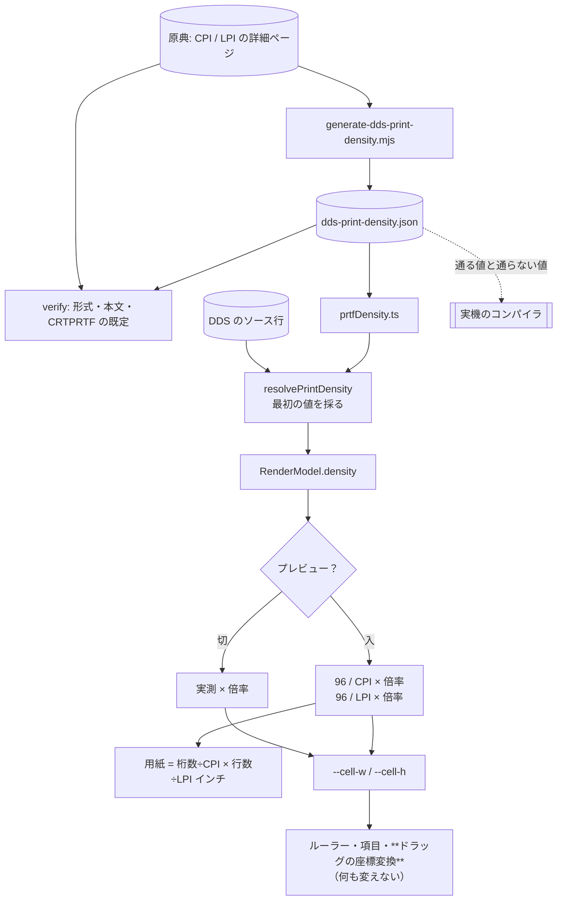

# レビューガイド: 帳票のプレビューモード（CPI / LPI）

## 変更概要 / 目的

帳票をビジュアルエディタで開けるようになった（PR #118）が、キャンバスは**等幅の升目**で、
紙の上の見え方とは比率が違っていた。

紙面の比率は **CPI / LPI** で決まる。原典（`LPI`）:
> ページの長さが 66 行で、ファイルの LPI の値が 6 であるとすれば、**用紙の長さは 11.0 インチ**です。

同じ 66 行 × 132 桁でも、**10 CPI / 6 LPI なら 13.2 × 11.0 インチ**、
**15 CPI / 8 LPI なら 8.8 × 8.3 インチ**。用紙に収まるかは行数ではなく**インチ**で決まる。

## 重要ポイント（特に見てほしい所）

### 1. **セルの大きさだけを差し替える**（`decisions.md` D1）

`vscode-extension/src/dds/webview/ui.ts:351` `previewDensity`

ルーラー・行番号・項目の配置・**ドラッグの座標変換**は、すべて
`--cell-w` / `--cell-h`（＝ `cellWidth` / `lineHeight`）を見ている。
差し替えれば**掴んで動かす経路を 1 行も変えずに済む**。

e2e に「**プレビュー中に掴んだ項目が指した桁に入る**」を入れて実測で固定している。

### 2. **実測と物理を混ぜない**（D2）

```
プレビュー:  96 / CPI × 倍率        （実測は使わない）
升目:        フォントの実測 × 倍率
```

混ぜると**倍率が二重に掛かる**——`20260826-dds-display-toggles` で
「実測値と表示値を分けて持つ」と決めたのと同じ、**必ず起きる作り**。

フォントだけは別で、**幅で合わせる**（`--font-scale`）。等幅なので幅が合えば桁が合う。

### 3. 値の集合は原典から生成し、**実機で両側から確かめた**

`docs/origin/generate-dds-print-density.mjs` / `verify-dds-print-density.mjs`

検査は原典の**「キーワードの形式」と本文の言い回しと `CRTPRTF` の既定**の 3 つが
一致することまで見る。

実機には**通る値と通らない値の両方**を流した——通る値だけでは
「集合が広すぎる」誤りに気づけない。

| | 実機で通る | 実機で通らない |
|---|---|---|
| `CPI` | 10 / 15 | 12 / 16 |
| `LPI` | 4 / 6 / 8 / 9 / 12 | 5 / 7 / 15 |

### 4. 1 ページの中で LPI が変わる帳票は**知らせるに留める**（D4）

原典は認めている（「6 LPI で 24 行、次に 8 LPI で 24 行」）。行ごとに高さが変わるので、
「行 ＝ 一定の高さ」という前提が崩れ、座標変換まで作り直しになる。

**黙って 1 つで描くのが一番悪い**ので、そこだけは避けて注記を出す。

### 5. 原典に無い値はソースから採らない（D5）

`CPI(12)` と書いてあっても既定のまま描く。実機のコンパイラが弾く値なので、
真似すると「**エディタでは見えるのにコンパイルが通らない**」になる。

## 処理フロー



## 主要な変更箇所

- `vscode-extension/src/core/dds/prtfDensity.ts:57` `resolvePrintDensity` /
  `:86` `paperInches`（原典の式）
- `vscode-extension/src/dds/webview/ui.ts:351` `previewDensity` /
  `:507` `renderDensity`（CPI / LPI の選択と用紙の表示）
- `docs/origin/generate-dds-print-density.mjs` / `verify-dds-print-density.mjs`
- `.aidev/works/20260827-dds-prtf-preview/verify/verify-density-values.mjs`（実機）

## リスク / 確認してほしい点

- **画面上の実寸は測っていない**。1 インチ = 96 px は CSS の定義に従っただけで、
  実際のディスプレイの DPI とは違う。
- **プリンタのフォントは再現していない**（等幅で描く）。
- **1 ページ内で LPI が変わる帳票は描けない**（注記を出す）。backlog へ。
- `CHRSIZ` / `FONT` / `PAGRTT` は見ていない。
