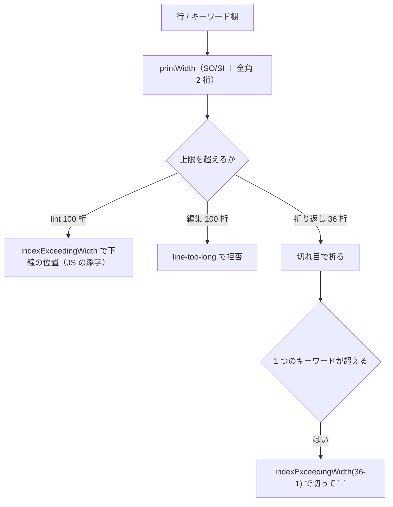

# レビューガイド: 行長の数え方を実機の桁に揃える

## 変更概要 / 目的

行の桁を **JS の文字数から実機の桁**（`printWidth`）に変える。
DBCS は連なりの前後に SO/SI が 1 桁ずつ入り、全角 1 文字が 2 桁を占める。

## 重要ポイント（特に見てほしい所）

- **`printWidth` と実機の可否が完全に一致する**（`research.md` F2）。境目の前後 ＋
  半角混在の 5 通りで確かめた。関数は既にあり、作り直していない。
- **起票の範囲より重い欠陥が折り返しにあった**（`decisions.md` D5）。
  `foldKeywordArea` が JS の文字数で数えており、**デザイナが自分でコンパイル
  できないソースを書き出していた**。lint は「気付けない」だが、こちらは「壊す」。
- **上限の値（100）は変えていない**（D1）。実機のソース物理ファイルは
  レコード長 92 と 112 が混在しており、どちらかはローカルからは分からない。
- **既存テストの前提を実機の証拠で直した**（D4）。全角 80 文字の注記行を
  「指摘しない」と固定していたが、実機では 170 桁で切れる。

## 処理フロー

## 主要な変更箇所

- `src/core/dbcs.ts` `indexExceedingWidth` — **JS の添字**を返す（桁ではない。D3）。
- `src/lint/rules/lineLength.ts` — 判定と下線の位置。文言に両方の数を出す。
- `src/core/dds/ddsEditWriteBack.ts` `foldKeywordArea` — 一番重い直し。
- `src/core/dds/ddsEdit.ts` — `line-too-long` の判定。

## リスク / 確認してほしい点

- **上限の出し分け（80 / 100）はしていない**。レコード長 92 のファイルでは
  81 桁目以降が切れるが、ローカルからはレコード長が分からない。別項目に起票した。
- 半角だけの行は値が変わらないので回帰は起きにくいが、折り方を単体で固定してある。
