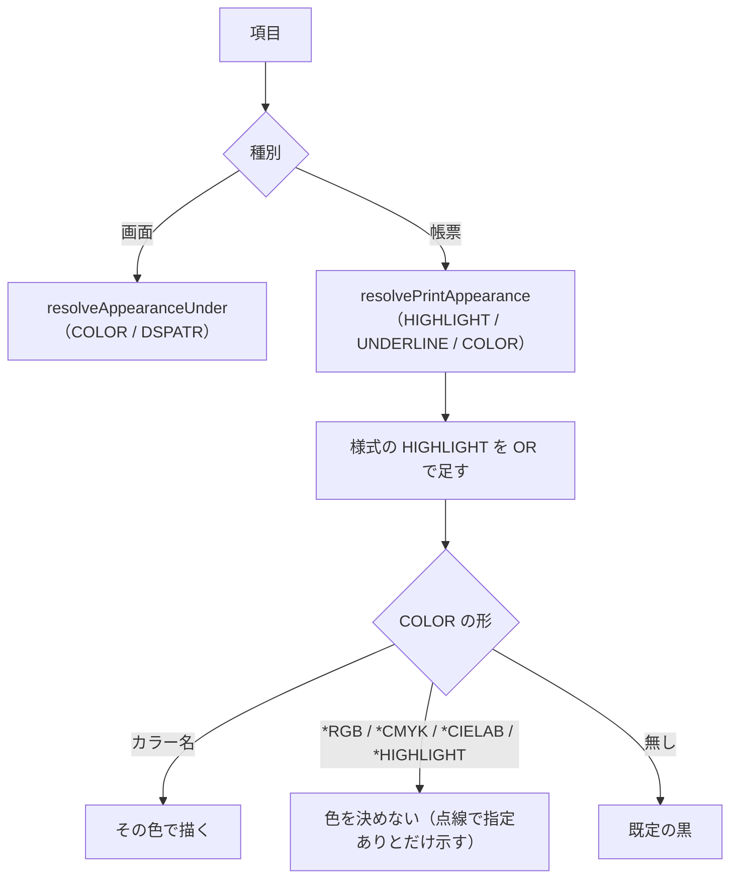

# レビューガイド: 帳票の強調

## 変更概要 / 目的

帳票のプレビューで**太字・下線・カラー**を描く。画面の 5250 配色とは
**別の語彙**（反転表示も明滅も非表示も無い）。

## 重要ポイント（特に見てほしい所）

- **起票の範囲外の欠陥を 1 件直した**（`decisions.md` D2）。帳票の項目にも
  画面用の解決が通っており、`COLOR(BRN)` が読めず `COLOR(WHT)` を読めてしまう
  状態だった。UI が描画を止めていたので表に出ていなかっただけ。
- **`HIGHLIGHT` は様式に書くと中の全項目に効く**（原典 ＋ 実機）。この work の要。
- **装置依存のカラーは色を決めない**（D3）。原典が「出力装置によって異なります」と
  書いているので、決め打ちすると実機と違う絵を信じさせる。
- **検査に実機を錨として持たせた**（D4）。カラー名の表は画面のページにも同じ形で
  載っており、**原典の中だけでは帳票のものか分からない**。

## 処理フロー

## 主要な変更箇所

- `docs/origin/generate-dds-print-appearance.mjs` — 原典からカラー名と
  レベルを取り出す。`verify-*` が**実機の 8 件**と突き合わせる。
- `src/core/dds/prtfAppearance.ts` — 解決。様式の `HIGHLIGHT` を OR で足す。
- `src/core/dds/ddsRenderItem.ts` — `toRenderItem` を種別で分ける（既定は画面）。
- `src/dds/webview/ui.css` — `.printed` の語彙（`.colored` とは別）。

## リスク / 確認してほしい点

- **画面の回帰**が一番の関心事。`toRenderItem` の既定引数は画面のままで、
  DSPF の e2e（配色 6 件）が通っている。
- `LINE`（線を印刷するキーワード）は扱っていない。項目の見え方ではないため。
- カラーの CSS 値は**見分けがつく近い色**であって、実機の印刷色そのものではない。
