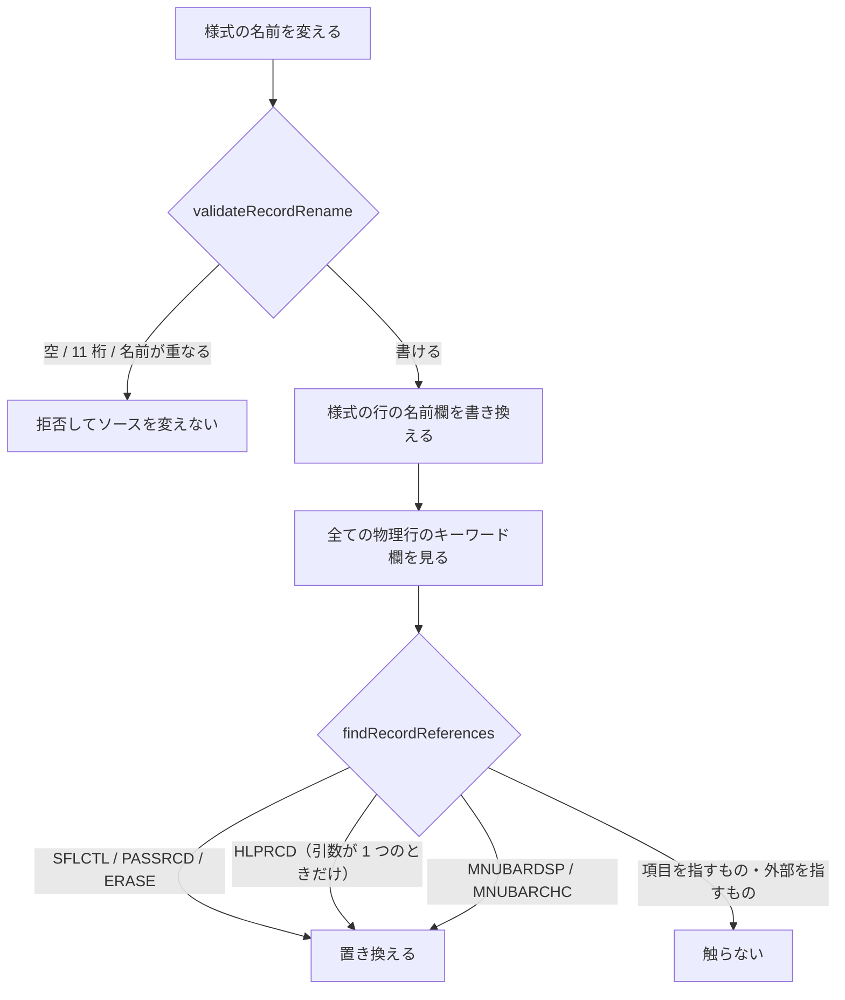

# レビューガイド: 様式の改名と参照追随

## 変更概要 / 目的

様式（レコード）の名前をデザイナから変えられるようにし、**それを指している
キーワードも一緒に直す**。前 work（項目の改名）で「改名の手段が無いので追わない」
として起票に回していた分。

## 重要ポイント（特に見てほしい所）

- **`renameRecord` は別の編集の種類**（`decisions.md` D1）。`setAttributes` は
  様式に無いもの（長さ・型・用途）を受け取れてしまう。
- **追う先だけを差し替える**（D2）。物理行ごとに当てる作りは項目と共有する。
- **根拠の強さを表に書き分けた**（D4）。`SFLCTL` / `ERASE` / `PASSRCD` は
  実機で確認、`MNUBARDSP` / `MNUBARCHC` は**原典のみ**。
- **`HLPRCD` はコンパイラーが見ていない**（`research.md` F3）。存在しない様式を
  指しても通るので、誤って追っても実機は教えてくれない。だから原典の条件
  「ファイル名を省いたときだけ」を厳密に守っている。
- **落ちないテストを 1 件直した**（D7）。

## 処理フロー

## 主要な変更箇所

- `src/core/dds/ddsReferences.ts` `RECORD_ARGUMENTS` — 表。各行に原典の引用と、
  **実機で確かめたか原典だけか**を書いてある。
- `src/core/dds/ddsEdit.ts` `validateRecordRename` — 重複・空・長さ。
  重複を拒否するのは**実機が通さない**から（`decisions.md` D5）。
- `src/dds/webview/ui.ts` `recordNameInput` — 項目の名前欄と同じ約束。

## リスク / 確認してほしい点

- **`MNUBARDSP` / `MNUBARCHC` は実機で確かめられていない**（メニュー・バーの
  通る形を組めなかった）。原典の文は明確だが、根拠の強さが他と違う。
- `HLPRCD` の条件（引数が 1 つ）を誤ると外部のファイルの様式名を書き換えうる。
  単体で固定してあり、条件を外すと落ちる。
