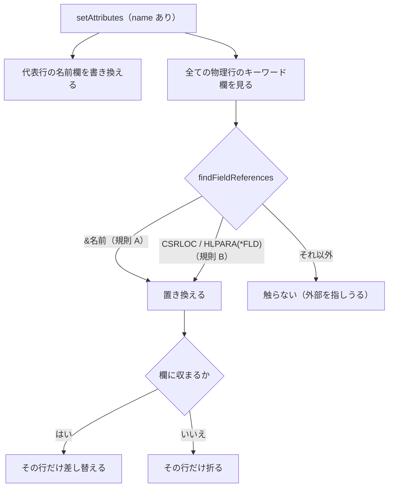

# レビューガイド: 名前変更の参照追随

## 変更概要 / 目的

項目の名前を変えると、**同じソースの中でその項目を指しているキーワードの引数**も
一緒に変わる。外部のファイル・フォント・メッセージを指す引数は**触らない**。

## 重要ポイント（特に見てほしい所）

- **見つけ方が 2 本立て**（`decisions.md` D1）。`&名前` はキーワードを問わず追い
  （表が要らない＝書き漏らしようがない）、定位置の引数だけを表で持つ。
  原典が `&` を一貫して「このソースの中のフィールド」の印に使うことが根拠。
- **外部を壊さないことが最大の関心事**。`REF(CUSTNO)` が黙って書き換わると
  原因の分からない壊れ方をする。単体・e2e の両方で固定した。
- **表の網羅を検査で見張る**（D5）。原典の構文に名前らしい引数があるのに判断が
  書かれていないキーワードで `npm run verify` が落ちる。
- **断り書きが誤っていた**（D3）。「SFLCTL 等は追随しません」と出していたが、
  `SFLCTL` が指すのは様式で、項目の改名では元から影響しない。
- **実機で対照つきに確かめた**（D6）。追随なしのソースは実機が通さない
  ——追随の値打ちがそこにある。

## 処理フロー

## 主要な変更箇所

- `src/core/dds/ddsReferences.ts` — 規則 A / B と `NOT_FOLLOWED`（追わない理由）。
  **表の各行に原典の引用**が付いている。
- `src/core/dds/ddsEdit.ts` `renameReferenceResults` — **物理行ごと**に書き換える
  （区間で置き換えると関係のない行まで畳まれる。D4）。
- `docs/origin/verify-dds-references.mjs` — 判断の網羅を見張る。
- `src/dds/webview/ui.ts` — 断り書きの訂正と、変わった件数の通知。

## リスク / 確認してほしい点

- **`&` の参照が継続行にまたがる形**は追えない（`CSRLOC(ROW +` / `COL)` の
  `COL` 側）。取りこぼすだけで壊さないので、いまは受け入れている。
- `NOT_FOLLOWED` に物理/論理ファイル（PF/LF）のキーワードも入れてある。
  画面・帳票では使わないが、検査が原典の一覧を横断するので判断が要る。
