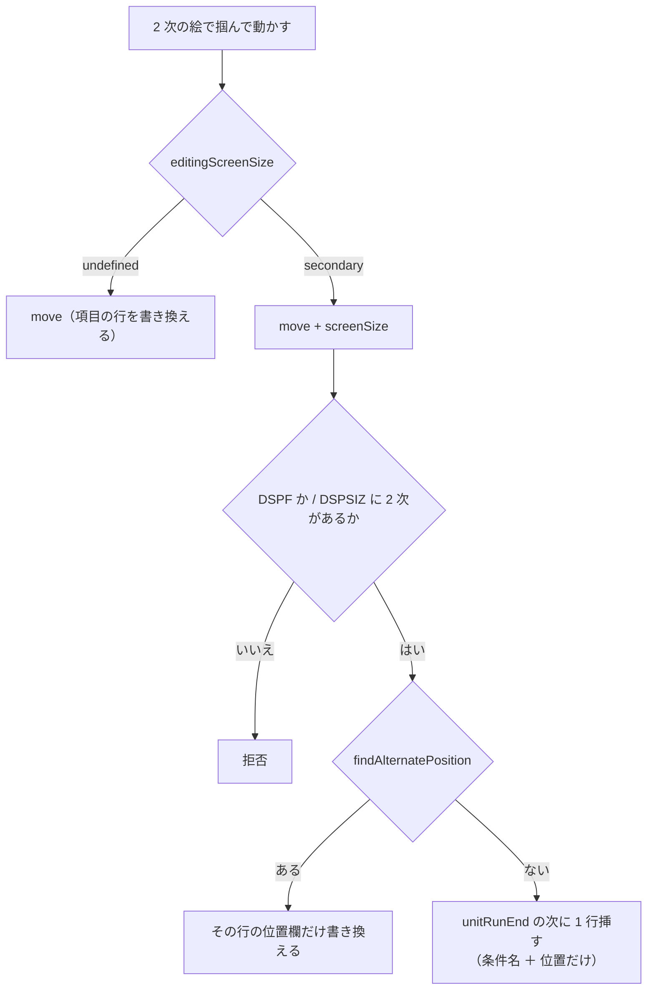

# レビューガイド: 2 次画面サイズでの編集

## 変更概要 / 目的

2 次画面サイズの絵で項目を**動かせる**ようにする。宛先は項目の行ではなく
**位置の上書き行**（無ければ作る・要らなくなったら消せる）。
前の work（`20260828-dds-alternate-position`）は絵を出すところまでで、
掴んでも動かせない状態だった（`decisions.md` D3）。

## 重要ポイント（特に見てほしい所）

- **上書き行の置き場所と形は原典に無い**。実機に判定させて決めた
  （`.aidev/works/20260828-dds-secondary-edit/verify/`）。
  規則は 4 つ: run の直後 / 1 項目 1 本 / 条件付け欄は画面サイズ条件名だけ /
  長さ欄を持てない。
- **引き当ては 1 か所に寄せた**（`findAlternatePosition`）。描く側と書く側が
  同じ関数を通る。写していたら「見えている項目を掴んだのに別の行が書き換わる」
  という壊れ方をしうる。
- **`screenSize` の意味の衝突を先に解いた**（`decisions.md` D3）。
  `move.screenSize` は `"primary" | "secondary"`、条件側は名前（`*DS4`）なので
  そちらを `screenSizeName` に改名した。
- **テストの期待値を実機で裏取りした**（D7）。緑のまま実機が通さない形を
  固定していた fixture が 1 件あった。

## 処理フロー

## 主要な変更箇所

- `src/core/dds/ddsEdit.ts:1059` `moveSecondary` — 置換 / 挿入の分岐。実機の 4 規則の出所。
- `src/core/dds/ddsEditWriteBack.ts` `buildAlternatePositionLine` — 作る行。
  **名前・長さ・型・用途・キーワードを受け取らない**（受け取れる形にすると
  「書いたらどうなるか」を考え続けることになる）。
- `src/core/dds/ddsConditioning.ts` `findAlternatePosition` — 描く側と書く側の共通の引き当て。
- `src/core/dds/ddsLogicalUnits.ts` `unitRunEnd` — 挿入位置。`sourceLines` の**最大値**。
- `src/dds/webview/ui.ts` `editingScreenSize` — 「いま 2 次か」を 1 か所で決める。
- `src/cli/dds.ts` `readEdits` — 素通しをやめ `parseEdits` を通す（D4）。

## リスク / 確認してほしい点

- **`clearAlternatePosition` を scope に足した**（D2）。作れるのに消せない片道の扉を
  避ける判断だが、requirement の「対象外」には書いていなかった。
- 2 次では `resize` を掴ませない。**キーボードでの長さ変更は元から無い**ので、
  塞ぎ方はこれで足りている（矢印は位置だけ）。
- `pendingStructural` は `add` / `remove` だけ true。2 次の挿入・削除でも
  **選んでいる項目の行番号は変わらない**ので選択を落とさない方が正しい、と判断した。
