# レビューガイド: 候補にすぎない選択欄を、一覧つき自由入力にする

## 変更概要 / 目的

**列挙した値＝制限とは限らない。** 実機が `Rstd=NO` と言う欄では、列挙値は候補にすぎず
任意の値を書ける。定義は `attributes.restricted:false` でそう言っており、
検証（`validate()`）もそれに従っている。**画面だけが遅れていた。**

`restricted:false` は検証を緩めるだけで、部品は `<select>` のまま。
`<select>` である以上、**一覧に無い値は打てない**。

| | 該当 |
|---|---|
| `restricted:false` の選択欄 | **108 欄** |
| うち**選択肢が 1 つだけ** | **57 欄** |

**選択肢 1 つの `<select>` は選択ではなく錠前。** 典型が `ADDPFM` の `SRCTYPE`——
原典の定義済み値は `*NONE` だけだが、実際に書くのは `RPGLE` / `CLP`。
**プロンプターからは打てなかった。**

## 重要ポイント（特に見てほしい所）

### 1. 分かれ目は 1 行だけ

```
選択肢がある かつ 制限あり  → <select>（いままでどおり）
選択肢がある かつ 候補のみ  → <input list> ＋ <datalist>
選択肢がない               → いままでどおり
```

`src/prompter/webview/ui.ts` の `buildControl`。読む単位を増やさないため、
判定はこの 1 行に閉じてある。

### 2. 新しい仕組みを足していない

`<input list>` ＋ `<datalist>` は**この画面で既に動いている**——
オブジェクト名の候補が同じ形で出ており、単体テストと e2e があり、
VSCode 側でも出荷済み。**同じ画面に 2 通りの候補の出し方を作らない。**

### 3. 入力欄の作りは `buildTextInput` に任せた

幅・`maxlength`（**CL 変数の余地**）・値の設定を別経路で作ると、どちらかが後退する。
PR#98 で `maxlength` を落として `&MSGIDVAR` が書けなくなった前例があるので、
**新しい入力欄を書かない**。

### 4. 「変えすぎ」も落ちるようにした

後退を戻す検査を 3 件置いたが、**3 件目は逆方向**——
「制限のある欄まで自由入力にする」と落ちる。
範囲そのもの（`restricted === false` の欄だけ）を検査している。

```mermaid
flowchart TD
  A[定義: attributes.restricted] --> B[描画モデル: SerializableField.restricted]
  B --> C{restricted === false ?}
  C -->|はい| D["&lt;input list&gt; + &lt;datalist&gt;<br/>一覧に無い値も打てる"]
  C -->|いいえ / 未指定| E["&lt;select&gt;<br/>いままでどおり"]
  A --> F["validate&#40;&#41;<br/>既に restricted を見ている（無変更）"]
```



## 主要な変更箇所

- `src/prompter/formModel.ts` — `SerializableField.restricted` を追加し、
  `toSerializableState` が `attributes.restricted` をそのまま渡す
  （`maxLength` / `allowsVariable` と同じ並び）。
- `src/prompter/webview/ui.ts` — `buildControl` を `buildSelect` /
  `buildOpenChoice` に分けた。`buildOpenChoice` は `buildTextInput` を使い回す。
- `dev/prompter-standalone.ts` — `ADDPFM` をサンプルに追加。
- `dev/prompter-e2e.mjs` — 5 件追加。既存の「種類ごとに候補一覧が出る」は
  **`datalist` を全件数えていた**ので `objects-` に絞った（過剰に固定した検査は
  正しい変更を落とす）。
- `test/unit/prompterWebview.test.ts` — 3 件追加。**108 / 57 という件数も固定**した
  ——動いたらこの変更の前提が変わっている。

## リスク / 確認してほしい点

1. **`<datalist>` の見え方は確かめていない。** 候補が並ぶことは DOM で確認できるが、
   VSCode の WebView でどう表示されるかは実際に開かないと分からない。
   オブジェクト名の候補が同じ仕組みで出荷済みなので**新しい risk ではない**が、
   F5 で一度見てもらえると確実。
2. **`npm run test:integration` は未実行**（`xvfb-run` が無い）。WebView の描画だけの
   変更で拡張ホストの経路に触れていないが、CI の `integration` ジョブで確認する。
