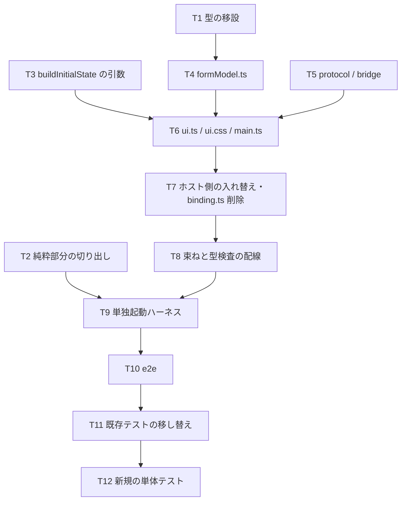

# 計画: F4 プロンプターを VSCode 非依存に作り替える

## 実装方針

**下から積む。** コア（純粋）→ 契約 → UI → ホスト → 束ね → ハーネス → e2e の順。
各段で `npm test` が緑であることを保ち、**最後にまとめて動かす形にしない**
（4,718 行のうち 1,401 行を作り替えるので、崩れた場所が分からなくなる）。

`binding.ts` の削除は**最後の段**（T7）に置く。それまでは新旧が並存し、
既存テストが通り続けるので、どの段で壊したかが分かる。

## 作業順序と依存関係

1. T1〜T3（コアの下ごしらえ。依存: なし。既存の振る舞いを変えない）
2. T4〜T5（契約。依存: T1）
3. T6（UI 本体。依存: T3, T4, T5）— **最大の塊**
4. T7〜T8（ホストと配線。依存: T6）
5. T9〜T10（ハーネスと e2e。依存: T2, T8）
6. T11〜T12（テスト。依存: T10）

## リスク / 留意点

- **R1: 既存テストの移し替え（spec の R1）**。`buildHtml` の出力に `data-depends-on` が
  含まれることを見ている検査は、属性が無くなるので移せない。同じことを e2e で見る。
  **消す前に、e2e が「その後退を戻すと落ちる」ことを確かめる**
  （AGENTS.md「落ちないテストは何も守っていない」）。
- **R2: 改名・削除がある**（`binding.ts` → `formModel.ts` ほか、`help.ts` 削除）。
  `npm test` は `out-test/` をクリーンしないので、**走らせる前に `rm -rf out out-test`**
  （AGENTS.md。過去にテスト件数が 338 → 348 に水増しされた）。
- **R3: `style="…"` を使わない**（CSP から `'unsafe-inline'` を外すため）。
  使っても**例外は出ず静かに効かない**ので、目視では守れない。class で切り替える。
- **R4: 再描画でフォーカスが飛ぶ**。入力のたびに作り直すので、欄の名前と
  カーソル位置を保存して戻す。**e2e で「連続入力できる」ことを確かめる**
  （見落とすと 1 文字ごとにフォーカスが外れる、という致命的な形になる）。
- **R5: `maxlength` の CL 変数の余地**（`binding.ts:1381`、PR#98 の後退）。
  移植で落としやすい。単体テストで固定する。

## テスト方針

| 層 | 何を見るか |
|---|---|
| 単体（`npm test`） | コアの新しい引数（`occurrences` / `reportEmptyRequired`）、`parsePrompterMessage`、`toSerializableState`（既存を維持）、`maxlength` の算出 |
| e2e（`node dev/prompter-e2e.mjs`） | **画面の操作**。spec の表に挙げた 11 項目。CI の `gui-e2e` で走る |
| 統合（`npm run test:integration`） | F4 で例外なく開けること（既存のまま。中身は e2e が見る） |
| 往復（`npm run verify`） | 書き戻しが変わっていないこと（全 538 定義） |

**e2e は「落ちること」を確かめてから載せる**——後退を 1 つずつ戻して赤になるかを見る。
