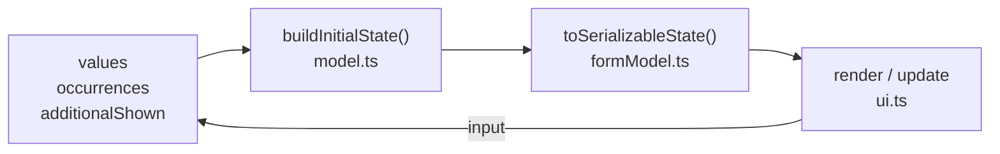
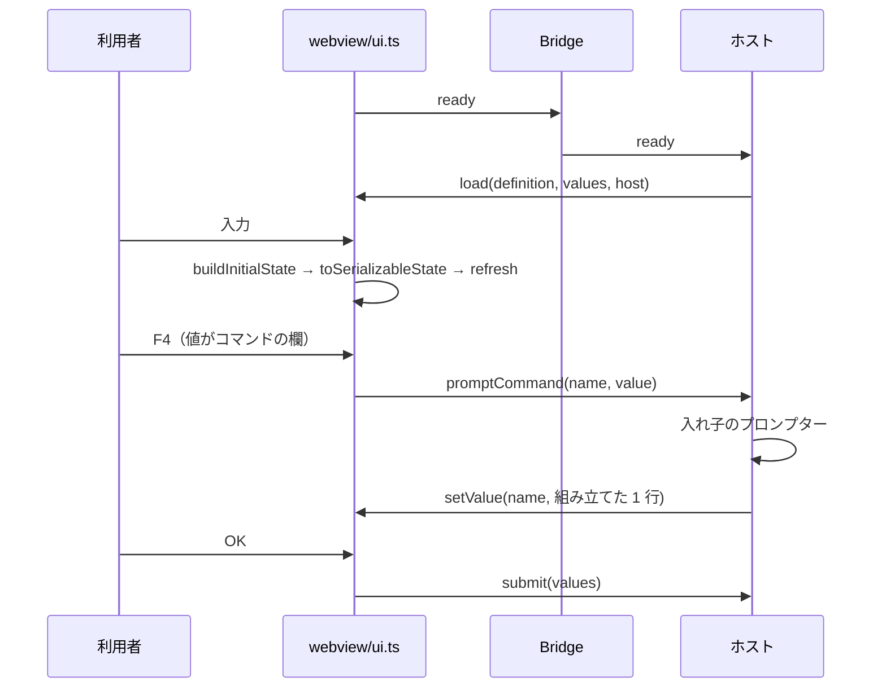

# レビューガイド: F4 プロンプターを VSCode 非依存に作り替える

## 変更概要 / 目的

`binding.ts`（**1,401 行**。HTML + CSS + **インライン JS 827 行**を文字列で組み立てる）を解体し、
DDS ビジュアルエディタ（PR #109）と同じ 4 点セットに載せ替えた。

**狙いは 1 つ**——プロンプターの画面を **VSCode の外で動かし、押して確かめられる**ようにする。
いままで自動で見られたのは「例外なく開けた」までで（`20260828-f4-integration-test`）、
画面の中は誰も検査していなかった。実際 `dependencies` は WebView に渡っておらず
**一度も画面に出ていなかった**のに、単体テストは通っていた（PR#93〜#98 で 3 回）。

機能は増やしていない。**構造の入れ替えと、それで初めて可能になった検証**だけ。

## 重要ポイント（特に見てほしい所）

### 1. 判定の写しが消えた（この変更の要点）

以前は条件表示・必須・相関制約の判定が**サーバとクライアントに二重に**あり、
`binding.ts` に「片方だけ直すと食い違う」と注意書きが要る状態だった。
**実際に食い違ってもいた**——クライアント側は `visibleByDefault` を見ていない
（`dependsOn` と併せ持つ欄が現れた瞬間に表面化する）。

いま UI は `model.ts` / `visibilityRules.ts` / `cdmlRules.ts` を**そのまま import** する。
esbuild が束ねるので同じ関数が動く。写しは 1 行も無い。

これに伴い、描画モデルから **`evaluatorSpec` / `constraintFields` / `constraints` を落とした**
（写しを動かすためだけの荷物だった）。`prompterWebview.test.ts` が復活を検査する。

### 2. 状態は「値」と「いくつ見せているか」だけ

`src/prompter/webview/ui.ts:36` `Session`。描くたびにコアへ渡して作り直す。

描き直しは **2 段**（`ui.ts:149` `rebuild()` / `ui.ts:196` `refresh()`）。
構成が変わるとき（読み込み・組の増減・F10）だけ DOM を作り直し、
入力のたびは表示・必須・エラー・選択肢だけ更新する。
**1 文字ごとに作り直すとフォーカスとカーソルが飛ぶ**ため。

### 3. 繰り返しの組数はコアに引数で渡す（`model.ts` の唯一の実質変更）

`countOccurrences` は**値の入っている組しか数えない**ので、「追加」を押した直後の
空の組が消えてしまう。`buildInitialState` に `occurrences` を足した
（`model.ts:125` `InitialStateOptions`）。**既定の振る舞いは不変。**

同じ引数で `reportEmptyRequired` も入れた。「必須なのに空を咎めるのは確定のときだけ」という
規則は、以前クライアント側の JS が別に持っていたもの。

### 4. 純粋な書き戻しを `applyChanges.ts` から切り出した

`buildClCommandText` / `buildRpgLineText` は `vscode` API を使わないのに、
**同じファイルの 1 行目が `import * as vscode`** だったのでブラウザから使えなかった。
`commandText.ts` へ移した（**中身は 1 行も変えていない**。往復検証 538 定義が緑）。

おかげで単独起動ハーネスが「**確定したらこの行が書き戻される**」を実際に描ける。

## 処理フロー

`Bridge` の実装は 2 つだけ。VSCode 版は `postMessage`（`webview/bridge.ts:34`）、
単独起動版は直接呼び出し（`dev/prompter-standalone.ts` の `DirectBridge`）。
**UI から見た形は同じ。**

## 主要な変更箇所

- `src/prompter/webview/protocol.ts:20` — `PrompterHost`。「何ができるか」ではなく
  **「ホストが何を肩代わりするか」**。単独起動は `closesWindow: false`（閉じる先が無い）。
- `src/prompter/webview/protocol.ts:87` — `parsePrompterMessage`。不正なら捨てる（例外にしない）。
  **値が 1 つでも不正なら表ごと捨てる**——桁で書き戻すので、欠けた値は空欄上書きと区別が付かない。
- `src/prompter/webview/ui.ts:196` `refresh()` — 見えない欄は**表示の上でも咎めない**。
- `src/prompter/webview/ui.ts:453` `removeOccurrence()` — 組を消したら**後ろを繰り上げる**。
  以前は DOM を複製して番号を振り直していた（184 行）。値を動かせば済む。
- `src/prompter/formModel.ts` の `withCurrentValue` — **選択肢に無い値を握り潰さない**（下記リスク）。
- `src/prompter/webview.ts` — 器だけ。`onDidDispose` でも決着させる（**待ち続けると F4 が二度と開かない**）。
- `.vscode/tasks.json` — F5 を `compile:all` に。`compile` だけだと**画面が真っ白**になる。

## リスク / 確認してほしい点

1. **`npm run test:integration` を手元で回せていない**（`xvfb-run` が無い）。
   パネルの作り方を変えている（`localResourceRoots` の追加・`onDidDispose` での決着）ので、
   **CI の `integration` ジョブが緑になることが確認の本体**。
2. **選択肢に無い値の扱いを変えた**（`withCurrentValue`）。旧実装は先頭の選択肢を書き戻しており
   `ADDPFM SRCTYPE(RPGLE)` が `*NONE` に化けていた。いまは値を選択肢に足して保つ。
   **旧実装の挙動に依存していた運用が無いか**だけ見てほしい（あるとは思えないが、書き戻しが変わる）。
3. **`retainContextWhenHidden: false` のまま**。隠して再表示すると入力が初期値に戻る。
   旧実装でも同じで**変えていない**が、直すなら別 work。
4. e2e は **12 回連続で緑**（1 回 8.6 秒）。CI では DDS 側と別ステップ（`if: always()`）。
