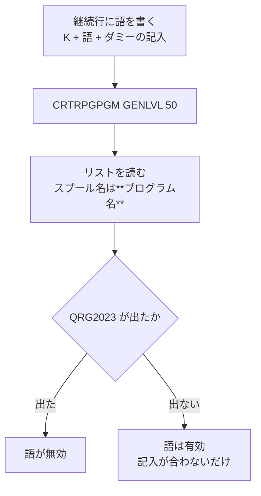

# レビューガイド: F 仕様 継続行の選択欄・記入欄を足す

## 変更概要 / 目的

RPG III の F 仕様は **53 桁目に `K` を書くと次行が継続行**になり、
**54-59 が「選択」・60-65 が「記入」**として働く。定義には `CONTINUATION`(53) しか無く、
**継続行が書けなかった**。その 2 欄を足す。

**コードは 1 行も変えていない。** 定義 JSON と、それを守るテストだけ。

## 重要ポイント（特に見てほしい所）

### 1. 語の集合は実機のコンパイラに判定させた（RPG III に原典が無いため）

判定は**リストのメッセージ番号**で行う。**作成の成否では判別できない**——
`GENLVL(50)` を付けると誤りがあってもプログラムは作成され、`ZZZZZZ` すら「通る」。

前 work はここを成否で判定して**誤った結論**を出しかけた（`INFSR` を「無効」と判定したが、
実際は `QRG2075`＝記入が違うだけだった）。

### 2. 対照が 2 回助けた

先頭と末尾に `INFDS`（有効）と `ZZZZZZ`（無効）を置いた。**2 巡とも 4/4。**

**1 回目は誤読を止めた。** スプール名を `QRPGLST` で引いていて 0 件しか返らず、
「メッセージが無い ＝ 有効」と判定されて**全件が「有効」に見えた**。
対照の `ZZZZZZ` が「有効」になったので気付けた。
実際のスプール名は**プログラム名**（`AGENTS.md` に追記）。

**2 回目は末尾で効いた。** 途中で診断が止まっていないことを示す。

### 3. 候補の出所は実際に取りこぼしていた → 選択肢で縛らない

候補は ILE の F 仕様キーワード由来。「RPG III にしか無い語を拾えない」懸念を
**確かめるために 2 巡目を流した**ら、**さらに 5 件が有効**だった。

| 巡 | 候補 | 有効 |
|---|---|---|
| 1 | ILE のキーワード 30 語 | 10 |
| 2 | 別の候補 20 語 | **5**（`SAVDS` `IND` `NUM` `ID` `COMIT`） |

**15 件中 5 件（3 分の 1）を取りこぼしていた。** 集合が閉じている保証が無いので、
`dropdown` にすると**実機が受ける語を打てなくする**（`ADDPFM` の `SRCTYPE` と同じ形）。
だから `inputType: "text"` にし、確かめた 15 語は `help` に置いた。

### 4. 「QRG2023 が出ない」だけでは不在証明

本文を読んで裏を取った（`verify/probe-msgsummary.mjs`）。

| 語 | メッセージ本文（先頭） |
|---|---|
| `ZZZZZZ` | `The Option entry is invalid. Continuation…` |
| `SAVDS` | `**NUM, SAVDS, IND and ID options valid for**…` |
| `IGNORE` | `IGNORE option specified for program-described…` |
| `SFILE` | `File with SFILE option not externally-described` |

**どれも語そのものを名指ししている。** おまけに `QRG2156` は 4 語を並べており、
「実機は集合を並べてくれない」は `QRG2023` に限った話だと分かった。

## 主要な変更箇所

- `resources/prompter/rpg/rpg3/ja/F-SPEC.json` — `CONTOPT`(54-59) / `CONTENTRY`(60-65) を追加。
  `dependsOn` で **53 桁目が `K` のときだけ出す**（ファイル行では 60-65 は空白でなければ
  ならない＝`QRG2016`。条件表示にしておけば踏まない）。
- 同 — `CONTINUATION` の `placeholder` を `S` → `K`（help と食い違っていた）。
- `test/unit/rpg3NumericColumns.test.ts` — 桁の重なりを**全欄で機械検査**、条件表示、
  「選択肢で縛っていないこと」を固定。**4 件とも戻すと落ちる**ことを確認済み。
- `AGENTS.md` — スプール名がプログラム名であること、件数が多いときの読み方、
  `GENLVL` を上げたら成否で判定しないこと。

## リスク / 確認してほしい点

1. **語の一覧はまだ閉じていない可能性がある。** 2 巡で 50 語を試したが、
   「候補に無い語は検出できない」限界は残る。**選択肢で縛っていないので害は無い**が、
   help の「全部とは限らない」という書き方が妥当かは見てほしい。
2. **別項目として backlog へ回したもの**: `restricted:false` の `dropdown` は
   `<select>` である以上、列挙外を打てない。**CL 側の 86 欄が同じ状態**。
   今回は `text` を選んで回避したが、回避であって解決ではない。
