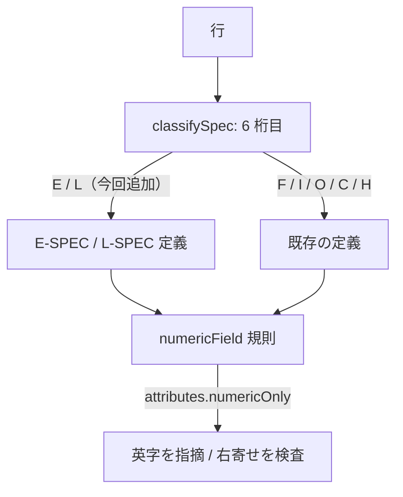

# レビューガイド: RPG III の残りの数値欄

## 変更概要 / 目的

RPG III の定位置の数値欄を実機で確定し、定義に反映した。**付けた欄と、あえて
付けなかった欄**の両方が要点。

## 重要ポイント（特に見てほしい所）

1. **スキップ欄に `numericOnly` を付けていない**（`O-SPEC.json` 19-20 / 21-22）。
   実機は `A0`〜`B2` を受ける（`QRG6016`）。付けると実機の通す値を lint が弾く。
   `test/unit/rpg3NumericColumns.test.ts` に**付けたら落ちる**テストがある。

2. **E / L 仕様が消費経路に無かった**（`src/core/rpgSpec.ts:207` 付近）。
   定義 JSON はあったのに `classifySpec` の switch に `E` / `L` が無く、
   F4 も lint も一度も届いていなかった。分類そのものを見るテストで固定した。

3. **空白でなければならない桁に入力欄が残っている**（D1）。消すと既存ソースの
   その桁が画面に出ず書き戻しで消えるため、`help` で警告する方を採った。

4. **53 桁目は「ラベル」ではなく「継続」だった**（D2）。既存 help の
   「MVT/MVS では空白」という記述が、IBM i で確かめずに他系統の資料から
   起こしたものであることを示している。

## 処理フロー

## 主要な変更箇所

- `vscode-extension/src/core/rpgSpec.ts` — `E` / `L` の分類を足した（rpg3 のみ）
- `vscode-extension/resources/prompter/rpg/rpg3/ja/O-SPEC.json` — 3 欄に付け、2 欄には**付けない**理由を書いた
- `vscode-extension/resources/prompter/rpg/rpg3/ja/{E,L,F}-SPEC.json` — 数値欄と空白必須の桁
- `docs/src/RPG3SAMP.rpg` — F/I/O の桁ずれ（5 行）

## リスク / 確認してほしい点

- `LABELS` → `CONTINUATION` の改名。定義の外から参照している箇所は無いことを確認したが、
  プロンプターの入力欄の名前が変わる。
- サンプルはまだコンパイルが通らない（桁は正しい）。理由は backlog に残した。
