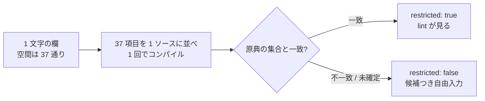

# レビューガイド: 確かめた欄だけを lint の対象にする

## 変更概要 / 目的

lint の `restricted-value`（定義済み値以外を弾く）を**既定 ON** にする。
ただし見るのは **`restricted: true` の欄だけ**で、その印が付くのは
**実機で全空間を試して原典と一致した欄だけ**——いまは **1 欄**。

## 重要ポイント

### 1. 「漏れが無い」は列挙を試しても分からない

`restricted: true` に必要なのは「列挙が正しい」ことではなく**「漏れが無い」**こと。
列挙された値だけ試しても、**列挙に無い有効な値**は見つからない
（RPG III の継続行で踏んだ限界そのもの）。

**1 文字の欄なら空間は 37 通り**（ブランク ＋ A-Z ＋ 0-9）。全部試せば完全性が決まる。
37 回コンパイルする代わりに、**1 ソースに 37 項目を並べて 1 回**で流している。

### 2. 一括の読み取りが一度まちがった（**ここを見てほしい**）

コンパイル・リストは「**Data Description Source**」の後に「**展開後のソース**」が続き、
**後半にも項目名が出る**。素朴に項目名で引くと後半が前半を上書きし、
**すべて「指摘なし」＝有効**に見える。

一度そのまま「**37 文字中 25 文字が有効**」という結果を出しました。
気付けたのは、**同じ日に単独で取った判定（`0` は無効）と食い違った**からです。

**食い違いを「どちらか選ぶ」で済ませず、原因まで戻ったのが要点。**

### 3. 「指摘が無い ＝ 有効」ではない

網羅で指摘が出なかった値のうち、**原典に無いもの**は単独で確かめました。

| 値 | 網羅 | 単独 | 結論 |
|---|---|---|---|
| 表示装置 35 桁 `V` | 指摘なし | **作成できない** | 有効ではない |
| 印刷装置 35 桁 `G` | 指摘なし | **作成できる** | **原典に無いが有効** |
| 印刷装置 35 桁 `O` | 指摘なし | **作成できる** | **原典に無いが有効** |

一括では誤りが多い行で指摘が出きらないことがあるため、**単独での確認が要る**。

### 4. 対照が雛形の誤りを捕まえた

物理/論理の確認では、**対照（`A`＝通るはず）が落ちました**。
値ではなく雛形が誤っているので、**結果を採らず未確定**としています。
対照が無ければ「`A` は無効」と誤って記録していました。

### 5. 既定の規則集合を変える

`lintRules.test.ts` / `lintCli.test.ts` の 3 件が落ちました。
**これは正しい抵抗**——既定を黙って変えさせないための仕掛けです。
数を書き換えるだけにせず、**なぜ変わったか**（実機で確かめた欄だけを見る規則であること、
偽陽性を数えてから ON にしたこと）をテストのコメントに残しました。

## 主要な変更箇所

- `docs/origin/generate-dds-prompter.mjs` — `PROVEN_COMPLETE`（いまは `DDS-DSPF:38` のみ）と
  `attributes.restricted` の出力。**増やす条件をその場に書いてある。**
- `src/lint/rules/index.ts` — `enabledByDefault: true`。説明も現状に合わせた。
- `test/unit/ddsPositionalValues.test.ts` — 印が付く範囲を `["DDS-DSPF:38"]` で固定
  （**根拠なく増やすと落ちる**）＋ 規則が `Z` / `0` を指摘することを確認。

## リスク / 確認してほしい点

1. **確かめた欄は 1 つだけ。** 規則としての効き目は今のところ狭いです。
   物理/論理は雛形を直せば測れます（やっていないことを記録済み）。
   17 桁（仕様のタイプ）は値を変えると行の種類が変わるので、この手法では測れません。
2. **`restricted: false` には副作用があります**（意図した方向）。画面が候補つきの
   自由入力になるので、印刷装置 35 桁の `G` / `O` を**書けるようになりました**。
3. 偽陽性は `docs/src` の 11 サンプルで 0 件。**実サンプルの範囲での確認**です。
