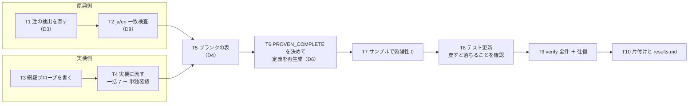

# 計画: DDS 定位置欄の値集合を実機で網羅し、`restricted` を広げる

## 実装方針

**「原典側の修復」と「実機側の観測」を分けて進める。** 両者は独立で、
混ぜると「値が増えたのは原典を直したからか実機の結果を入れたからか」が
分からなくなる。最後に突き合わせて `PROVEN_COMPLETE` を決める。

**分割（subtask）はしない。** 生成器 1 本・定義 6 ファイル・検査 1 本・テスト 1 本で、
1 PR に収まる。実機の観測と原典の修復は独立だが、**どちらも単独ではデリバリできない**
（片方だけ入れても値集合が揃わず `restricted` を立てられない）ので、
別 work にも割らない。

## 作業順序と依存関係

1. **T1** 生成器の注の抽出を直す（依存: なし）
2. **T2** ja/en の値集合一致を検査に足す（依存: T1。T1 で値が増えるので、増えた後で一致を見る）
3. **T3** 網羅プローブを書く（依存: なし。T1/T2 と並行してよい）
4. **T4** 実機に流して結果を採る（依存: T3）
5. **T5** ブランクの表を埋める（依存: T1・T4。原典の引用と実機の判定の**両方**が要る）
6. **T6** `PROVEN_COMPLETE` を決めて定義を再生成（依存: T5）
7. **T7** サンプルで偽陽性 0 を確認（依存: T6）
8. **T8** テストを更新し、戻すと落ちることを確かめる（依存: T7）
9. **T9** `npm run verify` 全件と往復検証（依存: T8）
10. **T10** 実機の片付けと `results.md` 仕上げ（依存: T4。ただし全部終わってから書く）

**T6 は T4 の後でなければならない**（spec の「実装の順序」）。
実機の結果を見ずに `PROVEN_COMPLETE` を増やすと、確かめていない欄に印が付く。

## リスク / 留意点

| リスク | 対応 |
|---|---|
| **対照が落ちる** | その回の結果を採らない。まず雛形とコマンドを疑う（`CRTPF` の `REPLACE` が実例） |
| **一括で構造が崩れて指摘が消える** | 17 桁は 2 段（一括 → 単独確認）。35/38 桁は行の役割が変わらないので一括で足りる |
| **偽陽性が出る** | その欄は `true` にしない。**規則ごと切られる方が損失が大きい**（既定 ON の規則） |
| **ja/en がずれる** | T2 の検査で落ちる。注の抽出の窓（200 文字）が言語で違う結果を出しうる |
| **ブランクが落ちる** | `restricted: true` の欄は `<select>` になり戻せない。T5 を T6 の前に置いている |
| **テストの期待値を漫然と書き換える** | `ddsPositionalValues.test.ts:148` は必ず落ちる。**落ちたら期待値を直す前に理由を確かめる** |
| **実機の共用機に負荷** | 1 接続にまとめる。一括 7 本 ＋ 単独確認 11 件前後で ~18 コンパイル |
| **スプールの削除** | プローブは `DLTSPLF` を持たない（D9）。名前を記録して残す |

## テスト方針

- **単体（`ddsPositionalValues.test.ts`）**
  - 欄ごとの**値集合**を固定する（T1 で増えた `G` / `O` / ブランクを含む）。
  - **`restricted: true` が付く欄**の一覧を固定する（`:134` の suite）。
  - **`restricted: false` のままの欄**も一覧で固定する（`:148`。何を確かめていないかが分かる）。
  - `true` にした欄で、**実機が無効と判定した文字**を含む行が `restricted-value` で
    指摘されることを固定する（AC4）。**実機の判定をそのまま期待値にする。**
  - `docs/src` のサンプルで指摘 0 件（AC5）。
- **戻すと落ちることの確認**（AGENTS.md の規約）
  - `PROVEN_COMPLETE` から今回足した欄を外すと、`true` の一覧と発火のテストが落ちる。
  - 注の抽出を元の正規表現に戻すと、値集合のテストが落ちる。
  - **落ちることの確認は期待値の正しさを保証しない**ので、期待値は
    **実機の生の結果（`verify/results.md`）と原典の生テキスト**で裏を取る。
- **検査（`npm run verify`）**
  - `verify-dds-prompter.mjs`: 桁定義との一致 ＋ **ja/en の値集合一致（T2 で追加）**。
  - `verify-prompter-roundtrip.mjs`: 無変更の確定で一致・入れた値が同じ値で返る（AC8）。
- **実機**
  - 各種別で「通ると分かっている最小形」が作成できること（雛形の健全性）。
  - 全 37 通りの判定が対照つきで揃うこと。
- **手で見るもの**: プロンプターで `true` にした欄が `<select>` になり、
  **ブランクが選べる**こと（AC-I2 / AC-I5）。`dev/prompter-e2e.mjs` で開く。
