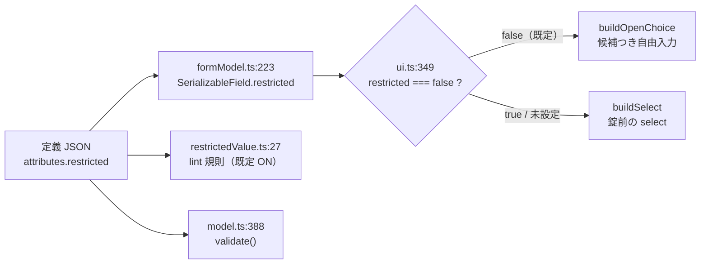

# 調査: DDS 定位置欄の値集合を実機で網羅する

## 調査の問い

- Q1: 物理/論理（PF）の雛形はなぜ落ちたのか（前回は対照 `A` が通らなかった）。
- Q2: 17 桁（仕様のタイプ）は、構造由来の失敗と読み分けられるか。
- Q3: 表示装置 35 桁の「一括の読み取りが当てにならない」は、手法の限界か読み取りの欠陥か。
- Q4: 印刷装置 35 桁の `G` / `O` は本当に原典に無いのか（errata の要否）。
- Q5: 出力先の仕様——`restricted` を消費するのはどこか。何を壊しうるか。

## 判明した事実

### F1: `CRTPF` に `REPLACE` パラメーターは無い（Q1 の答え）

前回の雛形は**正しく、コマンドが誤っていた**。`CRTDSPF` / `CRTPRTF` の
`REPLACE(*YES)` をそのまま流用しており、実機は

```
CPD0043  Keyword REPLACE not valid for this command.
CPF0001  Error found on CRTPF command.
```

を返していた。**DDS の中身は一度も評価されていない**。リスト（スプール）が
0 バイトだったのもこのため——コンパイルに到達していないので出力が無い。

修正後（`DLTF` → `CRTPF`）、対照は 2/2 一致した
（`verify/probe-research.mjs`、`verify/research-report.json`）。

| 形 | 期待 | 実機 |
|---|---|---|
| PF 35 桁 = `A` | 作成できる | ○ `CPC7301 File RPFA created` |
| PF 35 桁 = `Q`（原典に無い） | 落ちる | × `CPD7419@35桁 Data type not valid` |

**前回の「雛形が誤っている」は誤診**。`20260828-rpg3-fspec-reclen` が
`*LIBL` の問題を「F 仕様の書き方」と誤診したのと同じ型で、
**原因はコンパイルに到達する前**にあった。

### F2: 17 桁は `CPD7410` と `*` 印の桁で読み分けられる（Q2 の答え）

無効な値を 17 桁目に置くと `CPD7410` が出て、リストの `*` 印が
**ちょうど 17 桁目**を指す。

```
    200       A          X F1            10A     1  2
*                CPD7410-*
```

3 種別すべてで同じ形を確認した（`verify/probe-research.mjs`）:

| 形 | 期待 | 実機 |
|---|---|---|
| PF 17 = `K`（キー。PF では有効） | 作成できる | ○ `CPC7301` |
| PF 17 = `X`（どの種別にも無い） | 落ちる | × `CPD7410@17桁` |
| DSPF 17 = `K`（PF にはあるが DSPF に無い） | 落ちる | × `CPD7410@17桁` |
| PRTF 17 = `K` | 落ちる | × `CPD7410@17桁` |

**対照 4/4 一致。** 「値そのものが無効」と「構造上の失敗」は、
メッセージ番号ではなく**印が指す桁**で分かれる。番号だけでは分からない
（`CPD7410` は 38 桁の無効値でも出る）。

### F3: 「一括は当てにならない」の正体はページ境界（Q3 の答え）

**手法の限界ではなく、読み取りの欠陥だった。** コンパイル・リストの指摘行は
直前のソース行に属するが、**ページ境界では見出しが割り込む**。

```
   2500       A            F22           10V     4  2      ← V の行
 5770SS1 V7R3M0 ...  Page    2                             ← ページ見出し
 SEQNBR  *...+....1....+....2...
*                                  CPD7419-*                ← これは F22(V) の指摘
   2600       A            F23           10W     5  2
```

前回は項目名で grep していたため **`V` の指摘だけが見えず「有効」に見え**、
単独で流すと落ちたので「一括は当てにならない」と結論していた。
ページ見出しと空行を飛ばして親を辿る解析器を書いたところ、
**既存のリストから 37/37 が漏れなく取れた**（`verify/parse-listing.mjs`）。

つまり**表示装置 35 桁は実機に流し直す必要が無い**。前回のリストで足りる。

### F4: メッセージ番号の意味は「受理したか」を分ける（リスト末尾の Messages 節）

| 番号 | 本文 | 意味 |
|---|---|---|
| `CPD7419` | Data type not valid. | **値そのものが無効** |
| `CPD7408` | Entry for decimal positions or field length not valid. | データ・タイプは**受理**。長さ／小数の指定を咎めている |
| `CPD7635` | Length too large for floating-point precision. | 同じく**受理**（`F` は浮動小数点） |
| `CPD7410` | （17 / 38 桁で観測）示された欄にその文字は使えない | **値そのものが無効** |

**受理された集合 = 全 37 − `CPD7419` の集合**。件数はリスト末尾の
Messages 節と突き合わせて数えられる（D35 は 19 件、R35 は 28 件）。

### F5: 表示装置 35 桁は原典と完全一致する（流し直し不要）

`verify/parse-listing.mjs` で既存の `exhaustive-D35.txt` を解析した結果:

- `CPD7419`（無効）19 件: `B C H K P Q R U V 0-9`
- 指摘なし 12 件: ブランク `A D E G I J M N O W X`
- `CPD7408`/`CPD7635`（受理・長さの咎め）6 件: `F L S T Y Z`

**受理 18 件 = 原典の 18 件（`_XANSYWIDMFLTZJEOG`）と完全一致。過不足ゼロ。**

### F6: 印刷装置 35 桁の `G` / `O` は原典にある（Q4 の答え。errata は不要）

`docs/origin/dds/FIELD-PRTF-prtdata.html` の**値の表の直後の「注」**:

> 注: **O (混用) および G (グラフィック)** は、2 バイト文字セット (DBCS) を
> 使用する DDS 印刷装置ファイルをサポートします。

さらにブランクも本文に明記されている:

> データ・タイプを指定せず、参照フィールドから複写もしなかった場合には、
> IBM i オペレーティング・システムはデフォルトにより次の値を割り当てます。
> **小数点以下の桁数 (36 から 37 桁目) がブランクであれば A (文字)。**

**backlog の「原典に `G` `O` が無い。原典側を errata で補う判断が要る」は前提が誤り。**
原典にはあり、**生成器が読めていない**。

原因は `addNoteDataTypes` の正規表現（`generate-dds-prompter.mjs:190`）:

```js
const note = /(?:注|Note)\s*[:：]\s*(?:データ・タイプ|The data types)([\s\S]{0,160})/u.exec(text);
```

**「注:」の直後が「データ・タイプ」で始まること**を要求している。

| 種別 | 原典の注の書き出し | 一致 |
|---|---|---|
| 物理/論理 | 「注: **データ・タイプ** J (専用)、E (択一)、O (混用) および G (図形) は…」 | ○ |
| 印刷装置 | 「注: **O (混用) および G (グラフィック)** は…」 | **×** |

R35 の実機結果も原典と符合する。受理 9 件 = ブランク `A F G L O S T Z`
（`CPD7419` 28 件 = 37 − 9）。原典の表 6 件 ＋ 注の 2 件 ＋ 本文のブランク = 9。**一致。**

### F7: ブランクが本文にしかない欄が 2 つある

生成器がブランクを採るのは、**`<dt>` / 表の項目が「ブランク」と書かれているとき**だけ
（`addBlank`、`generate-dds-prompter.mjs:146`）。

| 欄 | 現在の値 | ブランク |
|---|---|---|
| 物理/論理 17 | `_RKJSO` | ○ 項目にある |
| 物理/論理 35 | `PSBFAHLTZ5JEOG` | **× 本文だけ**（「この欄がブランクであれば…物理ファイル内の対応するフィールドの…」） |
| 物理/論理 38 | `_BIN` | ○ |
| 表示装置 17 | `_RH` | ○ |
| 表示装置 35 | `_XANSYWIDMFLTZJEOG` | ○ |
| 表示装置 38 | `_OIBHMP` | ○（済） |
| 印刷装置 17 | `_R` | ○ |
| 印刷装置 35 | `SAFLTZ` | **× 本文だけ** |

**lint はブランクを咎めない**（`restrictedValue.ts:38` の `if (value.length === 0) continue`）
ので誤検出は出ないが、**プロンプターでは選べない値になる**——`restricted: true` の欄は
`<select>` になり、選択肢に無いブランクへ戻せない。データ・タイプのブランクは
「既定（文字）」を意味する常用の値なので、落としたままにはできない。

### F8: `restricted: true` は入力欄の種類を変える（Q5 の答え）



**`buildSelect` は一覧に無い値を黙って落とす**（`ui.ts:367` の `select.value = field.value`。
一致する `<option>` が無ければ `selectedIndex` は -1 になる）。
`false` から `true` へ変えるということは、**利用者が打てた値を打てなくする**変更でもある。
だから「実機が受ける集合と定義の集合が完全一致」以外の条件で `true` にしてはいけない。

## 影響範囲

- `docs/origin/generate-dds-prompter.mjs` — 生成器。`PROVEN_COMPLETE` /
  `addNoteDataTypes` / `addBlank` の 3 か所。
- `vscode-extension/resources/prompter/dds/{ja,en}/DDS-{PF,DSPF,PRTF}.json` — 再生成される 6 ファイル。
- `restricted-value` 規則（既定 ON）の**発火範囲が広がる**。偽陽性が出れば
  規則ごと切られるので、`docs/src` のサンプルで 0 件を確かめる必要がある。
- プロンプターの入力欄（`buildOpenChoice` → `buildSelect`）。
- 検査: `docs/origin/verify-dds-prompter.mjs`、`scripts/verify-prompter-roundtrip.mjs`。
- テスト: `vscode-extension/test/unit/ddsPositionalValues.test.ts`
  （**「確かめていない欄は `restricted: false`」を固定しているので、必ず更新が要る**）。

## 実現性 / リスク

- **表示装置 35 桁は実機不要**（F3 / F5）。既存リストの解析だけで確定する。
- **印刷装置 35 桁も実機不要**に近い。既存の `exhaustive-R35.txt` が 37/37 を持つ。
  必要なのは生成器を直して原典側を 9 件にすることだけ。
- **物理/論理 35・38 桁は実機が要る**（F1 で雛形が直ったので流せる）。2 回のコンパイル。
- **17 桁は 2 段構え**。一括で `CPD7410@17` の集合を採り、**そこに出なかった値だけ**
  単独で確かめる（`R` は新しいレコードを始めるので、一括では構造が壊れて
  他の行の指摘が消えうる。一括だけでは「指摘が無い＝有効」と断定できない）。
  単独で確かめる件数は PF 6 / DSPF 3 / PRTF 2 程度の見込み。
- **リスク: 偽陽性**。`true` にした欄で `docs/src` のサンプルが 1 件でも咎められたら、
  その欄は `true` にしない（規約「入力の検査を厳しくするときは実機の値を流して確かめる」）。
- **リスク: en 版との構造一致**。`verify-rpg-spec-definitions.mjs` と同じ趣旨で、
  ja / en は構造（値集合）が同じでなければならない。原典 HTML は日英で別ファイルなので、
  **英語版の注も同じ形で読めるか**を確かめる必要がある（`The data types` の分岐がある）。

## 実装アンカー

- A1: `restricted: true` を立てる単一の場所（`docs/origin/generate-dds-prompter.mjs:111`
  `PROVEN_COMPLETE`）— いまは `["DDS-DSPF:38"]` の 1 件。表の注記もここにある。
- A2: 注から値を足す（`docs/origin/generate-dds-prompter.mjs:188` `addNoteDataTypes`、
  正規表現は `:190`）— 印刷装置の注に当たらない箇所。
- A3: ブランクを足す（`docs/origin/generate-dds-prompter.mjs:146` `addBlank`）—
  項目に「ブランク」と書かれた場合しか通らない。本文からは採っていない。
- A4: `restricted` を定義に書き出す箇所（`docs/origin/generate-dds-prompter.mjs:317`）。
- A5: 原典の誤りを直す枠（`docs/origin/generate-dds-prompter.mjs:113` `ORIGIN_ERRATA`）
  — **今回は使わない見込み**（F6）。
- A6: lint 規則（`vscode-extension/src/lint/rules/restrictedValue.ts:21`）と
  登録（`vscode-extension/src/lint/rules/index.ts:192`、`enabledByDefault: true`）。
- A7: 入力欄の切り替え（`vscode-extension/src/prompter/webview/ui.ts:349`）と
  錠前の実装（`:361` `buildSelect`、`:367` が値を落とす行）。
- A8: 値の妥当性検査（`vscode-extension/src/prompter/model.ts:388`）。
- A9: 既存テスト（`vscode-extension/test/unit/ddsPositionalValues.test.ts:112`
  「DDS の restricted-value」suite、`:148` が「確かめていない欄は false」を固定）。
- A10: リスト解析器（`.aidev/works/20260829-dds-restricted-expand/verify/parse-listing.mjs`）
  — 今回書いたもの。ページ境界と 2 部構成を構造で解く。
- A11: 実機プローブの雛形（同 `verify/probe-research.mjs`）— `CRT` の表に
  種別ごとのコマンド列（PF は `DLTF` → `CRTPF`）を持つ。

## 実装時の注意

- **`CRTPF` に `REPLACE` を書かない**（`CPD0043`）。`DLTF` で場所を空けてから作る。
  `CRTDSPF` / `CRTPRTF` にはあるので、種別ごとにコマンド列を分ける。
- **リストは「前半（ソース）」だけを見る。** 後半（展開後ソース）にも項目名が出る。
- **指摘行の親はページ境界をまたぐ。** 見出し・空行で親を切らない。
- **判定に使うのは印が指す桁**。メッセージ番号だけでは足りない（`CPD7410` は
  17 桁でも 38 桁でも出る）。番号は「無効か受理か」の判別に使う（F4）。
- **`CPD7408` / `CPD7635` は「受理」側**。これを無効と数えると、
  `F L S T Y Z` を弾いて**正しいソースを咎める**。
- **スプールは消さない**（2026-08-29 の決定）。この work のプローブは `DLTSPLF` を持たない。
  初版は「直近 3 件」を順位で消しており、`CRTPF` が `CPD0043` で即落ちして
  リストが出なかった回に**無関係な既存スプールを約 15 件消した**（復元不可）。
  作成物・メンバー・IFS は名前が一意なので消してよい。
- **対照が期待どおりでない回の結果は採らない。** 前回・今回とも、対照が誤診を止めている。
- **ブランクを落とさない。** `restricted: true` にすると `<select>` になり、
  選択肢に無い値へは戻せなくなる（F7 / F8）。
- **`ddsPositionalValues.test.ts:148` は必ず落ちる。** 「確かめていない欄は false」を
  固定しているため。**落ちたら期待値を書き換える前に、なぜ変わったのかを確かめる。**

## spec への申し送り

- **errata は使わない**（F6）。原典は正しく、生成器の抽出が足りないだけ。
  `ORIGIN_ERRATA` に `G` / `O` を足す設計にしないこと。
- **`addNoteDataTypes` をどこまで緩めるかは設計判断**。広げすぎると
  関係の無い注（「37 桁目に 0 を指定します」等）から文字を拾う。
  既存のコメントが「対象を狭く取る」と明記しているので、**DBCS の裏取りは残す**。
- **ブランクを本文から採る方法も設計判断**。全欄に一律で足すのは危険
  （ブランクが無効な欄があるかもしれない）。**実機の網羅がブランクを受理した欄にだけ**
  足すのが安全側で、`PROVEN_COMPLETE` と同じ根拠に乗る。
- **英語版の原典で同じ抽出が通るかを確かめる**。ja / en で値集合がずれたら
  同じソースが言語で違う結果になる。
- 17 桁の網羅は**一括 → 単独確認の 2 段**にする（F2 / 実現性の節）。
- 残った未確定: **物理/論理 35・38 桁と 17 桁×3 種別の実機結果**（未取得）。
  これらは coding で流す。
