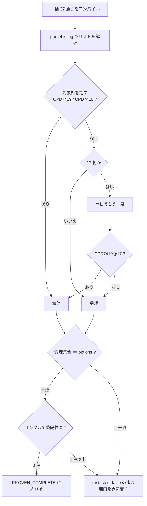

# 仕様: DDS 定位置欄の値集合を実機で網羅し、`restricted` を広げる

## 概要

DDS の定位置欄 8 つのうち `restricted: true` は 1 件（表示装置 38 桁）。
残り 7 欄について**実機が受ける値の集合**を確定し、原典と完全一致した欄だけ
`restricted: true` にする。一致しなかった欄は `false` のまま、理由を残す。

research（`research.md`）で 5 問すべてに答えが出ており、**errata は不要**・
**表示装置 35 桁と印刷装置 35 桁は実機に流し直す必要が無い**ことが分かっている。
残る実機作業は物理/論理 3 欄と 17 桁 3 種別。

## 設計方針

### D1: 判定は「印が指す桁」で行い、メッセージ番号は受理／無効の別に使う

コンパイル・リストの指摘は `メッセージ番号 + *印が指す桁` の組で読む
（`research.md` F2 / F4）。番号だけでは足りない——`CPD7410` は 17 桁でも 38 桁でも出る。

| 番号 | 意味 | 集合 |
|---|---|---|
| `CPD7419` Data type not valid. | 値そのものが無効 | **無効** |
| `CPD7410` （示された欄に使えない文字） | 値そのものが無効 | **無効** |
| `CPD7408` Entry for decimal positions or field length not valid. | 値は受理。長さ／小数の咎め | **受理** |
| `CPD7635` Length too large for floating-point precision. | 値は受理 | **受理** |

**受理集合 = 全 37 −（対象桁を指す無効メッセージが付いた文字）。**
`CPD7408` を無効と数えると `F L S T Y Z` を弾き、正しいソースを咎める。

代替案（作成の成否だけで判定する）を退けた理由: 有効な値でも長さ・
小数・キーワードの前提が違えば作成は落ちる。成否では受理と無効が分けられない。

### D2: リストの解析は構造で行う（`parse-listing.mjs`）

前回の読み取りは 2 度まちがえた（2 部構成／ページ境界。`research.md` F3）。
どちらも項目名の grep で解いていたのが原因なので、**構造で解く**。

- リストを `E N D O F S O U R C E` で切り、**前半だけ**を見る。
- 指摘行の親は**直前のソース行**。ページ見出し・欄見出し・空行では親を切らない。
- 桁は **6 桁目の `A` を基準**に換算する（`-***` の `-` の次が指す桁）。

この解析器は work の `verify/` に置く。**生成器（`docs/origin/`）には入れない**
——原典から定義を作る経路ではなく、実機の観測を読む道具だから。

### D3: `addNoteDataTypes` は「DBCS を含む注」まで緩め、すべての注を見る

いまは「注:」の直後が `データ・タイプ` / `The data types` で始まることを要求しており
（`generate-dds-prompter.mjs:190`）、印刷装置の注（`O (混用) および G …`）に当たらない。

**変更**: 前置きの語を必須にせず、`注` / `Note(s)` のすべてに対して
`DBCS` を含むものだけを対象にする（`exec` → `matchAll`）。

**安全性は原典の全件走査で裏を取った**。`docs/origin/dds` と `dds-en` の全 HTML で
「DBCS を含む注」を持つのは **3 ページだけ**（`FIELD-DSPF-valentries` /
`FIELD-PF-ldata` / `FIELD-PRTF-prtdata`）で、いずれもデータ・タイプのページ。
拾う値も DBCS のデータ・タイプに限られる。**巻き込みは起きない。**

既存コメントの「対象を狭く取る」という意図は `DBCS` の裏取りが担う。
前置きの語は**言語と種別で揺れる**ので、条件として弱い。

### D4: ブランクは表で足す（`BLANK_FROM_PROSE`）。本文の解析はしない

物理/論理 35 桁と印刷装置 35 桁は、ブランクが**値の一覧ではなく本文**にある
（`research.md` F7）。本文の解析は退ける——書き方が揃っておらず、
**別の桁の話を拾う**危険がある。実際、印刷装置の該当文は

> 小数点以下の桁数 **(36 から 37 桁目)** がブランクであれば A (文字)。

で、ブランクなのは 35 桁目ではなく 36-37 桁目。素朴な「ブランクであれば」の
照合はここで誤る。

**採用**: `PROVEN_COMPLETE` / `ORIGIN_ERRATA` と同じ形の**根拠つきの表**。

```js
const BLANK_FROM_PROSE = [
  { type: "DDS-PF",   column: 35, meaning: "…", origin: "<原典の生テキスト>", machine: "<実機の判定>" },
  { type: "DDS-PRTF", column: 35, meaning: "…", origin: "…", machine: "…" }
];
```

**入れる条件は 2 つとも要る**: 原典の本文にブランクの意味が書かれていること、
**かつ実機の網羅がブランクを受理したこと**。片方だけでは入れない。

ブランクを落とすと、`restricted: true` の欄は `<select>` になり
**ブランクへ戻せなくなる**（`research.md` F8）。lint は空欄を咎めないので
指摘は増えないが、入力欄としては後退する。

### D5: 17 桁は「一括 → 単独確認」の 2 段で確かめる

17 桁は値ごとに行の役割が変わる（`R` は新しいレコードを始め、`K` はキー、
`J` は結合）。一括だけでは**構造の崩れが他の行の指摘を消しうる**ので、
「指摘が無い＝有効」と断定できない。

1. **一括**: 1 つのソースに 37 行を並べ、`CPD7410@17桁` が付いた文字を**無効**と確定する。
   （無効の判定は他の行の状態に影響されない——付いた印は事実）
2. **単独確認**: 一括で印が付かなかった文字だけを、**1 つずつ**コンパイルして
   `CPD7410@17桁` が出ないことを確かめる。ここで印が付けば無効に回す。

単独確認の対象は原典の値の数に近い見込み（物理/論理 6 / 表示装置 3 / 印刷装置 2）。

### D6: `restricted: true` に入れる条件（`PROVEN_COMPLETE`）

**次の 3 つをすべて満たした欄だけ**。1 つでも欠けたら `false` のまま。

1. 全 37 通りを実機に判定させ、**対照が期待どおり**であること。
2. **実機の受理集合と定義の `options` が完全一致**（過不足ゼロ）。
3. `docs/src` の**全サンプル**に lint をかけて **`restricted-value` の指摘が 0 件**。
   この規則が効くのは DDS の 5 件（`CUSTMST.pf` / `CUSTLF1.lf` / `DBCSSAMP.pf` /
   `CUSTMNT.dspf` / `CUSTRPT.prtf`）だが、**他の規則の指摘も増やさない**ことを見るため
   全件を流す（前作業も 11 件で 0 件を確かめている）。

### D7: 原典 errata は使わない

backlog の「印刷装置 35 桁は原典に `G` `O` が無いので errata で補う判断が要る」は
**前提が誤り**（`research.md` F6）。原典にはあり、生成器が読めていないだけ。
`ORIGIN_ERRATA` に足す設計にはしない——**原典が正しいのに誤りとして記録すると、
後から見た人が原典を疑う**。

### D8: ja / en の値集合の一致を検査に足す

`verify-dds-prompter.mjs` は各言語を桁定義と照合するだけで、**言語間を比べていない**。
`restricted: true` にすると値集合が lint の判定に効くので、ずれると
**同じソースが言語で違う指摘になる**。注の抽出は 200 文字の窓で切るため、
**日英で拾う値が変わりうる**（実際 ja の物理/論理は窓に `A (文字)` が入り en は入らない。
いまは既存の値なので影響が出ていないだけ）。

`verify-dds-prompter.mjs` に「同じ桁の `options` の**値の集合**が ja と en で一致」を足す
（ラベルは訳文なので比べない）。

### D9: 実機スクリプトは削除を持たない

`verify/` のプローブは `DLTSPLF` を**書かない**（2026-08-29 の決定）。
作ったスプールは名前を報告して残す。作成したファイル・メンバー・ソース物理ファイル・
IFS は名前が一意なので消す。`CRTPF` は `REPLACE` を受けないので `DLTF` → `CRTPF` の順で流す。

## 対象範囲

| ファイル | 変更 |
|---|---|
| `docs/origin/generate-dds-prompter.mjs` | `addNoteDataTypes`（D3）/ `BLANK_FROM_PROSE` 新設（D4）/ `PROVEN_COMPLETE` 追加（D6） |
| `vscode-extension/resources/prompter/dds/{ja,en}/DDS-{PF,DSPF,PRTF}.json` | **再生成**（手編集しない） |
| `docs/origin/verify-dds-prompter.mjs` | ja/en の値集合一致を追加（D8） |
| `vscode-extension/test/unit/ddsPositionalValues.test.ts` | 値集合と `restricted` の期待値を更新 |
| `.aidev/works/20260829-dds-restricted-expand/verify/` | `parse-listing.mjs`（済）/ 網羅プローブ / 結果 |

**変更しない**: `restrictedValue.ts`（規則本体）・`ui.ts`・`model.ts`・
`types.ts`・`formModel.ts`。今回は**定義の値だけ**を動かす。

## インターフェース / データ構造

### `parse-listing.mjs`（work の verify/。実装済み）

```js
parseListing(text) => [{ seq, text, marks: [{ id, column, width }] }]
```

`marks[].column` が **DDS の桁**（6 桁目の `A` を基準に換算済み）。

### `BLANK_FROM_PROSE`（生成器。新設）

```js
{ type: "DDS-PRTF", column: 35,
  meaning: "文字（既定）",
  origin: "データ・タイプを指定せず、参照フィールドから複写もしなかった場合には…"
          "小数点以下の桁数 (36 から 37 桁目) がブランクであれば A (文字)。",
  machine: "全 37 通りのうちブランクは指摘なし（verify/exhaustive-*.txt）" }
```

`parseDetail` の返り値に対して、**`ORIGIN_ERRATA` の直前**で適用する
（errata がブランクを触ることは無いが、順序を決めておく）。

### `PROVEN_COMPLETE`（生成器。追加）

`"<定義名>:<桁>"` の集合。**表のコメントに欄ごとの根拠を書く**（既存の形を踏襲）。

## 振る舞いの詳細

### 実機に流す一覧（1 接続にまとめる）

| # | 対象 | 形 | 目的 |
|---|---|---|---|
| 1 | 物理/論理 35 | 一括 37 | 受理集合 |
| 2 | 物理/論理 38 | 一括 37 | 受理集合 |
| 3 | 物理/論理 17 | 一括 37 | 無効集合（D5 段 1） |
| 4 | 表示装置 35 | 一括 37 | 受理集合（この work の証拠として採り直す） |
| 5 | 表示装置 17 | 一括 37 | 無効集合 |
| 6 | 印刷装置 35 | 一括 37 | 受理集合（同上） |
| 7 | 印刷装置 17 | 一括 37 | 無効集合 |
| 8+ | 17 桁の単独確認 | 1 件ずつ | D5 段 2（見込み 11 件前後） |

**対照**は各一括に自然に含まれる（原典にある値と無い値が同じ流しに入る）。
加えて種別ごとに「通ると分かっている最小形」を 1 件流し、
**作成が成功すること**を確かめる（雛形の健全性。`CRTPF` の件の再発防止）。

### 判定の流れ



### 不一致だったときの扱い

- **定義に足りない値がある**（実機が受けるのに原典に無い）→ 原典を読み直す。
  注・本文に書かれていないか確かめる（印刷装置の `G`/`O` はこれだった）。
  本当に原典に無ければ **`false` のまま**にし、理由を表に書く。errata は使わない。
- **定義に余分な値がある**（原典にあるのに実機が弾く）→ **`false` のまま**。
  実機が正だが、原典の値を消すと利用者が既存ソースを読めなくなる。

## ドメイン固有の考慮

- **原典を正とし、記述の無い挙動は実機で確かめる**（charter / AGENTS.md）。今回は
  「原典に無い」と思われていたものが**原典にあった**ので、まず原典に戻る（D7）。
- **JSON を手で直さず生成スクリプトを直す**（AGENTS.md）。
- **入力の検査を厳しくするときは実機の値を流して確かめる**（AGENTS.md）。D6 の条件 3。
- **列挙した値＝制限とは限らない**（AGENTS.md）。確かめていない欄は `false` のまま。
- **対照を必ず置く**。前回・今回とも対照が誤診を止めている。
- **73-80 桁は無視されない**——今回は 35/38/17 桁だけなので影響しないが、
  雛形の 80 桁を超える書き込みはしない。

## エラー処理 / 異常系

| 状況 | 扱い |
|---|---|
| 対照が期待どおりでない | **その回の結果を採らない**。雛形かコマンドを疑う |
| リストが取れない（スプールが無い） | コンパイルに到達していないと考える。返ったメッセージを読む（`CPD0043` の例） |
| 一括で作成が成功してしまう | 無効値が 1 つも無いはずはない。雛形を疑う |
| 受理集合が定義と不一致 | `false` のまま。理由を `PROVEN_COMPLETE` の表に書く |
| サンプルで偽陽性が出た | その欄は `true` にしない。**規則ごと切られる方が損失が大きい** |
| ja/en で値集合がずれた | `verify-dds-prompter.mjs` が落ちる。原典の窓の切り方を直す |

## 受け入れ基準との対応

| AC | 満たし方 |
|---|---|
| AC1 全 37 通りを対照つきで記録 | 一括 7 本 ＋ 単独確認。結果は `verify/results.md` に欄ごとの表で残す。対照が落ちた欄は「採らない」と明記 |
| AC2 完全一致した欄だけ `PROVEN_COMPLETE` | D6 の 3 条件。不一致は生成器の表に理由を書く |
| AC3 生成スクリプト経由で再生成・ja/en 構造一致 | JSON は手編集しない。D8 の検査で言語間の値集合を固定 |
| AC4 実機が弾く値を lint が指摘 | `true` にした欄ごとに、実機で無効と判定された文字を含む行で発火を確認（テストに固定） |
| AC5 `docs/src` 全サンプルで偽陽性 0 | D6 の条件 3。1 件でも出たらその欄は `true` にしない |
| AC6 `npm test` 全通過・戻すと落ちる | `ddsPositionalValues.test.ts` を更新。`PROVEN_COMPLETE` を戻すと落ちることを確認する |
| AC7 `npm run verify` 全 OK | `verify-dds-prompter.mjs` に D8 を足したうえで全件 OK |
| AC8 往復（無変更で一致・値が返る） | `verify-prompter-roundtrip.mjs` を流す。`true` にした欄でブランクが選べることも見る（D4） |
| AC9 実機の残骸 0 | オブジェクト・メンバー・ソース物理ファイル・IFS を消す。**スプールは残す（D9）**——名前を `results.md` に記録する |
| AC10 17 桁を実施 or 理由つきで戻す | D5 で実施する。段 2 で決着しない値が出たらその欄を `false` にし、理由を書いて backlog に戻す |
| AC-I1〜I5 相互作用 | `true` にした欄が `<select>` になること、ブランクが選べること（D4）、`false` の欄が自由入力のままであることを確認。`ui.ts` は変更しない |

## 実装の順序（plan への申し送り）

1. **生成器を直す**（D3 / D8）→ 印刷装置 35 桁の `G` `O` が入ることを確認。
   この時点では `PROVEN_COMPLETE` を増やさない（値集合の修復だけを分けて見る）。
2. **実機に流す**（一括 7 本 ＋ 単独確認）→ `verify/results.md`。
3. **ブランクの表**（D4）を実機の結果で埋める。
4. **`PROVEN_COMPLETE` を決める**（D6 の 3 条件）。
5. **テストと検査**を更新。戻すと落ちることを確かめる。

**1 と 2 は独立**なので順序を入れ替えてよいが、**4 は 2 の後**でなければならない。
