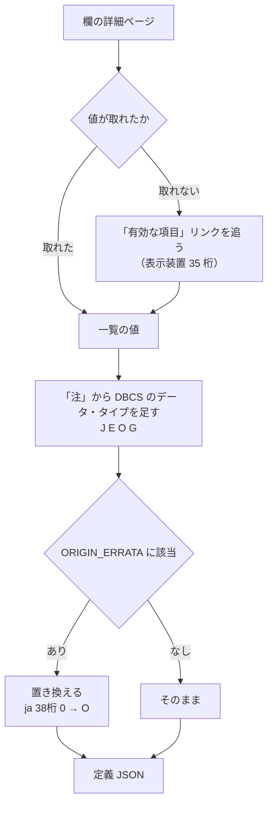

# レビューガイド: DDS の値集合を原典どおりに直す

## 変更概要 / 目的

DDS の定位置欄の「有効な値」が 3 か所で落ちていた。**どれも黙って落ちる形**で、
プロンプターの選択欄が空になったり、実機が受ける値を選べなかったりしていた。

| 欄 | 前 | 後 |
|---|---|---|
| 表示装置 35 桁 | **選択肢なし（自由入力）** | ブランク X A N S Y W I D M F L T Z J E O G |
| 物理/論理 35 桁 | P S B F A H L T Z 5 | **＋ J E O G** |
| 表示装置 38 桁 | I B H M P | **ブランク O** I B H M P |

**JSON は 1 文字も手で直していない。** 生成器を直して再生成した。

## 重要ポイント（特に見てほしい所）

### 1. 日本語版の原典が誤っている（実機で決着）

38 桁目について、**ja は「ブランクまたは 0」（数字のゼロ）、en は「Blank or O」（英字のオー）**。
実サンプル `docs/src/CUSTMNT.dspf` は `O` を使っている。

実機（`CRTDSPF`。対照を先頭と末尾に置いて 4/4 一致）:

| 38 桁 | 結果 |
|---|---|
| `0`（ja の原典） | **弾かれる** — `CPD7410` |
| `Q`（対照・でたらめ） | 弾かれる — **同じ `CPD7410`** |
| `O`（en の原典） | **通る** |

`CPD7410` は「示されたフィールドに**文字を使用することはできない**」。
**でたらめな値と同じ扱い**なので、`0` は誤植と確定。

`ORIGIN_ERRATA` に根拠つきで書いた（`verify-cl-roundtrip.mjs` の `BROKEN_EXAMPLES` と同じ作法）。

### 2. **消すのではなく置き換える**（危うく別の欠陥を作るところだった）

最初は誤植を**消す**実装にした。結果、日本語版の 38 桁が `(空) I B H M P` になり、
**正しい値 `O` が選べなくなった**。誤植を直したつもりで、利用者が書けない状態を作っていた。

置き換えに変更し、**日英が同じ集合になること**をテストで固定した。

### 3. 「弾かれた ＝ 無効な値」ではない

`H` `M` `P` も実機では弾かれた。**しかしメッセージが違う。**

| メッセージ | 本文 | 意味 |
|---|---|---|
| `CPD7410` | 示されたフィールドに文字を使用することはできない | **値が無効** |
| `CPD7443` | 使用目的が **H または P** の場合には、フィールドをブランクにしなければならない | **認識されている** |
| `CPD7436` | **メッセージ・フィールド**の場合には… | **M も認識されている** |

本文を読まずに「弾かれたから外す」としていたら、**実機が受ける 3 値を落としていた**。
RPG III の継続行で踏んだのと同じ形。

### 4. `restricted` は付けていない（意図的）

この backlog 項目の元の狙いは lint の `restricted-value` を有効にすることだった。
**値集合が「完全だ」と言えるのは、実機で全値を判定した 38 桁だけ。**
残り 4 欄は原典を読んだだけで確かめていない。

backlog の「**部分的に有効にしない**」に従い、項目を割った
——値集合の修復（この PR）と、`restricted-value` の有効化（残り 4 欄の実機確認が前提）。

## 処理フロー

## 主要な変更箇所

- `docs/origin/generate-dds-prompter.mjs` — `parseDetail` に 3 つの読み取りと
  `ORIGIN_ERRATA`。**注は対象を狭く取る**（「データ・タイプ」で始まり DBCS を含むものだけ。
  広く拾うと「37 桁目に 0 を指定…」のような別の注から関係の無い文字を採る）。
- `docs/origin/fetch-origin.mjs` — manifest 併合の鍵を**保存先パスから**作る。
  書き込み側は `dds-en/…` を使うのに読み戻しが `category/name` を組み直しており、
  **5 件が余計に畳まれていた**（618→465 行の大半は同じページの重複記録で、除去は正しい挙動）。
- `docs/origin/sources.mjs` ＋ 取得した 2 ページ — 子ページ `rzakcvalentries.htm`。
- `test/unit/ddsPositionalValues.test.ts` — 値集合の回帰。**生成器の 4 つの直しを
  それぞれ戻すと落ちる**ことを確認済み。

## リスク / 確認してほしい点

1. **`ORIGIN_ERRATA` は原典を上書きする仕組み**なので、増やすときは必ず実機の根拠を添えること。
   いまは 1 件だけ。
2. **残り 4 欄は実機で確かめていない。** 値は原典どおりだが、38 桁で見たとおり
   **原典が誤っていることがある**。`restricted` を立てる前に同じ手順を踏む必要がある。
3. manifest の行数が 618 → 468 に減る。**記録は失われていない**（同じページの重複除去。
   集合比較で「落ちたものなし」を確認済み）。
