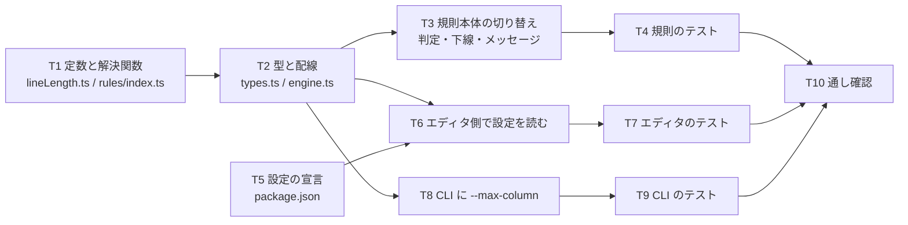

# 計画: lint の桁上限を設定化する

## 実装方針

**下から積む**。定数と解決関数 → 型と配線 → 規則本体 → 2 つの消費者（エディタ / CLI）の順で、
**各段でコンパイルが通る状態を保つ**。`RuleContext.maxColumn` を必須にするため、
型を足す段では engine が値を載せるところまで同じタスクで行う（片方だけだと型が落ちる）。

振る舞いが変わるのは T3（規則本体の切り替え）だけで、それ以前は既定 100 のまま動く。

## 作業順序と依存関係

1. **T1** 定数と解決関数を置く（依存: なし。振る舞い変更なし）
2. **T2** 型を足し engine で解決して載せる（依存: T1）
3. **T3** 規則本体を `context.maxColumn` に切り替える（依存: T2。**ここで振る舞いが変わる**）
4. **T4** 規則のテスト（依存: T3）
5. **T5** `package.json` に設定を宣言（依存: なし）
6. **T6** エディタ側で設定を読む（依存: T2, T5）
7. **T7** エディタのテスト（依存: T6）
8. **T8** CLI に `--max-column`（依存: T2）
9. **T9** CLI のテスト（依存: T8）
10. **T10** 通し確認（依存: T4, T7, T9）

## リスク / 留意点

- **`MAX_COLUMN` の改名を伴う。** `npm test` は `out-test/` をクリーンしないので、
  旧名のコンパイル結果が残ると**テストが二重に走る**（AGENTS.md の既知の罠。
  実際に 338 → 348 に水増しされたことがある）。**T10 で `rm -rf out out-test` してから走らせる。**
- **メッセージの後半を直し忘れると、上限 80 で存在しない注記域を案内する。**
  T3 で判定・下線・メッセージ後半の 3 か所を**同時に**直す。1 か所でも残すと
  「判定は 80 なのに下線は 101 桁目」「上限 80 なのに 81-100 が注記域」になる。
- **既定を変えると既存テストが一斉に落ちる。** `L >= 100` のメッセージは
  現在と**文字列レベルで同一**にする。T10 で既存テストが 1 件も変わらず通ることを確認する（AC5）。
- **`src/lint/` に `vscode` を混入させない。** 設定の読み出しは T6（`src/language/`）だけ。
  T10 の `verify-lint-core.mjs` が機械検査する（AC7）。
- **不正値の扱いが経路で違う**（設定＝フォールバック / CLI＝`UsageError`）。
  T6 と T8 で取り違えないこと。

## テスト方針

`spec.md`「受け入れ基準との対応」の 7 件を、次の層で確認する。

| 層 | 何を見るか | AC |
|---|---|---|
| 規則の単体（`test/unit/lintRules.test.ts`） | 上限 80 で 81 桁が指摘され 80 桁が通ること。境界ちょうど。メッセージに適用中の上限が出ること。全角を含む行が `printWidth` で判定されること | AC1, AC2, AC3, AC6 |
| エディタ（`test/unit/lintDiagnostics.test.ts`） | `setConfig({ rpgClSupport: { "lint.maxColumn": 80 } })` が効くこと。不正値で既定 100 に戻ること | AC1, AC3 |
| CLI（`test/unit/lintCli.test.ts`） | `--max-column 80` が同じ指摘を出すこと。不正値・範囲外が `UsageError` になること | AC4 |
| 回帰（`npm test` 全体） | **既存テストを 1 行も変えずに通ること**（既定 100 の据え置き） | AC5 |
| 機械検査（`scripts/verify-lint-core.mjs`） | `src/lint/` が `vscode` を import していないこと | AC7 |

**新しく足すテストは、直す前の状態に戻すと落ちることを確かめる**（AGENTS.md）。
特に T4 のメッセージ 3 分岐は、後半の固定文言を残したままだと落ちる形で書く
——落ちないテストは何も守っていない。
