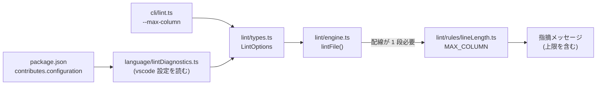

# 調査: lint の桁上限を設定化するための材料

## 調査の問い

- **Q1**: 上限の値域を「80 / 100 の 2 択」にしてよいか。実機のソース物理ファイルの
  レコード長は実際どんな値を取るか。（requirement の未確定事項）
- **Q2**: レコード長からデータ桁数はどう決まるか（何桁引くのか）。
- **Q3**: 設定を lint core まで渡す配線はどこを通るか（実装アンカー）。
- **Q4**: 上限を変えると、いま何が壊れうるか（既存の検査・テスト）。

## 判明した事実

### F1: レコード長は 2 種類ではなく **171 種類**（Q1 の答え: 2 択では足りない）

pub400 の実機カタログを集計した（`QSYS2.SYSTABLES` の `FILE_TYPE = 'S'`）。

```sql
SELECT COUNT(DISTINCT ROW_LENGTH), COUNT(*), MIN(ROW_LENGTH), MAX(ROW_LENGTH)
  FROM QSYS2.SYSTABLES WHERE FILE_TYPE = 'S'
-- → 171 種類 / 461,236 件 / 最小 13 / 最大 32766
```

上位の分布（`GROUP BY ROW_LENGTH ORDER BY COUNT(*) DESC`）:

| レコード長 | 件数 | データ桁 |
|---:|---:|---:|
| 112 | 400,033 | 100 |
| 92 | 52,571 | 80 |
| 115 | 2,580 | 103 |
| 132 | 2,528 | 120 |
| 120 | 726 | 108 |
| 240 | 315 | 228 |
| 160 | 289 | 148 |
| 100 | 228 | 88 |
| 200 | 210 | 188 |

**上位 2 つ（データ 100 桁・80 桁）で 98.1%** を占めるが、**尾が長い**。
`115` / `132` / `120` のような中間値が実在し、しかも 50 行で打ち切っても
まだ続く（171 種類）。

> **起票時の見立ては 5 件の標本に基づいていた**（`20260828-dds-line-width-columns` の D1:
> 「pub400 で 5 件中 92 が 3 件・112 が 2 件」）。母数を 461,236 件に広げると
> **2 値の列挙では現場のソースを覆えない**ことが分かる。

### F2: データ桁 = レコード長 − 12（Q2 の答え）

ソース物理ファイルの様式は 3 欄で固定されている。実機カタログで確認した
（`QSYS2.SYSCOLUMNS`、`QGPL` の `ROW_LENGTH = 112` の実物）:

| 順 | 欄 | 型 | 長さ |
|---:|---|---|---:|
| 1 | `SRCSEQ` | NUMERIC | 6, 小数 2 |
| 2 | `SRCDAT` | NUMERIC | 6, 小数 0 |
| 3 | `SRCDTA` | CHAR | **100** |

`6 + 6 + 100 = 112`。**行番号 6 バイト ＋ 日付 6 バイトが先頭に付く**ので、
ソース行として書けるのは `ROW_LENGTH - 12` 桁。112 → 100、92 → 80 で、
現行の固定値 100 は「レコード長 112 のソース PF」を仮定している。

### F3: 設定の受け口は既に `rpgClSupport.lint.*` にある（Q3）

`package.json` の `contributes.configuration.properties` に 2 つある。

- `rpgClSupport.lint.enable`（boolean・既定 true）
- `rpgClSupport.lint.rules`（object・既定 `{}`）

`src/language/lintDiagnostics.ts:16` の `CONFIG_SECTION = "rpgClSupport"` から
`config.get(...)` で読む形。**新しい設定を足す先はここで確立している。**

### F4: lint core には `LintOptions` の口があるが、規則までは届いていない（Q3）

- `LintOptions`（`src/lint/types.ts:111`）は既に `enabledRules` / `dialectOverrides` /
  `cNewOpcodes` の 3 つを持つ。**追加の器としてはそのまま使える。**
- ただし規則の署名は `(context: RuleContext) => findings` で、
  **`RuleContext`（`src/lint/types.ts:121`）はオプションを持たない**。
  現状 `cNewOpcodes` だけが例外的に `createRpgSpecContext()`（`engine.ts:41`）へ
  渡されており、**規則本体にオプションを渡す道は無い**。
- したがって配線が 1 段要る（`RuleContext` に足すか、規則を生成する形にするか。
  **判断は spec**）。

### F5: 消費者は 2 系統。両方に通さないと食い違う（Q4）

| 消費者 | 位置 | 現状 |
|---|---|---|
| エディタ診断 | `src/language/lintDiagnostics.ts:82` の `options: { … }` | vscode 設定を読んで渡す |
| lint CLI | `src/cli/lint.ts:190` の `options: { … }` | コマンドラインフラグから作る |

**CLI 側には既に前例がある**。`--c-new-opcode`（`src/cli/lint.ts:100`）で、
使い方の文（`src/cli/lint.ts:30`）に

> VSCode の設定 rpgClSupport.cNewOpcodes を使っている場合は、同じ値を
> --c-new-opcode で渡す。渡さないとエディタと CI で C 仕様の新旧判定が食い違い…

と**同じ食い違いへの注意が明記されている**。桁上限も同じ性質を持つので、
同じ扱いに揃えるのが自然（requirement の US2 / AC4）。

### F6: 純粋性は機械検査されている（Q4）

`scripts/verify-lint-core.mjs` が **`src/core` / `src/lint` / `src/cli` が
`vscode` を import していないこと**を TypeScript の `preProcessFile` で構文的に検査する。
grep ではなく import を構文で取り出しており、コメント・文字列の誤検出も
複数行 import の取りこぼしも無い。**AC7 は既に自動化済み**——新たにテストを書く必要はなく、
この検査を通すだけでよい。

### F7: 上限を直接見ているのは 1 ファイル 4 か所（Q4）

`src/lint/rules/lineLength.ts` の `MAX_COLUMN`:

- `:25` 定義（`const MAX_COLUMN = 100`）
- `:29` 判定（`columns <= MAX_COLUMN`）
- `:35` 下線の開始位置（`indexExceedingWidth(context.line, MAX_COLUMN)`）
- `:44` **メッセージ本文**（`固定長ソースは ${MAX_COLUMN} 桁までです`）

`:44` が AC3（適用中の上限をメッセージに出す）に直接効く。
なお `:45` に `（1-80 桁が仕様書、81-100 桁が注記域）` という**固定の文言**があり、
上限が 80 のときは注記域が存在しないので**この文も上限に追従させる必要がある**。

### F8: 桁の数え方は変えなくてよい

`printWidth`（`src/core/dbcs`）が実機の桁（SO/SI ＋ 全角 2 桁）で数え、
下線の位置だけ `indexExceedingWidth` で JS の添字に直している。
**この二重の数え方は上限とは独立**なので、上限を可変にしても触らない（AC6）。

## 影響範囲



- 変更するのは上記 5 ファイル ＋ テスト。
- **他の規則には波及しない**（`MAX_COLUMN` を見ているのは `lineLength.ts` だけ）。
- 既存テスト: `test/unit/lintRules.test.ts` / `lintCli.test.ts` /
  `lintDiagnostics.test.ts` / `lintCorpus.test.ts`。
  `lintDiagnostics.test.ts:94` に `setConfig({ rpgClSupport: { … } })` の型があり、
  **新しい設定のテストもこの形で書ける**。

## 実現性 / リスク

- **実現性は高い**。追加の器（`LintOptions`）・設定の受け口（`rpgClSupport.lint.*`）・
  CLI のフラグ解析・テストの設定スタブが**すべて既にある**。新規の依存も要らない。
- **リスク 1: 既定を変えると一斉に赤くなる**。既定 100 を厳守する（AC5）。
- **リスク 2: エディタと CI の食い違い**。設定と CLI フラグの両方を用意しても、
  利用者が片方だけ設定すれば食い違う。**`--c-new-opcode` と同じく使い方の文で明記する**
  のが既存の流儀（F5）。
- **リスク 3: 下限を設けないと自滅する**。上限を 80 未満にすると、原典が
  「仕様書の注記以外の部分は 7 から 80 桁目」と規定する範囲そのものを弾き始める。
  実機には `ROW_LENGTH` 13 / 15 / 20 / 50 / 72 / 80 のソース PF も実在するが、
  それらは固定長ソース（RPG/DDS）ではない公算が高い。**下限の要否は spec で決める。**

## 実装アンカー

- **A1**: 上限の定義と使用（`vscode-extension/src/lint/rules/lineLength.ts:25,29,35,44`）
  — `MAX_COLUMN` の 4 か所。`:44,45` はメッセージ本文で、注記域の説明文も上限に追従させる。
- **A2**: オプションの型（`vscode-extension/src/lint/types.ts:111` `LintOptions`）
  — ここに上限を足す。`:121` `RuleContext` は規則へ渡す側で、配線方式の選択に関わる。
- **A3**: 規則への配線（`vscode-extension/src/lint/engine.ts:76` `const context = {…}`）
  — 行ごとの `RuleContext` を組み立てている箇所。`:41` に `cNewOpcodes` の前例がある。
- **A4**: エディタ側の設定読み出し（`vscode-extension/src/language/lintDiagnostics.ts:82`）
  — `options: { … }` に足す。`:16` が `CONFIG_SECTION`。
- **A5**: CLI のフラグ（`vscode-extension/src/cli/lint.ts:100` `case "--c-new-opcode"`,
  `:190` `options: { … }`, `:22` `USAGE`）— 同じ形で `--max-column` を足す。
- **A6**: 設定の宣言（`vscode-extension/package.json`
  `contributes.configuration.properties`）— `rpgClSupport.lint.enable` の隣。
- **A7**: テスト（`vscode-extension/test/unit/lintRules.test.ts` /
  `lintCli.test.ts` / `lintDiagnostics.test.ts`）
  — 設定スタブは `lintDiagnostics.test.ts:94` の `setConfig` の形。

## 実装時の注意

- **メッセージの後半（`（1-80 桁が仕様書、81-100 桁が注記域）`）は固定文言**。
  上限だけ差し替えて後半を放置すると、上限 80 のときに**存在しない注記域を案内する**。
  A1 の `:45` を必ず一緒に直す。
- **`indexExceedingWidth` に渡す上限も差し替える**（`:35`）。ここを 100 のままにすると
  判定は 80 で出るのに**下線は 101 桁目から**という食い違いになる。
- **`printWidth` と JS の文字数を取り違えない**。判定は実機の桁、下線の位置は JS の添字。
  この区別は既存コードのコメントに明記されている（`lineLength.ts:33-34`）。
- **`src/lint/` に `vscode` を import しない**。`verify-lint-core.mjs` が落とす（F6）。
  設定の読み出しは必ず `src/language/` 側に置く。
- **共用機（pub400）への負荷**。F1/F2 の集計はカタログへの `GROUP BY` 2 本と
  6 行の `FETCH FIRST` 1 本だけで済ませてある。再確認が要るときも
  461,236 件への結合は避ける（データ桁は `ROW_LENGTH - 12` で導ける）。

## spec への申し送り

- **Q1 は解決した。値域は 2 択にしない。** 実機に 171 種類あり、上位 2 値で 98.1% を
  覆うものの `115` / `132` / `120` などが実在する。**数値を受ける形にする**のが妥当。
  （decision の「80 / 100 から選べる」は 5 件の標本に基づく見立てで、母数を広げると
  成り立たない。**決定の意図——利用者が自分のソース PF に合わせられること——は
  数値設定の方がよく満たす**ので、意図に沿って値域だけ広げる。）
- **決めること 1: 下限を設けるか**（リスク 3）。原典の「7-80 桁目が仕様書」と
  実機の小さいレコード長の実在をどう扱うか。
- **決めること 2: 規則へオプションを渡す方式**（F4）。`RuleContext` に足すか、
  規則を生成する形にするか。`cNewOpcodes` の前例（`engine.ts:41`）は
  「規則ではなく文脈オブジェクトへ渡す」形になっている。
- **決めること 3: 設定名**。decision は `lineLength.maxColumn` と書いたが、
  既存の並びは `rpgClSupport.lint.enable` / `rpgClSupport.lint.rules` なので
  `rpgClSupport.lint.maxColumn` が素直（`lineLength.` の階層は既存に無い）。
- **AC7 は新規テスト不要**（F6。`verify-lint-core.mjs` が既に検査している）。
