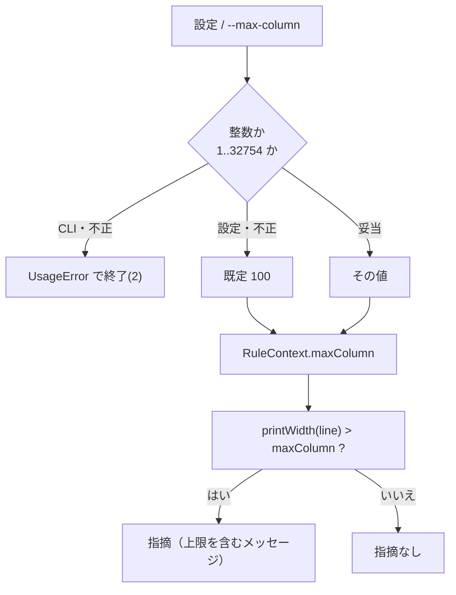

# 仕様: lint の桁上限を設定化する

## 概要

行長検査（`line-length`）の上限を、モジュール定数から**要求ごとに解決される値**に変える。
利用者は VSCode 設定 `rpgClSupport.lint.maxColumn` か lint CLI の `--max-column` で
自分のソース物理ファイルのデータ桁数を指定する。**既定は 100** で、
指定しなければ現在と 1 件も違わない指摘になる。

## 設計方針

### 1. 値域は「整数」にする（2 択にしない）

requirement の未確定事項の答え。実機カタログの実測（research F1）で
**レコード長は 171 種類・461,236 件**あり、上位 2 値（データ 100 桁 / 80 桁）で 98.1% を
占めるものの `115`(103桁) / `132`(120桁) / `120`(108桁) などが実在する。
2 値の列挙では現場を覆えない。

- **値域は 1〜32754 の整数**。上端は実機で観測した最大レコード長 32766 から
  先頭 12 バイト（`SRCSEQ` 6 ＋ `SRCDAT` 6）を引いた値（research F2）。
- **下限は 1 とし、80 未満を禁じない**。原典は「仕様書の注記以外の部分は 7 から 80 桁目」と
  規定するが、実機にはレコード長 13 / 15 / 20 / 50 / 72 / 80 のソース PF も実在する。
  そこに固定長ソースを入れれば**実際に切り捨てられる**ので、
  指摘が出るのは正しい。**禁じると正しい設定ができなくなる。**

### 2. 規則へは `RuleContext` で渡す（ファクトリにしない）

`RULE_SPECS`（`src/lint/rules/index.ts:147`）は**モジュールレベルの定数**で、
読み込み時に 1 度だけ評価される。`layoutRule(entry.code, …)`（`:210`）という
ファクトリの前例はあるが、**引数が静的**なので要求ごとに変わる設定には使えない。
規則の署名を変えて全規則をファクトリ化するのは影響が大きすぎる。

したがって `RuleContext` に `maxColumn` を足す。`cNewOpcodes` が
`createRpgSpecContext()`（`engine.ts:41`）へ渡される前例と同じく、
**engine が解決してから規則に渡す**形にそろえる。

- **`maxColumn` は必須フィールドにする**（`?` を付けない）。任意にすると規則側にも
  既定値が要り、**既定が 2 か所**になる。片方だけ直すと型は通りテストも落ちないまま
  食い違う（`RULE_SPECS` の `severity` を 1 か所にしている理由と同じ。`rules/index.ts:50-56`）。
- 既定値 `DEFAULT_MAX_COLUMN = 100` は **`lineLength.ts` が持つ**（100 の根拠＝原典の
  注記域の記述がそこに書いてあるため）。`rules/index.ts` から re-export し、
  engine は `request.options?.maxColumn ?? DEFAULT_MAX_COLUMN` で解決する。

### 3. 不正値の扱いは経路で変える

- **VSCode 設定**: 整数でない / 範囲外なら**既定にフォールバック**する。
  設定 UI にエラーを出す手立てが無く、赤くならないまま lint が黙るのが最悪なため。
  `package.json` 側にも `minimum` / `maximum` を書き、UI でも弾く。
- **CLI**: `UsageError` で落とす。明示的に渡した値が黙って無視されるのは事故のもとで、
  既存の `--fail-on` / `--format` と同じ流儀（`src/cli/lint.ts:78,103`）。

### 4. メッセージは上限に追従させる（後半の固定文も）

現在のメッセージ後半 `（1-80 桁が仕様書、81-100 桁が注記域）` は**固定文言**で、
上限だけ差し替えると上限 80 のときに**存在しない注記域を案内する**。
原典の規定（仕様書 7-80 桁 / 注記 81-100 桁）を超えて言い切らないよう、3 通りに分ける。

| 上限 L | 後半 |
|---|---|
| `L >= 100` | `（1-80 桁が仕様書、81-100 桁が注記域）` ← **既定 100 で現在と同一** |
| `81 <= L <= 99` | `（1-80 桁が仕様書、81-{L} 桁が注記域）` |
| `L <= 80` | `（1-{L} 桁が仕様書。注記域は入りません）` |

`L = 103` のような原典の外側でも `81-100 桁が注記域` とだけ言うので、**原典を超えて主張しない**。

## 対象範囲

| ファイル | 変更 |
|---|---|
| `src/lint/rules/lineLength.ts` | `MAX_COLUMN` を `DEFAULT_MAX_COLUMN` に改名して export。判定・下線・メッセージを `context.maxColumn` で行う |
| `src/lint/rules/index.ts` | `DEFAULT_MAX_COLUMN` の re-export |
| `src/lint/types.ts` | `LintOptions.maxColumn?`（追加）/ `RuleContext.maxColumn`（必須で追加） |
| `src/lint/engine.ts` | 上限を解決し `RuleContext` に載せる |
| `src/language/lintDiagnostics.ts` | 設定 `rpgClSupport.lint.maxColumn` を読んで `options` に渡す |
| `src/cli/lint.ts` | `--max-column` の解析・`USAGE`・`options` への引き渡し |
| `package.json` | `rpgClSupport.lint.maxColumn` の宣言 |
| `test/unit/lintRules.test.ts` / `lintCli.test.ts` / `lintDiagnostics.test.ts` | 追加テスト |

**触らないもの**: 桁の数え方（`printWidth` / `indexExceedingWidth`）、他の 4 規則、
レイアウト規則（`FileRuleContext` は上限を必要としない）。

## インターフェース / データ構造

```ts
// src/lint/types.ts
export interface LintOptions {
  readonly enabledRules?: readonly RuleId[];
  readonly dialectOverrides?: Record<string, unknown>;
  readonly cNewOpcodes?: ReadonlySet<string>;
  /**
   * 行長検査の桁上限。ソース物理ファイルのデータ桁数（レコード長 - 12）。
   * 未指定なら DEFAULT_MAX_COLUMN(100)。
   */
  readonly maxColumn?: number;
}

export interface RuleContext {
  readonly line: string;
  readonly lineNumber: number;
  readonly definition?: PrompterDefinition;
  readonly specKeyword?: string;
  readonly dialect?: Dialect;
  /** 解決済みの桁上限。**必須**（既定を規則側に持たせない）。 */
  readonly maxColumn: number;
}
```

```ts
// src/lint/rules/lineLength.ts
export const DEFAULT_MAX_COLUMN = 100;
/** 設定できる範囲。上端は実機の最大レコード長 32766 - 12。 */
export const MIN_MAX_COLUMN = 1;
export const MAX_MAX_COLUMN = 32754;
export function resolveMaxColumn(value: unknown): number;  // 不正なら DEFAULT_MAX_COLUMN
```

```jsonc
// package.json
"rpgClSupport.lint.maxColumn": {
  "type": "integer",
  "default": 100,
  "minimum": 1,
  "maximum": 32754,
  "description": "行長検査(line-length)の桁上限。ソース物理ファイルのデータ桁数(レコード長 - 12)を入れる。実機の代表値はレコード長 112 → 100 桁、92 → 80 桁。CI で lint CLI を回すなら --max-column に同じ値を渡す。"
}
```

```
--max-column <桁数>   行長検査の桁上限（既定 100）。ソース物理ファイルの
                      データ桁数（レコード長 - 12）。VSCode 設定
                      rpgClSupport.lint.maxColumn と同じ値を渡す。
```

## 振る舞いの詳細



- 上限の判定は**実機の桁**（`printWidth`。SO/SI ＋ 全角 2 桁）で行う。
- 下線の開始位置は `indexExceedingWidth(line, maxColumn)` で求める。
  **ここにも同じ上限を渡す**（片方だけ差し替えると、判定は 80 で出るのに
  下線は 101 桁目からになる）。

### エッジケース

| 入力 | 結果 |
|---|---|
| 設定なし | 上限 100。既存と完全に同じ |
| `maxColumn: 80`、80 桁ちょうどの行 | 指摘なし（`<=` 判定） |
| `maxColumn: 80`、81 桁の行 | 指摘。下線は 81 桁目に当たる文字から |
| `maxColumn: 0` / `-5` / `1.5` / `"80"`（設定） | 既定 100 にフォールバック |
| `--max-column abc` / `0` / `32755`（CLI） | `UsageError`（終了コード 2） |
| 全角を含む行 | `printWidth` で数えるので JS の文字数より大きくなりうる |

## ドメイン固有の考慮

- **`src/lint/` に `vscode` を持ち込まない**。設定の読み出しは `src/language/` 側だけで行い、
  core には解決済みの数値を渡す。`scripts/verify-lint-core.mjs` が
  TypeScript の `preProcessFile` で import を構文的に検査しており、違反すれば落ちる。
- **エディタと CI の食い違い**は既知の型。`--c-new-opcode` の `USAGE`（`src/cli/lint.ts:30`）に
  同じ注意が既に書かれているので、`--max-column` にも同じ調子で明記する。
- **既定を変えない**。上限が黙って狭まると、正しいソースが一斉に赤くなる。
- 桁は**実機の桁**で数えるという既存の性質を保つ（`printWidth`）。
  レコード長 92 のファイルで全角 30 文字の行が実機で 71 文字に欠けた実測が、
  この検査の存在理由そのもの。

## エラー処理 / 異常系

- 設定値が不正 → 既定 100 にフォールバック（黙って落ちない）。
- CLI 引数が不正 → `UsageError`。使い方を表示して終了コード 2。
- `--max-column` に値が無い → 既存の `next()` が
  `${arg} に値がありません` を投げる（`src/cli/lint.ts:66`）。

## 受け入れ基準との対応

| AC | 満たし方 |
|---|---|
| **AC1** 80 にすると 81-100 桁の行が指摘される | `columns <= context.maxColumn` の判定に解決済みの値を使う。`lintRules.test.ts` に追加 |
| **AC2** 80 でも 80 桁以内は指摘されない | 同上（境界 80 ちょうどを含めてテスト） |
| **AC3** メッセージに適用された上限が出る | `設計方針 4` の 3 分岐。上限 80 で「100 桁まで」とも「81-100 桁が注記域」とも言わない |
| **AC4** CLI から同じ上限を指定でき同じ指摘になる | `--max-column` を `LintOptions.maxColumn` に渡す。同じ `lintFile()` を通るので結果は一致。`lintCli.test.ts` に追加 |
| **AC5** 設定しなければ 100 のまま、既存テストが変わらず通る | `DEFAULT_MAX_COLUMN = 100`、`L >= 100` のメッセージが現在と**文字列レベルで同一**。既存テストを 1 行も変えない |
| **AC6** 実機の桁で数える | `printWidth` / `indexExceedingWidth` を触らない。全角を含む行のテストを追加 |
| **AC7** `src/lint/` が vscode を import しない | 設定読み出しを `src/language/` に閉じる。`scripts/verify-lint-core.mjs` が機械検査（新規テスト不要） |

## design 工程の要否

**不要**と判断する。3 コンポーネント（core / CLI / エディタ）にまたがるが、
研究工程で実装アンカーが 7 点まで特定済みで、追加する構造は
**フィールド 1 つ・フラグ 1 つ・設定 1 つ**しかない。
アーキテクチャ上の判断（規則へ渡す方式）は上の `設計方針 2` で決着している。
