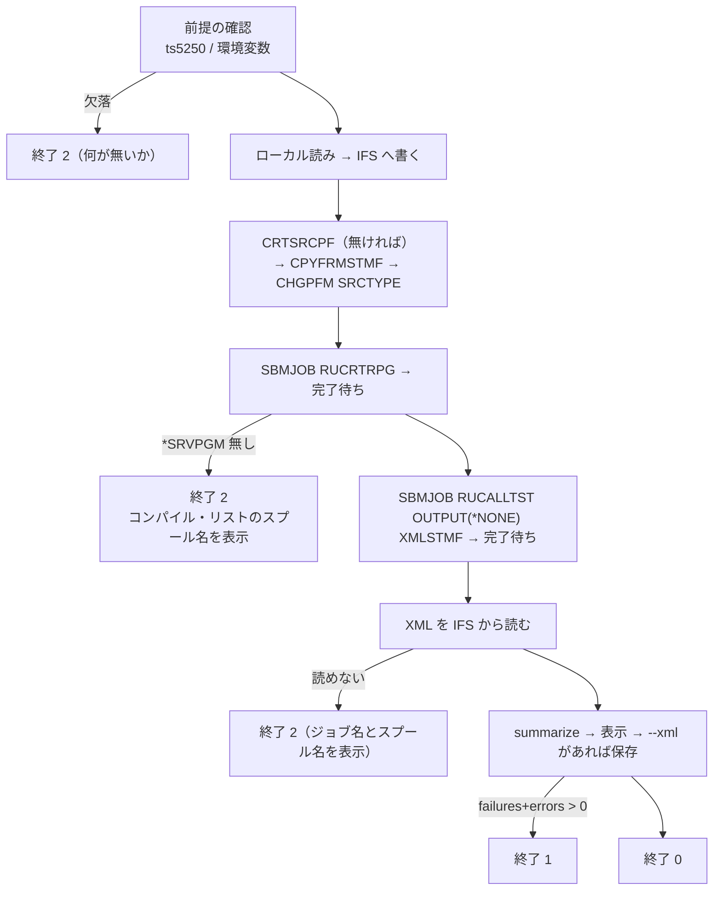

# 仕様: RPGUnit ランナー

## 概要

`tools/run-rpgunit.mjs` を新設する。ローカルのテストソース 1 本を渡すと
**転送 → ビルド → 実行 → 結果採取**までを通し、要約を表示して終了コードを返す。

```
node tools/run-rpgunit.mjs <ソース> [--pgm 名前] [--srctype RPGLE|SQLRPGLE]
                                    [--xml <保存先>] [--lib <ライブラリー>]
                                    [--srcfile <ソースPF>] [--keep] [--json]
```

## 設計方針

### 1. 純粋な部分を分ける（実機なしで確かめられるように）

実機が要る道具は**そのままでは回帰が書けない**。次の 2 つは実機に触らないので分離し、
単体で確かめられるようにする。

| 関数 | 責務 |
|---|---|
| `parseArgs(argv)` | 引数の解析と既定値の解決（`--pgm` 省略時はファイル名、`--srctype` 省略時は拡張子） |
| `summarize(xml)` | JUnit XML から件数と失敗の内訳を取り出す |

残り（転送・ビルド・実行・取得）は実機に触る。`--self-test` で前者だけを回せるようにする。

### 2. 罠を道具の中に閉じ込める

requirement の目的そのもの。使う側が知らなくてよくする。

| 罠 | 道具側の扱い |
|---|---|
| `SRCMBR` はプログラム名と揃える | **メンバー名は常にプログラム名**にする。利用者は指定できない |
| `SRCTYPE` の指定漏れ | 拡張子から決める（`.sqlrpgle`/`.sqlrpg` → `SQLRPGLE`、他 → `RPGLE`）。`--srctype` で上書き可 |
| `INLLIBL` ＋ `RPGUNIT/` 修飾 | `SBMJOB` を組み立てる側で必ず付ける |
| `INQMSGRPY(*DFT)` | 同上。**ジョブを `MSGW` で残さない** |
| 既定 20 秒の時間切れ | `timeoutMs: 120000`。長い処理は `SBMJOB` で切り離す |
| `XMLSTMF` のディレクトリ | IFS の作業ディレクトリ直下に置く（既存が前提） |

### 3. ビルドと実行は別ジョブにし、順に待つ

`SBMJOB` を 2 本投げると互いを待たない。**1 本目の完了を待ってから 2 本目**を投げる。
CL driver は使わない（要らないことを実測済み）。

### 4. 失敗の出し分け

| 終了コード | 意味 |
|---|---|
| **0** | 全テスト合格 |
| **1** | テストが失敗した（`failures` または `errors` > 0） |
| **2** | 道具の異常（前提不足・ビルド失敗・XML が取れない） |

**ビルド失敗は 2**。テストの失敗（1）と混ぜない——CI が「テストが落ちた」と
「回せなかった」を区別できなくなる。

### 5. ゴミを残さない

IFS の作業ファイル（ソース・XML）は `finally` で消す。`--keep` で残せる（調査用）。
**スプールは消さない**（規約）。作成した `*SRVPGM` とメンバーは残す（再実行の材料）。

### 6. 前提の欠落は最初に分かる形で落とす

`/workspaces/ts5250` と `profiles.local.json` の存在、必要な環境変数
（`AS400_SYSTEM` / `AS400_LIB` / `AS400_IFS_DIR`）を**最初に確かめ**、
足りなければ**何が無いかと、どう渡すか**を書いて終了コード 2 で落ちる。

## 対象範囲

| ファイル | 変更 |
|---|---|
| `tools/run-rpgunit.mjs` | 新規 |
| `tools/README.md` | 新規（使い方・前提・CI での使い方） |
| `.claude/skills/rpgunit-test/SKILL.md` | 「毎回スクリプトを書く」前提を改め、この道具を案内する |

`vscode-extension/` には置かない（実機非依存の検証系と性質が違う）。
CI は名指しのスクリプトしか実行しないので影響ゼロ。

## インターフェース / データ構造

```
使い方: node tools/run-rpgunit.mjs <ソースファイル> [オプション]

  --pgm <名前>        テストプログラム名（既定: ソースのファイル名）
                      **ソースメンバー名も同じになる**（RUCRTRPG の制約）
  --srctype <型>      RPGLE | SQLRPGLE（既定: 拡張子から判定）
  --lib <ライブラリー>  既定: 環境変数 AS400_LIB
  --srcfile <名前>    ソース物理ファイル（既定: QUNITSRC。無ければ作る）
  --xml <パス>        JUnit XML の保存先（ローカル）
  --json              要約を JSON で出す（自律ループ向け）
  --keep              IFS の作業ファイルを消さない
  --self-test         実機に触らず、純粋な部分だけ確かめる
```

`summarize(xml)` の戻り:

```js
{ tests: 2, failures: 1, errors: 0, name: "ASAOLIB/FIXTST2",
  cases: [ { name: "TESTFAIL", classname: "FIXTST2", failure: { message: "...", detail: "..." } } ] }
```

## 振る舞いの詳細



### 出力の形（人が読む側）

```
▸ 転送     SAMPLE.rpgle → ASAOLIB/QUNITSRC(FIXTST2)  [RPGLE]
▸ ビルド   FIXTST2 … OK (3.2s)
▸ 実行     FIXTST2 … 2 tests, 1 failure (1.1s)

  ✗ TESTFAIL  (FIXTST2->FIXTST2:900)
      Expected 2, but was 3.

FAILURE  2 tests, 1 failure, 0 error
```

## ドメイン固有の考慮

- **秘密を読まない**。`.env` は `--env-file` で渡すだけ。識別子は `.env.verify`。
- **日本語は XML に載らない**（CCSID 819）。要約に出ない場合があることを README に書く。
- **スプールは消さない**。失敗時は名前とジョブ名を出すに留める。
- 実機は**共用ではない**（SR-OSAKA は自機）が、ジョブを残さない・ゴミを消すのは同じ。

## エラー処理 / 異常系

| 事象 | 扱い |
|---|---|
| `/workspaces/ts5250` が無い | 終了 2。パスと、`--env-file` の渡し方を表示 |
| 環境変数が足りない | 終了 2。足りない名前を列挙 |
| ソースファイルが無い | 終了 2 |
| ビルド失敗（`*SRVPGM` ができない） | 終了 2。**コンパイル・リストのスプール名とジョブ名**を表示（AC8） |
| `RUCALLTST` が XML を作らない | 終了 2。ジョブ名を表示 |
| テストが失敗 | 終了 1。失敗の内訳を表示（AC7） |

## 受け入れ基準との対応

| AC | 満たし方 |
|---|---|
| AC1 | 1 コマンドで全段を通す。各段を `▸` で表示 |
| AC2 | メンバー名を**常にプログラム名**にする（利用者に選ばせない） |
| AC3 | 拡張子から `SRCTYPE` を決め、`CHGPFM` で必ず設定する |
| AC4 | `summarize` の `failures + errors` で 0/1 を出し分ける |
| AC5 | `finally` で IFS の作業ファイルを削除（`--keep` で残せる） |
| AC6 | `--xml` で保存。中身は実機が出した JUnit XML そのもの |
| AC7 | `summarize` が `<failure>` の `message` と本文を拾い、失敗ごとに表示 |
| AC8 | ビルド失敗時に `OUTPUT_QUEUE_ENTRIES_BASIC` を引いてスプール名とジョブ名を表示 |
