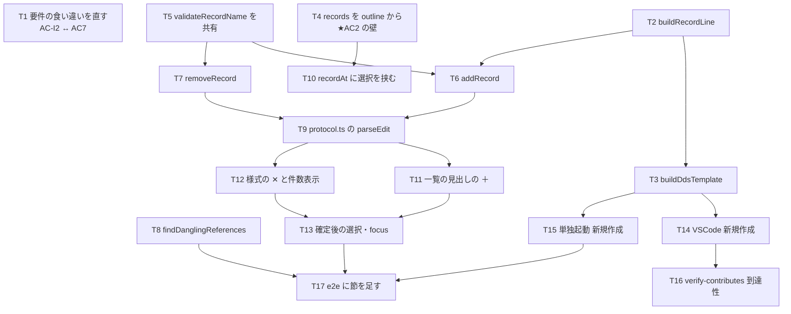

# 計画: DDS を一から作れるようにする（新規作成とレコード様式）

## split 判定（DESIGN.md「5.」）

**割らない（不可分層 → 単一サイクル）。** ユーザー判断 2026-09-08。

- discriminator「そのピースは単独で検証・デリバリ可能か」に対して **NO**。
  この work の値打ちは「新規作成 → 最初の項目を置くまでが通ること」そのもので、
  `records` の導き方だけ・雛形だけ・`addRecord` だけを出しても **AC を 1 つも満たさない**。
- 唯一切り出せそうな D5（宙に浮いた参照の検証）は、様式を消せるようになって初めて要る。
  先に出すと動機の見えない PR になる。
- 規模は 12 ファイル・新規 core モジュール 2 本。既存 work（`dds-record-rename` /
  `dds-keyword-edit`）と同程度で、**漸進レビューで負荷を割るほどの大きさではない**。

## 実装方針

**下から積む。** core（判断を持つ層）→ 継ぎ目（`protocol.ts`）→ UI → ホスト → 実操作の検証。
逆から作ると「画面はできたが core が受け取れない」状態で行き詰まる。

とくに **T4（`records` の導き方）を先に置く**。spec の実測どおり、ここが塞がっている限り
雛形を作っても UI は「フィールドを置く」を押させない。**この 1 タスクだけで AC2 の壁が外れる**ので、
早い段階で「空の様式に項目が置ける」ところまで通しておくと、以降のタスクを実機ならぬ
単独起動ハーネスで触りながら進められる。

### 3 つの「写す」

新しい作法を作らず、既にある形を写す。plan の各タスクは写し元を名指しする。

| 作るもの | 写し元 | 何を守るか |
|---|---|---|
| `＋` と名前の入力欄 | `addKeywordButton`（`ui.ts:1466`） | 開く / `Enter` / `Escape` / focus の戻し先（AC-I1〜I4） |
| 様式の `✕` | キーワードのチップの `✕`（`ui.ts:1401`） | 確認せず送り、undo で戻す（D4） |
| 様式の行の組み立て | `buildItemLine` / `buildKeywordLine`（`ddsEditWriteBack.ts`） | 桁を数え直さない（D6） |

## 作業順序と依存関係

1. **T1**（要件の直し）— 依存なし。review が食い違った AC を突き合わせる前に済ませる
2. **T2 → T3**（行の組み立て → 雛形）
3. **T4**（`records` の導き方）— 依存なし。**ここで AC2 の壁が外れる**
4. **T5 → T6 / T7**（名前の検査の共有 → 追加 / 削除）
5. **T8**（宙に浮いた参照）— 依存なし。両モデルの `diagnostics` に足すところまで
6. **T9**（`parseEdit`）— T6 / T7 に依存
7. **T10 → T13**（UI）
8. **T14 / T15**（ホスト）— T3 に依存
9. **T16**（到達性の検査）→ **T17**（実操作の e2e）

## リスク / 留意点

| リスク | 対応 |
|---|---|
| **T4 が既存の振る舞いを変える**（`records` に空の様式・非表示のみの様式が増える） | `records` の読み手は 3 か所だけ（タイトル・`canAdd`・`recordAt`）。3 つとも「増えるほうが正しい」。既存テスト 3 件（`dspfRenderModel` / `prtfRenderModel` / `ddsEditorWiring`）はソース順＝配置順なので通る。**通ることを確かめてからではなく、落ちることを先に確かめる**（下記テスト方針） |
| **`✕` の押し間違いで様式ごと消える** | 確認は出さない（D4）。代わりに **`Delete` キーには割り当てない**——選択の種類で「様式ごと N 件」に化ける形を作らない。件数を状態行に出し、undo で戻す |
| **宙に浮いた参照の検査が偽陽性を出す** | spec で同梱 DDS 8 本を通して 0 件を実測済み。**T8 でその 8 本を単体テストに固定する**（新しいサンプルが増えたときに気付ける） |
| **`vscode.openWith` の引数の順** | `(uri, viewType)`。逆にすると**無言で失敗する**（既存コードの注記）。T14 のレビュー観点に置く |
| **`blur` での二重確定** | 追加の入力欄は **`blur` で確定しない**（D3）。`recordNameInput` を写すと踏む罠なので、写し元は `addKeywordButton` にする |
| **入力欄のキーがキャンバスへ漏れる** | `isTypingTarget`（`ui.ts:2316`）は `HTMLInputElement` を見ているので、**素の `<input>` を使う限り**漏れない。`contenteditable` 等に置き換えない |
| **改名・追加の後に `out-test/` が残る** | 新しいテストファイルを足すので、**`rm -rf out out-test` してから `npm test`**（AGENTS.md。旧名の結果が残ると二重に走る） |

## テスト方針

### 単体（`npm test`）

- **T4 は回帰テストを先に書き、直す前の状態で落ちることを確かめる**（AGENTS.md「テストを足したら、
  直す前の状態に戻して落ちることを確かめる」）。落ちないテストは何も守っていない。
  期待値は spec の実測 1（`records: []` / `outline` は 1 件）をそのまま固定する。
- 期待値の裏取り: 桁・上限・境界を書くテストは**原典に戻る**（AGENTS.md「落ちることの確認は、
  期待値の正しさを保証しない」）。今回該当するのは
  **名前 10 桁**（`FIELD-DSPF-pos1928` / 既存 `NAME_WIDTH`）と
  **`DSPSIZ` の 24x80**（`dspfScreenSize.ts` の原典引用）の 2 つ。どちらも既存の定数・引用を使い、
  テストに数字を書き写さない。
- 一度出た欠陥は `test/unit/` の該当ファイルに足す。今回の「黙って壊れる」種類は 3 つ:
  1. 空の様式が `records` から消える（T4）
  2. 様式を消したのに位置の上書き行が孤児として残る（T7）
  3. 参照が宙に浮いたまま何も出ない（T8）

### 実操作（`npm run dev:e2e`）

**「押して動くか」まで見る**（AGENTS.md「プロンプターは『モデルまで』では届いていない」と同じ罠が
このエディタにもある）。`dev/e2e.mjs` に足す節:

- 新規 DSPF → **ソース面に `DSPSIZ` と `R REC1` が出る**
- そのまま定数を置く → ソースに行が増える（**AC2 の本丸**）
- `＋` → 名前 → `Enter` → 一覧に様式が増え、**その見出しが選択されている**
- `Escape` → 何も増えない
- `✕` → 様式と中の項目が消え、状態行に件数が出る
- 「元に戻す」→ 戻る

### 全体（test 工程）

- `npm test` — 既存 1167 件 ＋ 追加分（AC10）
- `npm run verify` — `verify-contributes.mjs` を含む（T16 の検査がここで回る）
- `npm run dev:e2e` — 既存 196 件 ＋ 追加分（AC8 / AC10）
- `aidev smoke` — `.aidev/config.yml` の `smokeCommand`
