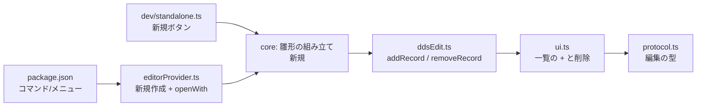

# 調査: 新規作成とレコード様式の追加・削除

## 調査の問い

- Q1: 空ファイルは本当に行き止まりか。どこで止まるか
- Q2: 名前の入力手段は既に何があるか（`askItem` / インライン入力）。どちらが AC-I3 を満たすか
- Q3: 様式名の規則は原典に何と書かれているか。既存の検証はどこまでやっているか
- Q4: 行を挿入する編集（`add`）は書き戻しでどう実現されているか。様式の挿入に流用できるか
- Q5: VSCode で新しいファイルを作り、カスタムエディタで開き直せるか
- Q6: 単独起動ではファイルをどう開いているか。新規作成を足せるか
- Q7: 雛形に入れる `DSPSIZ` の値の根拠は何か
- Q8: 破壊的な操作の確認について、この PJ の既存の作法は何か
- Q9: 利用者が操作する部品として、確立したパターンは何か

## 判明した事実

- **F1: 行き止まりは UI が既に知っている。**
  `ui.ts:595` に `const canAdd = view.records.length > 0 && this.options.askItem !== undefined;`
  があり、**様式が 0 件なら「フィールドを置く」「定数を置く」を `disabled` にしている**。
  core 側も `applyDdsEdits` が `insertionPoint`（`ddsEdit.ts:871`）で様式を引けず
  `record-not-found` を返す（実測）。**塞がっているのは入口ひとつで、その先は通っている。**

- **F2: インライン入力の前例がある。** 様式の**改名**は一覧の中の入力欄で実装済み
  （`ui.ts:1285` `recordNameInput`、設置は `ui.ts:1255`）。約束は
  「**Enter で確定 / Escape で戻す / 抜けたら確定・同じ値なら送らない**」で、
  `maxLength = 10`。**`askItem`（ホストが入力箱を持つ）は項目追加専用**（`ui.ts:2380`）。
  → **改名と同じ形にすれば AC-I3（キーボードだけで完結）を満たせる。**
  `askItem` は VSCode では `showInputBox`、単独起動では `<dialog>` になり、**作法がホストごとに違う**。

- **F3: 様式名の規則（原典 `dds/FIELD-DSPF-pos1928.html`）。**
  > 名前は 19 桁目から始まっていなければなりません。
  > 17 桁目に R を指定した場合には、19 - 28 桁目に指定した名前はレコード様式名になります。
  > **同一ファイル内では各レコード様式名は固有の名前でなければなりません。**

  17 桁目の値（`dds/FIELD-DSPF-pos17.html`）: `R`＝レコード様式名 / `H`＝ヘルプ仕様 / ブランク＝フィールド名。

- **F4: 検証は既にある。** `validateRecordRename`（`ddsEdit.ts:1139`）が
  **空 / 10 桁超 / 重複**の 3 つを見て、それぞれ `record-needs-name` /
  `name-too-long` / `record-name-duplicate` を返す。
  **文字種（先頭が英字か等）は見ていない**——原典の当該ページにも規定が無い。
  → 追加でも**同じ規則をそのまま使う**のが一貫する（増やすなら別途の根拠が要る）。

- **F5: 行の挿入は既にできる。** `applyDdsEdits` の `case "add"`（`ddsEdit.ts:635`）は
  `{ replaceFrom: at, replaceTo: at, lines: [...] }` で**置換ではなく挿入**を表現している。
  結果は降順に並べ替えられる（`ddsEdit.ts:645`「先に適用した指示が後続の行番号を動かさない」）。
  **様式の挿入も同じ形で書ける。**

- **F6: VSCode で開き直す経路は実装済み。** `editorProvider.ts:92` が
  `vscode.commands.executeCommand("vscode.openWith", document.uri, DDS_EDITOR_VIEW_TYPE)` を使う。
  コメントに **「引数は (uri, viewType) の順——逆にすると無言で失敗する」** と明記がある。
  → 新規作成は「ファイルを作る → 同じ `openWith`」で足りる。**新しい API は要らない。**

- **F7: 単独起動は `<input type="file">` で読むだけ**（`dev/standalone.html:15`、
  `dev/standalone.ts:390` で `file.text()`）。**保存はダウンロード**（`Blob` ＋ `<a download>`）。
  → 新規作成は「雛形の文字列を `host.load(name, text)` に渡す」だけで成立する。**ファイルシステムは要らない。**

- **F8: 破壊的な操作に確認は無い。** 項目の削除は `ui.ts:2337` で
  `{ kind: "remove", sourceLine }` を**即座に送る**。確認ダイアログはこの PJ に 1 つも無い。
  取り消しは**undo に委ねている**（VSCode は `WorkspaceEdit` → 標準の undo、
  単独起動は `history` スタック `dev/standalone.ts:72`）。

- **F9: 画面サイズの既定は 24×80。** `dspfScreenSize.ts:63` に原典引用つきで
  `DEFAULT_SCREEN`（`DS3` = 24 行 × 80 桁）。原典は
  「指定できるのは、24 x 80、および 27 x 132 だけ」。
  なお **`DSPSIZ` の詳細ページは未取得**（索引の 1 行要約のみ）。既定値の根拠は
  `dspfScreenSize.ts` が引いている原典文にある。

## 影響範囲

- **両ホストが同じ雛形を使う**ので、雛形は core に 1 か所。
- `DdsEdit` に種類が増えるので `protocol.ts` の `parseEditorMessage` も増える。
- `verify-contributes.mjs` が `package.json` の `when` と対象拡張子の一致を検査しているので、
  **コマンドを足したらそこも通す**。

## 実現性 / リスク

- **技術的な壁は無い。** 挿入・削除・開き直しはいずれも既存の仕組みで表現できる（F5・F6）。
- **リスク 1: 確認ダイアログを入れると PJ の作法から外れる**（F8）。
  この PJ は「即座に実行して undo で戻す」で統一されている。
  様式の削除だけモーダルを出すと、**その 1 か所だけ作法が違う**ことになる。
- **リスク 2: 空ファイルの扱い。** 雛形で作れば様式は必ず 1 つあるが、
  **既存の空ファイルを開いた人**は依然として行き止まりになる。
  一覧の `＋` があれば救えるので、**`＋` は様式 0 件でも押せる必要がある**。
- **リスク 3: 新規作成の保存先。** VSCode ではワークスペースが無い状態もある。

## 実装アンカー

- A1: 追加ボタンの活殺（様式 0 件の判定）— `src/dds/webview/ui.ts:595` `canAdd`
- A2: 一覧の描画（`＋` を置く先）— `src/dds/webview/ui.ts:877` `renderOutline` / `:884` `list.className = "dds-tree"`
- A3: インライン入力の前例 — `src/dds/webview/ui.ts:1285` `recordNameInput`（設置は `:1255`）
- A4: 名前の検証 — `src/core/dds/ddsEdit.ts:1139` `validateRecordRename`
- A5: 行の挿入 — `src/core/dds/ddsEdit.ts:635` `case "add"` / `:871` `insertionPoint`
- A6: 編集の型 — `src/core/dds/ddsEdit.ts:88-188` `DdsEdit` / `src/dds/webview/protocol.ts:119` `parseEditorMessage`
- A7: VSCode の開き直し — `src/dds/editorProvider.ts:92` `vscode.openWith`（**引数は (uri, viewType)**）
- A8: 単独起動のファイル読み込み — `dev/standalone.ts:390` / 保存は `:104` 付近
- A9: 雛形の置き場 — **未特定**（`src/core/dds/` に新規。design で決める）
- A10: 項目削除の経路（様式削除の参考）— `src/dds/webview/ui.ts:2337`

## 実装時の注意

- **`vscode.openWith` の引数は `(uri, viewType)`。逆にすると無言で失敗する**（既存コードの注記）。
- **`applyDdsEdits` の結果は降順に並べ替えられている**（`ddsEdit.ts:645`）。
  複数の指示を返すときは行番号のずれを自分で調整しない。
- **入力欄のキーをキャンバスへ漏らさない。** プロパティ欄で既に踏んだ罠で、
  漏らすと `Delete` で項目が消え、矢印で項目が動く（AC-I5）。
- **`blur` で確定する欄は `isConnected` を見る**（PR#170 で入れたばかり）。
  再描画で外された欄から確定すると同じ編集を再送する。
- **`renameRecord` は参照も追う**（`&名前` / `CSRLOC` / `HLPARA(*FLD)`）。
  **削除でも同じ問題がある**——消した様式を指す参照が残る。追うか、警告するかを決める必要がある。
- 対象拡張子の真実源は `src/utils/fileScope.ts` の `TARGET_EXTENSIONS`。数え上げない。

## design への申し送り

1. **名前の入力はインライン（F2）を採る**のが AC-I3 に対して素直。`askItem` はホストごとに作法が違う。
2. **確認ダイアログは PJ の作法から外れる（F8）。** 代案は
   **「即座に削除し、`pendingStatus` で『EMPDTL を削除しました（項目 7 件）』と知らせ、undo で戻す」**。
   AC7 は「削除の**前**に件数」と書いてあるので、**AC7 を見直すか、例外として確認を入れるかを決める**。
   → **2026-09-08 決定: 即座に削除し、後から件数を知らせる**（PJ の作法に揃える）。
   requirement の AC7 を書き換えた。
3. **`＋` は様式 0 件でも押せること**（既存の空ファイルを救う唯一の手段。リスク 2）。
4. **様式を消したときの参照**（消えた様式を指す `&名前` 等）。
   → **2026-09-08 決定: 書き換えず、検証タブに出す**（AC11）。黙って書き換えると原因が掴めない。
5. **PRTF の雛形に画面サイズ相当は入らない**（紙面は `CRTPRTF` 側）。非対称をどう見せるか。
6. 保存先の決め方（VSCode）。ワークスペースが無い場合の退避。
