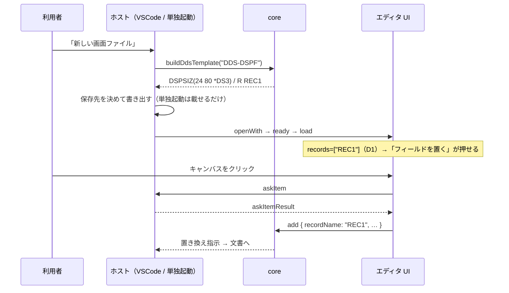
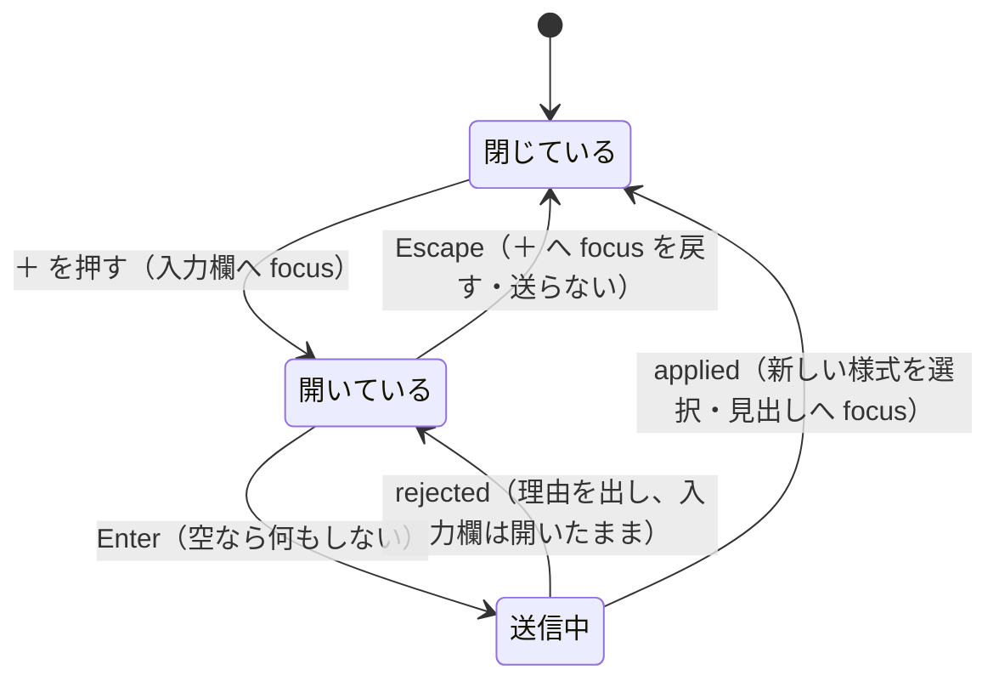

# 仕様: DDS を一から作れるようにする（新規作成とレコード様式）

## 概要

要件（US1〜US4）を、**core に 2 つの編集操作と 1 つの雛形を足し、ホストに新規作成の導線を置く**ことで実現する。

調査（research F1〜F9）は「技術的な壁は無い」と結論したが、**spec で実測したところ壁が 1 つあった**——
`RenderModel.records` が**配置できた項目から**導かれているため、**項目が 0 件の様式は `records` に出ない**。
雛形（`DSPSIZ` ＋ 空の様式 1 つ）を作っても `canAdd` が false のままで、**AC2 がその時点で落ちる**。

```
buildDspfRenderModel(['…DSPSIZ(24 80 *DS3)', '     A          R REC1', ''])
  records = []                                     ← 様式はあるのに空
  outline = [{"name":"REC1","line":2,"items":0}]
```

この 1 点を直せば、残りは既存の仕組みの上に載る（挿入・削除・開き直しは実装済み。F5・F6）。
実際、**core は空の様式に項目を足せる**ことを実測で確かめた（「実測で確かめたこと」2）。
塞いでいるのは UI が読む `records` だけ。

## 設計方針

### D1: `records` は「配置できた項目」ではなく「宣言された様式」から作る（**この作業の中心**）

`fromLayout`（`dspfRenderModel.ts:215`）と `fromPrtfLayout`（`prtfRenderModel.ts:94`）は
`layout.items`（＝配置できた項目）を走査して `records` を組み立てている。この導き方だと

- **項目が 0 件の様式**が消える（雛形・追加直後の様式・既存の空ファイル）
- 用途が `H`（非表示）の項目しか無い様式も消える（配置解決が落とすため）

`outline`（`buildDspfOutline`。**配置解決を通さない**）から作れば両方とも出る。
`outline` は既に**両方のモデルが作って渡している**ので、新しい入力は要らない。

```ts
// 名前の無い束（「（様式の外）」＝最初の様式より前の項目）は様式ではないので外す。
const records = outline.filter(r => r.name.length > 0).map(r => r.name);
```

**`outline` 引数の既定値 `= []` を外す**（必須にする）。既定のままだと、渡し忘れた呼び出しが
`records: []` を**黙って**受け取る——いま直そうとしているのと同じ壊れ方になる。
呼び出しは PJ 内に 2 か所（両モデルの `build*RenderModel`）しかなく、どちらも渡している。

> 退けた案: `canAdd` の判定だけを `outline` に変える。**同じ集合を 2 つの鍵で数えること**になり、
> `recordAt`（追加先の決定）と一覧のタイトルは古い集合を見続ける。要件 AC12 は
> 「様式 0 件のファイルでも `＋` を押せる」なので、どのみち `records` の意味をはっきりさせる必要がある。

### D2: 追加先の決定は「行の見当」に**選択中の様式**を足す（順序を変えず、届かない穴だけ塞ぐ）

`recordAt`（`ui.ts:2442`）はクリックした行以上に項目が無いとき `records` の**末尾**へ落ちる。
DSPF の様式は画面行が重なりうるので、行から様式を厳密には決められない。

> **2026-09-08 修正（coding。`decisions.md` D1）。** 当初この節は順序を
> 「①行の見当 → ②選択中の様式 → ③末尾」と書いていたが、**実装して押したら間違いだった**。
> 足したばかりの様式は項目が 0 件なので ① では絶対に引っかからず、項目を持つ様式が
> 上に 1 つでもあると ① が必ず勝つ——**② には永久に到達しない**。以下は直した後の順序。

| 順 | 判定 | 変更 |
|---|---|---|
| 1 | **一覧で様式の見出しそのものを選んでいるなら、その様式** | **新規** |
| 2 | クリック行以上で一番下にある項目の様式 | 現状のまま |
| 3 | `records` の末尾 | 現状のまま |

**見出しを選んでいるときだけ**で、項目を選んでいるときは 2 のまま——見出しを選ぶのは
「この様式で作業する」という明示だが、項目を選ぶのはその項目を見ているだけで置き先の宣言ではない。
併せて、見出しから置いたときは**置いたあとも同じ見出しを選んだまま**にする
（`place()` で `pendingSelectRecord` を立てる）。これで「様式を足した直後にその様式へ置ける」
（AC4）が**決まった振る舞い**になる。

### D3: 名前の入力は**インライン**（`addKeywordButton` と同じ約束）

research F2 は「改名（`recordNameInput`）と同じ形」を薦めたが、より近い前例が既にある
——**キーワードの `＋ 追加`**（`ui.ts:1466`）。あちらは

- `＋` を押す → **隠してあった `<input>` を出して `focus()`**
- `Enter` で確定 / `Escape` で閉じて `＋` へ **`focus()` を戻す**
- ホストに入力箱を頼まない（`askItem` を使わない＝**両ホストで同じ形**）

要件の AC-I1 / AC-I2 / AC-I3 / AC-I4 が**そのまま**この約束と一致する。**同じ形を写す**。
`askItem` は採らない——VSCode では `showInputBox`、単独起動では `<dialog>` で**作法がホストごとに違う**（F2）。

### D4: 削除は**即座に実行し、後から件数を知らせる**（確認ダイアログは出さない）

research F8 の通り、この PJ に確認ダイアログは 1 つも無く、取り消しは undo に委ねている。
様式の削除だけモーダルにすると、その 1 か所だけ作法が割れる。requirement の AC7 は
この判断で 2026-09-08 に書き換え済み。

> **要件の食い違いを 1 件見つけた。** AC-I2 は「削除は**確認を経てから**消え、取り消せば何も起きない」と
> 書いたままで、AC7（確認を出さない）と矛盾する。AC7 が後の判断なのでそちらを採り、
> **AC-I2 は「削除は即座に効き、undo で元に戻る」と読み替える**（plan で requirement を直す）。

### D5: 消えた参照は**書き換えず、検証タブに出す**（AC11）

様式を消すと 2 種類の参照が宙に浮く。**どちらも出す。**

| 参照 | 例 | 表 |
|---|---|---|
| **様式**を指すもの | `SFLCTL(EMPDTL)` / `ERASE` / `PASSRCD` / `HLPRCD` / `MNUBARDSP` / `MNUBARCHC` | `RECORD_ARGUMENTS` |
| **中の項目**を指すもの | `&名前` / `CSRLOC(行 桁)` / `HLPARA(*FLD 名前)` | `FIELD_ARGUMENTS` ＋ 規則 A |

> AC11 の括弧の中は**項目の側**しか挙げていないが、様式を消せば `SFLCTL(消した様式)` も同時に宙に浮く。
> 片方だけ出すと「出ない側は正しい」と読まれるので、両方を対象にする。

**偽陽性が出ないことを実測で確かめた**（「実測で確かめたこと」3）。

### D6: 雛形は**既存の組み立て関数の合成**にする（桁を新たに数えない）

`buildKeywordLine("DSPSIZ(24 80 *DS3)")` が**既に**サンプルとバイト一致の行を返す（実測）。
様式の行だけが無いので `buildRecordLine(name)` を足し、雛形はこの 2 本を並べるだけにする。
`addRecord` の書き出しも同じ `buildRecordLine` を通す——**雛形の様式と、後から足した様式が
必ず同じ形になる**（別々に組むと桁がずれても誰も気付かない）。

### D7: 保存先は `showSaveDialog`（ワークスペースが無くても成立する）

research リスク 3（ワークスペースが無い状態）は、保存ダイアログに決めさせれば消える。
**`filters` は付けない**——付けると拡張子の集合が `sourceKind.ts` の外にもう 1 つできる。
代わりに、返ってきたパスを **`resolveDdsType` に判定させ**、種別が合わなければ既定の拡張子を足す。

### D8: PRTF に画面サイズ相当の説明は**出さない**

紙面は `CRTPRTF` の `PAGESIZE` で決まり DDS には書かれない（既に `prtfPage()` が設定から採っている）。
出さない理由は 3 つ:

1. **DDS に無いものを DDS のエディタが説明する場所が無い。** 雛形に注記行を入れる案は、
   注記行を消す編集操作がデザイナに無いので**消せないゴミ**になる。
2. 紙面の唯一の説明の置き場は既に設定（`rpgClSupport.prtf.pageWidth` 等）にある。
3. 出すならホスト側の通知になるが、**両ホストで作法が違い C1（同じ雛形・同じ振る舞い）に反する**。

## 対象範囲

| ファイル | 変更 |
|---|---|
| `src/core/dds/ddsTemplate.ts` | **新規**。雛形の組み立て（DSPF / PRTF） |
| `src/core/dds/ddsDanglingReferences.ts` | **新規**。宙に浮いた参照を集める（D5） |
| `src/core/dds/ddsEditWriteBack.ts` | `buildRecordLine` を足す |
| `src/core/dds/ddsEdit.ts` | `DdsEdit` に `addRecord` / `removeRecord`、検証と書き戻し |
| `src/core/dds/dspfRenderModel.ts` | `records` を `outline` から作る（D1）／診断に D5 を足す |
| `src/core/dds/prtfRenderModel.ts` | 同上 |
| `src/dds/webview/protocol.ts` | `parseEdit` に 2 種類 |
| `src/dds/webview/ui.ts` | 一覧の見出しの `＋`、様式の `✕`、`recordAt`（D2）、確定後の選択 |
| `src/dds/editorProvider.ts` | 新規作成コマンド 2 つ（DSPF / PRTF） |
| `package.json` | `commands` 2 件・`menus.explorer/context` 2 件 |
| `dev/standalone.ts` / `dev/standalone.html` | 新規作成ボタン 2 つ |
| `docs/origin/verify-contributes.mjs` | 新規作成コマンドの到達性を検査（下記） |
| `dev/e2e.mjs` | AC8 の実操作 |

**触らないもの**: `dspfLayout` / `prtfLayout`（配置解決）、`askItem`（項目追加の入力）、3 ペインの構成。

## インターフェース / データ構造

### 1. 編集操作（`ddsEdit.ts`）

```ts
/**
 * **様式（レコード）を足す。** 置き場はファイルの末尾で、`sourceLine` を採らない
 * ——足す先は「どこか」ではなく「最後」だから（並べ替えは対象外）。
 */
| { readonly kind: "addRecord"; readonly name: string }

/**
 * **様式を消す。中の項目も一緒に消える。**
 *
 * `remove`（項目を消す）と分ける。同じ語が「選んでいるものによって様式ごと消える」に
 * 化けると、押した人の予想と食い違う（`clearAlternatePosition` を分けたのと同じ理由）。
 *
 * `sourceLine` は**様式宣言の行**。
 */
| { readonly kind: "removeRecord"; readonly sourceLine: number }
```

拒否コードは**増やさない**。4 つとも既にある:

| 場面 | コード | 既存の出どころ |
|---|---|---|
| 名前が空 | `record-needs-name` | `validateRecordRename` |
| 10 桁超 | `name-too-long` | 同上（`NAME_WIDTH`） |
| 同名がある | `record-name-duplicate` | 同上（実機で確認済み） |
| 指定行に様式が無い（削除） | `record-line-not-found` | 同上 |

**`validateRecordRename` から名前の検査を切り出して共有する**（`validateRecordName(units, name, exceptSourceLine?)`）。
写すと片方だけ緩めたときに黙って守りが消える。**文字種は見ない**——原典（`FIELD-DSPF-pos1928`）に規定が無く、
改名が見ていない以上、追加だけ厳しくする根拠が無い（F4）。

#### 書き戻し

- **`addRecord`**: 挿入点＝**最後の非空白行の直後**（`isDdsBlankLine` でない最後の行の次。
  すべて空白なら 0）。`{ replaceFrom: at, replaceTo: at, lines: [buildRecordLine(name)] }`。
  - 空ファイル `[""]` → `["     A          R REC1", ""]`。行頭に空行を残さない。
  - `insertionPoint`（`ddsEdit.ts:871`）は**流用しない**——あれは「その様式の中の末尾」で、
    ここが要るのは「ファイルの末尾」。
- **`removeRecord`**: 様式の論理単位から**次の `record` 単位の手前まで**の `sourceLines` を集め、
  `removalRuns`（`ddsEdit.ts:847`）と同じ流儀で**連続する塊ごと**の削除指示にする。
  - 注記行・空行は単位に属さないので**残る**（項目の削除と同じ扱い。黙って消さない）。
  - 位置の上書き行（`*DS4` の行）は項目単位の `sourceLines` に**入っている**ので一緒に消える（実測済み）。

```ts
export function buildRecordLine(name: string): string {
  // 17 桁目に `R`、19-28 桁に名前。桁は DDS_COLUMNS が持つ（ここで数えない）。
  const typed = ddsReplaceField(LINE_PREFIX, DDS_COLUMNS.nameType, "R");
  return ddsReplaceField(typed, DDS_COLUMNS.name, name.trim().toUpperCase()).trimEnd();
}
```

### 2. 雛形（`ddsTemplate.ts`）

```ts
/** 新しいファイルの中身。**両ホストがこれを使う**（同じファイルができる）。 */
export function buildDdsTemplate(ddsType: EditableDdsType): readonly string[];
```

| 種別 | 中身 |
|---|---|
| `DDS-DSPF` | `buildKeywordLine("DSPSIZ(24 80 *DS3)")` ＋ `buildRecordLine("REC1")` |
| `DDS-PRTF` | `buildRecordLine("REC1")` |

- **`DSPSIZ` を明示する**（要件 3）。省くと「IBM 提供の画面サイズ条件名を使用して条件付ける」形になり、
  `*DS3` 条件の項目が黙って消える事故（AGENTS.md）と同じ土俵に載る。
- 値は原典の 2 つのうち既定の側。原典（`dspfScreenSize.ts` の引用）:
  > このキーワードを指定しなかった場合には、表示装置ファイルは、**24 x 80 の画面**を備えた表示装置に対してのみオープンすることができます。
  > 指定できるのは、**24 x 80、および 27 x 132 だけ**です。
- **数値形式に IBM の条件名を添える**（`24 80 *DS3`）。既存サンプル（`CUSTMNT.dspf`）と同じ形。
- 様式名は `REC1`。**中身のある名前を勝手に決めない**（利用者が改名する前提。改名は実装済み）。
- **PRTF に `DSPSIZ` 相当は入れない**（D8）。

### 3. 宙に浮いた参照（`ddsDanglingReferences.ts`）

```ts
export type DanglingReferenceCode =
  | "record-reference-not-found"
  | "field-reference-not-found";

export interface DanglingReference {
  readonly code: DanglingReferenceCode;
  readonly message: string;
  readonly sourceLine: number;   // 1 始まり
}

/** キーワード欄が指す名前のうち、このファイルに無いものを集める。**書き換えない。** */
export function findDanglingReferences(
  outline: readonly OutlineRecord[],
  fileKeywords: readonly FileKeywordEntry[]
): readonly DanglingReference[];
```

- 走査対象は**モデルが既に持っている 3 種のキーワード欄**——ファイル・レベル / 様式 /
  項目。`sourceLine` はその欄の代表行（一覧・プロパティと同じ鍵）。
- 名前の集合: 様式＝`outline` の名前つき、項目＝`outline[].items[].attributes.name`。
- 参照の抽出は **`findRecordReferences` / `findFieldReferences` をそのまま使う**
  （どのキーワードのどの引数が名前かは `ddsReferences.ts` が唯一の真実。写さない）。
- `RenderDiagnosticCode` に `DanglingReferenceCode` を足し、
  `buildDspfRenderModel` / `buildPrtfRenderModel` が `diagnostics` の末尾へ加える。
  `fromLayout` / `fromPrtfLayout` には足さない（**生の行を持たない**ので名前の集合を作れない）。

メッセージ:

- `SFLCTL が指す様式 EMPDTL がありません`
- `CSRLOC が指すフィールド CSRROW がありません`

### 4. プロトコル（`protocol.ts`）

```ts
case "addRecord":
  // 名前の中身（長さ・重複）は core の検証が見る。ここは型だけ（`renameRecord` と同じ）。
  return typeof value.name === "string" ? { kind: "addRecord", name: value.name } : undefined;
case "removeRecord":
  return isPositiveInteger(value.sourceLine)
    ? { kind: "removeRecord", sourceLine: value.sourceLine }
    : undefined;
```

**`HostMessage` / `EditorHost` は増やさない。** 新規作成はホストの殻の仕事で、UI は関与しない
（`providesFileIO` の意味そのもの）。

### 5. UI（`ui.ts`）

#### 一覧の見出しの `＋`

`template()` の左ペインの `pane-head` に置く。**`renderOutline` の中には置かない**
——あそこは項目が 0 件だと `項目がありません` を出して**早く返る**ので、
様式 0 件のファイルで `＋` が消える（AC12 が落ちる）。

```html
<div class="pane-head">
  <div class="pane-title">レコード様式</div>
  <span class="rec-add">
    <button id="dds-add-record" type="button" title="レコード様式を足す">＋</button>
    <input class="rec-add-input" maxlength="10" placeholder="様式名" hidden>
  </span>
  <button id="dds-fold-left" …>◧</button>
</div>
```

約束は `addKeywordButton`（`ui.ts:1466`）と**同一**:

| 操作 | 振る舞い | 受け入れ基準 |
|---|---|---|
| `＋` を押す | `input.hidden = false` → `value = ""` → `focus()` | AC-I1 / AC-I4 |
| `Enter` | 空なら何もしない。`addRecord` を送り、入力欄を閉じる | AC-I2 / AC-I3 |
| `Escape` | 閉じて `＋` へ `focus()` を戻す。**送らない** | AC-I1 / AC-I2 / AC-I4 |
| キー入力 | `isTypingTarget` が `HTMLInputElement` を見ているので**キャンバスへ漏れない** | AC-I5 |

**`blur` では確定しない**（`recordNameInput` と違う点）。改名は「既にある値を直す」ので抜けたら確定が自然だが、
追加は「無かったものを作る」なので、**焦点が外れただけで様式ができるのは驚き**になる。
`addKeywordButton` も `blur` で送っていない。

#### 様式の `✕`

`renderOutline`（`ui.ts:879`）の様式見出し（`li.record`）に、名前がある様式だけ `✕` を置く
（「（様式の外）」は様式ではない）。押したら**確認せず** `removeRecord` を送る（D4）。
キーワードのチップの `✕`（`ui.ts:1401`）と同じ見た目・同じ理由づけ。

**`Delete` キーには割り当てない。** `onKeyDown`（`ui.ts:2316`）の `Delete` は「選択中の**項目**を消す」で、
選択の種類によって「様式ごと N 件消える」に化けると取り返しがつかない。`✕` は見出しの中にあるので
Tab で届き、マウス専用にはならない。

#### 確定後の選択とフォーカス（AC-I4）

行番号は編集で動くので、`pendingSelection`（行番号）では追えない。**名前で追う。**

```ts
private pendingSelectRecord: string | undefined;   // 様式名（大文字）
```

`applied` を受けたら `model.outline` から名前で引いて `this.selected` に代入し、
描画後にその見出し（`li.record[data-source-line]`）へ `focus()` する。

| 操作 | `pendingSelectRecord` | 見つからないとき |
|---|---|---|
| 追加 | 足した名前 | 何もしない（拒否されている） |
| 削除 | **一覧上の隣**（前があれば前、無ければ次） | `＋` へ `focus()`（様式が 0 件になった） |

#### 状態表示

- 追加: `pendingStatus = "様式 EMPDTL を作りました"`
- 削除: `pendingStatus = "EMPDTL を削除しました（項目 7 件）"`（AC7）。
  件数は**送る前に** `model.outline` の当該様式の `items.length` から採る（消えた後には数えられない）。
- `pendingStructural` は `addRecord` / `removeRecord` でも true にする（行がずれるので選択を捨てる）。

### 6. VSCode ホスト（`editorProvider.ts` / `package.json`）

```
rpgClSupport.newDspf  「RPG/CL Support: 新しい画面ファイル (DSPF) を作る」
rpgClSupport.newPrtf  「RPG/CL Support: 新しい帳票ファイル (PRTF) を作る」
```

手順（両方とも同じ関数。種別だけ引数）:

1. `showSaveDialog({ defaultUri, saveLabel: "作成" })`。
   `defaultUri` = 右クリックで渡されたフォルダ（無ければ最初のワークスペース、それも無ければ省略）
   ＋ 既定のファイル名（`NEWDSPF.dspf` / `NEWPRTF.prtf`）。
   **`filters` は付けない**（D7）。取り消し（undefined）なら**何もしない**（通知も出さない）。
2. `resolveDdsType(uri.fsPath)` が目的の種別でなければ、既定の拡張子を足したパスに直す。
3. `workspace.fs.writeFile(uri, Buffer.from(buildDdsTemplate(type).join("\n") + "\n", "utf8"))`。
   改行は `\n`（新しいファイルなので `files.eol` を読みに行かない）。雛形は ASCII のみで符号化の問題は無い。
4. `executeCommand("vscode.openWith", uri, DDS_EDITOR_VIEW_TYPE)`。
   **引数は `(uri, viewType)` の順**——逆にすると無言で失敗する（`editorProvider.ts:92` の注記）。

`package.json`:

```jsonc
"menus": {
  "explorer/context": [
    { "command": "rpgClSupport.newDspf", "when": "explorerResourceIsFolder", "group": "navigation@3" },
    { "command": "rpgClSupport.newPrtf", "when": "explorerResourceIsFolder", "group": "navigation@4" }
  ]
}
```

`editor/context` には**置かない**（開いているファイルと関係が無い操作なので）。
コマンド・パレットからは常に出る。

#### 到達性の検査（`verify-contributes.mjs` に追加）

「追加したリソースは到達可能になって初めて完了」に従い、**雛形が開けることを機械で固定する**:

- 2 つのコマンドが `contributes.commands` にある
- 2 つのコマンドが `explorer/context` にある
- **新規作成が使う既定の拡張子**（`.dspf` / `.prtf`）が
  `customEditors[].selector` と `sourceKind.ts` の**両方**に載っている
  ——載っていなければ「作れるのにビジュアルエディタで開かない」ファイルができる（AC1 が落ちる）

### 7. 単独起動ホスト（`dev/standalone.*`）

帯に `新規 DSPF` / `新規 PRTF` を足し、押したら
`host.load("NEWDSPF.dspf", buildDdsTemplate("DDS-DSPF").join("\n") + "\n")`。
`ddsType()` は**ファイル名の拡張子**で決まる（`standalone.ts`）ので、名前の付け方だけで種別が通る。
ファイルシステムは要らない（F7）。保存は既存の「保存」（ダウンロード）がそのまま使える。

## 振る舞いの詳細

### 新規作成から最初の項目まで（AC1 / AC2 / AC3）



**この経路が通ることは core の側で実測済み**（「実測で確かめたこと」2）。

### 様式の追加（AC4 / AC5）



拒否のとき**入力欄を閉じない**——閉じると打った名前が消え、何が悪かったのか確かめられない。
理由は `rejectMessage` ではなく `setStatus` に出す（`rejectMessage` はプロパティ面の欄に紐づく）。

### 様式の削除（AC6 / AC7 / AC11）

1. `✕` を押す（確認しない）
2. 送る前に件数を数え、隣の様式名を控える
3. `removeRecord` → 様式の行と中の項目の行が消える（注記行は残る）
4. `applied` → 隣の様式を選択・状態行に `EMPDTL を削除しました（項目 7 件）`
5. **参照が宙に浮いていれば検証タブに出る**（D5）。ソースは書き換えない
6. `Ctrl+Z`（VSCode）/「元に戻す」（単独起動）で戻る（AC9）

### エッジケース

| 状況 | 振る舞い |
|---|---|
| 様式が 0 件のファイルで `＋` | 押せる（`pane-head` は `renderOutline` の早期 return の外）。AC12 |
| 様式をすべて消した | `records` が空になり「フィールドを置く」が再び押せなくなる。`＋` は押せる |
| 名前が空のまま `Enter` | 何も送らない（`addKeywordButton` と同じ） |
| 小文字で入力 | `buildRecordLine` が大文字にする（`buildItemLine` の名前欄と同じ） |
| 11 桁以上打つ | `maxLength = 10` が打てなくする（`recordNameInput` と同じ）。それでも core の検証は残す |
| 既存の空ファイルを開く | 一覧は「項目がありません」、`＋` は押せる。押して様式を作れば置けるようになる |
| 「（様式の外）」の束 | `records` に入れない／`✕` を出さない（様式ではない） |
| 保存ダイアログを取り消す | 何もしない（通知も出さない） |
| 保存先が既存ファイル | `showSaveDialog` が上書き確認を持っている。**自前で聞かない** |

## ドメイン固有の考慮

- **原典の根拠**（すべて取得済みのページから直読。引用は上に転記済み）:
  - 様式名は 19-28 桁・**同一ファイル内で固有**（`dds/FIELD-DSPF-pos1928.html`）
  - 17 桁目の `R` が様式名（`dds/FIELD-DSPF-pos17.html`）
  - `DSPSIZ` は 24x80 / 27x132 のみ、省略時 24x80（`dspfScreenSize.ts` の引用）
- **桁を数え直さない。** 行の組み立ては `DDS_COLUMNS` と既存の `buildKeywordLine` /
  `ddsReplaceField` を通す。ルーラー・プロンプター・エディタで桁が食い違わない担保でもある。
- **名前の文字種は検査しない。** 原典の当該ページに規定が無く、改名（`validateRecordRename`）も
  見ていない。追加だけ厳しくすると「改名では通るのに追加では通らない名前」ができる。
- **実機で確かめる必要は無い。** 同名の様式が置けないこと・名前が 10 桁であることは
  `20260828-dds-record-rename` の probe で確認済み。今回はその規則を**流用するだけ**で、
  新しい規則を実機に問う場面が無い。
- **`.mnudds` は DSPF と同じ A 仕様書**（AGENTS.md）。保存ダイアログで `.mnudds` を選んでも
  `resolveDdsType` が `DDS-DSPF` を返すので、拡張子を付け直さずそのまま通る。

## エラー処理 / 異常系

| 起きること | 扱い |
|---|---|
| 名前が空 / 10 桁超 / 同名 | core が `rejected` を返す。UI は理由を状態行に出し、入力欄を開いたままにする |
| 指定行に様式が無い（ソースが外で変わった） | `record-line-not-found`。既存の他の編集と同じ文言の形 |
| `workspace.fs.writeFile` が失敗（権限・不正なパス） | `showErrorMessage` で理由を出し、**エディタは開かない** |
| `openWith` が失敗 | ファイルは残る。エラーを出す（作ったのに開かない状態を黙らせない） |
| 不正なメッセージ（`addRecord` に数値の name 等） | `parseEditorMessage` が `undefined` を返し、**列ごと捨てる**（既存の規約） |
| 宙に浮いた参照 | **エラーではない**。検証タブの指摘として出すだけ。書き換えない・編集は止めない |

## 受け入れ基準との対応

| AC | どう満たすか |
|---|---|
| AC1 | 新規作成コマンド → `showSaveDialog` → `writeFile` → `openWith(uri, viewType)`。到達性は `verify-contributes.mjs` が固定 |
| AC2 | **D1**（`records` を `outline` から作る）で `canAdd` が true になる。`recordAt` は D2 の 3（末尾）で `REC1` に落ちる |
| AC3 | `buildDdsTemplate`。DSPF は `DSPSIZ(24 80 *DS3)` ＋ 様式 1、PRTF は様式 1 |
| AC4 | `＋` → `addRecord` → `pendingSelectRecord` で選択。追加先は D2 の **1**（選択中の見出し）で決まる |
| AC5 | `validateRecordName`（改名と共有）→ `rejected` → 状態行に理由 |
| AC6 | `removeRecord` が様式の行＋中の項目の行をまとめて消す |
| AC7 | 送る前に `outline` から件数を採り、`pendingStatus` で知らせる。**確認は出さない** |
| AC8 | 単独起動の帯に同じ 2 ボタン。`dev/e2e.mjs` に節を足して実操作で確かめる |
| AC9 | 既存の経路（VSCode = `WorkspaceEdit` / 単独起動 = `history`）に乗るだけ。**新しい仕組みは要らない** |
| AC10 | `records` の並びは変わらない（ソース順＝配置順）。`fromLayout` の呼び出しは 2 か所とも `outline` を渡している |
| AC11 | `findDanglingReferences` を両モデルの `diagnostics` に足す。**様式側と項目側の両方** |
| AC12 | `＋` を `pane-head`（`renderOutline` の早期 return の外）に置く |
| AC-I1 | `addKeywordButton` の約束を写す（開く / `Escape` で閉じて捨てる） |
| AC-I2 | `Enter` 確定 / `Escape` 取り消し。**削除は確認せず、undo で戻る**（AC7 に合わせて読み替え。D4） |
| AC-I3 | `＋` は `<button>`（Tab で届く）→ 入力欄へ自動 focus → `Enter` → 作った様式の見出しへ focus |
| AC-I4 | `pendingSelectRecord`（名前で追う）。削除後は隣、様式 0 件なら `＋` |
| AC-I5 | `isTypingTarget` が `HTMLInputElement` を見ている（`ui.ts:2316`）ので、素の `<input>` を使う限り漏れない |

## 実測で確かめたこと（spec で走らせたもの）

1. **`records` は空の様式を落とす**（この作業の壁）
   `buildDspfRenderModel([DSPSIZ, "R REC1", ""])` → `records: []` / `outline: [{name:"REC1", items:0}]`
2. **core は空の様式に項目を足せる**
   `add { recordName:"REC1", item:{kind:"constant",text:"HELLO",row:3,column:5} }` が通り、
   適用後は `records: ["REC1"]` になる。→ **塞いでいるのは UI が読む `records` だけ**
3. **宙に浮いた参照の検査に偽陽性が出ない**
   同梱の DDS 8 本（`CUSTMNT.dspf` / `CUSTRPT.prtf` / `RENDER1.dspf` / `PRTTST.prtf` /
   `CONTTST.dspf` ＋ 単独起動の `references` / `indicators` / `report-emphasis`）で **0 件**。
   `REF(CUSTMST)` のような外部参照は `NOT_FOLLOWED` が除いている
4. **雛形の行は既存の組み立て関数とバイト一致**
   `buildKeywordLine("DSPSIZ(24 80 *DS3)")` がサンプルの行と完全一致。
   `ddsReplaceField` で組んだ様式の行が `     A          R MAIN` と同じ形
5. **位置の上書き行は項目の `sourceLines` に入っている**
   → 様式ごと消しても `*DS4` の行が孤児として残らない
6. **`fromLayout` / `fromPrtfLayout` の呼び出しは PJ 内に 2 か所**（どちらも `outline` を渡している）
   → 既定値を外しても壊れない

## 未確定として残すもの

- **PRTF の雛形（様式 1 つだけ）で `CRTPRTF` が通るか**は確かめていない。
  作った直後にコンパイルする経路がこの機能に無く、利用者は項目を置いてから作成する。
  実機で確かめるのは置いてからで足り、**この作業の受け入れ基準には入っていない**。
