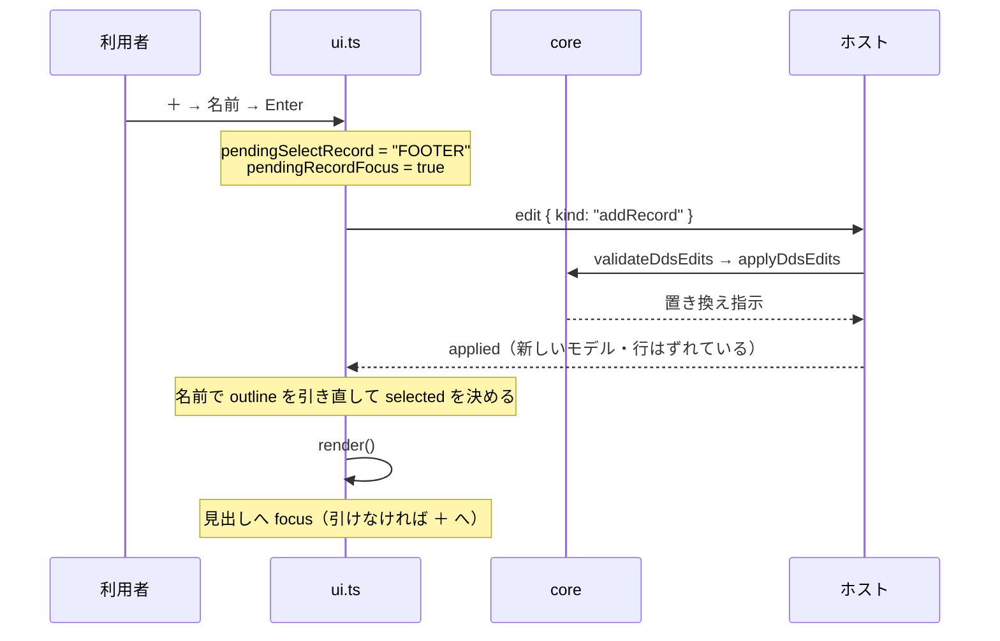

# レビューガイド: DDS を一から作れるようにする（新規作成とレコード様式）

差分は 20 ファイル（新規 4）・約 +1400 行。ただし**読むべきところは 5 か所**で、
残りはテストと、既存の作法をそのまま写した UI です。

## 変更概要 / 目的

ビジュアルエディタは**既存の DDS を直す道具**であって、**作る道具ではありませんでした**。
新規作成の導線が無く、項目はレコード様式の中にしか置けないのに**様式を作る手段が無い**
——テキストエディタで様式を手書きしてからでないとデザイナが使えない状態です。

この作業で「新規作成 → 最初の項目を置く」までがデザイナの中だけで完結します。

## いちばん見てほしいところ: `records` の導き方（1 行の意味が大きい）

**調査では「技術的な壁は無い」と結論しましたが、実測したら壁がありました。**

`RenderModel.records` は**配置できた項目から**導かれていたため、
**項目が 0 件の様式は `records` に出ません**。UI はこの件数で
「フィールドを置く」の可否を決めているので（`canAdd`）、雛形を作っても何も置けません。

```
buildDspfRenderModel([DSPSIZ, '     A          R REC1', ''])
  records = []                                    ← 様式はあるのに空
  outline = [{"name":"REC1","line":2,"items":0}]  ← 一覧には出ている
```

一方 **core は空の様式に項目を足せます**（`add` が通る）。塞いでいたのはここ 1 か所でした。

- `src/core/dds/dspfRenderModel.ts:265` `recordNames()` — `outline`（配置解決を通さない）から作る
- 併せて `fromLayout` / `fromPrtfLayout` の **`outline` 引数から既定値 `= []` を外しました**。
  残すと、渡し忘れが `records: []` を黙って受け取る——**いま直している壊れ方そのもの**です。

## 処理フロー: 追加・削除のあとに「どこを選び、どこへ焦点を移すか」

**差分を読むだけでは追いにくいのはここだけ**です。行番号は編集でずれるので**名前で追い**、
「選ぶ」と「焦点を移す」を**別のフィールド**にしてあります。



**なぜ 2 つに分けたか**——一緒にすると「隣が無い（最後の 1 つを消した）」ときに
`pendingSelectRecord` が `undefined` になり、**分岐ごと飛んで焦点が body に落ちます**。
実際そうなっていて、レビューで見つけました（`review.md` ラウンド 1）。

- `src/dds/webview/ui.ts:2541` `wireAddRecord()` — `＋` の約束（`addKeywordButton` を写す）
- `src/dds/webview/ui.ts:2593` `removeRecord()` — 隣が無ければ `null`（＝`＋` へ）
- `src/dds/webview/ui.ts:2605` `neighbourRecordName()`

## 主要な変更箇所

| 場所 | 要点 |
|---|---|
| `src/core/dds/dspfRenderModel.ts:265` | **`records` を `outline` から作る**。この作業の中心 |
| `src/core/dds/ddsTemplate.ts:52` | 雛形。**既存の組み立て関数の合成**（桁を新たに数えない） |
| `src/core/dds/ddsEditWriteBack.ts:279` | `buildRecordLine`。雛形と `addRecord` が**同じ関数**を通る |
| `src/core/dds/ddsEdit.ts:916` | `appendPoint` — 足す先は**最後の非空白行の直後**（末尾の空行を跨ぐ） |
| `src/core/dds/ddsEdit.ts:933` | `recordRemovalRuns` — 様式＋中の項目。**注記行は残す**（`removalRuns` と同じ流儀） |
| `src/core/dds/ddsEdit.ts:1247` | `validateRecordName` — 改名と追加で**共有**（写さない） |
| `src/core/dds/ddsDanglingReferences.ts:51` | 宙に浮いた参照。**書き換えず検証タブに出すだけ** |
| `src/dds/editorProvider.ts:149` | `createDdsFile` — 保存 → 書き出し → `openWith`。**引数は `(uri, viewType)`** |
| `src/dds/webview/ui.ts:2641` | `recordAt` — 追加先の決定。下記のとおり順序に理由がある |

## リスク / 確認してほしい点

### 1. 追加先の決定（`recordAt`）の順序 — **2 回変えています**

DSPF の様式は画面行が重なりうるので、行から様式は厳密には決まりません。

| 順 | 判定 |
|---|---|
| 1 | **描かれた項目を 1 つも持たない**様式の見出しを選んでいるなら、その様式 |
| 2 | その行以上でいちばん下にある項目の様式（従来） |
| 3 | 最後の様式（従来） |

- 当初 spec は「①行の見当 → ②選択」でしたが、**足したばかりの様式は項目 0 件なので
  ① に絶対引っかからず、② へ永久に到達しません**（e2e が捕まえた。`decisions.md` D1）。
- 逆に「選択を常に優先」にすると、**この作業と関係のない配置の振る舞いが変わります**
  ——見出しは `OVERLAY` / `CF03` を読むためにも選ぶので、レビューで 1 に絞りました。
- **見てほしいのは、1 の条件が「項目 0 件」で妥当かどうか**です。
  e2e が両側（届かない様式は救う／届く様式は上書きしない）を固定しています。

### 2. 上書きの確認だけモーダルを出しています

この PJ に確認ダイアログは 1 つもなく、取り消しは undo に委ねる作法です（research F8）。
**様式の削除も確認しません**（`✕` で即座に消え、件数を状態行に出す）。

例外は 1 か所——`src/dds/editorProvider.ts:149` で、**拡張子を足して
ダイアログの答えと違うパスへ書くとき、その先に既存ファイルがあれば確認します**。
`CUSTMNT` と打つとダイアログは `CUSTMNT` の衝突しか見ておらず、
`CUSTMNT.dspf` が**黙って消えていました**（レビューで発見）。

**判断を仰ぎたい点**: 「確認を出さない」作法の例外にしてよいか。
根拠は「*取り消せる操作*には undo、**消えたら戻らないものには確認**」で、
開いていないファイルの上書きに undo はありません。
代案（`filters` を付けてダイアログ自身に確認させる）は、拡張子の集合が
`sourceKind.ts` の外にもう 1 つできるので採りませんでした。

### 3. 宙に浮いた参照の範囲を AC より広げています

AC11 が挙げるのは項目側（`&名前` / `CSRLOC` / `HLPARA(*FLD)`）だけですが、
様式を消せば `SFLCTL(消した様式)` も同時に浮くので**両方**出しています（`decisions.md` D2）。

**偽陽性が怖い変更**なので、同梱の DDS を**ディレクトリごと走査**して 0 件であることを
単体テストに固定しました（サンプルが増えたら自動で対象になります）。

### 4. 既知の制約（この作業では直しません）

**PRTF の雛形にはファイル・レベルの行が 1 本も無いので、`LPI` / `CPI` を
デザイナから足せません。** 一覧は既存の行があるときだけ「ファイル」の見出しを出すためです。
DSPF は `DSPSIZ` を書くので入口があります——この非対称は
「帳票に画面サイズ相当を書かない」（紙面は `CRTPRTF` の `PAGESIZE`）の帰結です。

受け入れ基準に無く、**ファイル・レベルの行を「作る」手段はこのデザイナに元から無い**
（既存の行を直せるだけ）ので、follow-up に出します。

## 検証で見てほしいこと

- **e2e が 29 件増えています**（196 → 225）。すべて単独起動ハーネスで**実際に押して**います
  ——モデルまで見ても分からない類（`canAdd`・焦点・キーの取り回し）がここにあります。
- **直した 9 件すべて、直す前に戻すと落ちる**ことを確かめました
  （`test-result.md` の 4 件 ＋ `review.md` の 5 件）。
  うち 1 件は**最初に戻したものが間違っており**、テストが通ったままでした——
  実際に効いている変更を突き止め直しています。
