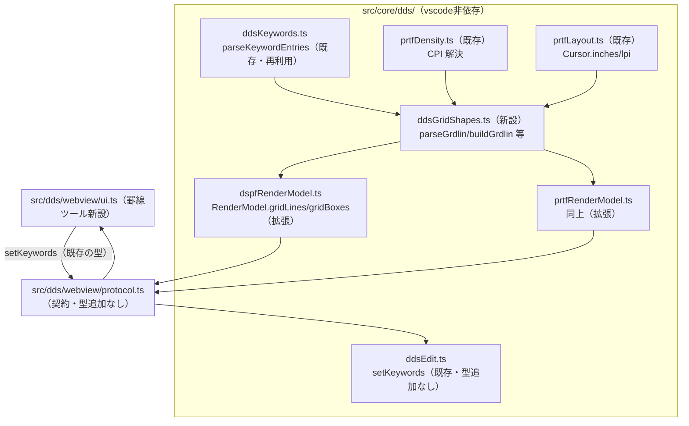
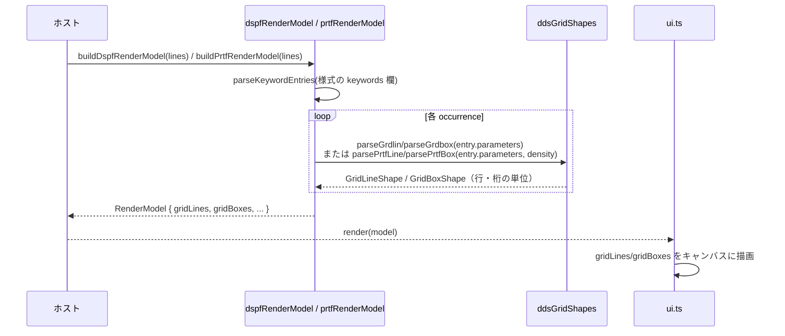
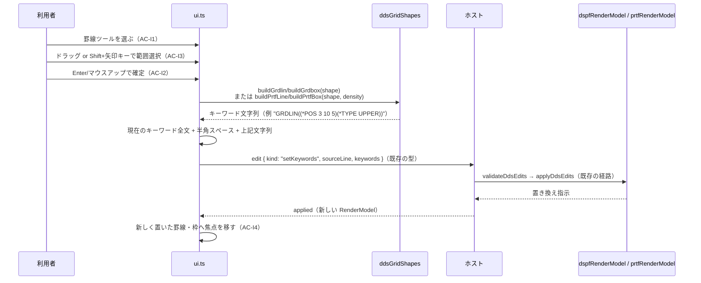

# 設計: 罫線を引けるようにする（DSPF / PRTF）— 構造設計

design.md で確定した方針（A〜D、`decisions.md` D1〜D5）を前提に、モジュール間の関係と
主要な2つの処理フロー（読み取り→描画、配置→書き戻し）を図にする。
**新しい設計判断はここでは行わない**（design.md で既に確定済み）。

## アーキテクチャ概要

罫線・枠の対応は、既存の DDS ビジュアルエディタの4層構造
（`core` → `protocol` → `bridge` → `ui`）に**新しい層を足さずに**収まる。

**この図で言いたいこと**: `ddsGridShapes.ts` が唯一の新規モジュールで、既存の
`ddsKeywords.ts`/`prtfDensity.ts`/`prtfLayout.ts` を**下流から呼ぶだけ**。
`protocol.ts`/`ddsEdit.ts` はどちらも**型を増やさない**（design.md 方針A）ので、
契約（webview ⇔ ホスト）を変更する作業は発生しない——tasks 分解上、
「protocol の変更」というタスクが不要になる（申し送りに反映）。

## コンポーネント / モジュール

| モジュール | 責務 | 依存 |
|---|---|---|
| `ddsGridShapes.ts`（新設） | キーワードの引数文字列 ⇔ 構造化データ（`GridLineShape`/`GridBoxShape`）の相互変換 | `ddsKeywords.ts`（引数の生テキスト取得元）、PRTF 側のみ `prtfDensity.ts` |
| `dspfRenderModel.ts`（拡張） | `GRDLIN`/`GRDBOX` の occurrence を `ddsGridShapes` で読み、`RenderModel.gridLines`/`gridBoxes` に載せる | `ddsGridShapes.ts` |
| `prtfRenderModel.ts`（拡張） | 同上（PRTF）。CPI/LPI 変換を経由 | `ddsGridShapes.ts`、`prtfDensity.ts`、`prtfLayout.ts` |
| `ddsKeywordLevels.ts`（拡張） | GRD 系キーワードのレベル登録（record/file） | 既存の登録表に追記するだけ |
| `docs/origin/*`（拡張） | GRD 系5件の原典取得・索引外キーワードの検査 | 既存スクリプト群への追記 |
| `ui.ts`（拡張） | 罫線ツールの操作モード・キャンバス描画・キーボード操作 | `RenderModel.gridLines`/`gridBoxes`（読み取り）、`setKeywords`（書き戻し） |

## 処理フロー / シーケンス

### フロー1: ソースを開く → プレビューに罫線・枠が出る（AC2, AC3）

PRTF のときだけ `density`（CPI/LPI の解決結果）が `parsePrtfLine`/`parsePrtfBox` に渡る
——**`RenderModel` に届く時点で単位は行・桁に揃っている**ので、UI 側の描画コードは
DSPF/PRTF で分岐しない（design.md 方針C）。

### フロー2: ドラッグで罫線・枠を配置する（AC4, AC-I1〜I4）

**新規の編集コマンドが登場しない**ことがこの図の要点——`setKeywords` は
`20260908-dds-new-and-records` 以前から存在する型で、`protocol.ts`/`ddsEdit.ts` は
今回変更されない。

### フロー3（Escape での取り消し。AC-I2, AC-I4）

ドラッグ中またはキーボード選択中に Escape を押すと、`UI->>Host` の発行が起きないまま
罫線ツールのモードを終了する。ソースは一切変更されず、焦点はツールボタンへ戻る
（`20260908-dds-new-and-records` の addRecord の取り消しと同じ形）。

## 設計判断

design.md の方針A〜D、`decisions.md` D1〜D5 を参照（ここでは繰り返さない）。
本工程で新たに追加した判断は無い。

## tasks への申し送り

- **タスクの単位は「フロー1（読み取り）」と「フロー2（書き込み）」でおおむね分けられる**。
  フロー1は `ddsGridShapes.ts` のパーサー関数 + `RenderModel` 拡張 + キャンバス描画で完結し、
  フロー2（配置 UI）より先に検証可能（AC2/AC3 が先に満たせる）。
  **フロー1を先に実装し、フロー2（ドラッグ操作・AC4/AC-I1〜I5）を後続にする順序**を推奨する
  ——読み取りが無いと配置結果を目視確認する手段が無く、検証が後回しになるため。
- **DSPF と PRTF は「パーサー/ビルダーの実装」は別タスクに割れるが、「RenderModel への統合」
  「UI の罫線ツール」は共通コードで両対応する**（design.md 方針B・C により UI/RenderModel が
  DSPF/PRTF を区別しないため）。tasks の3層決定木（`aidev-30-tasks`）では、
  この非対称（パーサーは種別ごと、UI/モデルは共通）を踏まえて判定する
  ——「DSPF 一式」「PRTF 一式」という縦割りの subtask 分割は、UI/モデルの共通部分を
  二重に割ることになり噛み合わない可能性がある。むしろ
  「パーサー/ビルダー（DSPF, PRTF 別々）」→「RenderModel 統合（共通）」→
  「UI 罫線ツール（共通）」→「原典・検査（AC1, AC7）」という**横割りの順序**が
  自然（ただし分割するかどうか自体は tasks 工程の判定に委ねる）。
- **原典データ・検査（AC1, AC7）は他のタスクと依存関係が薄い**——`ddsGridShapes.ts` の
  パーサー実装は原典の生テキスト（research F2/F3 に引用済み）があれば進められ、
  `resources/completion/dds-keywords.json` への反映を待たない。並行させられるタスク。
- **未確認事項**（design.md「未確認 / coding で確かめること」）は、対応するタスクの
  最初の一手として coding 側で解消する（`PrintDensity` 型のエクスポート形、
  `FRONTMGN`/`BACKMGN` の解決状況）。
