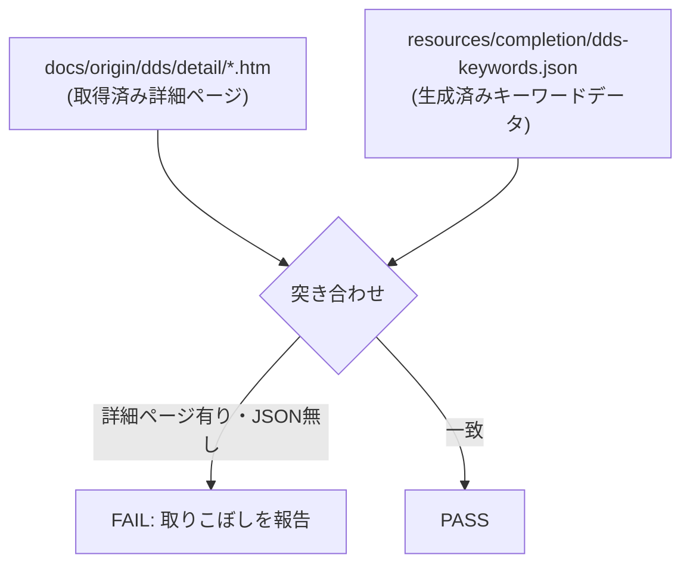

# 仕様: 罫線を引けるようにする（DSPF / PRTF）

## 概要

DSPF の `GRDLIN`/`GRDBOX`/`GRDATR`/`GRDCLR`/`GRDRCD` と PRTF の `BOX`/`LINE` を、
**通常の DDS キーワードと同じ経路**で扱えるようにする。

最大の設計判断は「罫線・枠専用の新しい編集コマンドを作らない」こと——研究で見つけた
既存の汎用キーワード編集機構（`parseKeywordEntries` / `setKeywords`）にそのまま乗せる。
新規に作るのは (a) 各キーワードの引数を構造化データに読み書きする**純粋関数**（core）と、
(b) それを使ってプレビューに描き、ドラッグで置く**UI**（webview）だけ。

## 設計方針

### 方針A（採用）: 罫線・枠は「普通のキーワード」として扱う。専用の追加/削除コマンドは作らない

**依拠する既存の事実**:
- `parseKeywordEntries`（`src/core/dds/ddsKeywords.ts:65`）は、キーワード欄の生テキストを
  `{ name, parameters, raw, kind }` の並びに割る。**意味づけはしない**——「どこで切れるか」だけ。
  これで `GRDLIN((*POS 3 10 5)(*TYPE UPPER)) GRDBOX(...)` のような並びを個別の
  `KeywordEntry` に割れる。**新しい分割ロジックは要らない。**
- `setKeywords`（`ddsEdit.ts:133`、書き戻しは `ddsEdit.ts:605-624`）は、
  ファイル・レベル/様式・項目レベルいずれのキーワード欄も**全置換**で書き戻す汎用の編集。
  現在すでに「キーワードを 1 つ足す」「1 つ消す」という操作（既存のキーワード・チップ UI）が
  これに乗っている——チップを足す/消すたびに**欄の全文を組み立て直して** `setKeywords` を呼ぶ形。
  罫線・枠もここに乗せれば、**追加・削除どちらにも新しい `DdsEdit` の種類が要らない**。
- `buildKeywordLine` / `buildRecordLine`（`ddsEditWriteBack.ts:126,279`）が示す前例:
  「構造化した入力から DDS のキーワード文字列を組み立てる**純粋関数**を core に置き、
  UI 側はそれを呼ぶだけ」という形。罫線・枠のキーワード文字列組み立ても同じ形にする。

**採らなかった代替案**: `addGridLine`/`addGridBox`/`removeGridShape` のような専用 `DdsEdit` を
新設する案。当初はこちらで検討したが、
- 既存の `setKeywords` と機能が重複する（全置換で書き戻す点は同じ）。
- 「1 つの様式に複数の罫線がある」場合の**削除対象の指定**（`sourceLine` だけでは同じ行に
  複数ある罫線を区別できない）を専用に解く必要が生じるが、**既存のキーワード・チップ削除は
  この問題を最初から抱えていない**（UI が現在の全文を知っており、消したい1件を除いた全文を
  組み立て直すだけ）。
- 新設すると「同じことをする 2 つの経路」（キーワード・チップ経由と専用コマンド経由）が並立し、
  AGENTS.md「同じ概念集合を複数箇所で列挙しない」に反する。

### 方針B（採用）: `RenderModel` に `gridLines` / `gridBoxes` を新設する（`items` は拡張しない）

**依拠する既存の事実**:
- `RenderItem`（`src/core/dds/ddsRenderItem.ts:45-48`）の `kind` は `"field" | "constant"` の
  2 種のみで、単一の行・桁・長さを前提にした形（`toRenderItem`、`ddsRenderItem.ts:171`）。
- `RenderModel`（`src/core/dds/dspfRenderModel.ts:109-140`）は `items` と並んで
  `diagnostics` のような**独立した配列**を複数持つ既存の形がある。

罫線・枠は「値を持つデータ項目」ではなく「装飾的な図形」で、フィールド/定数とは性質が違う
（編集規則・データ型・条件付けの扱いも別）。`RenderItem.kind` に無理に足すと、
既存の `items` を読むすべての消費側（キャンバス描画・一覧・選択処理）が
未知の `kind` への対処を強いられ、**この work と無関係な箇所に波及する**リスクがある。

**採らなかった代替案**: `RenderItem.kind` に `"gridLine" | "gridBox"` を足す案。
波及範囲が読みにくく、AGENTS.md「既存挙動を壊さない」に対して安全側でない。

### 方針C: PRTF の cm/inch は `RenderModel` の境界より内側で行・桁に変換し尽くす

**依拠する既存の事実**: `prtfLayout.ts` の `Cursor` 型（`prtfLayout.ts:68,277-280`）が
既に「行番号」と「物理位置（`inches`）」の両方を持ち、`prtfDensity.ts:21` に
「幅（インチ）＝桁数 ÷ CPI」という変換がコメント付きで存在する（research F4）。

`gridLines`/`gridBoxes` を `RenderModel` レベルでは**行・桁の単位に統一**し、
PRTF 用の cm→行桁変換は `prtfRenderModel.ts` の内部（`RenderModel` を組み立てる手前）で
完結させる。UI（`ui.ts`）は DSPF/PRTF の区別なく「行・桁」だけを扱えばよい
——**既存のフィールド描画と同じ座標系**になるので、キャンバス描画・ドラッグ・矢印キー移動の
コードを DSPF/PRTF で分岐させる必要がない（`ui.ts:358,2686,2957` の既存実装をそのまま使う）。

書き戻し（UI → キーワード文字列）は逆方向で、PRTF 用の builder が
行・桁 → cm 変換を行ってから `BOX(...)`/`LINE(...)` を組み立てる。

### 方針D: `GRDCLR` の消去効果はシミュレートしない（`ERASE` と同じ扱い）

**依拠する既存の事実**: `ERASE` キーワード（`ddsReferences.ts:181` 他）は**参照チェックの
対象としてのみ**存在し、それが書かれた様式の静的なレイアウト・描画には一切影響しない
——このプレビューは「実行時に何が起きるか」ではなく「DDS が宣言している配置」を描く設計
であることの表れ（`ddsReferences.ts` 全体の設計方針と整合）。

`GRDCLR` も実行時に既存の罫線・枠を消す**動的な効果**を持つキーワードで、静的な配置の
宣言ではない。`ERASE` と同じ理由で、**プレビューは `GRDCLR` の消去効果を反映しない**
（`GRDCLR` 自体はキーワードとしてデータ化する＝ AC1 の対象。作図もしない＝ requirements の
「対象外」どおり）。

## 対象範囲

### 原典データ・生成スクリプト
- `docs/origin/sources.mjs` — DSPF セクションに GRDLIN/GRDBOX/GRDATR/GRDCLR/GRDRCD の
  5 エントリを追加。**「DBCS に関する考慮事項」章（`dspkwd.htm`）を新しい2次索引として登録**
  （CNTFLD/IGCALTTYP/IGCCNV も同じ経路で拾えるようにする——AC7 の一般化）。
- `docs/origin/generate-dds-keywords.mjs` — 2次索引からのリンクも `KEYWORD_LINK` と同じ形で
  拾えるようにする（正規表現のパターンが index の URL 構造にのみ依存しないことを確認する）。
- `docs/origin/verify-dds-keywords.mjs`（または新設の
  `docs/origin/verify-dds-keyword-index-coverage.mjs`）— **AC7 の機械検査**。
  「取得済みの詳細ページ（`docs/origin/dds/detail/*.htm`）」と
  「`resources/completion/dds-keywords.json` に載っているキーワード」を突き合わせ、
  **詳細ページはあるのに JSON に無いもの**を検出して FAIL する（個別キーワード名を
  ハードコードしない——今回のような未知の取りこぼしを一般的に拾うため）。
- `resources/completion/dds-keywords.json` — 上記生成の結果として GRD 系 5 件・
  （PRTF の BOX/LINE は既存なので変更不要）が追加される。

### core（`src/core/dds/`）
- `ddsGridShapes.ts`（新設）— 罫線・枠のキーワード引数の**構造化パーサー / ビルダー**。
  DSPF 用（`GRDLIN`/`GRDBOX`）と PRTF 用（`LINE`/`BOX`）を両方持つ。
- `ddsRenderItem.ts` — 変更なし（`RenderItem` は拡張しない。方針B）。
- `dspfRenderModel.ts` — `RenderModel` に `gridLines`/`gridBoxes` を追加。
  `GRDLIN`/`GRDBOX` の解析結果をここに載せる。`GRDCLR`/`GRDATR`/`GRDRCD` は
  データとしては読めるが `gridLines`/`gridBoxes` には現れない（方針D、GRDRCD は非座標）。
- `prtfRenderModel.ts` — 同様に `BOX`/`LINE` を解析し、`prtfDensity.ts`/`prtfLayout.ts` の
  CPI/LPI 解決を通して行・桁に変換してから `gridLines`/`gridBoxes` に載せる。
- `ddsEdit.ts` — **新しい `DdsEdit` の種類は追加しない**（方針A）。バリデーションの追加もなし
  （はみ出し・重なりは拒否しない。`ddsEdit.ts:260,1190` の既存方針を罫線・枠にも適用）。

### webview（`src/dds/webview/`）
- `ui.ts` — 罫線・枠を置く操作モード（既存の `addKeywordButton` 相当の「＋」に並ぶ
  新しいツール）、キャンバスへの罫線・枠の描画、ドラッグ/矢印キーでの範囲選択。
  **新しい `protocol.ts` の型は増えない**（`setKeywords` をそのまま使うため）。
- `ui.css` — 罫線・枠の描画スタイル（線・矩形の border 表現）。

## 依拠する既存の事実

- `parseKeywordEntries`（`ddsKeywords.ts:65`）: キーワード欄を個別の occurrence に分割する
  既存関数。罫線・枠もこれで割れる（確認済み・上記方針A）。
- `setKeywords`（`ddsEdit.ts:133`、`ddsEdit.ts:605-624`）: ファイル/様式/項目いずれの
  キーワード欄も全置換で書き戻す既存の汎用編集（確認済み）。
- `Cursor.inches`/`lpi`（`prtfLayout.ts:68,277-280`）、CPI 解決（`prtfDensity.ts:21`）:
  PRTF の cm/inch ↔ 行桁変換に使う既存ロジック（確認済み・research F4）。
- `RenderItem.kind`（`ddsRenderItem.ts:45-48`）は `"field"|"constant"` のみ（確認済み）。
  罫線・枠は別の配列にする（方針B）。
- `ERASE` の扱い（`ddsReferences.ts:181` 他）: 動的効果を静的プレビューでシミュレートしない
  既存の前例（確認済み）。`GRDCLR` に適用。
- はみ出し・重なりを拒否しない方針（`ddsEdit.ts:260,1190` のコメント）: 罫線・枠にも適用する
  （確認済み・実機未検証。下記「未確認」参照）。
- window（`WINDOW`/`WDWBORDER`）の視覚描画: **該当なし**——現状どこにも実装が無いことを
  `grep -rn "WDWBORDER\|border" src/core/dds/dspfRenderModel.ts src/dds/webview/ui.ts` で確認済み
  （research F5）。流用元は無い。

## インターフェース / データ構造

### `ddsGridShapes.ts`（新設）

```ts
/** DSPF GRDLIN の境界種別。原典の *TYPE 値。 */
export type GridLineEdge = "upper" | "lower" | "left" | "right";

export interface GridLineShape {
  readonly row: number;      // 1始まり。start-line / position-down 相当
  readonly column: number;   // 1始まり。start-column / position-across 相当
  readonly length: number;   // 桁数（upper/lower）または行数（left/right）
  readonly edge: GridLineEdge;
}

export interface GridBoxShape {
  readonly row: number;
  readonly column: number;
  readonly depth: number;    // 行数
  readonly width: number;    // 桁数
}

// DSPF 側（行・桁のまま）
export function parseGrdlin(parameters: string): GridLineShape | undefined;
export function buildGrdlin(shape: GridLineShape): string;   // "GRDLIN((*POS 3 10 5)(*TYPE UPPER))"
export function parseGrdbox(parameters: string): GridBoxShape | undefined;
export function buildGrdbox(shape: GridBoxShape): string;

// PRTF 側（cm ⇔ 行桁の変換を内包）
export function parsePrtfLine(parameters: string, density: PrintDensity): GridLineShape | undefined;
export function buildPrtfLine(shape: GridLineShape, density: PrintDensity): string;
export function parsePrtfBox(parameters: string, density: PrintDensity): GridBoxShape | undefined;
export function buildPrtfBox(shape: GridBoxShape, density: PrintDensity): string;
```

**`PrintDensity`** は既存の型（`prtfDensity.ts` から export 済みのはず。coding 側で確認する
——research では存在の確認のみで型の正式なエクスポート名までは見ていない。**未確認**）。

`parseGrdlin`/`parseGrdbox` 等は `parseKeywordEntries` が返す `KeywordEntry.parameters`
（括弧の中身の生テキスト）を受け取る想定。**`*POS` トークンの後の数値列と `*TYPE` の値を
読む構文解析はここが新規に書く**（`parseKeywordEntries` は「キーワードの境目」しか
知らないので、個々のキーワードの引数文法はキーワードごとに別に要る——既存の
`dspfAttributes.ts:resolveAppearance` 等、他のキーワードの引数パーサーと同じ位置づけ）。

### `RenderModel` の拡張（`dspfRenderModel.ts` / `prtfRenderModel.ts` 共通）

```ts
export interface RenderModel {
  // ...既存フィールドは変更なし...
  readonly items: readonly RenderItem[];
  /** 罫線（GRDLIN / LINE）。行・桁は既に解決済み（PRTF も cm から変換済み）。 */
  readonly gridLines: readonly RenderGridLine[];
  /** 枠（GRDBOX / BOX）。同上。 */
  readonly gridBoxes: readonly RenderGridBox[];
  readonly diagnostics: readonly RenderDiagnostic[];
  readonly records: readonly string[];
}

export interface RenderGridLine extends GridLineShape {
  /** 1 始まり。この罫線を書いているキーワード欄の代表行（`items`/`records` と同じ鍵）。 */
  readonly sourceLine: number;
}

export interface RenderGridBox extends GridBoxShape {
  readonly sourceLine: number;
}
```

### webview 側の追加操作（`protocol.ts` の型は不変。UI 内部の状態のみ）

罫線・枠の配置は、UI 内部で完結する新しい操作モード（既存の `pendingSelectRecord` 等と
同様の一時状態）として実装し、確定時に**既存の** `{ kind: "setKeywords", sourceLine, keywords }`
を発行する。`keywords` は「現在の全文 + 半角スペース + `buildGrdlin(...)` 等の戻り値」。
削除も同じ形（現在の全文から対象の `KeywordEntry.raw` を除いた文字列を組み立てて送る）
——**既存のキーワード・チップ削除と全く同じ経路**（新しい処理を書かない）。

## 振る舞いの詳細

### 配置操作（AC4, AC-I1〜I5）

1. **開く**（AC-I1）: 既存の「＋」（`addRecord` 用、`ui.ts:2541 wireAddRecord`）と並ぶ
   新しいツールボタン（罫線用・枠用）。DSPF は「罫線」「枠」の2つ、PRTF も同様
   （キーワード名は異なるが UI 上の操作は共通）。
2. **配置**（AC4, AC-I3）: 罫線ツールが有効な間、キャンバス上をドラッグすると
   始点セル〜終点セルの範囲がハイライトされる（既存の `dragTarget`、`ui.ts:2686` と
   同じ計算を再利用）。マウスを離すと確定候補になる。
   - 選択が**1行**（複数桁）→ 横の罫線（`edge` は既定 `upper`。ドラッグ方向や
     選択セルの上半分/下半分でトグルできるようにするかは coding 側の裁量とする——
     受け入れ基準にはトグルの詳細までは規定しない）。
   - 選択が**1桁**（複数行）→ 縦の罫線（`edge` は既定 `left`）。
   - 選択が**複数行×複数桁**→ 枠（`GridBoxShape`）。
   - キーボード等価（AC-I3）: 既存の矢印キー移動（`ui.ts:2957` の差分テーブル）と同じ発想で、
     始点セルにフォーカスがある状態から Shift+矢印キーで範囲を広げ、Enter で確定・
     Escape で取り消す（AC-I2）。
3. **確定**（AC-I2）: Enter またはマウスアップで、選択範囲から `GridLineShape`/`GridBoxShape`
   を組み立て、DSPF なら `buildGrdlin`/`buildGrdbox`、PRTF なら `buildPrtfLine`/`buildPrtfBox`
   を呼び、結果を現在のキーワード全文に追記して `setKeywords` を送る。
   Escape なら何もせず操作モードを終了する（何もソースに残らない）。
4. **フォーカスの行き先**（AC-I4）: 確定後は新しく置いた罫線・枠へ焦点を移す
   （`20260908-dds-new-and-records` の `pendingSelectRecord`/`pendingRecordFocus` と
   同じ「選ぶ」と「焦点を移す」を分けるパターンを踏襲——同じ理由で分ける:
   隣が無い場合に分岐ごと飛んで焦点が落ちる事故を避けるため）。
   取り消したら罫線ツールのボタンへ焦点が戻る。
5. **既存操作を妨げない**（AC-I5）: 罫線ツールが有効な間のキー入力（矢印キー・Enter・
   Escape）は、選択中の他の項目（フィールド等）の編集キーへ**漏れない**
   （`20260908-dds-new-and-records` の「入力中のキーはキャンバスへ漏れない」と同じ検証観点）。

### 削除操作（AC6）

罫線・枠の見出し/チップに「✕」を付け、既存のキーワード・チップ削除と同じ経路
（現在の全文から対象の occurrence を除いて `setKeywords`）で消す。undo は
VSCode 標準の undo スタック（既存のフィールド削除と同じ——このエディタは
独自の undo 機構を持たず、テキスト編集としての undo に乗る前提。AC9 と同じ設計）。

### 索引外キーワードの検査（AC7）



新設または拡張する検査は、キーワード名を個別に列挙しない
（今回の GRDLIN 等を特別扱いしない）。**詳細ページの実在が正**で、
JSON 側に反映されていないものを機械的に見つける形にする。

## ドメイン固有の考慮

- **GRDLIN/GRDBOX/GRDCLR/GRDRCD はレコード・レベル・キーワード**（GRDATR のみ
  ファイル・レベルまたはレコード・レベル）。フィールド・レベルの位置には置けない
  ——`ddsKeywordLevels.ts` の既存のレベル判定機構（`keywordsNotAllowedAt`）に
  GRD 系を追加登録する。
- **`GRDRCD` を持つレコードは許可キーワードが限定される**（研究 F2: `DSPMOD, FRCDTA,
  GRDATR, GRDBOX, GRDCLR, GRDLIN, RETKEY, RETCMDKEY, RMVWDW, USRRSTDSP, WDWBORDER,
  WDWTITLE, WINDOW` のみ）。**この制約のバリデーションは本 work のスコープ外**とする
  （requirements になく、既存のキーワード・レベル検査の粒度を超える。follow-up 候補として
  次のアクションに記録する）。
- PRTF の `BOX`/`LINE` の座標は `CRTPRTF` の `FRONTMGN`/`BACKMGN`（マージン）が原点。
  現在の `prtfLayout.ts`/`prtfDensity.ts` がマージンをどこまで解決しているかは
  **未確認**（coding 側で確認する。research ではファイルの存在と CPI/LPI の扱いのみ確認）。

## エラー処理 / 異常系

- **はみ出し・重なりは拒否しない**（方針、上記「依拠する既存の事実」）。
  既存の重なり診断（`overlapsUnderIndicators` 等）は罫線・枠を対象にしない
  （フィールドの重なりとは性質が違う——罫線同士が重なっても実害が薄いため）。
- **`length`/`depth`/`width` が 0 以下になる操作**: UI のドラッグ/キーボード操作の設計上、
  1 セル未満の選択は成立しない（ドラッグ開始点と終了点が同じなら罫線ツールを終了する
  だけで、確定操作自体が発生しない）。**core 側の新しいバリデーション／却下コードは追加しない**。
- **PRTF で CPI/LPI が複数使われているレコード**（`prtfLayout.ts` の既存コメントが警告する
  「LPI がページ途中で変わると行番号と位置が比例しない」ケース）: 罫線・枠は
  **その罫線が属する様式に効いている LPI/CPI**（単一の値）で変換する。
  ページを跨ぐ罫線の配置は本 work の対象外（受け入れ基準に無い。1 様式内で完結する
  配置のみを扱う）。

## 受け入れ基準との対応

- AC1: `docs/origin/sources.mjs` に GRD 系 5 件（GRDRCD 含む）を追加し、
  `generate-dds-keywords.mjs` で `resources/completion/dds-keywords.json` に反映する。
  入力は `https://www.ibm.com/docs/{ja,en}/ssw_ibm_i_74/rzakc/rzakcmstdfgrd{l,b,a,c,r}.htm`
  （research F1 で確認済み）。
- AC2: `dspfRenderModel.ts` が `GRDLIN`/`GRDBOX` を `ddsGridShapes.ts` の
  `parseGrdlin`/`parseGrdbox` で読み、`gridLines`/`gridBoxes` に載せる。
  入力はレコードのキーワード欄（`parseKeywordEntries` の出力）。
- AC3: `prtfRenderModel.ts` が `BOX`/`LINE` を `parsePrtfBox`/`parsePrtfLine`
  （CPI/LPI 変換込み）で読み、同じく `gridLines`/`gridBoxes` に載せる。
- AC4: `ui.ts` の罫線ツール（新設）が、ドラッグ/キーボード操作から `GridLineShape`/
  `GridBoxShape` を組み立て、`buildGrdlin`/`buildGrdbox`/`buildPrtfLine`/`buildPrtfBox`
  で文字列化し、既存の `setKeywords` で書き出す。
- AC5: `ddsGridShapes.ts` のパーサー/ビルダーの単体テストが、research F2/F3 で引用した
  原典の生テキスト（構文・有効範囲）と直接照合する。
- AC6: 罫線・枠のチップに「✕」を付け、既存のキーワード・チップ削除と同じ経路で消す
  （新規コードは表示側のみ）。
- AC7: `docs/origin/verify-dds-keyword-index-coverage.mjs`（新設）が、取得済み詳細ページと
  生成済み JSON の差分を検出する。入力は `docs/origin/dds/detail/*.htm` と
  `resources/completion/dds-keywords.json`。
- AC-I1: 「振る舞いの詳細 / 配置操作」1.（新しいツールボタン。`ui.ts` の新設ツールモード）。
- AC-I2: 「振る舞いの詳細 / 配置操作」3.（Enter/マウスアップで確定・Escape で取り消し）。
- AC-I3: 「振る舞いの詳細 / 配置操作」2.（ドラッグおよび Shift+矢印キーでの範囲選択）。
- AC-I4: 「振る舞いの詳細 / 配置操作」4.（確定後は新しい罫線・枠へ、取り消しはツールボタンへ）。
- AC-I5: 「振る舞いの詳細 / 配置操作」5.（罫線ツール中のキー入力を他項目へ漏らさない）。

## 未確認 / coding で確かめること

- `prtfDensity.ts` の `PrintDensity` 型のエクスポート形（正式な型名・フィールド名）。
- `prtfLayout.ts`/`prtfDensity.ts` が `FRONTMGN`/`BACKMGN`（マージン）をどこまで
  解決しているか（原点のズレを罫線変換で考慮する必要があるか）。
- `GRDLIN`/`GRDBOX` を real 機（IBM i）でコンパイルしたときの、はみ出し・重なりの実際の挙動
  （拒否しない方針はフィールドの前例を踏襲したもので、GRD 系専用の実機確認はしていない）。
