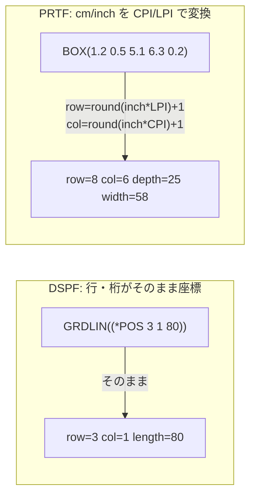

# レビューガイド: 罫線を引けるようにする（DSPF / PRTF）

差分は約20ファイル（新規4）・約+1700行。読むべき所は5か所に絞れます。

## 変更概要 / 目的

DDS ビジュアルエディタはフィールド・様式は視覚的に扱えるが、罫線・枠
（DSPF の `GRDLIN`/`GRDBOX`、PRTF の `BOX`/`LINE`）は扱えなかった。テキストエディタで
座標を手計算して手書きするしかない状態を解消し、プレビュー上の2クリック（またはキーボード）
だけで置ける・見える・消せるようにする。

## いちばん見てほしいところ: 専用の編集コマンドを1つも増やしていない

`setKeywords`（既存の汎用キーワード編集）に乗せる設計にした。新規に作ったのは
「構造化データ ⇔ キーワード文字列」の純粋な変換関数（`ddsGridShapes.ts`）だけで、
`protocol.ts`/`ddsEdit.ts` は**この work で1行も変わっていない**。

理由: 罫線・枠は同じ様式に複数ありうるので、削除の宛先を専用コマンドで指定しようとすると
「同じ行の複数罫線をどう区別するか」を新たに解く必要が生じる。既存のキーワード・チップ削除
（現在の全文から対象を除いて送り直す）はこの問題を最初から抱えていない——それに乗せた。

- `src/core/dds/ddsGridShapes.ts:1` — 新設モジュール全体。既存の `parseKeywordEntries`
  （`ddsKeywords.ts`）で切り出した後の1キーワード分だけを扱う
- `src/dds/webview/ui.ts:submitGridShape` — 確定時に組み立てた文字列を既存の全文に追記して
  `{kind:"setKeywords",...}` を送るだけ
- `src/dds/webview/ui.ts:removeGridShape` — 既存のキーワード・チップ削除と同じ経路

## 処理フロー: 座標系がDSPFとPRTFでまったく違う

design 段階でこの非対称に気づき（research）、`RenderModel` の境界（`gridLines`/`gridBoxes`）
より内側で変換し尽くす方針にした——UI（`ui.ts`）は DSPF/PRTF を一切区別せず、
既存のドラッグ・矢印キー移動をそのまま流用できる。

- `src/core/dds/ddsGridShapes.ts:parsePrtfBox` — cm/inch → 行桁の変換（`+1` オフセットの
  根拠は `prtfLayout.ts` の `Cursor` 初期値 `{row:1, inches:0}` と揃えている）

## 主要な変更箇所

| 場所 | 要点 |
|---|---|
| `src/core/dds/ddsGridShapes.ts` | 罫線・枠のパーサー/ビルダー（DSPF・PRTF 両方）。新設 |
| `src/core/dds/dspfRenderModel.ts` | `RenderModel`/`SecondaryScreen` に `gridLines`/`gridBoxes` を追加 |
| `src/core/dds/prtfRenderModel.ts` | 同上（PRTF）。ページごとの絞り込みも扱う |
| `src/dds/webview/ui.ts` | 罫線・枠ツール（2クリック配置・キーボード操作・選択・削除・描画） |
| `docs/origin/{sources.mjs,generate-dds-keywords*.mjs}` | GRD系5件の原典取得・反映 |
| `docs/origin/verify-dds-keyword-index-coverage.mjs` | 索引外キーワードの取りこぼし検査（新設） |

## リスク / 確認してほしい点

### 1. review で見つかった2件の must は「見えていないだけで壊れている」系

- **2次画面サイズに切り替えても罫線が1次の位置のまま**（`screenModel()` が
  `gridLines`/`gridBoxes` を差し替えていなかった）。削除しようとしても内部の比較が
  食い違い黙って失敗する——エラーも出ないため気づきにくい。
- **PRTF複数ページで BOX/LINE が全ページに重複表示**（`RenderGridBox`/`RenderGridLine` が
  そもそも `page` を持っていなかった）。

どちらも組み込み `code-review` が見つけ、コードを読んで再現条件を確認したうえで
修正・回帰テストまで実施済み（`review.md` 参照）。**見てほしいのは、この2件のような
「既存の仕組み（2次画面・複数ページ）に新しい概念（罫線・枠）を後から足すと、
既存の仕組み側の分岐を全部更新しないと静かに漏れる」という種類の欠陥が、
他にも残っていないか**という視点です。

### 2. 罫線と枠の判定は「選択した2点の形」から機械的に決まる

1行の選択→横罫線、1桁の選択→縦罫線、それ以外→枠。design で決めた仕様どおりだが、
**始点と終点が完全に同じ点**を弾く判定は review で追加した（review 前は長さ1の
罫線が黙って出来ていた）。この「機械的に決める」設計そのものが妥当かは、
実際に使ってみて違和感がないか確認してほしい。

### 3. 既知の制約（この work では対応しない）

- PRTF の `UOM`（cm/inch の選択）は DDS ソースに現れないため常に `*INCH` 扱い。
- `&名前`（プログラム-システム間フィールド）による可変位置は描画対象から外れる。
- `GRDRCD` の許可キーワード制限はバリデーションしない。

いずれも requirements/design の対象外として明示済み（test-result.md 参照）。
