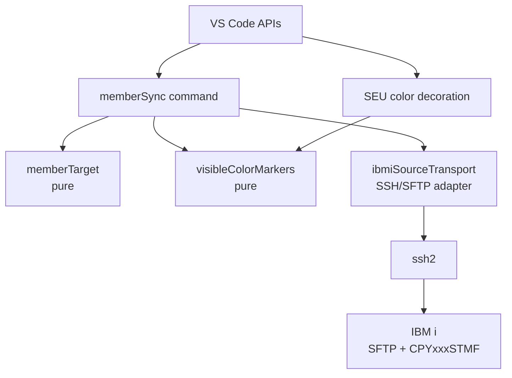
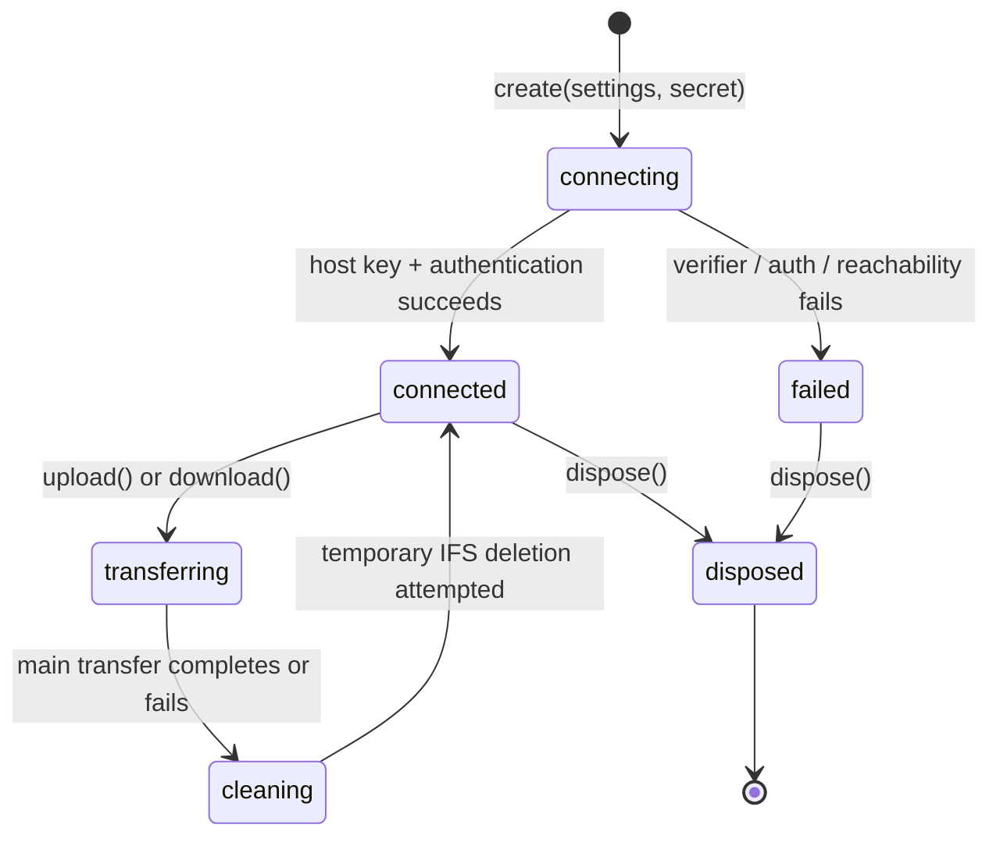
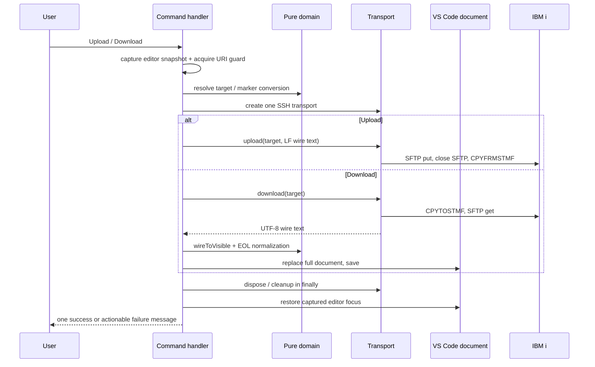

# 設計: IBM i ソースメンバーの手動同期と可視 SEU 色属性

## アーキテクチャ概要

本機能は、VS Code と IBM i の間にある「文書を送る／受け取る」というユースケースを、次の4層に分ける。

1. **ドメイン層**は、workspace 相対パスからの member target 解決と、可視 marker／wire control の相互変換を担う。VS Code、SSH、設定、時刻に依存しない。
2. **transport adapter 層**は、接続済みの SSH client 上で SFTP と IBM i の CL を順序どおりに実行する。temporary IFS file の生成・削除、host key 検証、失敗の正規化はここに閉じる。
3. **command 層**は、VS Code の active editor・settings・SecretStorage を一度だけ捕捉し、ドメイン層と adapter を組み合わせる。文書の置換、保存、通知、フォーカス復帰もここだけが行う。
4. **presentation 層**は、保存済み本文の marker を読むだけで色装飾を再計算する。同期接続や command の状態には依存しない。



`visibleColorMarkers` は command と装飾で共有する唯一の色定義である。色ごとの marker、wire Unicode、IBM i attribute byte を別々の場所へ複製しない。`fileScope.ts` の `isInScopeDocument` / `TARGET_EXTENSIONS` は表示対象の正本のまま維持する。同期 command は path 規則で対象をさらに絞るが、表示対象集合を再定義しない。

## コンポーネント / モジュール

| 層 | モジュール | 責務 | 依存先 |
|---|---|---|---|
| domain | `src/sync/memberTarget.ts` | `src/<LIB>/<SRCFILE>/<MEMBER>.<ext>` の4 segment を検査し、uppercase の `MemberTarget` を返す。object name 規則外・拡張子なしは `undefined`。 | TypeScript 標準ライブラリのみ |
| domain | `src/sync/visibleColorMarkers.ts` | 7基底色の表、wire⇔marker 変換、行ごとの `ColorSegment` 算出。未知／修飾属性の control は変換せず通過。 | TypeScript 標準ライブラリのみ |
| adapter | `src/sync/ibmiSourceTransport.ts` | `ssh2` 接続、strict host-key verification、temporary IFS path、SFTP transfer、CL exec、finally cleanup、技術エラーの分類。 | `ssh2`、domain の `MemberTarget` |
| application | `src/extension/commands/memberSync.ts` | 設定と SecretStorage の読取り・検証、active document snapshot、in-flight 排他、upload/download、通知と focus restore。 | VS Code API、domain、transport |
| presentation | `src/language/seuColorMarkers.ts` | 7個の decoration type、active editor/document/configuration の購読、対象外時の decoration 解除。 | VS Code API、`fileScope`、marker domain |
| composition | `src/extension/extension.ts` | command と色装飾を activation から登録する。 | command / presentation |

### domain 層

`memberTarget.ts` と `visibleColorMarkers.ts` は import してよいものを相互の型だけに限定し、`vscode` と `ssh2` を import しない。これにより、全受け入れ基準のうち path・色変換・色範囲を extension host なしで table-driven に検査できる。

`VisibleColorMarker[]` を不変の単一表として置き、次の派生索引を同じモジュール内で生成する。

- wire Unicode → marker
- marker → wire Unicode
- marker → `SeuBaseColor`

そのため、7色の追加・修正では表と table-driven test だけを更新すればよく、command と decoration の分岐を個別に修正しない。marker はいずれも BMP の1 UTF-16 code unit であることを起動時ではなく unit test で固定する。

サポートする marker はこの7基底色だけである。修飾済み（反転・下線など）の wire control は marker に変換せず、装飾もしないが、`wireToVisible` と `visibleToWire` の双方でそのまま通過させる。したがって、無変更の download→upload で失われない一方、VS Code から修飾済み属性を新規入力することは初期範囲に含めない。この扱いは decisions の D6 を実装可能な規則へ落としたものである。

### transport adapter 層

`IbmiSourceTransport` は **コマンド1回につき1 instance、1 SSH client** とする。global connection pool や Code for IBM i の接続状態は持たない。設定や SecretStorage を adapter へ渡すのは instance 作成時だけであり、adapter は VS Code configuration を再読込しない。

一時 IFS path は adapter が `ifsTempDirectory` の直下に UUID 相当の安全な名前で生成する。library、source file、member、temporary path は CL 文字列へ入れる前に検査済みの構造値から組み立て、任意文字列を shell に渡さない。upload と download はそれぞれの操作で別の temporary path を使う。



`upload` の内部順序は `SFTP put → SFTP file/subsystem close → CPYFRMSTMF → cleanup`、`download` は `CPYTOSTMF → SFTP get → cleanup` とする。SFTP subsystem を閉じても SSH client を閉じないことを adapter の private operation に隠す。cleanup は常に試行し、cleanup の失敗は先行する CPY/SFTP の主失敗を上書きしない。主失敗がない場合だけ cleanup 失敗を利用者に示す。

adapter 境界で返す失敗は、秘密値や raw command を含まない `IbmiSourceSyncError` に分類する。少なくとも `configuration`、`hostKey`、`authentication`、`transfer`、`copy`、`cleanup` を区別し、command 層は kind ごとの修正案を表示する。`cause` は内部保持しても利用者メッセージと通常ログには出さない。

### application command 層

`registerMemberSyncCommands(context)` が4 command を登録し、すべてを `context.subscriptions` に入れる。upload/download handler は以下の順に進む。

1. active editor、document URI、view column、selection、workspace folder を snapshot する。
2. workspace 内 URI と relative path を検査し、`resolveMemberTarget` が失敗したら接続しない。
3. settings と SecretStorage を読んで検証し、必要な secret がなければ接続しない。private key の passphrase は任意、password は必須である。
4. URI 単位の in-flight guard を取得する。同じ文書への upload/download が実行中なら二重実行せず通知する。異なる文書は別 temporary path と別 connection で実行できる。
5. transport を作成し、一方向の transfer を実行する。finally で transport を dispose し guard を解放する。
6. download だけは受信 text を document の EOL に正規化して marker 化し、full-document `WorkspaceEdit.replace` と `document.save()` を順に成功させる。transport 成功とローカル保存成功を混同しない。
7. 開始時 snapshot の document を `showTextDocument` で再表示し、可能な範囲で selection と view column を戻す。



settings の読取りと validation は `memberSync.ts` の private boundary に置く。設定値は各 command 実行の開始時に読むため、Settings UI での変更には extension 再起動が不要となる。password/passphrase は `context.secrets` の固定 key だけから読み、private key の本文を settings、SecretStorage、ログへ複製しない。`setAuthenticationSecret` / `clearAuthenticationSecret` は transfer を開始せず、secret の保存／削除だけを責務とする。

### presentation 層

`registerSeuColorMarkers(context)` は `dbcsShiftMarkers.ts` と同じ購読モデルを使うが、SOSI の state・status bar・本文への表示文字を共有しない。色 marker は document に実在する文字なので、decoration は前後への疑似文字を挿入しない。

各 `SeuBaseColor` に対して decoration type を1個作る。再計算時は `findColorSegments(document lines)` の結果を色ごとに振り分け、marker の位置から次 marker の直前または行末までを foreground decoration に設定する。同じ行内の marker は次の色への切替点になる。対象外 editor、inactive editor、設定 `rpgClSupport.seuColors.enabled=false` では7種類すべてに空配列を設定し、古い装飾を残さない。

イベント購読は次の3つに限定する。

- active text editor の変更
- active document の本文変更
- `rpgClSupport.seuColors.enabled` の設定変更

同期 command の upload/download 完了は document replacement を通じて既存の document-change 経路へ入るため、presentation 層へ直接 callback しない。これにより、手入力 marker、download、undo/redo のいずれも同じ再描画経路になる。

## インターフェース / データモデル

### 所有する型

```ts
// sync/memberTarget.ts
export interface MemberTarget {
  readonly library: string;
  readonly sourceFile: string;
  readonly member: string;
}

export function resolveMemberTarget(relativePath: string): MemberTarget | undefined;

// sync/visibleColorMarkers.ts
export type SeuBaseColor =
  | "green" | "white" | "red" | "turquoise" | "yellow" | "pink" | "blue";

export interface VisibleColorMarker {
  readonly color: SeuBaseColor;
  readonly marker: string;
  readonly wireCodePoint: number;
  readonly ibmiAttributeByte: number;
}

export interface ColorSegment {
  readonly range: { readonly line: number; readonly start: number; readonly end: number };
  readonly color: SeuBaseColor;
}

export function wireToVisible(text: string): string;
export function visibleToWire(text: string): string;
export function findColorSegments(lines: readonly string[]): readonly ColorSegment[];
```

`ColorSegment` は VS Code の `Range` を持たない。presentation 層だけがこの整数範囲を `vscode.Range` に変換するため、domain の unit test に VS Code stub は不要である。

```ts
// extension/commands/memberSync.ts
export type IbmiAuthMethod = "password" | "privateKey";

export interface IbmiSourceSyncSettings {
  readonly host: string;
  readonly port: number;
  readonly user: string;
  readonly authMethod: IbmiAuthMethod;
  readonly privateKeyPath?: string;
  readonly ifsTempDirectory: string;
  readonly hostKeySha256: string;
}

// sync/ibmiSourceTransport.ts
export interface IbmiSourceTransport {
  download(target: MemberTarget): Promise<string>;
  upload(target: MemberTarget, utf8WireText: string): Promise<void>;
  dispose(): void;
}

export interface IbmiSourceSyncError extends Error {
  readonly kind: "configuration" | "hostKey" | "authentication" | "transfer" | "copy" | "cleanup";
}

export function createIbmiSourceTransport(
  settings: IbmiSourceSyncSettings,
  authenticationSecret: string | undefined
): Promise<IbmiSourceTransport>;
```

`download()` の戻りは **UTF-8 wire text、EOL 未正規化**、`upload()` の入力は **LF 正規化済み UTF-8 wire text** とする。EOL と marker の変換責務を command に固定するため、adapter がローカル editor の表現を知る必要がない。

private key 認証では transport adapter が、command から渡された検証済みの `privateKeyPath` を使って鍵ファイルを読み、鍵本文は adapter 内の SSH 接続オプションへだけ渡す。path は `privateKey` のとき必須、SecretStorage の値は任意の passphrase とする。password 認証では secret を必須の password として渡す。この差を transport 内で VS Code settings の再読込によって補わない。

### 所有権と不変条件

| データ / 状態 | 所有者 | 不変条件 |
|---|---|---|
| 色表と変換索引 | `visibleColorMarkers` | 7基底色の marker/wire/attribute byte は一意で、未知 control は通過する |
| target | `memberTarget` | 4 segment・uppercase・IBM i object name 検証済み |
| SSH client / SFTP subsystem / temporary IFS path | transport instance | 1 command invocation のみで使用し、終了時に cleanup/dispose を試行 |
| password / passphrase | `ExtensionContext.secrets` | settings とログに書かない。private key 本文も保存しない |
| active document snapshot / URI guard | command invocation | 開始後に editor が切り替わっても、開始時 document だけを更新・再表示 |
| decoration types | color marker registration | extension lifetime に1組だけ作り、無効・対象外では常に解除 |

## 横断的な扱い

### エラー、通知、ログ

transport は技術的な失敗を safe な kind に正規化し、command が VS Code の日本語メッセージを選ぶ。これにより adapter に `vscode.window` を渡さず、user-visible wording を unit test できる。成功通知は upload では `CPYFRMSTMF` 成功後、download では `WorkspaceEdit` と `save()` の両方が成功した後だけ表示する。

任意のログには library/source file/member、secret、private key、本体 text、raw CL command を含めない。temporary IFS path をエラーに含める必要がある場合も、その path が secret を含まない生成規則であることを transport 側で保証する。

### 設定・寄与・activation

`package.json` は `rpgClSupport.ibmiSourceSync.*` と `rpgClSupport.seuColors.enabled`、4 command、upload/download の editor/context menu を寄与する。menu の `when` は既存 `TARGET_EXTENSIONS` と同じ拡張子集合を静的列挙する。ただし実行境界は command 内の workspace/path validation であり、menu 表示可否を認可の代わりにしない。

`extension.ts` は `registerLanguageFeatures(context)`、`registerShowPrompterCommand(context)` に加え、同期 command と color marker registration を呼ぶ composition root になる。F4、tab、save listener、Code for IBM i extension API への依存は追加しない。

### テスト境界

| 対象 | 検査方法 | 注目する不変条件 |
|---|---|---|
| `memberTarget` | pure unit | 階層、拡張子、object name、uppercase |
| `visibleColorMarkers` | pure table-driven unit | 7色往復、`Ŕ`、DBCS 不変、未知修飾属性通過、範囲終端 |
| command | vscode stub + fake transport | 接続前 validation、payload、replace/save、focus、in-flight guard、通知 |
| transport | injectable `ssh2` facade の unit | host verifier、SFTP close→CPY 順序、cleanup、秘密値非露出 |
| color registration | vscode stub | 7 decoration、各イベントで再描画／解除、SOSI との独立性 |
| integration | extension host | 色 marker と SOSI decoration の同居、実 editor での再描画 |
| real IBM i | 既存 probe | 7基底色、`Ŕ`→`x'28'`、DBCS、IFS cleanup |

transport をテスト可能にする client facade は `ibmiSourceTransport.ts` の non-exported factory injection または test-only factory parameter に限定する。command が `ssh2` の mock 構造を直接知る形にはしない。

## 設計判断

### 採用: 自前 SSH/SFTP adapter

Code for IBM i は接続情報・認証情報・内部 API を共有しない。research の F1 で、SEU colours も同拡張では未対応と確認済みである。したがって、本拡張の settings と SecretStorage を正本にし、`ssh2` adapter を所有する。接続設定を他 extension から読む案は API・秘密値の可用性・将来変更に依存するため退けた。

### 採用: 可視 marker を保存本文に保持し、装飾は派生させる

`Ŕ` はユーザーが VS Code から入力でき、red の R であることを視認できる。download で wire U+0088 を `Ŕ` に置換し、upload で逆変換する。VS Code decoration だけで制御コードを隠す案は、入力経路と保存済み文書上の識別を作れないため退けた。SOSI の `{` / `}` と異なり、色 marker は本文として保持する。

### 採用: command ごとの短命接続と URI guard

長寿命接続／connection pool は reconnect、configuration 変更、dispose の所有権を増やす一方、手動一方向同期の頻度には不要である。短命接続なら connection state を invocation に閉じられる。反対方向の同時実行による上書きだけは避けるため、command 層に URI 単位の guard を置く。

### 採用: adapter が temporary IFS file を所有する

command が IFS path や SFTP close の順序を知ると、upload/download の cleanup が分岐ごとに漏れる。adapter 内で生成から削除まで所有すれば、CL と SFTP の順序を unit test で固定できる。メンバーを直接 SFTP で操作する案は CCSID 変換と source PF member の扱いを保証できないため退けた。

### 採用: settings は invocation ごと、secret は SecretStorage から読む

設定値の変更を反映するため settings は command 開始時に読む。一方 password/passphrase は SecretStorage のみとし、private key path は非機密の settings に置く。settings へ password を置く案、秘密鍵本文をコピーする案は退ける。

## tasks への申し送り

1. まず `ssh2` と型定義、package contributions、VS Code stub の不足面を追加し、activation・menu 対象集合の検証を通す。transport を先に実装し始めない。
2. pure domain（target と色表・変換・segment）を table-driven test と共に作る。以後の command と decoration はこの公開関数だけを使う。
3. `ssh2` client facade を含む transport を実装し、host key、SFTP/CPY 順序、cleanup、safe error を unit test する。実機 probe の再実行はこの後に置く。
4. command を fake transport で実装し、settings/secret validation、URI guard、upload/download、replace/save/focus を固める。色 decoration とはまだ結線しない。
5. color registration を独立に実装し、SOSI と共存する integration test を追加する。最後に `extension.ts` から2登録を到達可能にする。
6. `npm run compile:all`、`npm test`、寄与検証、integration test、実機 probe を順に実施する。real IBM i の失敗は compile list / command error を読んで分類し、CCSID 65535 を成功扱いにしない。

各 task は上のモジュール境界をまたいで大きくしすぎず、少なくとも domain、transport、command、presentation、実機検証の順を保つ。受け入れ基準の対応は design の AC 表を正本として tasks の `AC:` 行から参照する。
