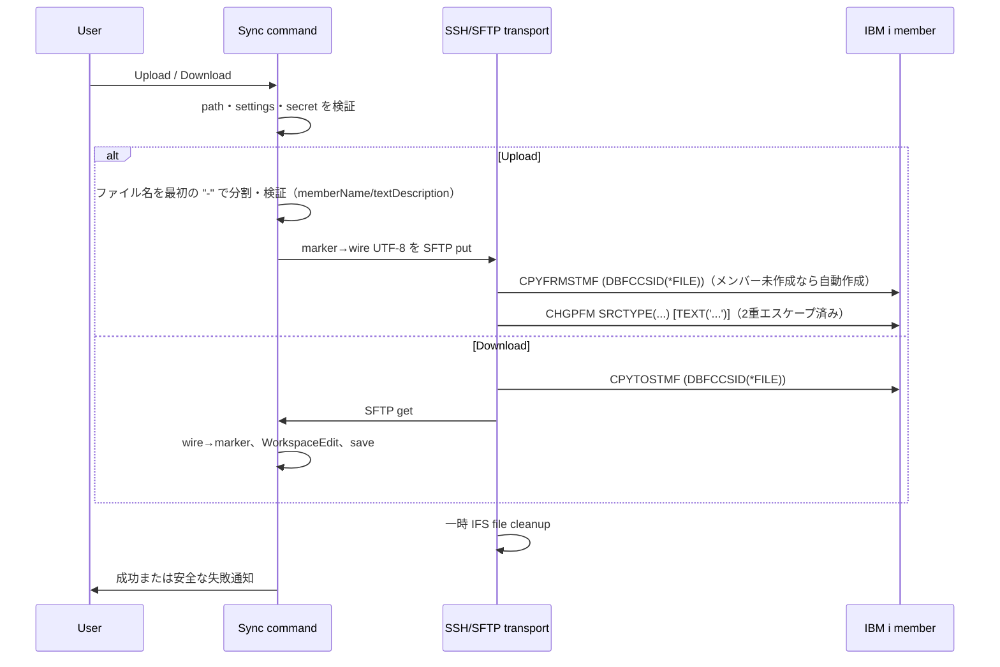

# レビューガイド: IBM i ソースメンバー同期と可視 SEU 色属性

## 変更概要 / 目的

VS Code の `src/<LIB>/<SRCFILE>/<MEMBER>.<ext>` を IBM i source member に明示的に対応付け、拡張自身の SSH/SFTP 接続で送受信する。SEU の7基底色は `Ŕ` などの可視 marker として編集・表示し、IBM i 側の属性バイトへ可逆に戻す。

**追加（US4）**: アップロード時、ファイル名 `<メンバー名>-<テキスト記述>.<拡張子>` の `-` 以降をメンバーのテキスト記述（TEXT属性）として、拡張子から導出した値をソース・タイプ属性（SRCTYPE）として IBM i 側メンバーへ反映する。メンバー名・テキスト記述の命名規則違反は接続前にローカルで弾く。

## 重要ポイント

- Code for IBM i の接続設定や API は参照しない。非機密接続値は拡張設定、password / passphrase は SecretStorage に分離する。
- SSH host key は SHA-256 hex を大小文字非区別、`SHA256:` Base64 を完全一致で検証する。Base64 の大小文字を同一視しない。
- IFS は UUID 付き一時 stream file に限る。SFTP の close 後に `CPYFRMSTMF` を実行し、成功・失敗を問わず cleanup する。
- 可視 marker は保存本文の1文字で、marker 自身から次の marker の直前まで decoration を適用する。SOSI decoration とは別系統で共存する。
- **（US4）区切り文字はアンダースコアではなくハイフン（`-`）**。IBM i オブジェクト名はアンダースコアを合法文字として許容するため、アンダースコアを区切りにすると既存の `MY_PGM.rpg` のようなファイル名の解決結果が黙って変わってしまう。ハイフンは IBM i オブジェクト名に絶対に現れないため、フォールバック分岐なしで安全に「最初のハイフンで分割」できる（decisions.md D7）。
- **（US4）`CHGPFM` の `TEXT('...')` は二重にエスケープする**。①CL 文字列リテラルのアポストロフィ二重化（`'`→`''`）と、②`client.exec()` のコマンド文字列を包む `system "..."` の外側二重引用符（SSH サーバーがログイン shell に `shell -c '<command>'` の形で実行させるため、shell 側の `\` `"` `$` `` ` `` も特殊文字になる）。①だけでは CL コマンド注入を防げない（review ラウンド3 で実際に検出。decisions.md D10）。
- **（US4）新規メンバー作成に `ADDPFM` は使わない**。IBM Documentation 原典どおり `CPYFRMSTMF` は宛先メンバーが無ければ自動作成するため、既存の内容コピーと同じコマンドで新規／既存の両方に対応できる（research.md F8）。

## 処理フロー

## 主要な変更箇所

- `vscode-extension/src/sync/memberTarget.ts:18` — workspace 相対パスを IBM i object name に限定して member target を解決。
- `vscode-extension/src/sync/visibleColorMarkers.ts:29` — 7基底色の marker / wire / attribute-byte を単一表で定義。
- `vscode-extension/src/sync/ibmiSourceTransport.ts:47` — SSH接続、厳格な host-key 検証、SFTP、一時 IFS file cleanup、`CPYTOSTMF` / `CPYFRMSTMF` を実装。
- `vscode-extension/src/sync/ibmiSourceTransport.ts:253` — hex と Base64 の fingerprint 比較を分離。
- `vscode-extension/src/extension/commands/memberSync.ts:46` — 明示 command のみで upload / download を開始し、文書置換・保存・フォーカス復帰を担う。
- `vscode-extension/src/language/seuColorMarkers.ts:13` — marker に対応した7色の decoration と再描画を登録。
- `vscode-extension/test/unit/memberSync.test.ts:189` — Base64 fingerprint の大小文字差を拒否する回帰テスト。
- `vscode-extension/src/sync/memberTarget.ts:34` — `resolveMemberTarget`（US4: 判別共用体化、ハイフン分割、`deriveSourceType` 追加）。
- `vscode-extension/src/sync/ibmiSourceTransport.ts:116` — `upload`（US4: `CPYFRMSTMF` 後に `CHGPFM` を追加）。
- `vscode-extension/src/sync/ibmiSourceTransport.ts:303` — `escapeClStringLiteral` / `escapeForRemoteShellDoubleQuoted`（US4: 2層エスケープ）。
- `vscode-extension/src/extension/commands/memberSync.ts:60` — target 解決失敗理由ごとの通知、属性反映失敗（`kind: "attributes"`）の区別（US4）。

## リスク / 確認したい点

- 同期は上書き操作であり、競合解決・更新日時判定・複数 member の一括転送は対象外。
- 接続先では設定した一時 IFS directory への作成・削除権限が必要。
- 65535 など、source PF の CCSID が UTF-8 変換を拒否する場合は copy failure として扱い、PF 側の CCSID 修正が必要。
- **（US4・未検証）** 宛先メンバー未存在時の `CPYFRMSTMF` 自動作成（AC17）、ライブラリー／ソース物理ファイル未存在時の失敗（AC18）、全角文字を含むテキスト記述の `CHGPFM` 往復は、本 work では実機に接続できず unit test（fake ssh client）までしか確認できていない。deliver の PR 本文の既知の制約に引き継ぐ（test-result.md「未検証の穴」）。
