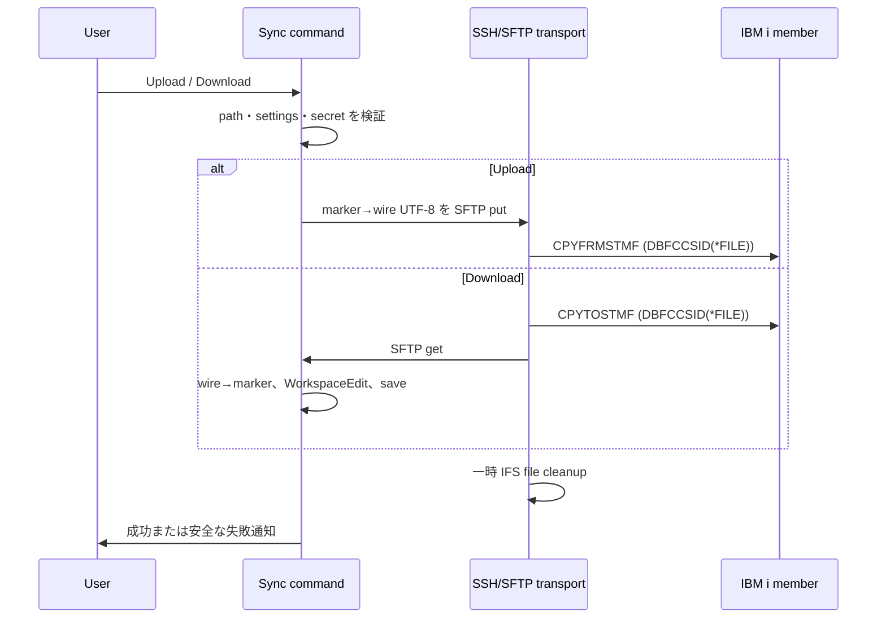

# レビューガイド: IBM i ソースメンバー同期と可視 SEU 色属性

## 変更概要 / 目的

VS Code の `src/<LIB>/<SRCFILE>/<MEMBER>.<ext>` を IBM i source member に明示的に対応付け、拡張自身の SSH/SFTP 接続で送受信する。SEU の7基底色は `Ŕ` などの可視 marker として編集・表示し、IBM i 側の属性バイトへ可逆に戻す。

## 重要ポイント

- Code for IBM i の接続設定や API は参照しない。非機密接続値は拡張設定、password / passphrase は SecretStorage に分離する。
- SSH host key は SHA-256 hex を大小文字非区別、`SHA256:` Base64 を完全一致で検証する。Base64 の大小文字を同一視しない。
- IFS は UUID 付き一時 stream file に限る。SFTP の close 後に `CPYFRMSTMF` を実行し、成功・失敗を問わず cleanup する。
- 可視 marker は保存本文の1文字で、marker 自身から次の marker の直前まで decoration を適用する。SOSI decoration とは別系統で共存する。

## 処理フロー

## 主要な変更箇所

- `vscode-extension/src/sync/memberTarget.ts:18` — workspace 相対パスを IBM i object name に限定して member target を解決。
- `vscode-extension/src/sync/visibleColorMarkers.ts:29` — 7基底色の marker / wire / attribute-byte を単一表で定義。
- `vscode-extension/src/sync/ibmiSourceTransport.ts:47` — SSH接続、厳格な host-key 検証、SFTP、一時 IFS file cleanup、`CPYTOSTMF` / `CPYFRMSTMF` を実装。
- `vscode-extension/src/sync/ibmiSourceTransport.ts:253` — hex と Base64 の fingerprint 比較を分離。
- `vscode-extension/src/extension/commands/memberSync.ts:46` — 明示 command のみで upload / download を開始し、文書置換・保存・フォーカス復帰を担う。
- `vscode-extension/src/language/seuColorMarkers.ts:13` — marker に対応した7色の decoration と再描画を登録。
- `vscode-extension/test/unit/memberSync.test.ts:189` — Base64 fingerprint の大小文字差を拒否する回帰テスト。

## リスク / 確認したい点

- 同期は上書き操作であり、競合解決・更新日時判定・複数 member の一括転送は対象外。
- 接続先では設定した一時 IFS directory への作成・削除権限が必要。
- 65535 など、source PF の CCSID が UTF-8 変換を拒否する場合は copy failure として扱い、PF 側の CCSID 修正が必要。
