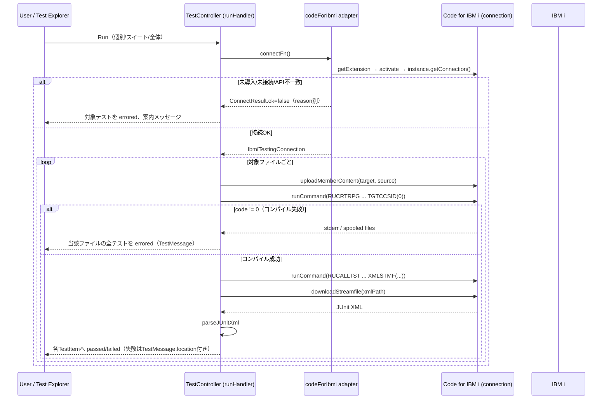

# 仕様: RPGUnitテストのVS Code Test Explorer統合

## 概要

VS CodeのTesting API（`TestController`）を使い、ワークスペース内のRPGUnitテストソースを
検出してTest Explorerパネルにテストツリーとして表示する。実行時はCode for IBM i拡張の
公開APIをソフト検出で利用し、テストソースのアップロード・コンパイル（`RUCRTRPG`）・
実行（`RUCALLTST`）・結果（JUnit形式XML）のダウンロードと解析を行い、成功/失敗を
Test Explorerへ反映する。コードカバレッジは`CODECOV`の実機可用性を検出したうえで
条件付きに提供する。AIエージェント向けの既存経路（`tools/run-rpgunit.mjs`/`rpgunit-test`
skill）は変更しない。

## 設計方針

- **接続はCode for IBM iへソフト検出で乗る**（decisions.md D1）。`extensionDependencies`
  には追加しない。
- **既存ロジックの移植、接続の付け替え**: `tools/run-rpgunit.mjs`のXML解析
  （`summarize`）とコマンド構築パターン（`RUCRTRPG … TGTCCSID(0)` / `RUCALLTST …
  XMLSTMF(...)`）をTypeScriptへ移植し、実行トランスポートだけをCode for IBM iの
  `connection.runCommand`/`content.uploadMemberContent`等に差し替える。
- **テストソースはローカルワークスペース優先**（requirements.mdで確定）。既存の
  `resolveMemberTarget`（`vscode-extension/src/sync/memberTarget.ts`）と同じ
  `src/<LIB>/<SRCFILE>/<MEMBER>.<ext>`規約でIBM i側の修飾名を解決する。
- **純粋ロジックとVS Code/接続I/Oを分離する**（`20260910-ibmi-source-member-sync`の
  設計方針を踏襲。`design.md:14`「変換とI/Oを分離する」と同じ考え方）。テスト検出・
  XML解析・コマンド文字列構築は純粋関数、Code for IBM i呼び出しはadapter、
  TestController配線はcommand層に限定する。
- **依存性注入でテスト可能にする**: `20260910-ibmi-source-member-sync`の
  decisions.md（「`MemberContentApi`を注入可能な依存として受け、production登録時だけ
  adapterを渡す」）と同じパターンを採る。
- **段階的劣化**: Code for IBM i未導入時・CODECOV未導入時は、それぞれの機能を静かに
  無効化し、他機能は提供し続ける（decisions.md D3）。

## 対象範囲

- 新規: `vscode-extension/src/testing/`
  - `discovery.ts` — ワークスペース内のRPGUnitテストソース検出（純粋ロジック）
  - `codeForIbmi.ts` — Code for IBM i拡張のソフト検出・API取得adapter
  - `rpgunitCommands.ts` — `RUCRTRPG`/`RUCALLTST`コマンド文字列構築（純粋ロジック。
    `tools/run-rpgunit.mjs`から移植）
  - `resultParser.ts` — JUnit形式XML解析（純粋ロジック。`tools/run-rpgunit.mjs`の
    `summarize`を移植）
  - `coverage.ts` — `CODECOV`検出・実行・カバレッジ結果の取得
  - `testController.ts` — `vscode.TestController`の生成・`TestItem`ツリー構築・
    `TestRunProfile`（Run/Coverage）登録
- 変更: `vscode-extension/src/extension/extension.ts`（activation登録を追加）
- 変更: `vscode-extension/package.json`（開発依存に`@halcyontech/vscode-ibmi-types`を
  追加。`engines.vscode`は変更不要）
- 変更なし（参照のみ）: `vscode-extension/src/sync/memberTarget.ts`、
  `tools/run-rpgunit.mjs`、`.claude/skills/rpgunit-test`

## 依拠する既存の事実

- `vscode-extension/src/extension/extension.ts:8-24` — activationの単一の入口。既存の
  `registerMemberSyncCommands(context)`等と並べて`registerRpgUnitTesting(context)`を
  追加する（research.md A1で確認済み）。
- `vscode-extension/src/sync/memberTarget.ts:1-19` の`resolveMemberTarget` —
  ワークスペース相対パスからIBM iライブラリー/ソース物理ファイル/メンバー名を
  解決する純粋ロジック（research.md F17で確認済み）。テスト検出でも再利用する。
- `tools/run-rpgunit.mjs:158-188`の`summarize` — JUnit形式XML（iRPGUnit v4/v6両対応）
  解析の純粋関数（research.md F14で確認済み）。
- `tools/run-rpgunit.mjs:467-520` — `RUCRTRPG`/`RUCALLTST`コマンド構築とその罠
  （`TGTCCSID(0)`、`SRCMBR`=プログラム名一致必須。research.md F15, F16で確認済み）。
- `codefori/vscode-ibmi`の`src/api/IBMiContent.ts`（GitHub mainブランチ、2026-09-22
  取得分で直接確認）:
  - `uploadMemberContent(library, sourceFile, member, content): Promise<boolean>`
    （`IBMiContent.ts:302`）— ソースメンバーへの直接アップロード。CCSID変換は
    内部で処理される。
  - `downloadMemberContent(library, sourceFile, member, localPath?): Promise<string>`
    （`IBMiContent.ts:198`）— ソースメンバーの直接ダウンロード。
  - `downloadStreamfile(remotePath, localPath?)` / `writeStreamfile(originalPath,
    content)`（`IBMiContent.ts:140,184`）— IFS上のXML結果ファイルの読み書きに使う。
  - `checkObject(object: {library, name, type, member?}, authorities?)`
    （`IBMiContent.ts:1026`）— `CODECOV`コマンドの存在検出に使う。
  - `getMemberList(filter): Promise<IBMiMember[]>`（`IBMiContent.ts:786`）—
    参考。今回は使わない（ローカルワークスペース優先のため）。
- `codefori/vscode-ibmi`の`src/api/IBMi.ts:119`（GitHub、同時点で確認） —
  `content = new IBMiContent(this)`。`instance.getConnection().content`で
  `IBMiContent`のメソッド群へアクセスする。
- `codefori/vscode-ibmi`の`src/api/types.ts:23-45`（GitHub、同時点で確認） —
  `RemoteCommand`（`command`, `noLibList?`, `getSpooledFiles?`等）、`CommandResult`
  （`code`, `stdout`, `stderr`, `signal?`）の型。`getSpooledFiles: true`を渡すと
  コンパイル・リストのスプールを併せて取得できる（コンパイルエラー表示・FR4に使う）。
- `vscode-extension/node_modules/@types/vscode/index.d.ts:18191,18197,18319,18394,
  18635,18894,18914` — `createTestController`、`TestRunProfileKind`、`FileCoverage`、
  `TestCoverageCount`、`loadDetailedCoverage`が現行の`@types/vscode@^1.90.0`に
  存在することを直接確認済み（research.md F1）。
- `vscode-extension/package.json:74-160`（commands）、`:161-200`（menus）、
  `:229-`（configuration） — 既存の寄与パターン（`rpgClSupport.*`命名、
  `category: "RPG/CL Support"`）。
- `.claude/skills/rpgunit-test/SKILL.md:147-192` — RPGUnitテストの形
  （`NOMAIN`サービスプログラム、`test`始まりの`EXPORT`手続きがテストケース、
  `setUp`/`tearDown`/`setUpSuite`/`tearDownSuite`の特殊扱い）。テスト検出の
  判定ロジックの根拠。
- `tools/run-rpgunit.mjs:217-259`の`parseOracleMarkers` — 固定長P仕様（6桁目`P`、
  名前7-21桁、24桁目`B`でEXPORT判定）と自由形式（`dcl-proc … export;`）の両方から
  `test`始まりの手続き名を検出する既存の解析パターン。テスト検出ロジックの土台として
  参考にする（オラクル印の検査ではなく、手続き列挙の部分だけを流用）。継続名前行
  （15桁を超える名前が`...`で次行へ続く形）の扱いも含めて参考にする。

## インターフェース / データ構造

### テスト検出（`discovery.ts`、純粋ロジック）

```ts
export interface DiscoveredTestProcedure {
  readonly name: string;          // 大文字。手続き名（例 TESTTAX）
  readonly line: number;          // 0-based。ソース中の定義行
}

export interface DiscoveredTestFile {
  readonly uri: vscode.Uri;
  readonly target: MemberTarget;  // memberTarget.ts の MemberTarget を再利用
  readonly procedures: readonly DiscoveredTestProcedure[];
}

/** ソース本文から test 始まりの EXPORT 手続きを列挙する（固定長・自由形式の両対応）。
 *  parseOracleMarkers の手続き列挙部分を流用し、オラクル印の検査は行わない。 */
export function findTestProcedures(source: string): readonly DiscoveredTestProcedure[];

/** ワークスペース内の対象ファイルを走査し、DiscoveredTestFile の一覧を返す。
 *  対象は src/<LIB>/<SRCFILE>/*.rpgle|*.sqlrpgle のうち findTestProcedures が
 *  1件以上を返したファイル。 */
export async function discoverTestFiles(
  workspaceFolders: readonly vscode.WorkspaceFolder[]
): Promise<readonly DiscoveredTestFile[]>;
```

### Code for IBM i adapter（`codeForIbmi.ts`）

```ts
/** テスト実行に必要な最小限のCode for IBM i操作。production実装は
 *  halcyontechltd.code-for-ibmi のexportsに委譲する。テストでは差し替え可能。 */
export interface IbmiTestingConnection {
  uploadMemberContent(target: MemberTarget, content: string): Promise<boolean>;
  runCommand(command: string, opts?: { getSpooledFiles?: boolean }): Promise<CommandResultLike>;
  downloadStreamfile(remotePath: string): Promise<string>;
  writeStreamfile(remotePath: string, content: string): Promise<void>;
  checkObjectExists(object: { library: string; name: string; type: string }): Promise<boolean>;
  runSQL(statements: string): Promise<readonly Record<string, unknown>[]>;
  readonly tempDirectory: string;   // getTempDirectory() 相当
}

export interface CommandResultLike {
  readonly code: number;
  readonly stdout: string;
  readonly stderr: string;
}

export type ConnectResult =
  | { readonly ok: true; readonly connection: IbmiTestingConnection }
  | { readonly ok: false; readonly reason: "notInstalled" | "notConnected" | "incompatibleApi" };

/** vscode.extensions.getExtension('halcyontechltd.code-for-ibmi') を検出し、
 *  必要なら activate() したうえで instance.getConnection() を確認する。
 *  未導入・未接続・API形状が想定と異なる場合はそれぞれ異なる reason を返す
 *  （20260910-ibmi-source-member-sync decisions.md D1と同じ方針: 互換性エラーを
 *  接続なしと同じ成功扱いにしない）。 */
export async function connectViaCodeForIbmi(): Promise<ConnectResult>;
```

### コマンド構築・XML解析（`rpgunitCommands.ts` / `resultParser.ts`、純粋ロジック）

`tools/run-rpgunit.mjs`からの移植。シグネチャは概ね維持する。

```ts
export function buildCreateTestCommand(opts: {
  library: string; program: string; sourceFile: string; member: string;
  bindServicePrograms?: readonly string[]; noTgtCcsid?: boolean;
}): string; // RUCRTRPG ... の1行

export function buildRunTestCommand(opts: {
  library: string; program: string; xmlStmf: string;
  order?: "api" | "reverse"; reclaimResources?: "no" | "always" | "once";
}): string; // RUCALLTST ... の1行

export interface TestSuiteResult {
  readonly name: string;
  readonly tests: number; readonly failures: number; readonly errors: number;
  readonly cases: readonly TestCaseResult[];
}
export interface TestCaseResult {
  readonly name: string; readonly classname: string;
  readonly failure?: { readonly kind: "failure" | "error"; readonly message: string; readonly detail: string };
}

/** tools/run-rpgunit.mjs の summarize を移植したもの。CDATA・エンティティの
 *  アンエスケープ、v4/v6両形式対応を含む。 */
export function parseJUnitXml(xml: string): TestSuiteResult;
```

### TestController配線（`testController.ts`）

```ts
export function registerRpgUnitTesting(
  context: vscode.ExtensionContext,
  connectFn: () => Promise<ConnectResult> = connectViaCodeForIbmi // DIポイント
): void;
```

- `controller = vscode.tests.createTestController('rpgClSupport.rpgunit', 'RPGUnit')`
- `controller.resolveHandler` で `discoverTestFiles` を呼び、`TestItem`ツリー
  （ファイル→手続き）を構築する。
- `controller.createRunProfile('Run', TestRunProfileKind.Run, runHandler)` を登録。
- `checkObjectExists`で`CODECOV`（decisions.md D3）の存在を確認できた場合のみ
  `createRunProfile('Coverage', TestRunProfileKind.Coverage, coverageHandler)`を登録。
- `runHandler`: `connectFn()` → 失敗時は全対象テストを`run.errored`にして
  接続エラーメッセージを表示 → 成功時は対象ファイルごとに
  upload → `RUCRTRPG`実行（失敗ならコンパイルエラーとして報告。FR4） →
  `RUCALLTST`実行 → XML結果ダウンロード → `parseJUnitXml` → 各`TestItem`へ
  `run.passed`/`run.failed`（`TestMessage.location`で失敗行へジャンプ。FR3, AC4）。

## 振る舞いの詳細



### テスト検出（コンパイル前）

1. アクティベーション時、または`controller.refreshHandler`呼び出し時に
   `discoverTestFiles`を実行する。
2. 対象拡張子は`.rpgle`/`.sqlrpgle`（固定長RPGUnit規約に合わせる。`fileScope.ts`の
   `TARGET_EXTENSIONS`のうちRPG系のみに絞る。RPG III(`.rpg`)はサブプロシージャーが
   無くRPGUnit対象外——`.claude/skills/rpgunit-test/SKILL.md:145`）。
3. `findTestProcedures`が1件以上の`test`始まり手続きを検出したファイルだけを
   テストアイテムとして登録する（検出0件のファイルはテストツリーに出さない）。

### テスト実行

1. `connectFn()`でCode for IBM iの接続を確認する。失敗時は対象テストすべてを
   `run.errored`にし、reasonに応じた案内メッセージ
   （未導入/未接続/API不一致）を表示して終了する。
2. 対象ファイルごとに:
   a. `resolveMemberTarget`でIBM i側の修飾名を解決する。
   b. `connection.uploadMemberContent(target, source)`でメンバーへアップロードする。
   c. `buildCreateTestCommand`で`RUCRTRPG`を構築し`connection.runCommand(...,
      {getSpooledFiles: true})`で実行する。`code !== 0`ならコンパイルエラーとして
      扱い、当該ファイル配下の全テストを`run.errored`にし、`stderr`/スプール内容を
      `TestMessage`として添える（FR4）。
   d. コンパイル成功なら`buildRunTestCommand`で`RUCALLTST`（`XMLSTMF`は
      `content.tempDirectory`配下の一意なパス）を実行する。
   e. `connection.downloadStreamfile(xmlPath)`でXMLを取得し`parseJUnitXml`で解析、
      各テストケースを対応する`TestItem`へ`run.passed`/`run.failed`で反映する。
      失敗時は`TestMessage.location`に失敗行相当（ソース上の手続き定義行。
      XML内の`(PGM->MODULE:NNN)`はモジュール内の相対行であり、ソース行への
      正確な対応付けはできないため、**手続き定義行へジャンプする**にとどめる
      —未確認点として下記「design への申し送り」に転記）。
   f. 一時ファイル（IFS上のXML等）は`writeStreamfile`/削除相当の後始末を行う
      （`RemoveLink`相当。Code for IBM iの`content`にある削除APIをcoding時に確認する）。
3. `RUCRTRPG`実行が実機で長時間かかる場合のフォールバックはdecisions.md D2参照。

### コードカバレッジ実行（Coverage profile。CODECOV検出済み時のみ）

1. Run同様にコンパイル・実行するが、`RUCALLTST`前後で`CODECOV`コマンドを起動する
   （具体的な計装・収集コマンド列はcoding時に一次資料（IBM Documentation原典）と
   実機で確定する。research.mdのF9-F12は二次情報のため、coding着手前に原典を
   直接照合すること）。
2. 取得した`.cczip`相当の結果を`vscode.FileCoverage`/`TestCoverageCount`へ変換する。
   変換ロジックの具体化はcoding時にIBM i Testing拡張（Apache-2.0）の実装パターンを
   参考にする（decisions.md、research.md 申し送り）。

## ドメイン固有の考慮

- **RPG固定長のみサポート**（本PJのAGENTS.md方針）。自由形式RPGのテストソースを
  除外する必要はない（RPGUnit自体は自由形式も書けるが、本PJの編集支援対象はRPG固定長の
  ため、自由形式のテストソースはテキストエディタとしては開けても編集支援機能の対象外。
  Test Explorerでの検出・実行は固定長・自由形式を区別しない——検出は手続き名の
  パターンマッチのみで、編集支援の対象範囲とは独立している）。
- **`SRCMBR`はプログラム名と一致させる**（`tools/run-rpgunit.mjs`の罠。設計方針節で
  言及済み。`buildCreateTestCommand`の実装で強制する）。
- **XMLのCCSIDはLatin-1**（`docs/workflow/rpgunit-install.md:213-231`）。日本語の
  `fail()`メッセージは失われる。Test Explorer上のメッセージ表示はこの制約を
  そのまま反映する（テスト名・メッセージはASCII推奨である旨をユーザー向けドキュメントに
  書き添える。design対象外だがREADME/skill更新はcoding時のタスクに含める）。
- **既存の`rpg-fixed`言語登録・プロンプター・ルーラー・SOSI表示に副作用を与えない**
  （AC6）。新規モジュールは`src/testing/`に閉じ、既存の`language/`・`prompter/`配下は
  変更しない。

## エラー処理 / 異常系

| 状況 | 扱い |
|---|---|
| Code for IBM i未導入 | 対象テストを`errored`、"Code for IBM i拡張機能が必要です"を表示 |
| Code for IBM i未接続 | 同上、"IBM iへの接続が必要です"を表示 |
| API形状が想定と異なる（バージョン不一致） | 同上、互換性エラーとして明示
  （接続なしと同じ成功扱いにしない。research.md F6a未確認点への対応） |
| コンパイル失敗（`RUCRTRPG`が`code !== 0`） | 当該ファイルの全テストを`errored`、
  `stderr`/コンパイル・リストの内容を`TestMessage`に含める |
| 実行時タイムアウト・接続断 | `errored`、再試行を促すメッセージ |
| XML取得・解析失敗 | `errored`、"結果を取得できませんでした"＋詳細 |
| `CODECOV`未導入 | Coverage profileを登録しない（エラーにしない。decisions.md D3） |

## 受け入れ基準との対応

- AC1: `discoverTestFiles`/`findTestProcedures`（テスト検出）でTestItemツリーを構築し、
  `resolveHandler`経由でTest Explorerに表示する。入力はワークスペース内の
  `src/<LIB>/<SRCFILE>/*.rpgle|*.sqlrpgle`ファイル。
- AC2: `runHandler`が個別/スイート/全体いずれの`TestRunRequest`にも対応する
  （VS Code Testing APIの標準機構。`request.include`の有無で絞り込む）。
  入力はCode for IBM iの接続（`connectFn`経由）。
- AC3: `TestRun`の`run.started`/`run.passed`/`run.failed`/`run.errored`呼び出しで
  VS Code標準のアイコン・色表示に反映される（VS Code側が提供、本PJでの追加実装不要）。
- AC4: コンパイルエラー・アサーション失敗のいずれも`TestMessage`（`message`/
  `expectedOutput`/`actualOutput`/`location`）で表現する。入力は`RUCRTRPG`の
  `stderr`/スプール、および`parseJUnitXml`が返す`failure.message`/`detail`。
- （AC5だったコードカバレッジは、decisions.md D3・D6・D7によりtest工程で対象外へ移した。
  `isCodeCoverageAvailable`による検出のみ実装済み。`Coverage`プロファイルの提供・
  `run.addCoverage`/`loadDetailedCoverage`によるオーバーレイ表示は将来work。）
- AC6: 新規コードを`src/testing/`に閉じ、既存モジュールを変更しないことで確保する。
  test工程で既存のunit test（言語機能・プロンプター等）の回帰が無いことを確認する。

## 相互作用の受け入れ基準（設計での対応）

- AC-I1: Test Explorerパネルの開閉はVS Code標準（アクティビティバー/コマンドパレット）
  がそのまま満たす。本PJでの追加UI実装は無い。
- AC-I2: テスト実行の開始・キャンセルはVS Code標準のRun/Debugボタンと
  `CancellationToken`（`runHandler`の第2引数）がそのまま満たす。
- AC-I3: Test Explorerのキーボード操作（フォーカス移動・Enterで実行等）はVS Code標準の
  Testing UIがそのまま満たす。本PJでの追加キーバインドは無い。
- AC-I4: 失敗テストの詳細を開いた際のジャンプは`TestMessage.location`
  （手続き定義行。振る舞いの詳細節参照）で満たす。
- AC-I5: 新規のキーバインド・コマンドは追加しない（Testing APIの標準コマンドのみ使う）
  ため、既存のF4/タブナビゲーション等と衝突しない。

## design への申し送り

- **未確認のままcoding前に確定が必要**:
  - `RUCRTRPG`のタイムアウト挙動の実機確認（decisions.md D2）。
  - `CODECOV`のコマンド定義・PTF・SR-OSAKAでの実機可用性（decisions.md D3、
    research.md F9-F13。原典の直接照合も必要）。
  - Code for IBM iのIFS一時ファイル削除API（`RemoveLink`相当）の正確なメソッド名。
  - テスト失敗時のソース行ジャンプ精度（XMLの`(PGM->MODULE:NNN)`はモジュール内相対行で
    あり、`OPTION(*SRCSTMT)`付きでコンパイルした場合に元のソース行へ正確に戻せるかは
    要検証。`.claude/skills/rpgunit-test/SKILL.md:169`の記述は「失敗報告のソース位置が
    元のソース行に戻せる」とあるため、精度は高い見込みだが、行番号の1-based/0-based変換等
    はcoding時に実測で確認する）。
- tasks工程では上記の実機確認をコーディング作業の先頭タスクとして計画する
  （確認結果次第で後続タスクの実装方針が変わるため）。
