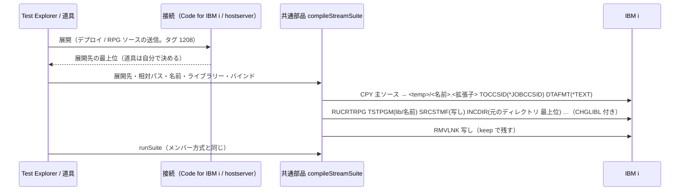

# 仕様: RPGUnit のテストを IFS に展開してコンパイル・実行できるようにする

## 概要

ワークスペースの `*.test.rpgle` / `*.test.sqlrpgle`（IBM i Testing と同じ置き方）を **IFS 方式**のテストとして検出し、
IFS に展開したソースから `RUCRTRPG SRCSTMF` でテスト・サービスプログラムを作って `RUCALLTST` で回す。

- **展開**: VS Code は Code for IBM i のデプロイに乗る（decisions D4・D5）。道具は git の最上位の RPG ソースを
  hostserver で IFS へ送る（D8）。
- **コンパイル**（共通部品）: 主ソースだけを `CPY … TOCCSID(*JOBCCSID) DTAFMT(*TEXT)` で一時ファイルへ写し、
  `INCDIR('<元のテストのディレクトリ>' '<展開先の最上位>')` を付けて `RUCRTRPG SRCSTMF` に渡す（D6）。
  実機（7.3・ジョブ CCSID 5035）では UTF-8（タグ 1208）の主ソースを直接渡すと `CPE3490` で開けないため。
- **名前とライブラリー**: 名前は IBM i Testing と同じ規則（`T` 前置・10 文字）。ライブラリーは VS Code なら Code for IBM i の
  現行ライブラリー、道具は `--lib` / `AS400_LIB`（D7）。
- メンバー方式は何も変えない。

## 設計方針

- **#181 の分け方をそのまま使う**: 判断（名前の決め方・コマンド・変換と `INCDIR` の手順・判定）は `vscode` を import しない
  共通部品に置き、VS Code と道具は接続と展開だけを持つ。
- **展開は接続側の責任、コンパイル以降は共通部品**。展開の手段は両者で違う（Code for IBM i のデプロイ／hostserver）が、
  「展開先の最上位」と「そこからの相対パス」を共通部品に渡した時点から先は同じ経路を通る。
- **メンバー方式の型と経路は変えない**。検出結果は判別共用体にするが、メンバー方式の値の形（`{ uri, target, procedures }`）は
  いまのまま保つ（既存の単体テストの期待値を変えない。AC9）。
- 退けた案は decisions.md（D4〜D11）に理由と一緒に残した。



## 対象範囲

- 新規 `vscode-extension/src/testing/streamTarget.ts`（共通部品）: 接尾辞の判定・名前の規則・相対パスの解決。
- `vscode-extension/src/testing/rpgunitCommands.ts`: `buildCreateStreamTestCommand` を足す。
- `vscode-extension/src/testing/suiteRunner.ts`: `compileStreamSuite` を足す。`runSuite` の入力を「プログラム」（ライブラリーと名前）にする。
- `vscode-extension/src/sync/memberTarget.ts`: オブジェクト名の検査を `isIbmiObjectName` として公開する（規則は変えない。`streamTestProgramName` が
  作った名前の検査に使う——メンバー名と同じ規則で判定するため）。
- `vscode-extension/src/testing/discovery.ts`: IFS 方式の検出を足す。
- `vscode-extension/src/testing/codeForIbmi.ts`: 現行ライブラリー・デプロイ（`deployTools`）を接続に足す。
- `vscode-extension/src/testing/testController.ts`: IFS 方式の項目と実行（フォルダーごとに 1 回デプロイ）。
- `tools/run-rpgunit.mjs`: IFS 方式の判定・RPG ソースの送信・`compileStreamSuite` の呼び出し。
- `vscode-extension/test/unit/`: `streamTarget.test.ts`（新規）・`suiteRunner.test.ts`・`rpgunitCommands.test.ts`・`discovery.test.ts`・
  `testController.test.ts`・`codeForIbmi.test.ts`（デプロイの判断）・`testingCore.test.ts`（見張りの対象に `streamTarget.ts` を足す）。
- E2E: `vscode-extension/dev/rpgunit-e2e-fixtures.mjs`・`dev/rpgunit-e2e.mjs`・`dev/rpgunit-e2e-helper/extension.js`・`tools/run-rpgunit-e2e.mjs`。
- 文書: `tools/README.md`・`.claude/skills/rpgunit-test/SKILL.md`・新規 `docs/workflow/rpgunit-test-explorer.md`（VS Code 側の使い方。
  拡張機能には README が無く、Test Explorer の使い方はどこにも書かれていない——`grep -rl "Test Explorer" docs` が 0 件。decisions D10）。

## 依拠する既存の事実

- 7.3（SR-OSAKA）で `RUCRTRPG` は `SRCSTMF`・`INCDIR`（複数）を受け付け、メンバー形式の `/COPY RPGUNIT/QINCLUDE,TESTCASE` も
  ストリームのソースから解決される — research F1・F22。
- 主ソースがタグ 1208 だと `CPE3490` / `RNS9339`。`CPY TOCCSID(*JOBCCSID) DTAFMT(*TEXT)` の写し（タグ 5035）なら日本語の注記・リテラルとも通る
  — research F2・F21。
- コピー句はタグ 1208 のまま読め、日本語リテラルも正しく比較される。相対パスは主ソースのディレクトリと `INCDIR` から探される
  — research F5・F6・F22。
- SQLRPGLE も拡張子 `.sqlrpgle` の写しを `SRCSTMF` に渡せば作れる — research F23。
- Code for IBM i の公開 API（3.0.13）: `exports.deployTools.getRemoteDeployDirectory(folder)`（未設定は `undefined`）、
  `launchDeploy(index, method?)`（方法を渡せば UI 無し。失敗は `undefined`）、デプロイは展開先のタグを 1208 にする
  — research F13・F14（`deployTools.ts` 77-153 行・`deployment.ts` 296-330 行）。
- Code for IBM i の接続設定 `getConfig()` は `currentLibrary?: string`・`defaultDeploymentMethod: DeploymentMethod | ''` を持ち、
  接続は `remoteFeatures.md5sum` を持つ — `codefori/vscode-ibmi` 3.0.13 `src/api/configuration/config/types.ts` 8-36・103-107 行、`src/api/IBMi.ts` 136・248 行。
- IBM i Testing の名前の規則 — research F9（`api/apiUtils.ts` 46-97 行）。
- いまの検出は `src/**/*.{rpgle,sqlrpgle}` と `resolveMemberTarget`（`discovery.ts:71-110`）。`resolveMemberTarget` は `.` を含む名前を
  弾く（`memberTarget.ts:21` `IBM_I_OBJECT_NAME`）ので、`*.test.rpgle` がメンバー方式になることはない — research F16・申し送り。
- 共通部品の手順・接続の型は `suiteRunner.ts:11-100`、`codeForIbmi.ts:26-117`（`wrapConnection`）。Test Explorer の項目と実行は
  `testController.ts:73-104`（`runFile`）・`125-172`（`runHandler`）・`182-200`（`refresh`）。
- 道具の接続は `tools/run-rpgunit.mjs:382` `openSuiteConnection`（SQL ジョブで `QCMDEXC`・IFS は `IfsConnection`。
  `writeFile` は `dataCcsid` でタグを決められる — research F19）。道具の self-test は本体に `RUCRTRPG\s+TSTPGM` などが書かれると落ちる（A9）。
- E2E のヘルパー拡張は Code for IBM i に接続するだけ（`dev/rpgunit-e2e-helper/extension.js`）。`deployTools.setDeployLocation({ path }, folder)` は
  `node.path` があれば入力欄を出さない（`deployTools.ts` 346-370 行）。

## インターフェース / データ構造

### 共通部品 `streamTarget.ts`（新規・`vscode` を import しない）

```ts
/** IBM i Testing と同じ接尾辞（大文字小文字を問わない）。 */
export const STREAM_TEST_SUFFIXES: readonly string[];          // [".test.rpgle", ".test.sqlrpgle"]
export function isStreamTestFile(fileName: string): boolean;

/**
 * IBM i Testing（Source Orbit 由来）の規則でテスト・プログラム名を作る。`calc.test.rpgle` → `TCALC`。
 * 作った名前が IBM i のオブジェクト名として不正なら undefined。
 */
export function streamTestProgramName(fileName: string): string | undefined;

export interface StreamTestTarget {
  /** 展開先の最上位（VS Code はワークスペース・フォルダー、道具は送信の最上位）からの相対パス。区切りは `/`。先頭にフォルダー名を含めない。 */
  readonly relativePath: string;
  /** "rpgle" | "sqlrpgle"（小文字）。写しの拡張子に使う（SQL かどうかを RUCRTRPG に伝える）。 */
  readonly extension: string;
  /** 規則で作ったプログラム名。作れなければ undefined（実行時に errored。D7）。 */
  readonly program: string | undefined;
}

/** 相対パスが IFS 方式のテストなら target、でなければ undefined。 */
export function resolveStreamTestTarget(relativePath: string): StreamTestTarget | undefined;
```

### `rpgunitCommands.ts`

```ts
export interface CreateStreamTestCommandOptions {
  readonly library: string;
  readonly program: string;
  readonly sourceStreamFile: string;
  readonly includeDirectories: readonly string[];
  readonly bindServicePrograms?: readonly string[];
  readonly bindingDirectories?: readonly string[];
  readonly noTgtCcsid?: boolean;
}
// → RPGUNIT/RUCRTRPG TSTPGM(L/P) SRCSTMF('<path>') INCDIR('<a>' '<b>') BNDSRVPGM(...) BNDDIR(...) TGTCCSID(0)
export function buildCreateStreamTestCommand(opts: CreateStreamTestCommandOptions): string;
/** CL の文字列リテラル。`'` は 2 つ重ねる。 */
export function quoteClString(value: string): string;
```

### `suiteRunner.ts`

```ts
export interface TestProgram { readonly library: string; readonly program: string }

/** IFS 方式。展開は済んでいる前提（deployRoot に relativePath がある）。 */
export async function compileStreamSuite(conn: SuiteConnection, input: {
  program: TestProgram;
  target: StreamTestTarget;         // relativePath と extension を使う
  deployRoot: string;
  binding: BindingSpec;
  noTgtCcsid?: boolean;
  keepCopy?: boolean;               // 変換した写しを残す（道具の --keep）
}): Promise<StreamCompileOutcome>;
/** 失敗の段階を持つ。変換（CPY）の失敗なら呼び出し側が「展開されているか」の案内を足せる。 */
export type StreamCompileOutcome = { readonly ok: true } | { readonly ok: false; readonly stage: "convert" | "compile"; readonly detail: string };

// 変更: 入力を MemberTarget から TestProgram へ（使うのはライブラリーと名前だけ）
export async function runSuite(conn, input: { program: TestProgram; order?; reclaimResources?; keepXml? }): Promise<RunOutcome>;
```

`compileSuite`（メンバー方式）は変えない。

### Code for IBM i の接続（`codeForIbmi.ts`）

```ts
// RawIbmiConnection に足す（構造的な最小 interface）
getConfig(): { libraryList: readonly string[]; currentLibrary?: string; defaultDeploymentMethod?: string };
// defaultDeploymentMethod は 3.0.13 では必ずある（'' を含む）が、構造的な最小 interface なので無い版にも耐える形にする
readonly remoteFeatures?: { readonly [name: string]: string | undefined };

// 拡張の exports から取る
interface RawDeployTools {
  getRemoteDeployDirectory(folder: vscode.WorkspaceFolder): string | undefined;
  launchDeploy(index?: number, method?: string): Promise<{ remoteDirectory: string } | undefined>;
}

export type DeployOutcome =
  | { ok: true; remoteDirectory: string }
  | { ok: false; reason: "notConfigured" | "failed" | "unavailable" };

// IbmiTestingConnection に足す
readonly currentLibrary: string | undefined;
deploy(folder: vscode.WorkspaceFolder): Promise<DeployOutcome>;
```

### 検出（`discovery.ts`）

```ts
export interface DiscoveredMemberTestFile { readonly uri; readonly target: MemberTarget; readonly procedures }   // いまと同じ形
export interface DiscoveredStreamTestFile { readonly uri; readonly stream: StreamTestTarget; readonly procedures }
export type DiscoveredTestFile = DiscoveredMemberTestFile | DiscoveredStreamTestFile;   // 判別は "stream" in file
```

### 道具（`tools/run-rpgunit.mjs`）

- 引数は変えない。ソースのファイル名が `isStreamTestFile` なら IFS 方式（`--srcfile` は使わない）。
- `--pgm` 省略時の名前は IFS 方式なら `streamTestProgramName`（メンバー方式はいまのまま）。

## 振る舞いの詳細

### 検出

- メンバー方式はいまのまま（`src/**/*.{rpgle,sqlrpgle}` と `resolveMemberTarget`）。
- IFS 方式: 拡張子の大文字小文字を問わない glob `**/*.[tT][eE][sS][tT].{[rR][pP][gG][lL][eE],[sS][qQ][lL][rR][pP][gG][lL][eE]}`
  （VS Code の `GlobPattern` は `[...]` の文字の範囲を解する——VS Code API の `GlobPattern` の説明。実物で動くかは実機 E2E で確かめる）を
  `**/node_modules/**` を除いて探し、**最終の判定は `isStreamTestFile`**（共通部品。道具と同じ関数）で行う。glob は候補を集めるだけ。
  `resolveStreamTestTarget(ワークスペース・フォルダーからの相対パス)` で target を作る（`vscode.workspace.asRelativePath(uri, false)`。
  第 2 引数 false でフォルダー名を付けない——いまのメンバー方式も同じ呼び方。`discovery.ts:104`）。test 手続きが 1 つも無ければ出さない（メンバー方式と同じ）。
- 2 つの走査で同じ URI が出たら 1 つにする。**`*.test.rpgle` は置き場所を問わず IFS 方式を先に判定する**（`src/L/F/calc-add.test.rpgle` は
  メンバー方式の規則では「メンバー CALC・テキスト add.test」に当たるため。decisions D14）。
- Test Explorer の項目のラベル: メンバー方式はメンバー名（いまのまま）、IFS 方式はファイル名（`calc.test.rpgle`）。`description` にプログラム名、
  作れないときは「プログラム名を作れません」。

### 実行（VS Code）

1. 接続（いまのまま）。
2. 要求されたファイルのうち IFS 方式のものを**ワークスペース・フォルダーごと**にまとめ、フォルダーごとに 1 回 `connection.deploy(folder)`:
   - `exports.deployTools` が無い（API 不一致） → `unavailable`。
   - `getRemoteDeployDirectory(folder)` が `undefined` → `notConfigured`。**`launchDeploy` は呼ばない**——未設定のまま呼ぶと
     `showErrorMessage('… is not configured for deployment.', 'Set deploy location')` を出す（`codefori/vscode-ibmi` 3.0.13 `deployTools.ts` 146-150 行）。
   - 方法: `getConfig().defaultDeploymentMethod` が空でなければ `undefined`（Code for IBM i に任せる）。空か無ければ
     `remoteFeatures.md5sum` があれば `"compare"`、無ければ `"all"`（D5）。
   - `launchDeploy(folder.index, method)` が `undefined` を返す、または例外を投げる → `failed`。
   失敗したフォルダーの IFS 方式のテストは errored（メッセージは「エラー処理」）。
3. IFS 方式のファイルごとに:
   - `program` が undefined → errored（名前を作れない）。`connection.currentLibrary` が undefined → errored。
   - `testing.json` を読む（いまと同じ `readTestingConfigs`・`resolveBinding`。`testController.ts:84-90`）。
   - `compileStreamSuite(conn, { program: { library: currentLibrary, program }, target, deployRoot, binding })`。`deployRoot` は手順 2 の
     `DeployOutcome.remoteDirectory`（`launchDeploy` の戻り値。`deployTools.ts` 141-145 行）。`noTgtCcsid` は渡さない
     ——メンバー方式も渡していない（`testController.ts:96`）ので、`TGTCCSID(0)` が付く（`rpgunitCommands.ts:42`）。`TGTCCSID(0)` は `RUCRTRPG` が
     `CRTRPGMOD` に `TGTCCSID` を付けない指定で、7.3 の `CRTRPGMOD` にそのキーワードが無いため要る（コミット `59145d2` の
     `tools/run-rpgunit.mjs` 474-479 行の注記。導入はコミット `7504f4b`）。
     失敗が `stage: "convert"` なら testController が detail に「デプロイされているか確認してください」を足す。
   - `runSuite(conn, { program })` → 結果の対応づけはいまのまま（手続き名と子項目のラベルで対応づける。`testController.ts:107-121`）。
4. メンバー方式はいまのまま（`compileSuite` → `runSuite({ program: { library: target.library, program: target.member } })`。いまも `runSuite` は
   `target.library`・`target.member` だけを使う——`suiteRunner.ts:80`・`86`）。

**IFS 方式は、開いているエディターの未保存の内容を使わない**（デプロイが送るのはディスク上のファイル——`launchDeploy` の方法はどれも
ファイルの URI を集めて送る。`deployTools.ts` 173-206 行）。メンバー方式はいまどおり開いている内容を送る（`testController.ts:56-63` `readSourceText`）。

### `compileStreamSuite`

使う接続の操作は既存の `SuiteConnection` のものだけ（`runCommand`・`tempDirectory`・`libraryList`。`suiteRunner.ts:17-29`）。足さない。

1. `source = posix.join(deployRoot, target.relativePath)`、`copy = <conn.tempDirectory>/<program.program>.<target.extension>`
   （写しの置き場は結果 XML と同じ一時ディレクトリ。decisions D11）。
2. `CPY OBJ(source) TOOBJ(copy) TOCCSID(*JOBCCSID) DTAFMT(*TEXT) REPLACE(*YES)`（ライブラリー・リスト無し）。失敗 →
   `{ ok: false, stage: "convert", detail: "IFS のソースを変換できません（<source>）。\n" + ジョブログ }`（次の手は呼び出し側が足す）。
3. `RUCRTRPG`（`buildCreateStreamTestCommand`。`includeDirectories = [posix.dirname(source), deployRoot]`、同じなら 1 つ）を
   `testLibraryList(library, conn.libraryList)` 付きで実行。成否は `code`（メンバー方式と同じ。`suiteRunner.ts:67`）。失敗は `stage: "compile"`。
4. `keepCopy` でなければ `RMVLNK copy`（成否に関わらず。`finally`）。**`RMVLNK` の失敗は無視し、コンパイルの結果を保つ**
   （メンバー方式の結果 XML の削除と同じ扱い。`suiteRunner.ts:81`）。

### 道具

1. `isStreamTestFile(basename(source))` なら IFS 方式。`--pgm` 省略時の名前は `streamTestProgramName`。作れなければ
   終了コード 2・「✗ ファイル名 <name> からプログラム名を作れません。--pgm で指定してください」。
2. 送信の最上位 `root` = `findSearchRoot`（`tools/run-rpgunit.mjs:168`。git の最上位、でなければソースのディレクトリ）。
   送るファイル = git なら `git ls-files --cached --others --exclude-standard`（**まだ追跡していない新しいファイルも含める**）のうち、
   でなければ `root` 直下のうち、`/\.(rpgle|sqlrpgle|rpgleinc|rpginc|inc|cpy)$/i` に当たるもの。ソース自身は必ず含める。
3. `deployRoot = <AS400_IFS_DIR>/rpgunit/<basename(root)>`。要るディレクトリを親から順に `MKDIR`（既存なら失敗するだけ。
   **この実行で作れたものを覚えておく**）し、各ファイルを `IfsConnection.writeFile(path, bytes, { create: true, dataCcsid: 1208 })` で送る（D8）。
4. `testing.json` をいまどおり読む（`findTestingConfigs`・`resolveToolBinding`。`--bnd` も同じ）。
5. `resolveStreamTestTarget(relative(root, source))` → `compileStreamSuite`（`keepCopy: --keep`・`noTgtCcsid: --no-tgtccsid`）→ `runSuite`
   （`--check-independence` の 2 回目もいまのまま）。
6. `--keep` でなければ、送ったファイルと**この実行で作ったディレクトリだけ**を消す（`finally`）。前からあったディレクトリは消さない。

図の補足: 道具は「展開先の最上位」を接続から受け取らず自分で決め（手順 3）、`testing.json` はどちらも共通部品の探索で読む（図では省いた）。

## ドメイン固有の考慮

- **文字コード**: 主ソースは必ず変換した写しをコンパイルする（D6）。変換先はジョブの CCSID（`*JOBCCSID`）。英語環境（CCSID 37 等）でも
  ASCII の範囲なら変換は損失しない（**未検証**。実機は日本語環境だけ）。コピー句は変換しない（1208 のまま正しく読める。research F5・
  `probe-stmf-details.mjs` D2。requirements FR6 はこの意味に直した——decisions D6）。
- **固定長の桁**: `DTAFMT(*TEXT)` は行を保つ。日本語は EBCDIC で SO/SI が入るので、写しの桁は元の UTF-8 の桁と一致しない
  （注記とリテラルの中だけなので実害は無い——実機で合格。research F2）。
- **エラー位置**: 失敗の対応づけは手続き名で行う（`testController.ts:107-121`）ので方式に依らない。
- **`testing.json` の `incDir` は読まない**。`INCDIR` は D6 の 2 つで決める（requirements の対象外の申し送りへの答え）。

## エラー処理 / 異常系

| 状況 | 扱い | メッセージ（要旨） | 確かめ方 |
|---|---|---|---|
| デプロイ先が未設定 | そのフォルダーの IFS 方式のテストを errored | 「Code for IBM i のデプロイ先が設定されていません。エクスプローラーでワークスペースのフォルダーを右クリックし『Deploy Location を設定』してから実行してください。IFS 方式（*.test.rpgle）のテストはデプロイした IFS のソースからコンパイルします。」 | 単体・実機 E2E |
| デプロイ失敗（`undefined` / 例外） | 同上 | 「Code for IBM i のデプロイに失敗しました。出力パネルの Code for IBM i のデプロイのログを確認してください。」 | 単体 |
| `deployTools` が無い | 同上 | 「Code for IBM i のデプロイ API が見つかりません（バージョン不一致の可能性）。」 | 単体 |
| 現行ライブラリーが無い | そのファイルを errored | 「Code for IBM i の接続設定に現行ライブラリーがありません。テスト・プログラムを作るライブラリーとして現行ライブラリーを設定してください。」 | 単体 |
| 名前を作れない（VS Code） | そのファイルを errored | 「ファイル名 <name> から IBM i のプログラム名を作れません（10 文字以内・英数字と _ $ # @）。ファイル名を変えてください。」 | 単体 |
| 名前を作れない（道具） | 終了コード 2 | 「✗ ファイル名 <name> からプログラム名を作れません。--pgm で指定してください」 | 道具の self-test（引数の解決） |
| 変換失敗（`CPY`） | VS Code: そのファイルを errored／道具: 終了コード 2 | 共通部品「IFS のソースを変換できません（<path>）。」＋ジョブログ ＋ VS Code は「デプロイされているか確認してください。」 | 単体 |
| コンパイル失敗 | VS Code: そのファイルを errored（いまと同じ）／道具: 終了コード 2・「✗ ビルド失敗」＋ジョブログ（メンバー方式と同じ） | 「コンパイルに失敗しました。」＋ジョブログ | 単体・実機 E2E（コピー句が無い対照） |
| 写しの `RMVLNK` 失敗 | 無視（結果を保つ） | — | 単体 |
| 道具: IFS へ送れない | 終了コード 2 | 「✗ IFS へソースを送れません: <path>」 | 単体テストの対象外（道具の接続部分には単体テストの仕組みが無く、実機で書き込みを失敗させる操作もしない）。review でコードを読む——decisions D12 |

## 受け入れ基準との対応

- AC1: 検出（`discovery.ts`）の単体テスト——`src/` の外・メンバー方式と同時・`*.test.sqlrpgle`・大文字の接尾辞（`isStreamTestFile` の判定）。入力は
  `findFiles` の結果（スタブ。glob は解釈しない）とワークスペース相対パス。実機 E2E（VS Code）で IFS 方式とメンバー方式の項目が同時に出ること、
  **glob の `[tT]…` が実物で大文字の接尾辞を拾うこと**（AC11 のバインドのテストを `test/IFSBIND.TEST.RPGLE` の大文字で置く）。
- AC2: VS Code の実機 E2E。入力は E2E 部品 `basicSource`（IFS 方式の置き場 `test/ifsbasic.test.rpgle`）。デプロイ先は E2E のヘルパー拡張が
  `deployTools.setDeployLocation({ path }, folder)` で設定する（`setDeployLocation` は `DeployTools` 名前空間の関数で、`exports.deployTools` は
  その名前空間そのもの——`typings.ts` 24 行 `deployTools: typeof DeployTools`・`deployTools.ts` 346 行）。
- AC3: 実機 E2E。`test/ifscopy.test.rpgle` が `/COPY qcopy/e2ecopy_h.rpgleinc`（ワークスペースの別ディレクトリ）を読む。
  対照は、どこにも無いコピー句 `qcopy/missing_h.rpgleinc` を読む同じ形のテストで errored（コンパイル失敗）。
- AC4: 実機 E2E。E2E 部品に `japaneseSource` を足す——`basicSource` と**同じ 2 手続き**で、注記に日本語、`TESTPASS` の比較を日本語の文字リテラル
  （`assert('日本語' = '日本語': …)`）にしたもの。件数（2 件中 1 件失敗）と失敗メッセージ（`Expected '2', but was '3'.`）を AC2 と比べる。
  AC3 のコピー句にも日本語の注記と日本語リテラルの定数を入れ、テストがそれを比べる。
- AC5: 道具の実機 E2E で、`--keep` で残した展開先のタグ 1208 のテストソースを、E2E が直接 `RUCRTRPG SRCSTMF` に渡して
  `CPE3490` / `RNS9339` を確かめる（共通部品を通さない対照）。
- AC6: AC2 の E2E ソースは `/COPY RPGUNIT/QINCLUDE,TESTCASE` を含む（E2E 部品の `basicSource`）。
- AC7: `streamTarget.test.ts`——IBM i Testing と同じ入出力（`calc.test.rpgle`→`TCALC`、10 文字超・`_` の接頭辞・大文字の拾い方・不正な名前）。
  ライブラリーは `testController.test.ts` で「IFS 方式のコンパイル・実行のライブラリーが接続の現行ライブラリー」であることを見る
  （道具は `--lib` / `AS400_LIB` でいまのまま）。規則は `tools/README.md` と `docs/workflow/rpgunit-test-explorer.md` に書く。
- AC8: 道具の実機 E2E に IFS 方式（正常＝終了コード 1・日本語入り、コピー句で合格＝終了コード 0）。道具の self-test の見張り（A9）はそのまま通す。
- AC9: `npm test`（既存の期待値は変えない。`runSuite` の入力の形だけ変わる——呼び出しの書き換えは許す）・`dev/rpgunit-e2e.mjs` の既存の 12 項目・
  `tools/run-rpgunit-e2e.mjs` の既存の 23 項目がすべて合格（この work で項目を足すので総数は増える）。
- AC10: 「エラー処理」表の「確かめ方」列のとおり。単体テスト:
  - `codeForIbmi.test.ts`（デプロイの判断）: `deployTools` 無し→`unavailable`、未設定→`notConfigured` で**`launchDeploy` を呼ばない**、
    方法の選び方（既定あり→渡さない／既定なし・`md5sum` あり→`compare`／なし→`all`）、`undefined` と例外→`failed`。
  - `testController.test.ts`: 各 `DeployOutcome` の失敗・現行ライブラリー無し・名前不正で errored とメッセージ。変換失敗（`stage: "convert"`）に案内が足されること。
  - `suiteRunner.test.ts`: 変換失敗・コンパイル失敗の `stage` と detail、写しの `RMVLNK` 失敗を無視すること。
  実機 E2E（VS Code）: E2E は**シナリオごとに VS Code を起動し直す**（`dev/rpgunit-e2e.mjs` の `runScenario` が毎回 `_electron.launch`。98-111 行）ので、
  ヘルパー拡張は起動時の環境変数 `E2E_DEPLOY_DIR` があればデプロイ先を設定し、無ければ `instance.getStorage().setDeployment` から
  そのフォルダーの設定を外す（`deployTools.ts` 355-360 行と同じ呼び方）。未設定のシナリオでは変数を渡さない。
  道具の「名前を作れない」は道具の self-test（引数の解決）。道具の「IFS へ送れない」は単体テストの対象外（decisions D12）。「展開先が決まらない」はデプロイ先が未設定のこと。
- AC11: 実機 E2E（VS Code）。IFS 方式のバインドのテスト（E2E 部品 `BIND_TEST_SOURCE`）と、同じディレクトリの `testing.json` の `bndSrvPgm`。
- AC12: `tools/README.md`・skill `rpgunit-test`・`docs/workflow/rpgunit-test-explorer.md` に、置き方・方式の決まり方・名前の規則・展開（デプロイ先／道具の
  `<AS400_IFS_DIR>/rpgunit/…`）と実行後に残るもの（VS Code: デプロイしたツリーは残る・写しは一時ディレクトリから消す／道具: `--keep` 以外は消す）・
  文字コード・`/COPY` の書き方（`INCDIR` は元のディレクトリと展開先の最上位）。
- AC13: CI（`npm test`・`tools self-test`）。
- AC14: `discovery.test.ts`——`src/L/F/x.test.rpgle` が IFS 方式の 1 件だけ、`src/L/F/X.rpgle` がメンバー方式の 1 件だけ。
