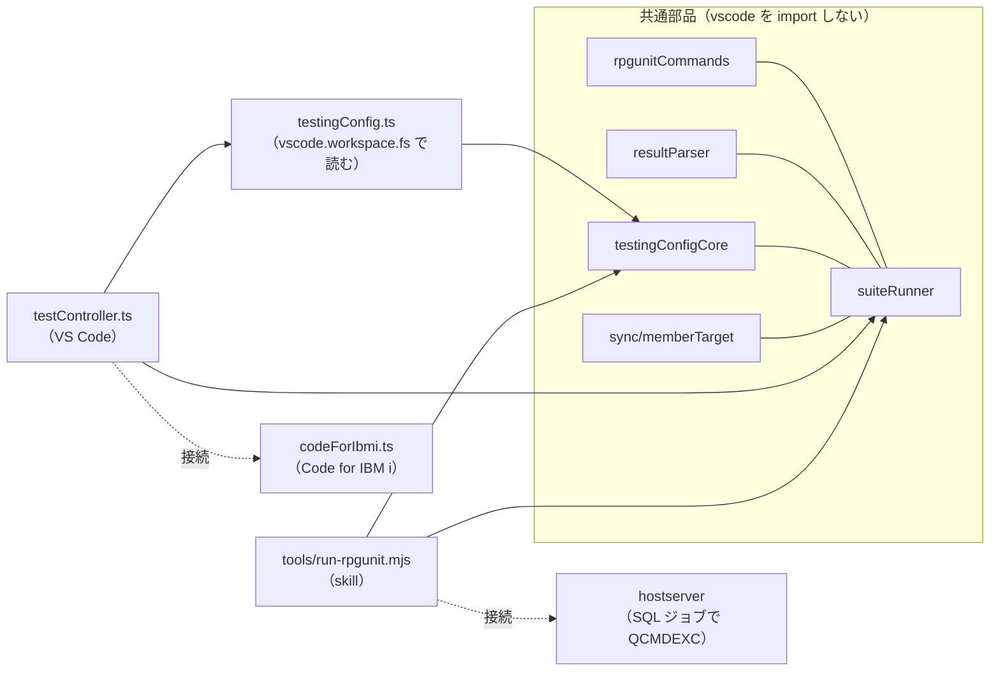

# 仕様: RPGUnit の実行ロジックを VS Code と skill で共通にする

## 概要

`vscode-extension/src/testing/` の `runFile`（`testController.ts`）が持つコンパイル〜実行の手順と、`testing.json` の
探し方・解釈を、`vscode` を import しない共通部品に切り出す。VS Code 側（Code for IBM i 接続）と
`tools/run-rpgunit.mjs`（hostserver 接続）が同じ共通部品を呼び、違いは接続の実装と既定のライブラリー・リストだけにする。



## 設計方針

- **手順を共通部品の関数にする**（FR8）。`compileSuite`（アップロード→`CHGPFM`→`RUCRTRPG`）と `runSuite`
  （結果 XML の事前削除→`RUCALLTST`→取得→事後削除→解析）に分ける。道具の `--check-independence` は
  コンパイル 1 回・実行 2 回なので、分けておく必要がある。
- **接続は interface で受ける**（`SuiteConnection`）。VS Code 側は既存の `IbmiTestingConnection`（Code for IBM i）、
  道具は hostserver で同じ形を実装する。
- **道具の接続は SQL ジョブで `QCMDEXC`**（decisions.md D3）。実機で確認済み（D6）。
- **`testing.json` の探し方は読み取り手段を注入する純粋関数にする**。VS Code は `vscode.workspace.fs`、
  道具は Node の `fs` を渡す。探索・合成・検査の規則は 1 か所。
- **道具は共通部品のビルド済み JS を動的 import で読む**（D2）。無ければ「`npm run compile` を先に」と出して
  終了コード 2。CI の `tools self-test` は先に拡張機能をビルドする。
- **共通部品が `vscode` を import しないことを単体テストで見張る**（AC7。AGENTS.md の WebView と同じ流儀）。

## 対象範囲

- 新規 `vscode-extension/src/testing/suiteRunner.ts` — `SuiteConnection`・`compileSuite`・`runSuite`・`testLibraryList`（`testController.ts` から移す）
- 新規 `vscode-extension/src/testing/testingConfigCore.ts` — `resolveBinding` と型（`testingConfig.ts` から移す）、`findTestingConfigs`
- 変更 `vscode-extension/src/testing/testingConfig.ts` — `vscode.workspace.fs` で読む薄い層だけにする
- 変更 `vscode-extension/src/testing/testController.ts` — `runFile` を共通部品の呼び出しに置き換える
- 変更 `vscode-extension/src/testing/codeForIbmi.ts` — `CommandResultLike` を共通部品側へ移し、`IbmiTestingConnection` を `SuiteConnection` の拡張にする
- 変更 `vscode-extension/src/testing/resultParser.ts` — 道具のレポートが使う `assertions`・`time`・`properties` を足す（追加のみ）
- 変更 `tools/run-rpgunit.mjs` — 共通部品を使う。hostserver 接続を `SuiteConnection` として実装。独自の `summarize`・コマンド組み立て・`objectExists`・`waitJob`・`reportSpools` を消す
- 変更 `.github/workflows/tools-tests.yml` — self-test の前に拡張機能をビルド
- 変更 `tools/README.md`・`.claude/skills/rpgunit-test/SKILL.md` — `testing.json`・`--bnd` の解釈・`--keep` と実行前の XML 削除の関係・ビルドの前提
- 新規 `tools/run-rpgunit-e2e.mjs`、新規 `vscode-extension/dev/rpgunit-e2e-fixtures.mjs`（2 つの E2E で使うテストソースとテスト対象の作成を共有）
- 単体テスト: `suiteRunner.test.ts`（新規）、`testingConfig.test.ts`（変更。`resolveBinding` の検査は import 先を `testingConfigCore` に
  変えてそのまま残し、`findTestingConfigs` の検査を足す）、`testController.test.ts`・`resultParser.test.ts`（変更）、
  `testingCore.test.ts`（新規。`vscode` 非依存の見張り）
- 変更 `vscode-extension/dev/rpgunit-e2e.mjs` — テストソースとテスト対象の作成を `rpgunit-e2e-fixtures.mjs` から読む

## 依拠する既存の事実

- 道具はコンパイル成否を `objectExists`（`QSYS2.OBJECT_STATISTICS` で名前だけ見る）で判定し、`SBMJOB … INLLIBL(RPGUNIT <lib> QGPL QTEMP)`
  でコンパイル・実行し、`--bnd` の修飾の無い名前をテストのライブラリーで補う。結果 XML は実行後の `finally` でだけ消し、
  `--keep` なら残す——`tools/run-rpgunit.mjs` の `objectExists`・`main`（2026-09-26 に直読）。
- `vscode-extension/src/testing/rpgunitCommands.ts`（`buildCreateTestCommand`・`buildRunTestCommand`）と
  `resultParser.ts`（`parseJUnitXml`）は既存（PR #178〜#180）で、どちらも import 文を持たない（`vscode` を使わない）。
  `vscode-extension/src/sync/memberTarget.ts`（`MemberTarget`・`deriveSourceType`）も import 文を持たない。
  AC7 の見張りの対象はこの 3 ファイルと新規の `suiteRunner.ts`・`testingConfigCore.ts`。
- 共通部品には既存の `vscode-extension/src/sync/memberTarget.ts` も含まれる（`MemberTarget` の型と `deriveSourceType`）。
  道具が直接 import する必要は無く（`MemberTarget` は素のオブジェクトで作る）、`compileSuite` が内部で使う（D2 の補足。D9）。
- 道具のレポート（`reportData`）は、解析結果の `cases[].assertions`・`cases[].time`・`properties` を使う（同ファイル `reportData`）。
  共通部品の `parseJUnitXml` はこれらを持たない（`vscode-extension/src/testing/resultParser.ts`）。
- VS Code 側の手順は `runFile`（`vscode-extension/src/testing/testController.ts`）にあり、`testLibraryList` も同ファイル。
- `testing.json` の規則（最寄り＋`.vscode`、キー単位の合成、検査 (a)〜(d)。requirements FR7 の 6 種類との対応は
  (a)＝JSON として読めない・存在するのに読めない、(b)＝オブジェクトでない・文字列の配列でない、(c)＝名前の形、(d)＝件数）は `vscode-extension/src/testing/testingConfig.ts`
  の `resolveBinding`・`readTestingConfigs`（PR #180）。`readTestingConfigs` は `vscode` を import している。
- hostserver: `executeStatement(conn, sql, { parameters })` は負の SQLCODE で `SqlError` を投げる
  （`/workspaces/ts5250/packages/hostserver/dist/db/execute.d.ts`）。SQL ジョブでは `CHGLIBL` が次の文へ持ち越され、
  `RUCRTRPG` の失敗は `SqlError -443`（本文に原因のメッセージ）で返り、ジョブログは `QSYS2.JOBLOG_INFO('*')` で読める
  ——2026-09-26 に実機（SR-OSAKA）で確認（decisions.md D6）。RPGUnit 自身のメッセージはジョブログ上で半角カナに化ける
  （`docs/workflow/rpgunit-install.md`「既知の制約（日本語環境）」と同じ現象）。
  `RUCALLTST` も SQL ジョブで動き XML が書かれる。テストが失敗すると `RUCALLTST` 自体が
  `CPF9897 FAILURE. 2 test cases, 2 assertions, 1 failure, 0 error.` で `SqlError -443` を返す——同日に実機で確認（D8）。
  よって `runSuite` は `RUCALLTST` の結果ではなく XML で合否を決める。
- CI の `tools self-test` は拡張機能をビルドせずに `node tools/run-rpgunit.mjs --self-test` を走らせている
  （`.github/workflows/tools-tests.yml`）。拡張機能のビルドは `vscode-extension/` で `npm ci` → `npm run compile`
  （`vscode-extension/package.json` の `scripts.compile`）。
- 拡張機能は `tsconfig.json` で CommonJS を `out/` へ出す（`"module": "commonjs"`、`"outDir": "./out"`）。Node の ESM から
  その CommonJS を動的 import して名前付きの関数を取り出せる——2026-09-26 に `out/testing/rpgunitCommands.js`・
  `resultParser.js` を `node --input-type=module` で import し、`buildCreateTestCommand`・`parseJUnitXml` が関数として
  得られることを確認した。

## インターフェース / データ構造

```ts
// suiteRunner.ts（vscode を import しない）
export interface CommandResultLike { readonly code: number; readonly stdout: string; readonly stderr: string; }

export interface SuiteConnection {
  uploadMemberContent(target: MemberTarget, content: string): Promise<boolean>;
  runCommand(command: string, opts?: { libraryList?: readonly string[] }): Promise<CommandResultLike>;
  downloadStreamfile(remotePath: string): Promise<string>;
  readonly tempDirectory: string;
  /** 呼び出し側の既定リスト（VS Code: 利用者の設定、道具: QGPL QTEMP）。 */
  readonly libraryList: readonly string[];
}

export function testLibraryList(targetLibrary: string, baseLibraryList: readonly string[]): readonly string[];

export type CompileOutcome = { readonly ok: true } | { readonly ok: false; readonly detail: string };
export function compileSuite(conn: SuiteConnection, input: {
  target: MemberTarget; source: string; binding: BindingSpec; noTgtCcsid?: boolean;
}): Promise<CompileOutcome>;

export type RunOutcome =
  | { readonly ok: true; readonly suite: TestSuiteResult; readonly xml: string }
  | { readonly ok: false; readonly detail: string };
export function runSuite(conn: SuiteConnection, input: {
  target: MemberTarget; order?: RunOrder; reclaimResources?: ReclaimResources; keepXml?: boolean;
}): Promise<RunOutcome>;
```

```ts
// testingConfigCore.ts（vscode を import しない）
export type ReadOutcome =
  | { kind: "missing" } | { kind: "directory" } | { kind: "text"; text: string } | { kind: "error"; message: string };

/** posix パス。file から親へ root まで遡り最初に見つかったものを nearest、`<root>/.vscode/testing.json` を global とする。
 *  root の外は読まない。 */
export function findTestingConfigs(
  filePath: string, rootPath: string, read: (path: string) => Promise<ReadOutcome>, display: (path: string) => string
): Promise<{ nearest?: TestingConfigSource; global?: TestingConfigSource }>;
// resolveBinding・BindingSpec・TestingConfigSource・ResolveBindingResult は testingConfig.ts から移す
```

```ts
// resultParser.ts（追加のみ）
export interface TestCaseResult { …既存…; readonly assertions?: number; readonly time?: string; }
export interface TestSuiteResult { …既存…; readonly properties: readonly { name: string; value: string }[]; }
```

道具側（`tools/run-rpgunit.mjs`）の接続:

```js
// hostserver の DbConnection 1 本（SQL ジョブ）＋ IfsConnection
runCommand(command, { libraryList }) {
  // libraryList があれば QCMDEXC('CHGLIBL LIBL(...) CURLIB(*CRTDFT)') → QCMDEXC(command)
  // 実行前に SELECT MAX(ORDINAL_POSITION) FROM TABLE(QSYS2.JOBLOG_INFO('*')) で位置を取っておく
  // SqlError → { code: 1, stderr: <ジョブログのうちその位置より後> + <SqlError の本文> }
}
uploadMemberContent(target, content) // IFS に書く → CRTSRCPF（既存なら無視）→ CPYFRMSTMF（既存の道具の手順）
                                      // → --keep でなければ IFS の一時ソースを RMVLNK（後始末は道具の接続の責務）
downloadStreamfile(path)              // IfsConnection.readFile → latin1 で復号（codeForIbmi.ts と同じ）
tempDirectory = AS400_IFS_DIR; libraryList = ["QGPL", "QTEMP"]
```

## 振る舞いの詳細

- `compileSuite`: `uploadMemberContent` → `CHGPFM … SRCTYPE(<拡張子由来>)`（ファイルを修飾するのでリストは渡さない）→
  `RUCRTRPG`（`testLibraryList`、`binding` を渡す）。
  `RUCRTRPG` の `code !== 0` で `{ ok: false, detail: stderr || stdout }`。**オブジェクトの有無は見ない**（FR2）。
- `runSuite`: `RMVLNK <tempDirectory>/<member>.xml`（失敗は無視）→ `RUCALLTST`（`compileSuite` と同じ `testLibraryList` を渡す。
  `code` は見ない）→ `downloadStreamfile`
  （失敗で `{ ok: false }`）→ `keepXml` でなければ `RMVLNK` → `parseJUnitXml`。
- VS Code（`runFile`）: `readTestingConfigs`→`resolveBinding`（誤りで errored）→ 開いている文書の内容 → `compileSuite`
  （失敗で errored）→ `runSuite`（失敗で errored）→ 結果を TestItem へ反映。**挙動は現状のまま**（AC9）。
- 道具（`main`）: オラクル印の検査（従来どおり）→ `testing.json`（上端は `git -C <ソースのディレクトリー> rev-parse --show-toplevel`、
  失敗すればソースのディレクトリー）→ `--bnd` があれば `bndSrvPgm` を置き換え（大文字化・形の検査は `resolveBinding` と同じ規則で）→
  `compileSuite`（失敗で終了コード 2、`detail` を表示）→ `runSuite`（`--order`、`--rclrsc`、`--keep`）→ `--check-independence` なら
  逆順でもう一度 `runSuite` → 表示・`--xml`・`--md`・`--json`（従来どおり）。
- 道具の `--bnd` の扱い: まず `testing.json` を通常どおり `resolveBinding` で解決する。`--bnd` があれば、それを
  `{ rpgunit: { rucrtrpg: { bndSrvPgm: [...] } } }` 相当の単独のソースとして `resolveBinding` に通し（同じ形・件数上限 50 の検査と
  大文字化。規則を 2 か所に書かない）、得た `servicePrograms` で**`bndSrvPgm` だけ**を置き換える。`bndDir` は
  `testing.json` の値のまま（FR5・D4）。`--bnd` の誤りは終了コード 2（`--bnd の値が正しくありません: <理由>`）。
- `--keep`: 実行後の作業ファイル（IFS 上のソースと XML）を消さない。実行前の XML の削除は常に行う（AC8）。

## ドメイン固有の考慮

- ビルド失敗時の「次に読む先（スプール）」表示はやめ、ジョブログ（`detail`）を出す。従来の表示は「道具が名前を付けて
  `SBMJOB` したジョブ」のスプールを名前で引いていたが、SQL ジョブで実行するとその名前のジョブが無くなるため。
  スプールは従来どおり消さない。
- ジョブログに出る RPGUnit のメッセージは半角カナに化ける（既知の制約）。`SqlError` の本文には英語の原文が入るので、
  `detail` にはそれも含める。

## エラー処理 / 異常系

| 状況 | VS Code | 道具 |
|---|---|---|
| `testing.json` の誤り | そのファイルを errored | 終了コード 2（パスと理由） |
| `--bnd` の形・件数の誤り | — | 終了コード 2（`resolveBinding` の理由を出す） |
| コンパイル失敗 | errored（ジョブログ） | 終了コード 2（ジョブログ） |
| 結果 XML が取れない | errored | 終了コード 2 |
| 共通部品が未ビルド | — | 終了コード 2（`npm run compile` を案内） |
| テストの失敗 | Failed | 終了コード 1 |

## 受け入れ基準との対応

- AC1: 両方が `compileSuite`/`runSuite` 経由で `buildCreateTestCommand`/`buildRunTestCommand` を使う。単体テストでコマンドを確かめる。
- AC2: `compileSuite` が `code` で判定。実機 E2E（`tools/run-rpgunit-e2e.mjs`）で `*SRVPGM` が残った状態の失敗が終了コード 2。
  修正前の道具（コミット済みの版）で同じ操作をしたときの挙動も、test 工程で実機で確かめて記録する。
- AC3: 道具が `findTestingConfigs`（上端＝git の最上位）→ `resolveBinding`。`testingConfigCore` の単体テストで、上端より上を読まない・
  git でないときはソースのディレクトリーだけ・`<root>/.vscode/testing.json` を global として読む・キーごとに最寄りを優先、を確かめる。
  実機 E2E でバインドが要るテストが合格。
- AC4: 道具の `--bnd` が `bndSrvPgm` を置き換え、修飾しない。単体テスト（道具の self-test）と実機 E2E。
- AC5: `runSuite` が実行前に `RMVLNK`。単体テスト（コマンドの順序）。
- AC6: FR7 の 6 種類（上の (a)〜(d)）と「ほかのキーは誤りにしない」は、共通部品に移した `resolveBinding` の単体テスト
  （PR #180 の `testingConfig.test.ts` の検査を `testingConfigCore` 向けに移す）で確かめる。道具が誤りで終了コード 2 に
  なることは、実機 E2E で `bndSrvPgm` が文字列の `testing.json` を置いて確かめる。
- AC7: `testingCore.test.ts` が共通部品のファイルに `vscode` の import が無いことを見る。道具の self-test が道具自身のソースを
  読み、`RUCRTRPG`／`RUCALLTST` のコマンド文字列・`<testcase` の解析・`testing.json` の探索・`OBJECT_STATISTICS` による
  成否判定が無いこと、`compileSuite`・`runSuite`・`findTestingConfigs`・`resolveBinding` を共通部品から読んでいることを確かめる。
- AC8: 道具の self-test（オラクル印・引数の解決（`--xml`・`--order`・`--rclrsc`・`--no-tgtccsid`・`--keep` を含む）・
  テンプレート・`reportData`・`compareRuns`）と実機 E2E（`--check-independence`（逆順の実行＝`--order reverse` 相当）・
  `--rclrsc always`・`--xml`・`--md`・`--json`・`--keep`、終了コード 0／1／2）。`--no-tgtccsid` は iRPGUnit v6 の 7.3 では
  コンパイルできない組み合わせ（`docs/workflow/rpgunit-install.md`）なので、実機では確かめず self-test でコマンドを確かめる。
- AC9: 単体テスト全件と `dev/rpgunit-e2e.mjs` の 12 項目。
- AC10: `tools/run-rpgunit-e2e.mjs` のシナリオ——正常（`TESTPASS` 合格・`TESTFAIL` 失敗で終了コード 1）・古い `*SRVPGM`（終了コード 2）・
  `testing.json` によるバインド（終了コード 0）・`--bnd`（終了コード 0）。
- AC11: `tools-tests.yml` にビルドを足し、PR の CI で通ることを確かめる。
- AC12: `tools/README.md` と skill `rpgunit-test` を更新する。
- AC13: `testLibraryList` の単体テスト（2 つの既定リスト）と、`compileSuite`・`runSuite` の両方が同じリストを渡すことの単体テスト。
  実機では、道具の正常シナリオ（バインド無し）がコンパイルできることで確かめる——`TESTCASE` の中の**修飾なしの**
  `/include qinclude,TEMPLATES` は `RPGUNIT` がライブラリー・リストに無いと `CPF4102` で落ちる（前 work の実機で観測済み）。
