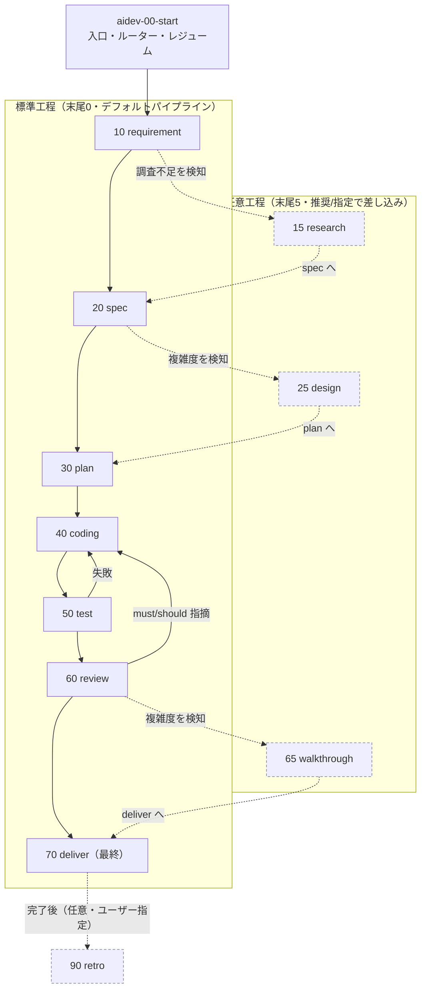
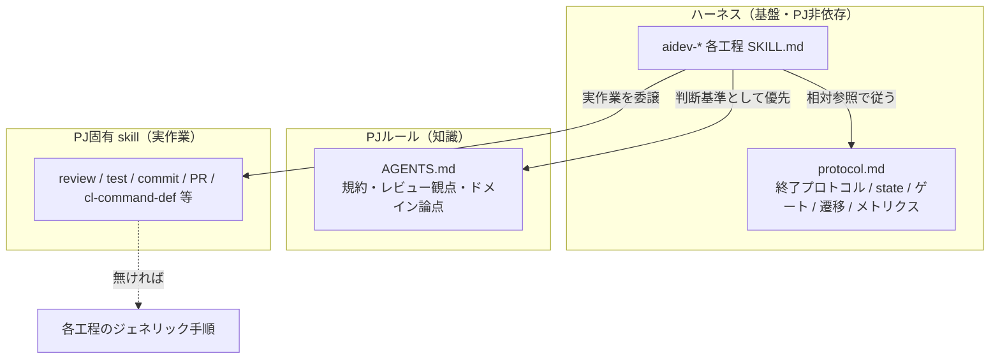
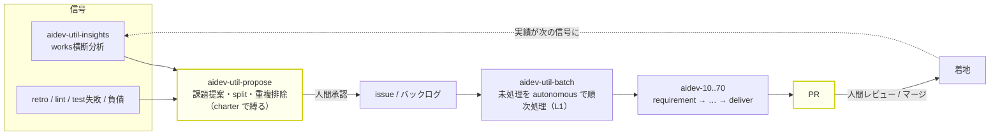

# aidev ハーネス 設計ノート（参照専用・skill実行では読まれない）

> このファイルは `SKILL.md` ではなく、どの skill / protocol からも参照されないため、
> skill 利用時には読み込まれない。**今後の aidev-* 改善のための設計記録**として残す。
> 「いま何があるか」は各 `SKILL.md` と `aidev-00-start/protocol.md` が正。
> ここには「なぜそうしたか・何を退けたか」を残す。

## 0. 全体像（図）

skill 群の関係と実行順を俯瞰するための地図。詳細な規約は `protocol.md` と各 `SKILL.md` が正。

### 0.1 工程パイプラインと差し戻し

標準工程（末尾0）を順に進み、任意工程（末尾5）は AI検知＋推奨かユーザー指定で差し込む。
各工程の末尾に承認ゲートがあり（interactive は人間 / autonomous は自動承認＋`humanGates`）、
test 失敗・review 指摘は coding へ差し戻す。



### 0.2 三層の責務分担

基盤（PJ非依存）／知識（AGENTS.md）／実作業（PJ固有 skill）を分離。各工程は実作業を PJ 資産へ
委譲し、無ければジェネリック手順にフォールバックする。ゲート・state・遷移は常に基盤が担う。



### 0.3 エコシステムと自己給餌ループ

番号なしユーティリティ（propose / batch / insights）が、パイプラインの上流・繰り返し・横断分析を担う。
両端（どの課題を起票するか・どの PR をマージするか）に人間ゲートを残し、間を自律化する。



> 黄色＝人間ゲート（前＝課題承認、後＝PR レビュー）。完全自動（発案→マージ）は高リスクのため採らない。

## 1. 目的と思想

- **PJ非依存の汎用ハーネス**。`.claude/skills/aidev-*` だけで自己完結し、特定PJ（AS400 等）に縛られない。
- 役割分担：
  - **ハーネス（基盤）= 開発フローの制御と進捗管理の器**。工程順・承認ゲート・遷移・state・レジューム。
  - **PJルール（AGENTS.md）= 知識**。レビュー観点・コーディング規約・ドメイン固有論点。
  - **PJ固有 skill = 実作業**。review/test/commit/PR 等の具体実行。
- 別PJへは `.claude/skills/aidev-*` と `.gitignore`（`.aidev/current` 除外）を置くだけで動く想定。

## 2. 主要な設計判断と理由

- **skills 内で自己完結（docs/ に置かない）**：実体が PJ フォルダ（docs/）にあると汎用性が崩れる。
  protocol も各工程手順も skills 内に閉じる。`docs/aidev/` は一度作ったが廃止した。
- **protocol.md を単一の共通定義（ホーム = aidev-00-start）**：終了プロトコル・state 規約などの
  共通ルールを1か所に集約。各工程 SKILL.md は `../aidev-00-start/protocol.md` を相対参照する。
- **工程手順は各 SKILL.md にインライン**：工程固有の内容はその skill 内で完結（外部 phase doc 不要）。
- **状態はファイル（`.aidev/works/<YYYYMMDD-slug>/`）**：state.yml ＋ 成果物の有無で現在地が一意に決まる。
  レジュームは「ファイルを見るだけ」。独自ステートエンジンを持たない。
- **pull 型・自動遷移なし**：push（完了→次を自動起動）はランタイム依存で移植性が低い。
  各工程は前提成果物の有無を自己チェックし、遷移は人間の承認後のみ。
- **2段階ゲート → 単一3択UX → 4択（段階レビュー追加）**：当初「承認/差し戻し」→「進む/中断」の2段階。
  AskUserQuestion による**単一3択**（承認して次へ / 承認して中断 / 差し戻す）に集約（クリック最小）。
  さらに、ユーザーが md を自力通読する代わりに**主エージェントが成果物を1項目ずつ提示して確認する
  「段階レビュー」**を4つ目の選択肢として追加（`protocol.md`「3.1」）。walkthrough 工程とは別物
  （あちらは deliver 前のコードレビュー補助 md 生成、こちらは任意工程のゲート提示モード）。
- **番号規約**：skill は **10刻み**（途中挿入に強い）。**末尾0=標準工程 / 末尾5=任意工程**。
  works フォルダは **日付プレフィックス `YYYYMMDD-slug`**（UTC）。当初は単純連番 `001-slug` だったが、
  ブランチ並行作成での番号衝突（max+1 が複数ブランチで同値）を避けるため日付方式に変更。
  日付は時系列ソート・可読性・衝突回避を両立し、既存走査も不要（`date` のみ）。UUID は可読性/ソートを
  損なうため不採用。
- **命名カテゴリは「役割」で割る（トリガでは割らない）**：当初は番号付き工程とユーティリティが同じ
  `aidev-*` 名前空間で交ざり見通しが悪かった。「人間が呼ぶ / AI が呼ぶ」で割る案も出たが**退けた**——
  標準工程は interactive で人間直叩きも前工程からの遷移も、autonomous で AI 自動も起こり得る（§3「単独実行可能」
  と整合）ので、トリガは状況依存の二次属性であり命名軸に不適。安定して固有なのは**役割／レイヤ**。
  そこで ①番号付きパイプライン（`aidev-N0/N5`）②ユーティリティ（`aidev-util-*` で名前空間分離）
  ③ランタイムガード（`aidev` CLI＝skill ではない）に分け、**トリガは description 冒頭の定型タグ**で示す
  （picker と AI ルーティングが見る場所）。これに伴い retro を `90`→`95` に renumber し「末尾5=任意」不変条件を回復。
  正典は `protocol.md`「4.1」。論理名参照のおかげで renumber/改名の影響は skill 名だけに閉じた。
- **論理名で相互参照**：renumber の影響を skill 名だけに閉じ込めるため、参照は番号でなく論理名。
- **PJ資産の優先（宣言不要・自動）**：知識は AGENTS.md 自動読込で自動採用。実行物は
  「関連PJ skill があれば優先、なければジェネリック手順」。PJ側の事前宣言・設定は不要。
- **重い工程の委譲（指示ベース）**：coding/test/review は任意でサブエージェント委譲可。
  特定ツールに依存させず「委譲する」意図で記述し、各エージェントが自機構で実現（無ければインライン）。
  **承認ゲート・遷移・state はサブに委譲不可＝必ず主エージェント**（サブは対話的承認ができない）。
- **全成果物にテンプレ/スキーマ**：requirement/spec/plan/tasks/decisions/state を定義済み。
  「下敷きにAIが埋める」方式（厳格スキーマ強制まではしていない）。
- **任意工程は AI検知＋ゲート推奨**：research は requirement 終了時に調査不足を、design は spec 終了時に
  複雑度を、walkthrough は review 終了時に複雑度を検知し、遷移ゲートで推奨（理由付き）。強制せず却下可。
  retro はユーザー指定起動。
- **重い質問深掘り（grilling / `grill-me` 等）は execution mode にせず requirement/spec 内の opt-in に置く**：
  質問の重さ（16〜50問規模）は自律性の軸（`mode`）とは別物。「重い・毎回不要・複雑なときだけ効く」は任意工程と
  同じプロファイルなので、requirement/spec から **AI推奨で opt-in 起動**する（PJに質問深掘り skill があれば優先、
  無ければ同等の質問をインライン＝PJ資産優先）。**autonomous は対話前提のため基本スキップ**。標準skillに役割で
  参照し特定skillへハード依存しない（移植性）。metrics/state に乗せたくなれば末尾5の任意工程へ昇格する余地は残す。
- **バッチ駆動（`aidev-util-batch`・非番号ユーティリティ）**：バックログ（チェックリスト）の未処理を
  autonomous で順次処理する L1 オーケストレーター。実処理は autonomous aidev＋PJ資産へ委譲、繰り返しは
  L2（/loop・/schedule）。「次の1件」は毎回ファイル（未チェック行）から導出（pop カーソルを別管理しない＝
  中断再開に強い）。将来、上流に planner（課題提案→issue化、人間承認付き）を足せば自己給餌ループになるが、
  完全自動(発案→マージ)は高リスク。実用形は「AI提案＋人間が課題承認＋自律実装＋人間PRレビュー」（B→A の順で段階導入）。
- **planner（`aidev-util-propose`・A 実装）**：charter(`.aidev/charter.md`)＋信号(insights/retro/負債)から
  課題を**提案**し、split 判定で右サイズ化、承認のうえ issue/バックログ化する非番号ユーティリティ（最上流 L_planner）。
  **信号に根ざす（恣意発案しない）・人間承認が既定・charter で縛る・重複排除・提案止まり**が安全設計の柱。
  自己給餌ループ: `insights/retro → aidev-util-propose → aidev-util-batch → PR`（両端に人間ゲート）。
- **実行モード（interactive / autonomous）**：autonomous は「夜セット→朝PR」型。思想は
  **「ゲートを消す」でなく「ゲートを PR（最終レビュー）に集約し、自己チェックを固くする」**。
  人間ゲートは前（タスク指示=requirement）と後（PRレビュー）に移動し、ループ内からは外す。
  受け入れるのは主に「方向/spec 誤りの手戻り」（機械的誤りは夜間の self-correction で潰れる）。
  `humanGates`（例 [spec]）で高レバレッジ工程だけ人間を残す**部分自律**が実用的。
  安全弁必須（test硬ゲート・ループ/予算上限・PRで停止/auto-merge禁止・証跡保存）。
  実行手段（headless/スケジュール）は harness とは別レイヤ。

- **作業間依存は `state.yml` の `dependsOn` に集約（backlog 注記でなく）**：依存問題は batch 駆動だけでなく
  **手動実行（`/aidev-40-coding` 直叩き）でも起きる**。backlog 限定の `blocked-by` では手動入口を素通りする。
  各工程が開始時に必ず読む `state.yml` に持たせ、`protocol.md`「2.7」の前提チェックで評価することで、
  **全入口（batch / 手動 / 直叩き）に一律に効く**。充足判定は works slug→approved に deliver / issue `#N`→クローズ。
  挙動は **soft**（interactive=警告して続行可、autonomous/batch=保留して次へ）＝「硬ゲートは承認のみ」の思想に合わせる。
  当初は backlog 行への `blocked-by:` 注記＋batch ガードを検討したが、入口非依存にならないため退けた。

## 2.5 タスク管理モデル（works = 実行の正 / backlog = 遅延キュー）

タスクの「管理」がどこに乗るかを、レイヤで分けて捉える（設計の世界観の記録）。

- **実行層 = `works/<slug>/state.yml`（基盤・常在）**：着手した作業の唯一の source of truth。
  `aidev-00-start` の「新規 requirement」直接フローは backlog なしで完結する**原初フロー**で、常に第一級
  （backlog 未導入時はこれだけで運用していた）。
- **intake 層 = backlog（任意・後付け・ローカル既定）**：**遅延／連続実行のためのキュー**。
  抽象的な役割は「autonomous ループが pop する未着手キュー」で、実体はローカル `.aidev/backlog/*.md` でも
  外部トラッカー（Jira/Redmine の未着手クエリ等）でもよい。backlog はその**ローカル既定実装**。
- **入口は2つ**：①直接（`aidev-00-start` 新規）②キュー経由（batch が backlog を pop）。着地は同じ `works`。
  流れは **backlog → works（consume）**であって works → backlog ではない。backlog 行は deliver で `[x]`。

### いつ backlog を使うか（判断ルール）
- **今すぐ1件** → `aidev-00-start` 直接（backlog 不要）。
- **後で／連続して複数件**（/loop・autonomous・タスク分割・計画ストック）→ backlog（または外部トラッカー）に積む。

### なぜ未着手を works に実体化しないか（state に `pending` を持たせる案を退けた理由）
全タスクを works 化し `state.yml` に `pending` 状態を持たせる案も検討したが、退けた。
works/ ノイズや「なめる state.yml が無い」問題は status フィルタで消せるが、次は構造的に残る:
- **グルーピング／共有文脈の喪失**：backlog 1ファイル＝順序つき・共有ヘッダ付きの束。N フォルダに割ると散る。
- **早すぎる 1:1 固定**：backlog 1項目は拾われる時に分割／統合／再定義され得る。先にフォルダを切ると凍結。
- **フォルダのゴミ化**：未着手の多くはやらない／言い換えられる。行は消せるがフォルダは残骸化。
- **外部トラッカーの二重持ち**：Jira 運用 PJ では未着手の正は Jira。works-pending はそれを二重化する。
→ 方針は **「保存を統一せず、ビューを統一する」**：router/insights が「works（常在）＋ backlog/トラッカー（あれば）」を
  読んで未着手＋進行中を一望する。未着手を works に実体化しない。

### ツール非依存の背骨
- `state.yml` の外部チケット参照は GitHub 固有にしない（将来 `issue:` → ツール非依存の `ticket:`。種類は PJ 設定）。
- 作業間依存 `dependsOn`（「protocol 2.7」）は **works slug を第一形式**にし、外部チケット（`#N` 等）は参照に徹する
  → 依存解決はトラッカー非依存で完結する。

### backlog ファイルの整理（複数前提）
- **standing**（ドメイン別の定常キュー：`cl.md` 等）と **split**（タスク分割由来・親に紐づく短命キュー：
  `split-<親>.md`）を区別し、自己記述ヘッダ（`kind` / `parent` / `priority`）を持たせる。
- 全項目消化済みは `archive/` へ退避し、active な glob を小さく保つ。複数ファイル選択は priority→名前順、
  跨ぎ依存は work レベルの `dependsOn` が担保。

## 2.6 ランタイムガード（強制力の二層モデル）

散文規約（SKILL/protocol）は LLM が守る前提で**実効が非決定的**だった（「必須化」と書いても記録が抜ける）。
そこで **state/metrics の更新と前提・不変条件検査を `.claude/skills/aidev-docs/bin/` の CLI に集約**し、強制力を二層にした。

- **二層モデル**：散文＝**ソフト**（移植可能・全エージェント共通）／ CLI＝**ハード**（決定的検査）。
  各 skill は CLI を呼ぶが、**非CLI環境向けに手作業フォールバックを残す**（挙動同一・移植性維持）。
- **hooks は採らない**（ユーザー方針）。hooks はツール境界でしか発火せず「工程開始/記録忘れ」のような
  非ツール事象を捕捉できない＝この用途に不適。代わりに「**正しいやり方＝ガードされたやり方**」にして、
  最後の砦を deliver の `verify` ゲートと `doctor` の事後検知に置く（自動割り込みは諦め、単一経路化で代替）。
- **Node 非依存・OS両対応**：`aidev`（POSIX sh）と `aidev.ps1`（PowerShell）で挙動・出力・終了コードを一致。
  破壊的 git 操作は CLI に持たせない（`land` を作らず `verify && commit` パターン）＝安全・移植性。
- **version-aware verify が肝**：`new` が `state.yml` に `schema:` を刻み、`verify`/`doctor` は**導入版以上の
  不変条件のみ強制**。schema 未記載の旧 work は **legacy 免除**。これで「PJと一緒に育てる」中で新ガードを
  足しても**過去 work を遡及的に違反扱いしない**（「過去分は捏造しない」= protocol §8 と整合）。
- **`new` を作成の唯一経路にする理由**：手書きだと `schema:` 刻印を書き忘れ得る→その work が誤って legacy
  免除になり enforcement が無効化する。`new` 一本化で「全新規 work が検査対象」を保証する（enforcement の起点）。
- 退けた: `land`（verify+commit）を別コマンド化＝CLI に破壊的操作を入れると移植性/安全性が落ちるため。

## 3. 退けた案（なぜ採用しなかったか）

- **自動で次工程へ遷移**：工程ゲートの人間レビューが品質の要。自動化すると手戻りが増幅。→ ゲート式。
- **AGENTS.md への「統合宣言」必須化**：PJ側に委譲マッピングを書かせる案。過剰設計。
  AGENTS.md は自動読込・skill は description で自動採用されるため、宣言なしで成立する。→ 不要に。
- **「必ず aidev-00-start で始める」を正しさの要件にする**：別セッションの直接 `/aidev-40-coding`
  起動（コールド再開）を壊す。→ 「推奨運用」に留め、各工程は単独実行可能なまま。
- **委譲をツール束縛で表現**：`Agent` ツール前提にすると移植性が落ちる。→ 散文で意図を記述し、
  `allowed-tools` への `Agent` 追加は「Claude Code での実現手段」と位置づけ。
- **deploy 工程をデフォルト追加**：CI/CD の責務・破壊的・PJ固有性が高い。→ 原則スコープ外
  （必要なら `aidev-80` で完全委譲＋強ゲート）。

## 4. 既知の限界・留意点

- **AIの自己検知は不完全**：research/design 推奨は過検知・見逃しがある。だから推奨止まりで強制しない。
- **サブエージェントの自動委譲は非決定的**：「あれば優先」は確率を上げるが100%保証ではない。
- **PJ skill 自動採用も非決定的**：実運用で「reviewでPJ skillが使われたか」の観察が望ましい。
- **相対参照（`../aidev-00-start/protocol.md`）**：Claude Code の `.claude/skills/` 配置前提。
  他エージェント展開時はパス解決方法の確認が要る。
- **クロスエージェント**：AskUserQuestion / Agent は Claude Code の実現手段。Copilot/Codex では
  選択UIはテキスト、委譲は各機構/インラインにフォールバック（挙動は同等を意図）。各社仕様は流動的。

## 5. 今後の改善アイデア

- **deploy(80) / その他任意工程**：必要になったら末尾規約に沿って差し込み。
- **テンプレの厳格化（任意）**：揺れを抑えたい場合、テンプレを「厳密遵守」化、またはテンプレファイル分離。
- **retro の活用**：retro の「ハーネス改善提案」をこのファイルや新 issue に還流させる運用。
- **`aidev-util-insights`（横断分析・実装済）**：複数 works を横断して `review.md` / `metrics.yml` /
  `decisions.md` / `retro.md` を集計し、再発パターンと systemic な改善提案を出す**非番号のユーティリティ skill**。
  per-work の retro とは別レベル（meta）。パイプライン工程ではないため番号を付けず、protocol の
  対象作業特定／終了プロトコル／メトリクス記録には乗らない。出力は `.aidev/insights/<日付>-insights.md`。
  ※ works が少ないうちは傾向が出ない点に留意（skill 側でデータ限界を明示する）。
- ~~**state 更新の堅牢化**：state.yml 更新を手書き heredoc でなくヘルパー化~~（**実装済**: `.claude/skills/aidev-docs/bin/aidev`(+`.ps1`) の
  `new`/`event`/`approve` に集約。「2.6 ランタイムガード」参照）。
- **作業の split 判定（3層決定木）**：1要件をどの粒度の作業単位に割るかの判定。**軸（frontend/backend・層別・
  機能別…）は列挙しない**——それらは下記の単一原則を適用した結果にすぎず、軸を taxonomy 化すると原則と矛盾し
  場当たり化する。discriminator は単一原則 **「そのピースは単独で検証・デリバリ可能か」**（検証可能性＝seam の指標）。

  ```
  そのピースは単独で検証・デリバリ可能か？
  ├─ YES（低結合）            → 別 work / 別 PR（planner 層。dependsOn でスタック。★refactor 等の振る舞い不変変更はここ）
  └─ NO（相互依存・共同検証のみ）
        大きく、漸進レビューで負荷を割れるか？
        ├─ YES                → subtask 分割（1 PR 維持・内部を漸進実装/レビュー。protocol.md「2.8」）
        └─ NO（不可分）        → 単一サイクル ＋ walkthrough のコミット構成
  ```

  - **別 work 層（低結合）**：ドメイン/モジュール境界が綺麗・単独で検証/デリバリ可能・ファイル重複が少ない。
    出力は issue/バックログ項目 → `aidev-util-batch` が消化（planner へのボトムアップ入口）。requirement 終了時
    （必要なら spec 終了時）に AI 検知パターンで「別 work 化」を提案。interactive=人間承認、autonomous=自動判定。
    「大規模＋高結合」を無理にここへ落とさない。代替策: ①**依存順に分割**（スタックPR）②**分離用リファクタを
    先行 PR** にして継ぎ目を作る。
  - **subtask 層（高結合・大規模・漸進レビュー可）**：1 PR を保ったまま `works/<親>/<NN>-<subslug>/` に割り、
    各 subtask が plan→coding→test→review を回す。**plan 工程で判定**する（requirement/spec ではなく、構造が
    見えてから。`aidev-30-plan` 参照）。実装は schema 3（protocol.md「2.8」）。
  - **不可分層**：真に割れないときだけ 1 PR にまとめ、**walkthrough** とコミット構成でレビュー負荷を緩和。
  - **釘刺し（誤適用の防止）**：**振る舞い不変な変更（refactor 等）は単独検証可＝低結合**。subtask に落とさず、
    別 work（先行 PR）にする。先行 PR に切り出せない（新機能を見ないと seam が引けない）場合のみ、同一 work 内の
    順序付きコミット＋walkthrough で扱う（subtask の重い統合 test/review 機構は不要だから）。
  - autonomous は安全側＝**明確に独立な seam がある時だけ分割、迷えば分けない**（誤分割の統合地獄を回避）。

## 6. 経緯メモ（実証された学び）

- issue#4 の試走で **review→coding の差し戻し**が発生。原因は「言語同居の副作用（.cmd へ CL 診断、
  .dds へ RPG 編集機能）を spec 前に調査していなかった」こと。
  → この学びが **research 工程（影響範囲調査）追加**の直接の動機。retro があれば体系的に拾える類の改善。
