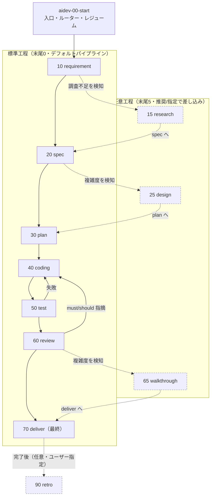
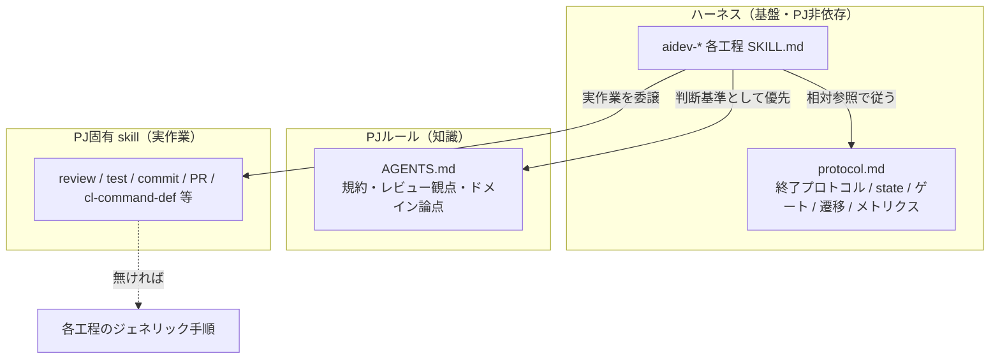
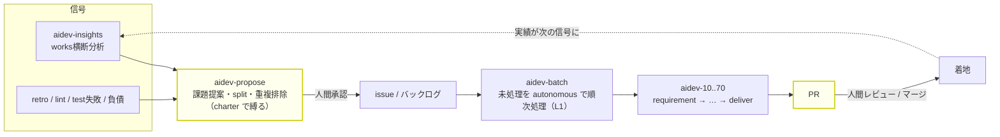

# aidev ハーネス 設計ノート（参照専用・skill実行では読まれない）

> このファイルは `SKILL.md` ではなく、どの skill / protocol からも参照されないため、
> skill 利用時には読み込まれない。**今後の aidev-* 改善のための設計記録**として残す。
> 「いま何があるか」は各 `SKILL.md` と `aidev-00-start/protocol.md` が正。
> ここには「なぜそうしたか・何を退けたか」を残す。

## 0. 全体像（図）

skill 群の関係と実行順を俯瞰するための地図。詳細な規約は `protocol.md` と各 `SKILL.md` が正。

### 0.1 工程パイプラインと差し戻し

標準工程（末尾0）を順に進み、任意工程（末尾5）は AI検知＋推奨かユーザー指定で差し込む。
各工程の末尾に承認ゲートがあり（interactive は人間 / autonomous は自動承認＋`humanGates`）、
test 失敗・review 指摘は coding へ差し戻す。

### 0.2 三層の責務分担

基盤（PJ非依存）／知識（AGENTS.md）／実作業（PJ固有 skill）を分離。各工程は実作業を PJ 資産へ
委譲し、無ければジェネリック手順にフォールバックする。ゲート・state・遷移は常に基盤が担う。

### 0.3 エコシステムと自己給餌ループ

番号なしユーティリティ（propose / batch / insights）が、パイプラインの上流・繰り返し・横断分析を担う。
両端（どの課題を起票するか・どの PR をマージするか）に人間ゲートを残し、間を自律化する。

> 黄色＝人間ゲート（前＝課題承認、後＝PR レビュー）。完全自動（発案→マージ）は高リスクのため採らない。

## 1. 目的と思想

- **PJ非依存の汎用ハーネス**。`.claude/skills/aidev-*` だけで自己完結し、特定PJ（AS400 等）に縛られない。
- 役割分担：
  - **ハーネス（基盤）= 開発フローの制御と進捗管理の器**。工程順・承認ゲート・遷移・state・レジューム。
  - **PJルール（AGENTS.md）= 知識**。レビュー観点・コーディング規約・ドメイン固有論点。
  - **PJ固有 skill = 実作業**。review/test/commit/PR 等の具体実行。
- 別PJへは `.claude/skills/aidev-*` と `.gitignore`（`.aidev/current` 除外）を置くだけで動く想定。

## 2. 主要な設計判断と理由

- **skills 内で自己完結（docs/ に置かない）**：実体が PJ フォルダ（docs/）にあると汎用性が崩れる。
  protocol も各工程手順も skills 内に閉じる。`docs/aidev/` は一度作ったが廃止した。
- **protocol.md を単一の共通定義（ホーム = aidev-00-start）**：終了プロトコル・state 規約などの
  共通ルールを1か所に集約。各工程 SKILL.md は `../aidev-00-start/protocol.md` を相対参照する。
- **工程手順は各 SKILL.md にインライン**：工程固有の内容はその skill 内で完結（外部 phase doc 不要）。
- **状態はファイル（`.aidev/works/<YYYYMMDD-slug>/`）**：state.yml ＋ 成果物の有無で現在地が一意に決まる。
  レジュームは「ファイルを見るだけ」。独自ステートエンジンを持たない。
- **pull 型・自動遷移なし**：push（完了→次を自動起動）はランタイム依存で移植性が低い。
  各工程は前提成果物の有無を自己チェックし、遷移は人間の承認後のみ。
- **2段階ゲート → 単一3択UX**：当初「承認/差し戻し」→「進む/中断」の2段階。最終的に
  AskUserQuestion による**単一3択**（承認して次へ / 承認して中断 / 差し戻す）に集約（クリック最小）。
- **番号規約**：skill は **10刻み**（途中挿入に強い）。**末尾0=標準工程 / 末尾5=任意工程**。
  works フォルダは **日付プレフィックス `YYYYMMDD-slug`**（UTC）。当初は単純連番 `001-slug` だったが、
  ブランチ並行作成での番号衝突（max+1 が複数ブランチで同値）を避けるため日付方式に変更。
  日付は時系列ソート・可読性・衝突回避を両立し、既存走査も不要（`date` のみ）。UUID は可読性/ソートを
  損なうため不採用。
- **論理名で相互参照**：renumber の影響を skill 名だけに閉じ込めるため、参照は番号でなく論理名。
- **PJ資産の優先（宣言不要・自動）**：知識は AGENTS.md 自動読込で自動採用。実行物は
  「関連PJ skill があれば優先、なければジェネリック手順」。PJ側の事前宣言・設定は不要。
- **重い工程の委譲（指示ベース）**：coding/test/review は任意でサブエージェント委譲可。
  特定ツールに依存させず「委譲する」意図で記述し、各エージェントが自機構で実現（無ければインライン）。
  **承認ゲート・遷移・state はサブに委譲不可＝必ず主エージェント**（サブは対話的承認ができない）。
- **全成果物にテンプレ/スキーマ**：requirement/spec/plan/tasks/decisions/state を定義済み。
  「下敷きにAIが埋める」方式（厳格スキーマ強制まではしていない）。
- **任意工程は AI検知＋ゲート推奨**：research は requirement 終了時に調査不足を、design は spec 終了時に
  複雑度を、walkthrough は review 終了時に複雑度を検知し、遷移ゲートで推奨（理由付き）。強制せず却下可。
  retro はユーザー指定起動。
- **バッチ駆動（`aidev-batch`・非番号ユーティリティ）**：バックログ（チェックリスト）の未処理を
  autonomous で順次処理する L1 オーケストレーター。実処理は autonomous aidev＋PJ資産へ委譲、繰り返しは
  L2（/loop・/schedule）。「次の1件」は毎回ファイル（未チェック行）から導出（pop カーソルを別管理しない＝
  中断再開に強い）。将来、上流に planner（課題提案→issue化、人間承認付き）を足せば自己給餌ループになるが、
  完全自動(発案→マージ)は高リスク。実用形は「AI提案＋人間が課題承認＋自律実装＋人間PRレビュー」（B→A の順で段階導入）。
- **planner（`aidev-propose`・A 実装）**：charter(`.aidev/charter.md`)＋信号(insights/retro/負債)から
  課題を**提案**し、split 判定で右サイズ化、承認のうえ issue/バックログ化する非番号ユーティリティ（最上流 L_planner）。
  **信号に根ざす（恣意発案しない）・人間承認が既定・charter で縛る・重複排除・提案止まり**が安全設計の柱。
  自己給餌ループ: `insights/retro → aidev-propose → aidev-batch → PR`（両端に人間ゲート）。
- **実行モード（interactive / autonomous）**：autonomous は「夜セット→朝PR」型。思想は
  **「ゲートを消す」でなく「ゲートを PR（最終レビュー）に集約し、自己チェックを固くする」**。
  人間ゲートは前（タスク指示=requirement）と後（PRレビュー）に移動し、ループ内からは外す。
  受け入れるのは主に「方向/spec 誤りの手戻り」（機械的誤りは夜間の self-correction で潰れる）。
  `humanGates`（例 [spec]）で高レバレッジ工程だけ人間を残す**部分自律**が実用的。
  安全弁必須（test硬ゲート・ループ/予算上限・PRで停止/auto-merge禁止・証跡保存）。
  実行手段（headless/スケジュール）は harness とは別レイヤ。

## 3. 退けた案（なぜ採用しなかったか）

- **自動で次工程へ遷移**：工程ゲートの人間レビューが品質の要。自動化すると手戻りが増幅。→ ゲート式。
- **AGENTS.md への「統合宣言」必須化**：PJ側に委譲マッピングを書かせる案。過剰設計。
  AGENTS.md は自動読込・skill は description で自動採用されるため、宣言なしで成立する。→ 不要に。
- **「必ず aidev-00-start で始める」を正しさの要件にする**：別セッションの直接 `/aidev-40-coding`
  起動（コールド再開）を壊す。→ 「推奨運用」に留め、各工程は単独実行可能なまま。
- **委譲をツール束縛で表現**：`Agent` ツール前提にすると移植性が落ちる。→ 散文で意図を記述し、
  `allowed-tools` への `Agent` 追加は「Claude Code での実現手段」と位置づけ。
- **deploy 工程をデフォルト追加**：CI/CD の責務・破壊的・PJ固有性が高い。→ 原則スコープ外
  （必要なら `aidev-80` で完全委譲＋強ゲート）。

## 4. 既知の限界・留意点

- **AIの自己検知は不完全**：research/design 推奨は過検知・見逃しがある。だから推奨止まりで強制しない。
- **サブエージェントの自動委譲は非決定的**：「あれば優先」は確率を上げるが100%保証ではない。
- **PJ skill 自動採用も非決定的**：実運用で「reviewでPJ skillが使われたか」の観察が望ましい。
- **相対参照（`../aidev-00-start/protocol.md`）**：Claude Code の `.claude/skills/` 配置前提。
  他エージェント展開時はパス解決方法の確認が要る。
- **クロスエージェント**：AskUserQuestion / Agent は Claude Code の実現手段。Copilot/Codex では
  選択UIはテキスト、委譲は各機構/インラインにフォールバック（挙動は同等を意図）。各社仕様は流動的。

## 5. 今後の改善アイデア

- **deploy(80) / その他任意工程**：必要になったら末尾規約に沿って差し込み。
- **テンプレの厳格化（任意）**：揺れを抑えたい場合、テンプレを「厳密遵守」化、またはテンプレファイル分離。
- **retro の活用**：retro の「ハーネス改善提案」をこのファイルや新 issue に還流させる運用。
- **`aidev-insights`（横断分析・実装済）**：複数 works を横断して `review.md` / `metrics.yml` /
  `decisions.md` / `retro.md` を集計し、再発パターンと systemic な改善提案を出す**非番号のユーティリティ skill**。
  per-work の retro とは別レベル（meta）。パイプライン工程ではないため番号を付けず、protocol の
  対象作業特定／終了プロトコル／メトリクス記録には乗らない。出力は `.aidev/insights/<日付>-insights.md`。
  ※ works が少ないうちは傾向が出ない点に留意（skill 側でデータ限界を明示する）。
- **state 更新の堅牢化**：state.yml 更新を手書き heredoc でなくヘルパー化（cwd 事故・冗長さの回避）。
- **作業の split 判定（A=planner の一部・未実装）**：1要件を複数の作業/issue/PR に分けるかの判定。
  plan のタスク分解（1PR内）とは別レベル＝作業単位そのものの分割。出力は issue/バックログ項目 →
  `aidev-batch` が消化（A planner へのボトムアップ入口）。requirement 終了時（必要なら spec 終了時）に
  既存の AI 検知パターンで「分割提案」する。interactive=人間が分割案を承認、autonomous=自動判定。

  **判定ルール（結合度が主軸・規模は引き金）**:
  - 規模が大きい＝「分割できる？」の引き金にすぎない。可否は**結合度（独立性）**で決める。
  - **低結合**（ドメイン/モジュール境界が綺麗・**単独で検証/デリバリ可能**・ファイル重複が少ない）→ 分割。
  - **高結合**（相互依存・共有ファイル編集・単独検証不可・マージ衝突しそう）→ 大規模でも分割しない。
  - 「大規模＋高結合」でも 1 つの巨大 PR に直行しない。優先策:
    1. **依存順に分割**（順序/スタックPR：基盤→依存の順に個別マージ）
    2. **分離用リファクタを先行 PR** にして継ぎ目を作る
    3. 真に不可分なときだけ 1 PR にまとめ、**walkthrough** とコミット構成でレビュー負荷を緩和
  - **検証可能性が seam の指標**：単独でテストできない部分はそこで割らない。
  - autonomous は安全側＝**明確に独立な時だけ自動分割、迷えば分けない**（誤分割の統合地獄を回避）。

## 6. 経緯メモ（実証された学び）

- issue#4 の試走で **review→coding の差し戻し**が発生。原因は「言語同居の副作用（.cmd へ CL 診断、
  .dds へ RPG 編集機能）を spec 前に調査していなかった」こと。
  → この学びが **research 工程（影響範囲調査）追加**の直接の動機。retro があれば体系的に拾える類の改善。
