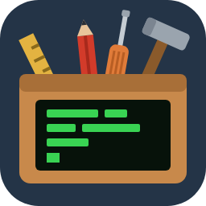

# ibmi-dogubako（道具箱）



IBM i の開発を VS Code と AI から助ける道具箱です。
名前は IBM i に昔からある Toolbox に掛けた和名です（道具箱 = dogubako）。

中心は VS Code 拡張「**Dogubako for IBM i**」です。固定長の RPG・CL・DDS を、
SEU で書くのと同じ感覚で VS Code でも書けるようにします。

- **桁がずれない**: カーソル行の上にルーラー（SEU と同じ書式行）を出し、全角文字の前後の
  SO/SI を `{` `}` で見せて、実機と同じ桁で表示します。どちらもソースは書き換えません。
- **F4 プロンプター**: SEU と同じく F4 で入力画面を開き、桁を揃えて書き戻します。
  CL は約 250 コマンド、RPG は仕様書ごと（ILE・RPG III）、DDS は定位置項目とキーワードに対応します。
- **定義は IBM の原典から機械的に作っています**: プロンプターの欄・必須・選択肢・ヘルプは、
  IBM Documentation と実機のコマンド定義からスクリプトで生成し、原典と突き合わせて検査しています。
  そのため、**使うときに IBM i への接続は要りません**。
- **画面・帳票をマウスで作る**: DDS ビジュアルエディタで項目の配置、罫線、キーワードの値を画面の上で
  編集し、DDS に書き戻します。全角と属性文字の桁も実機と同じに数えます。
- **IBM i との行き来**: ソース・メンバーの送受信（1 メンバーずつ、またはソース・ファイル単位で差分を見ながら）と、
  RPGUnit のテストの実行ができます。
- **日本語の現場向け**: 画面・ヘルプは日本語です（CL・RPG の定義は英語版もあります）。

## 目次

- [動作環境](#動作環境)
- [入れる](#入れる)
- [使い方](#使い方)
  - [対象のファイル](#対象のファイル) ／ [書く](#書く) ／ [画面・帳票（DDS）](#画面帳票dds) ／
    [IBM i とソースを送受信する](#ibm-i-とソースを送受信する) ／ [RPGUnit のテストを回す](#rpgunit-のテストを回す) ／
    [コマンドラインの道具](#コマンドラインの道具vs-code-不要)
- [設定](#設定)
- [既知の制約](#既知の制約)
- [リポジトリの構成](#リポジトリの構成)
- [開発する](#開発する)
- [商標について](#商標について)

## 動作環境

- VS Code 1.90 以降
- IBM i との送受信を使うときは、IBM i 側で SSH サーバーが動いていること
- RPGUnit のテストを使うときは、IBM i に RPGUnit が入っていて、
  [Code for IBM i](https://marketplace.visualstudio.com/items?itemName=halcyontechltd.code-for-ibmi) で接続できること
- VSIX を自分で作るときは Node.js 20 以降

## 入れる

1. VSIX を用意する。配られた `ibmi-dogubako-<版>.vsix` を使うか、リポジトリ直下で作る:

   ```sh
   ./build-vsix.sh        # Linux / WSL / Mac
   build-vsix.bat         # Windows
   ```

   `--no-install` を付けると依存の入れ直しを省きます。出力先は環境変数 `VSIX_OUT_DIR` で変えられます。
2. VS Code の拡張機能ビューの「…」→「VSIX からのインストール」で選ぶ
   （または `code --install-extension ibmi-dogubako-<版>.vsix`）。
3. 旧名の「RPG/CL Development Support」が入っていたら、**先にアンインストールする**
   （同じコマンドが二重に登録されて衝突します）。旧版で保存した IBM i 同期のパスワードは引き継がれないので、
   保存し直してください。設定（`rpgClSupport.*`）はそのまま使えます。

## 使い方

### 対象のファイル

拡張子で判定します。

| 種類 | 拡張子 |
|---|---|
| RPG（ILE / RPG III、SQL 組み込みを含む） | `.rpgle` `.sqlrpgle` `.rpg` `.sqlrpg` |
| CL | `.clp` `.clle` |
| DDS | `.pf` `.lf` `.dspf` `.prtf` `.mnudds` `.dds` |
| コマンド定義 | `.cmd` |

RPG は固定長だけに対応します（自由形式は対象外）。`.rpgle` は ILE、`.rpg` は RPG III として扱います
（設定 `rpgClSupport.rpgDialectByExtension` で変えられます）。

### 書く

| 機能 | 操作 |
|---|---|
| **ルーラー** | カーソル行の上に桁の目盛り、または SEU と同じ書式行が出る。ステータスバーの表示を押すと目盛り ⇔ 書式行を切り替える。消す・戻すはコマンド「ルーラー: 表示の切り替え」 |
| **SOSI の表示** | 全角文字の前後に SO を `{`、SI を `}` で見せる（ソースは書き換えない）。これで桁が実機と揃う。切り替えはコマンド「制御コード(SOSI)表示の切り替え」 |
| **F4 プロンプター** | 行にカーソルを置いて **F4**。その行の内容が入った入力画面が開き、確定すると桁を揃えて書き戻す。欄で **F1** を押すとその欄のヘルプが出る。CL の `SBMJOB CMD(...)` のようにコマンドを書く欄では、その中でさらに F4 が使える |
| **欄の移動** | RPG・CL では **Tab** / **Shift+Tab** で次・前の欄の桁へ移る |
| **コメント** | **Ctrl+/** で行をコメントにする・戻す（RPG・CL） |
| **補完** | RPG の命令コード・組み込み関数・仕様書キーワード、DDS のキーワード（カーソル行で書ける場所のものだけ）を出す |
| **桁の検査** | 行の長さ・数値欄の桁などの誤りを、書いている間に波線で出す。行長の上限は、ソース物理ファイルのレコード長から 12 を引いた桁数を `rpgClSupport.lint.maxColumn` に入れる（既定 100。レコード長 112 のとき） |
| **SEU の色属性** | ソースに入った SEU の色属性を、目に見える印と色で表す |

### 画面・帳票（DDS）

`.dspf` / `.prtf` を開いて右クリックします。

- **プレビュー**（「画面プレビュー」「帳票プレビュー」）: 表示・印刷のイメージを横に並べて見る。
  帳票の 1 ページの大きさは `rpgClSupport.prtf.*` で `CRTPRTF` の値に合わせる。
- **DDS ビジュアルエディタ**: 次の操作を画面の上で行い、DDS のソースに書き戻す。
  - 項目をマウスで動かす・伸ばす・足す・消す
  - 罫線を引く（ツールバーの「罫線を引く」→ ドラッグ）
  - `COLOR(RED)` や `DSPATR(HI RI)` のような値を一覧・チェックボックスから選ぶ

  ウィンドウ（`WINDOW`）とサブファイルの 1 ページ分（`SFLPAG`）も、実機と同じ位置に描く。
- **新しく作る**: エクスプローラーのフォルダを右クリック →「新しい画面ファイル (DSPF) を作る」
  または「新しい帳票ファイル (PRTF) を作る」。

### IBM i とソースを送受信する

ローカルのフォルダとソース・メンバーを、次の形で対応させます。

```
src/<ライブラリー>/<ソース・ファイル>/<メンバー名>-<テキスト記述>.<ソース・タイプ>
例: src/MYLIB/QRPGLESRC/ORDR01-受注入力.rpgle
```

`-<テキスト記述>` は省いてかまいません。アップロードすると、テキスト記述とソース・タイプ
（拡張子を大文字にしたもの）もメンバーに反映します。

**準備**（接続は SSH です）

1. 設定を入れる（`Ctrl+,` で `ibmiSourceSync` を検索するか、`settings.json` に書く）:

   ```jsonc
   {
     "rpgClSupport.ibmiSourceSync.host": "ibmi.example.co.jp",
     "rpgClSupport.ibmiSourceSync.port": 22,
     "rpgClSupport.ibmiSourceSync.user": "MYUSER",
     "rpgClSupport.ibmiSourceSync.authMethod": "password",               // または "privateKey"
     "rpgClSupport.ibmiSourceSync.privateKeyPath": "",                   // privateKey のとき秘密鍵の絶対パス
     "rpgClSupport.ibmiSourceSync.ifsTempDirectory": "/home/MYUSER/tmp", // 書き込める既存の IFS フォルダ
     "rpgClSupport.ibmiSourceSync.hostKeySha256": "SHA256:..."           // 必須。下の方法で調べる
   }
   ```

   ホスト鍵の指紋は `ssh-keyscan -p 22 <ホスト> 2>/dev/null | ssh-keygen -lf -` で出る
   `SHA256:...` を入れます（まず ED25519 の行を試してください）。指紋が合わないと接続を拒否します。
2. コマンド「IBM i 同期: 認証情報を保存」で、パスワード（秘密鍵ならパスフレーズ）を保存する。
   保存先は VS Code の SecretStorage で、`settings.json` には書きません。

**1 メンバーずつ**: ソースを開いて右クリック →「IBM i: 現在のソースをアップロード」／「ダウンロード」。

**ソース・ファイル単位**: エクスプローラーで `src/<ライブラリー>/<ソース・ファイル>` のフォルダを右クリック →
「IBM i: ソース・ファイル単位で送受信」。ローカルにまだフォルダが無いときは、コマンドパレットから開いて
ライブラリーとソース・ファイルを入力します。

- 向き（ダウンロード／アップロード）を切り替え、転送するメンバーをチェックボックスで選んで「転送」を押す。
- 転送元・転送先の更新日時・行数・テキスト記述が並び、新しい方に印が付く。
- 「差分」で転送前に中身を比べられる（左が転送先、右が転送した後の姿）。
- 転送先の方が新しいメンバーを上書きするときだけ、確認が出る。
- 未保存の変更があるファイルは転送しない。
- 転送した後は、ローカルの更新日時を IBM i の更新日時に揃える（直後は「同じ日時」と出る）。

### RPGUnit のテストを回す

Code for IBM i で IBM i に接続した状態で、VS Code の Test Explorer（テスト・ビュー）から実行します。

- `src/<ライブラリー>/<ソース・ファイル>/` の `.rpgle` / `.sqlrpgle` は、ソース・メンバーへ送ってコンパイルする。
- `*.test.rpgle` / `*.test.sqlrpgle` は、Code for IBM i のデプロイ先（IFS）のソースからコンパイルする。
- バインドするサービス・プログラムなどは、IBM i Testing 拡張と同じ `testing.json` から読む。

導入の手順は [docs/workflow/rpgunit-install.md](docs/workflow/rpgunit-install.md)、
Test Explorer との繋ぎ方は [docs/workflow/rpgunit-test-explorer.md](docs/workflow/rpgunit-test-explorer.md) にあります。

### コマンドラインの道具（VS Code 不要）

CI や AI エージェントから使う道具です。`vscode-extension/` で `npm install && npm run compile` の後:

```sh
node out/cli/lint.js --format text <ファイル…>            # 桁の検査。既定は SARIF で出す（CI のコード・スキャン用）
node out/cli/dds.js render --format text <.dspf|.prtf>   # 画面・帳票を文字で描く
node out/cli/dds.js patch --edits <編集.json> <ファイル>   # 項目の移動などを DDS に当てる
```

詳しくは `--help` を見てください。VS Code の設定（`rpgClSupport.lint.maxColumn` / `rpgClSupport.cNewOpcodes`）を
変えているなら、同じ値を `--max-column` / `--c-new-opcode` で渡します。渡さないと、エディタと CI で結果が食い違います。

RPGUnit のテストを VS Code を使わずに回す `tools/run-rpgunit.mjs` もあります（[tools/README.md](tools/README.md)）。
こちらは実機への接続に別リポジトリ（ts5250）を使います。

### 困ったとき

コマンド「Dogubako: 出力を表示」で拡張のログを見られます。

## 設定

どれも `rpgClSupport.` で始まります（旧名の名残ですが、設定を引き継ぐため変えていません）。

| 設定 | 既定 | 内容 |
|---|---|---|
| `ruler.defaultMode` | `full` | ルーラーの初期の表示（`ruler` = 目盛り、`full` = 書式行、`off` = 出さない） |
| `prompter.openBeside` | `true` | F4 プロンプターをソースの右側に開く |
| `language` | `auto` | プロンプターの表示言語（`auto` / `ja` / `en`） |
| `rpgDialectByExtension` | `.rpgle`→ILE、`.rpg`→RPG III | 拡張子ごとの RPG の方言 |
| `cNewOpcodes` | `EVAL` `IF` など | C 仕様書で新形式（拡張演算項目 2）として扱う命令コード |
| `lint.enable` | `true` | 書いている間の桁の検査 |
| `lint.maxColumn` | `100` | 行長の上限（レコード長 − 12） |
| `lint.rules` | `{}` | 検査の規則ごとの有効・無効 |
| `prtf.pageLength` / `pageWidth` / `overflowLine` | `66` / `132` / `60` | 帳票プレビューの 1 ページの大きさ（`CRTPRTF` の `PAGESIZE` / `OVRFLW`） |
| `seuColors.enabled` | `true` | SEU の色属性を色で表す |
| `ibmiSourceSync.*` | — | IBM i との送受信の接続先（[準備](#ibm-i-とソースを送受信する)を参照） |

## 既知の制約

- RPG は固定長だけに対応します。自由形式（`**FREE`）には対応しません。
- IBM i との送受信は SSH だけです。IBM i Access のホスト・サーバー経由には対応していません。
- RPG III の定義は日本語版だけです（英語の原典が入手できないため）。
- VS Code 拡張としてマーケットプレイスには公開していません。VSIX から入れてください。

## リポジトリの構成

| 場所 | 中身 |
|---|---|
| `vscode-extension/` | VS Code 拡張の本体。`src/` がソース、`resources/` がプロンプター・補完・桁の定義、`dev/` が画面の単独起動ハーネスと e2e |
| `docs/origin/` | IBM の原典から定義を生成・照合するスクリプト。**定義の JSON は手で直さず、ここのスクリプトを直す** |
| `docs/workflow/` | IBM i の開発ワークフロー（AI の自律ループ・RPGUnit の導入など）の設計と手順 |
| `docs/research/` | 調査の記録（競合の比較・実機での確認など） |
| `tools/` | 実機に触る開発用の道具（RPGUnit の実行など）。CI では動かない |
| `.aidev/` | 開発の作業記録（要件・タスク・テスト結果・レビュー）と backlog |
| `build-vsix.sh` / `.bat` | VSIX を作る |

## 開発する

```sh
cd vscode-extension
npm install
npm run compile:all      # tsc と、画面（WebView）の束ね
npm test                 # 単体テスト
```

- **F5** で拡張を読み込んだ VS Code が起動します（`npm run compile:all` が先に走ります）。
- 画面の e2e は `npm install --no-save playwright-core` の後に `npm run dev:e2e`（[vscode-extension/dev/README.md](vscode-extension/dev/README.md)）。
- 定義の検査は `npm run verify:defs`。CI（`.github/workflows/`）は、定義の再生成で差分が出ないこと、
  単体テスト、統合テスト、画面の e2e を回します。
- 開発の決まりごと（原典の扱い、実機での確かめ方、踏んだ罠）は [AGENTS.md](AGENTS.md) にまとめてあります。
  変更する前に読んでください。

## 商標について

This project is not affiliated with or endorsed by IBM.
IBM, IBM i, and AS/400 are trademarks of International Business Machines Corporation.
本プロジェクトは IBM とは関係のない非公式のものです。
