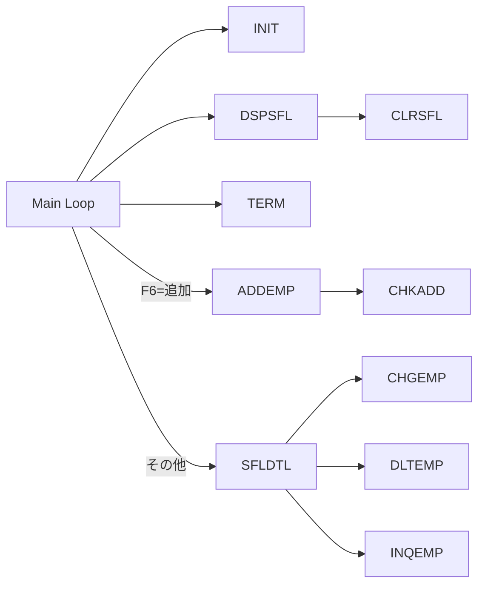

# EMPMNT01.rpgle 詳細設計書

## 1. 概要
`EMPMNT01.rpgle` は、社員マスタメンテナンス用の AS/400 ILE RPG プログラムです。
主な機能は以下の通りです。

- 社員マスタの一覧表示
- 社員追加
- 社員変更
- 社員削除
- 社員照会

内部的にはサブファイルを使った一覧画面と、複数のサブルーチンによる処理分岐で構成されています。

---

## 2. ファイル定義

| ファイル名 | 種別 | 属性 | 役割 | 補足 |
|---|---|---|---|---|
| `FEMPMSTP` | UF | A E K DISK USROPN | 基本社員マスタ入力ファイル | `RENAME(EMPMSTR:EMPREC)` |
| `FEMPDSP` | CF | E WORKSTN SFILE(EMPSFL:RRN) | 社員一覧用サブファイル | `INFDS(WSINFO)` |

### 2.1 `FEMPMSTP` のキー

- `EMPREC` レコードをキーアクセスで操作
- `CHAIN EMPREC` / `WRITE EMPREC` / `UPDATE EMPREC` / `DELETE EMPREC` が使用される

### 2.2 `FEMPDSP` のサブファイル

- 表示専用のサブファイルレコード `EMPSFL`
- 制御フィールドに `RRN` を使用
- ワークステーション情報を `WSINFO` に格納

---

## 3. パラメータ定義

このプログラムは外部パラメータ定義を明示していません。
すべての変数は内部で定義されるスタンドアロン変数とデータ構造です。

---

## 4. データ構造定義

### 4.1 `WSINFO`

- `WSKEY` 369～369A
- `FEMPDSP` の `INFDS` で使用するワークステーション情報領域

### 4.2 `DATES`

- `SDATE` : 8S 0
- `SYY` : 4S 0 OVERLAY(SDATE:1)
- `SMM` : 2S 0 OVERLAY(SDATE:5)
- `SDD` : 2S 0 OVERLAY(SDATE:7)

### 4.3 `ERRCODE`

- `BYTPVD` : 10I 0 INZ(0)
- `BYTAVL` : 10I 0
- `MSGID` : 7A
- API 呼び出し時のエラーメッセージ領域

---

## 5. スタンドアロン変数一覧

| 変数 | 型 | 初期値 | 役割 |
|---|---|---|---|
| `RRN` | 4S 0 | - | サブファイルレコード番号 |
| `SFLSIZ` | 4S 0 | 9999 | サブファイル最大件数 |
| `SFLPAG` | 4S 0 | 15 | 1ページあたり表示件数 |
| `MSGLIN` | 4S 0 | 24 | メッセージ表示行 |
| `ERRFLG` | 1A | - | エラーフラグ |
| `FUNC` | 1A | - | 機能コード |
| `OLDKEY` | 6S 0 | - | 変更時の旧キー保持 |
| `TODAY` | D | - | 当日日付 |
| `WDATE` | 8S 0 | - | ワーク日付 |
| `WTIME` | 6S 0 | - | ワーク時刻 |
| `WUSER` | 10A | - | ユーザープロファイル |
| `CNT` | 4S 0 | - | 汎用カウンタ |

### 5.1 画面バッファ関連

- `WEMPNO`, `WEMPNM`, `WDEPT`, `WPOST`, `WSAL`, `WHDATE` などの入力/出力用フィールドが使用される
- `ERRMSG` はエラーメッセージ表示用

---

## 6. 定数定義

| 定数 | 値 | 説明 |
|---|---|---|
| `C_ADD` | '1' | 追加 |
| `C_UPD` | '2' | 変更 |
| `C_DEL` | '4' | 削除 |
| `C_INQ` | '5' | 照会 |

---

## 7. 処理フロー概要

### 7.1 プログラム開始

1. `INIT` サブルーチン呼び出し
2. `DOW *IN03 = *OFF` のメインループ
3. `DSPSFL` で画面表示
4. `*IN03` 判定で終了
5. `*IN06` で `ADDEMP`
6. それ以外は `SFLDTL`
7. ループ終了後に `TERM`

### 7.2 主なサブルーチン

- `INIT`
- `CLRSFL`
- `DSPSFL`
- `SFLDTL`
- `ADDEMP`
- `CHGEMP`
- `DLTEMP`
- `INQEMP`
- `CHKADD`
- `TERM`

---

## 8. サブルーチン詳細

### 8.1 `INIT`

- システム日付/時刻取得
- ユーザープロファイル取得 (`QWCRNETA`)
- 社員マスタファイルオープン
- サブファイル初期化（`CLRSFL`）

### 8.2 `CLRSFL`

- `*IN31` を OFF にして `EMPCTL` を書く
- `RRN` を 0 にリセット

### 8.3 `DSPSFL`

- `CLRSFL` 呼び出し
- `EMPMSTR` を先頭から読み込み
- ループ内で `EMPSFL` にサブファイルレコードを書き込み
- `RRN` > 0 の場合 `*IN32` を ON にしてサブファイル有効化
- `EMPCTL` を `EXFMT` で表示

### 8.4 `SFLDTL`

- `ERRFLG` 初期化
- `DO RRN` でサブファイル明細分処理
- `CHAIN CNT EMPSFL` でサブファイル明細を取得
- `SOPT` に応じて以下を呼び出し
  - `C_UPD` → `CHGEMP`
  - `C_DEL` → `DLTEMP`
  - `C_INQ` → `INQEMP`
- `SOPT` を空白に戻して `UPDATE EMPSFL`
- エラー時は `ERRMSG` をセット

### 8.5 `ADDEMP`

- 追加入力画面の初期化
- `EXFMT EMPADD` で入力受け付け
- `CHKADD` で入力チェック
- 問題なければ社員レコードを `WRITE EMPREC`
- 成功時に `ERRMSG = '追加しました'`

### 8.6 `CHGEMP`

- `SEMPNO CHAIN EMPREC` で対象レコードを取得
- レコードが存在しない場合、エラー
- 画面用フィールドに読込データをセット
- `EXFMT EMPCHG` で編集
- `OLDKEY CHAIN EMPREC` で再取得後、更新
- `UPDATE EMPREC`
- 成功時に `ERRMSG = '変更しました'`

### 8.7 `DLTEMP`

- `SEMPNO CHAIN EMPREC` で対象レコードを取得
- `EXFMT EMPDLT` で削除確認
- `SEMPNO CHAIN EMPREC` で再取得後、`DELETE EMPREC`
- 成功時に `ERRMSG = '削除しました'`

### 8.8 `INQEMP`

- `SEMPNO CHAIN EMPREC` で対象レコードを取得
- 画面用フィールドに読込データをセット
- `EXFMT EMPINQ` で照会表示

### 8.9 `CHKADD`

- `WEMPNO` が 0 以下ならエラー
- `WEMPNO CHAIN EMPREC` で重複チェック
- `WEMPNM` が空白ならエラー

### 8.10 `TERM`

- `CLOSE EMPMSTR`

---

## 9. サブルーチン呼び出し構造

---

## 10. 主要キー/レコードアクセス

### 10.1 `EMPMSTR / EMPREC`

- 追加: `WRITE EMPREC`
- 変更: `CHAIN EMPREC` / `UPDATE EMPREC`
- 削除: `CHAIN EMPREC` / `DELETE EMPREC`
- 照会: `CHAIN EMPREC`

### 10.2 `EMPSFL`

- サブファイル明細は `WRITE EMPSFL`
- 明細ループでは `CHAIN CNT EMPSFL`
- オプション判定後 `UPDATE EMPSFL`

---

## 11. 主要画面定義（ソース上で参照）

- `EMPCTL`
- `EMPSFL`
- `EMPADD`
- `EMPCHG`
- `EMPDLT`
- `EMPINQ`

---

## 12. 注意点・設計上の特徴

- `QWCRNETA` によるユーザープロファイル取得
- サブファイル表示後に `EXFMT EMPCTL` でキー入力を待機
- `SFLDTL` のループは `RRN` 件数分だけサブファイル明細処理を行う
- 追加・変更・削除・照会は `SOPT` フィールド1文字による分岐
- エラー時は `ERRMSG` をセットして再表示させる設計

---

## 13. 追加補足

### 13.1 サブファイルの制御

- `RRN > 0` の場合にのみ `*IN32` を ON にして画面上にサブファイルを有効化
- サブファイルクリア時には `*IN31` の制御を行う

### 13.2 エラーハンドリング

- `CHGEMP`, `DLTEMP`, `INQEMP` では存在確認後にエラーを表示
- `CHKADD` では入力不備と重複登録を防止

---

この設計書は `EMPMNT01.rpgle` の処理構造とデータ設計を元に作成しています。
必要であれば、画面定義 `DSPF` / `SRVPGM` との連携や実際のフィールド定義一覧をさらに追加できます。
