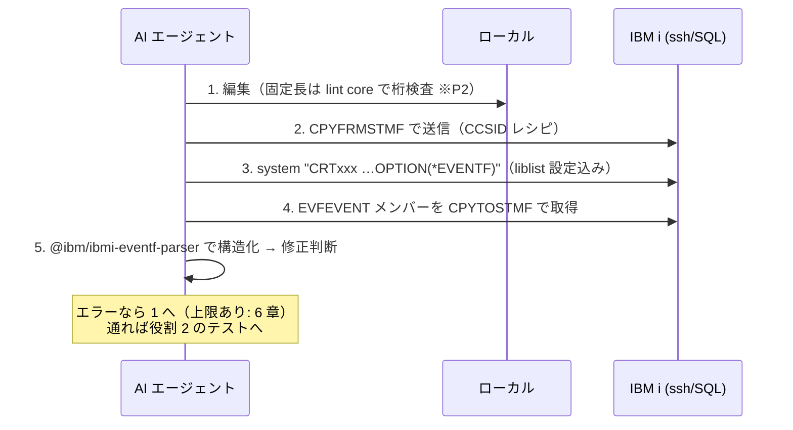

# VS Code を軸とした IBM i 開発ワークフロー設計書

作成: 2026-07-19（work `20260719-ibmi-dev-workflow`）。
根拠は調査記録（[research.md](../../.aidev/works/20260719-ibmi-dev-workflow/research.md) の
F1〜F9、および [docs/research/code-for-ibmi.md](../research/code-for-ibmi.md)）に
F 番号で紐づける。根拠の無い主張は書かない。

## 1. 全体像

### 中心原則: 人間は UI、AI は同じプリミティブを直接

Code for IBM i の実行系（転送・コンパイル・エラー取得・SQL・スプール）は、すべて
ssh + CL + SQL の包装であることをソース直読で確認した（**F1**）。したがって:

- **人間**は VS Code の UI（Code for IBM i ＋本 PJ 拡張のルーラー・F4 プロンプター・SOSI）で編集する
- **AI エージェント**は UI を介さず、**同じサーバー側プリミティブ**（ssh・CL・SQL・MCP）へ直接到達する
- 両者は**実機上の状態**（ソースメンバー・オブジェクト・スプール・DB）で合流する

この分担により「VS Code 拡張であるがゆえに AI が機能を使えない」問題は、
機能を AI に開放するのではなく**経路を分ける**ことで解消する。

### 開発の基本形: ローカル・ファースト

コードはローカル（VS Code）で書き、**IFS ではなくライブラリー上のソースメンバー**へ
直接送受信する（F2。Code for IBM i の IFS デプロイ＋bob モデルは採らない）。

```mermaid
flowchart LR
  subgraph local[ローカル / VS Code]
    edit[編集<br>人間: ルーラー・F4・SOSI<br>AI: テキスト直編集]
    lint[ローカル lint<br>桁・キーワード検査 ※P2]
  end
  subgraph ibmi[IBM i 実機]
    mbr[(ソースメンバー<br>QSYS.LIB)]
    cmp[コンパイル<br>OPTION(*EVENTF)]
    evf[(EVFEVENT)]
    tst[RPGUnit]
    app[5250 アプリ / DB2]
  end
  edit --> lint -->|CPYFRMSTMF| mbr
  mbr -->|CPYTOSTMF| edit
  mbr --> cmp --> evf
  evf -->|CPYTOSTMF + eventf-parser| edit
  cmp --> tst
  e2e[E2E テスト<br>as400-web-emulator MCP] <-->|画面操作 + SQL| app
```

### 段階導入

まず作成者一人で回して有効性を判断し、その後チーム（受託案件）へ展開する。
一人で完結する構成（レシピ＋既存ツール）を先行させ、CLI 化・チーム向け導入手順は
実証後に固める（spec の決定事項）。

### aidev ハーネスとの関係

本設計は開発プロセス（aidev の requirement→…→deliver）を置き換えない（**F9**）。
aidev は言語非依存の**工程・承認・記録**の枠組みであり、本設計はその
**coding / test 工程の中で使う IBM i 固有の道具**（転送・コンパイル・テスト・E2E）を
定義する。ハーネス側の変更は不要で、PJ 資産優先の規約（protocol 2.5）により
本設計のレシピ・skill が各工程から自動的に使われる。

## 2. 資源マップ

何をどこから使うか。すべて調査済みの事実に基づく（括弧内が根拠）。

### 2.1 使う資源と役割

| 資源 | 役割 | 備考 |
|---|---|---|
| **Code for IBM i** | 人間の接続・ブラウズ・コンパイル UI | 活用する側に回る（競合しない）。AI からは使わない（F1: 同じことを直接やる） |
| **本 PJ (as400-coding-helper)** | 人間の固定長編集支援（ルーラー・F4・SOSI・補完）＋桁定義データ | 桁定義は将来のローカル lint の唯一の材料（F7） |
| **as400-web-emulator** | AI の 5250 操作（MCP 19 ツール）・E2E・スプール受信 | 画面系は実用水準。SQL/CL/IFS は core 実装済み・MCP 未配線（F3） |
| **内製 Java MCP (MCP DB2 Server)** | 当面の DB 参照（SELECT のみ） | TS 配線完了後は as400-web-emulator に集約（spec 決定） |

### 2.2 IBM 公式の再利用部品

| 部品 | 用途 | 出所 |
|---|---|---|
| `@ibm/ibmi-eventf-parser` | コンパイルエラー（EVFEVENT）の構造化 | npm / Apache-2.0（F1） |
| `@ibm/itest` | RPGUnit テストの CLI 実行（VS Code 不要・環境変数認証） | npm（F5） |
| RPGUnit (`tools-400/irpgunit`) | ILE RPG のユニットテスト。固定長で書ける | v6.0.0、実機に RPGUNIT ライブラリ導入（F5） |
| `OPTION(*NOGEN)` / `OPTION(*EVENTF)` / QCAPCMD | 実機層の構文検査（コンパイラ＝リンター） | IBM i 標準機能。原典照合済み（F7） |
| QSYS2 SQL サービス | ジョブ・スプール・オブジェクト等のシステム情報 | 既存実績（F1、AGENTS.md） |

### 2.3 使わないと決めたもの

| 対象 | 理由 |
|---|---|
| IBM 公式 `ibmi-mcp-server` | mapepire の実機導入が前提。内製 TS 経路は導入物ゼロで同等以上（F6） |
| Code for IBM i のローカル開発モデル（IFS + bob） | メンバー直送受信の要件と合わない（requirement） |
| vscode-rpgle のリンター | `**FREE` 限定が実装で確定。固定長に効かない（F7） |
| 商用静的解析（ARCAD 等） | 一人検証の段階では過剰。将来のチーム展開時に再評価（F7） |

## 3. 人間のフロー

### 3.1 編集

- VS Code でローカルのソースを開く。固定長の入力支援は本 PJ 拡張が担う:
  ルーラー（Cols/Full 切替）・F4 プロンプター（RPG 仕様書 / CL / DDS / `.cmd`）・
  SOSI 表示・補完（命令コード / BIF / キーワード）
- Code for IBM i を併用する場合、編集支援の重複は無い（固定長・DDS・日本語は
  向こうの守備範囲外。[docs/research/code-for-ibmi.md](../research/code-for-ibmi.md)）。
  ただし **F4 キーの衝突**（clPrompter 併用時）は未確認事項として 7 章に記載

### 3.2 メンバー送受信

経路は `CPYFRMSTMF` / `CPYTOSTMF`（F2。vscode-ibmi と同じプリミティブ）:

```sh
# 送信（ローカル → メンバー）: scp で IFS の一時パスへ → メンバーへコピー
scp -P 2222 src/MYPGM.rpgle user@host:/home/user/
ssh user@host 'system "CPYFRMSTMF FROMSTMF('"'"'/home/user/MYPGM.rpgle'"'"') \
  TOMBR('"'"'/QSYS.LIB/MYLIB.LIB/QRPGLESRC.FILE/MYPGM.MBR'"'"') MBROPT(*REPLACE)"'
# 受信（メンバー → ローカル）: 逆向きに CPYTOSTMF → scp
```

- **CCSID**: 非 UTF-8 のソースファイルは `STMFCCSID(1208)` ⇔ `DBFCCSID(<CCSID>)` の
  指定で変換する（DBCS 含む。vscode-ibmi の実装レシピを正とする。F2）
- **ソース日付は保持しない**（Code for IBM i の既定と同じ割り切り。F2。
  保持が必要な案件では本ワークフローを適用しない判断も含めチーム展開時に再評価）
- **メンバーロックは無い**。人間と AI が同一メンバーを同時に触らない運用とする
  （git のブランチ分離をローカル側の真実とし、実機は「ビルド先」と割り切る）

### 3.3 コンパイルとテスト

- 人間は Code for IBM i の Ctrl+E（アクション）を使ってよい。AI と同じ実機状態に
  合流するため、どちらでコンパイルしても結果は同じ
- テストの実行と結果確認は 4 章のテスト 3 層と同じ手段を人間も使える
  （`@ibm/itest` は人間の CLI としても機能する。F5）

## 4. AI エージェントのフロー

AI は 4 役割を担う（requirement）。各役割の標準手順と使用経路を定める。

### 4.1 役割 1: コーディング〜コンパイル〜修正の自律ループ



**2026-07-19 に pub400（IBM i 7.5）で全段の実行を確認済み**。実証済みのコマンド列は
skill `ibmi-remote`（`.claude/skills/ibmi-remote/SKILL.md`）に置いた。
実装形態は**レシピ集（skill）→ CLI に段階化**（spec 決定）で、現在は前半の段階。

#### 4 段目は SQL ではなく `CPYTOSTMF`（当初設計からの訂正）

当初は vscode-ibmi にならい「EVFEVENT を SQL で SELECT」と書いていたが、
**ssh だけの経路では成立しない**ことが実機で判明した。vscode-ibmi があれをできるのは
**mapepire という SQL クライアントを持っている**ためで、結果セットを受け取る仕組みが
無い ssh 経路には移せない。

| 試した経路 | 結果 |
|---|---|
| `RUNSQLSTM` で SELECT | **`SQL0084 SQL statement not allowed`**（DDL/DML 専用） |
| PASE の `/usr/bin/db2` | **`cannot open for reading`**（一般ユーザーに実行権限なし） |
| **`CPYTOSTMF`** | **成功** |

`CPYTOSTMF` はメンバー送受信（3.2）で既に使うため、**新しい依存は増えず経路が
1 本に統一される**。なお `CREATE ALIAS QTEMP.X FOR <LIB>.EVFEVENT(<MBR>)` 自体は
成功する（`SQL7994`）ので、将来 SQL クライアントを持てば SQL 経路も選べる。

取得できる情報（実機の出力）:

```
MAROBENI1/QRPGLESRC(EVFTEST) :6 桁5-16 [RNF7030] S30 The name or indicator UNDEFIN... is not defined.
MAROBENI1/QRPGLESRC(EVFTEST) :0 桁0-0  [RNS9308] T50 Compilation stopped. Severity 30 errors found in program.
```

**行・桁・メッセージ ID・重大度**が構造化されて取れ、AI が修正箇所を特定するのに足りる。

### 4.2 役割 2: テスト（3 層）

| 層 | 手段 | 対象 | 制約 |
|---|---|---|---|
| ユニット | RPGUnit + `@ibm/itest`（ssh・環境変数認証。F5） | ILE RPG（固定長可） | **RPG III は書けない**（サブプロシージャーが無い）。コンパイル検査＋E2E で代替 |
| データ | as400-web-emulator MCP の SQL ツール（**TS 配線後**。F3/F6） | テストデータ作成・結果検証 | 配線完了まで暫定: 内製 Java MCP（SELECT）＋ ssh `RUNSQL`（書き込み） |
| E2E | as400-web-emulator MCP（19 ツール。F3） | 5250 アプリの画面操作・スプール | 待機はテキスト一致のみ等の既知の限界（F3）。不足は backlog |

テストデータの書き込みは 6 章の安全規則（対象スキーマ制限）に従う。

**埋める順序は上から**。既存コードはユニットから書けないことが多い（下記
「AI にテストを書かせる場合の方針」の壁 1）。E2E で外側を固め、その保護下で
ロジックを切り出し、切り出せた分にユニットを書く。

#### RPGUnit の仕組み（ユニット層の前提）

出典は `tools-400/irpgunit` のソース直読
（`host/iRPGUnit/QINCLUDE/TESTCASE.RPGLE` / `host/iRPGUnit/QSRC/EXTTST.RPGLE`）。
自律ループがテスト結果をどう受け取るかに直結するため、要点を残す。

**テストスイート = 1 サービスプログラム。発見は名前だけで行う。**
`ctl-opt NoMain` ＋ `/include qinclude,TESTCASE` で書き、`*SRVPGM` にコンパイルする。
ランナーは実行時にエクスポートされた手続きを走査し、名前で振り分ける（`EXTTST.RPGLE`）。
アノテーションに相当する仕掛けは無い。

| 名前 | 役割 |
|---|---|
| `test` で始まる（前方一致） | テストケース |
| `setUpSuite` | スイート開始前に 1 回 |
| `setUp` | 各テストの前 |
| `tearDown` | 各テストの後 |
| `tearDownSuite` | スイート終了後に 1 回 |

COBOL 用に 10 文字へ切り詰めた別名（`SETUPSTE` / `TEARDWN` / `TEARDWNSTE`）も
ランナーが受理する。RPG 専用の仕組みではない。

**失敗は戻り値ではなく `CPF9897` エスケープメッセージで伝わる。**
アサーションは値を返さず例外を投げ、ランナーが捕捉して結果にする
（`TESTCASE.RPGLE` の各 `dcl-pr` に `@throws CPF9897 …` と明記）。
失敗した時点でその手続きは中断する。

**設計上の含意**: テスト結果の取得は、コンパイルエラー（EVFEVENT を SQL で読む）とは
**別経路**になる。自律ループ（4.1）の 6 段目は EVFEVENT ではなく `RUCALLTST` の
出力・ジョブログを解釈する必要がある。実装時に取り違えないこと。

#### 何をテストできるか — 境界は「純粋さ」ではなく「画面の有無」

**副作用のないコード専用ではない。**むしろ逆で、`clrpfm`（物理ファイル消去）・
`runCmd`（任意の CL 実行）・`rclActGrp`・`assertJobLogContains` が用意されているのは、
**テスト対象が DB とジョブの状態を触る前提**だからである。純粋な計算だけを想定するなら
これらは不要になる。

境界は**「5250 画面を介さずに呼べるか」**にある。3 段に分かれる。

| 段 | 対象 | 呼び方 | 性格 |
|---|---|---|---|
| 1 | `*SRVPGM` のサブプロシージャー | 直接呼ぶ | JUnit に最も近い。**入出力が引数と戻り値で閉じるものが最も書きやすい** |
| 2 | `*PGM`（**CL プログラムを含む**） | `runCmd('CALL …')` または `CALL` | 呼んだ後、**副作用**（DB の中身・ジョブログ・メッセージ待ち行列）をアサートする。形は結合テストに近い |
| 3 | 表示装置ファイルを持つ対話プログラム | — | **ユニットテスト不可**。E2E（as400-web-emulator MCP）で担当する |

**「純粋 CL のテスト」は成立しない。**テストスイートを書ける言語は
`RUCRTRPG` / `RUCRTCBL` の 2 つだけで（`QCMD` 配下にこの 2 コマンドしか無い）、
**CL でテストケースを書く手段は無い**。CL プログラムは段 2 として
「RPG のテストから呼び、副作用を検証する」形になる。

**設計上の含意**: 本ワークフローで RPG/CL を書く際、テスト容易性は
「副作用を無くすこと」ではなく**「画面と業務ロジックを分離し、ロジックを
サブプロシージャーに出すこと」**で上がる。段 1 に落とせた分だけ速く確実に回り、
落とせない分は段 2・段 3 のコスト（実機の状態準備・画面操作）を払うことになる。

#### アサーションは V2 を使う（旧 API と 2 系統ある）

`TESTCASE.RPGLE` には `// V2 Prototypes` の区切りがあり、その前後で 2 系統ある。
**新しく書くものは V2 を使う**（公式例 `QEXAMPLE/RPGEXAMPLE.RPGLE` も V2）。

| V2（使う） | 用途 |
|---|---|
| `assertEqual(期待 : 実際 [: メッセージ])` | **`overload` で型ごとに自動振り分け**（string / numeric / float / date / time / timestamp） |
| `assert(条件 [: メッセージ])` | 汎用。false で失敗 |
| `assertThat(期待 : 実際 : マッチャー [: メッセージ])` | マッチャー手続きのポインターを渡す拡張点 |
| `fail(メッセージ)` | 無条件失敗 |
| `assertJobLogContains` / `assertMessageQueueContains` | ジョブログ・メッセージ待ち行列の検査（IBM i 特有） |

旧 API は `aEqual`（文字列）/ `iEqual`（整数）/ `nEqual`（真偽）。**新規では使わない。**

**`fail` は原則書かない。**アサーションが失敗判定・メッセージ生成・中断をすべて行う
（`assertEqual` は `Expected 'X', but was 'Y'.` を自動生成する）。自分で
`if 〜 fail(...)` と書くとこのメッセージを失う。`fail` の出番は条件分岐で表現できない
失敗のみで、代表例が例外を期待するテスト:

```rpgle
monitor;
  call PGM();
  fail( 'PGM should have thrown an exception' );   // 到達＝例外が来なかった＝失敗
on-error;
  // 例外が来た＝成功
endmon;
```

`TESTCASE.RPGLE` は補助手続きも公開している（`clrpfm` / `runCmd`(CL 実行) /
`rclActGrp` / `waitSeconds`）。テストデータの準備をテスト内から CL 経由で行える。

#### 固定長でも書ける（本 PJ の対象内）

`dcl-proc … export` は自由形式の書き方で、固定長には **P 仕様書**の等価物がある。
本 PJ の原典由来データで確認済み（`prompter/rpg/ile/ja/P-SPEC.json` の桁定義と、
`completion/rpg-completion.json` の P-SPEC キーワードに `EXPORT` がある）。

```
     P testCalcDays
     P                 B                   EXPORT      ← 44-80 桁がキーワード欄
     D testCalcDays    PI
      * C 仕様 または /free ブロック
     P testCalcDays
     P                 E
```

プロシージャー名の欄は 7-21 桁（15 文字）。`test` 接頭辞が必須なので**名前は短く設計する**
（超える場合は `...` で継続）。なお D 仕様書にも `EXPORT{(外部名)}` があるが、
あれは**変数を公開する別物**。混同しないこと。

**注意**: 公式例はすべて `**free` で書かれており、**固定長でテストを書いた実例は原典に無い**。
P 仕様書で書けるはずだが実機コンパイルは未確認（7 章 #2 の確認時に併せて試す）。

#### `export` は「バインド時に見える」であって公開一覧とは別

`export` を付けてもサービスプログラムの公開一覧に載るかは `CRTSRVPGM` の `EXPORT`
パラメーターで決まる（`QINCLUDE/CRTTST.RPGLE`: `@param export - Export specification
(*ALL, *SRCFILE, or binder language source)`）。

**バインダー言語で絞ると、`export` と書いたテストが公開一覧から漏れて静かに実行されない。**
テストスイートは `EXPORT(*ALL)` 前提で作ること。

#### テストは独立させる — シナリオごとにプログラムを分けない

`setUp` / `tearDown` は**テストごとに毎回**走る（`CMDRUNSRV_runTestProc` が
テストと setup/tearDown を組で受け取る）。実行はフラットな並びではなく入れ子:

```
setUpSuite                              1 回だけ（環境・オーバーライド等）
  ├ setUp → testNormalCase  → tearDown
  ├ setUp → testBoundaryMax → tearDown   それぞれ独立
  └ setUp → testFileEmpty   → tearDown
tearDownSuite                           1 回だけ
```

したがって**シナリオの違いはプログラムではなくプロシージャーで表す**。
1 テスト対象 = 1 サービスプログラムに `testXxx` を必要なだけ並べる（JUnit の
1 クラス複数 `@Test` と同じ）。

| 分ける基準 | 判断 |
|---|---|
| シナリオが違うだけ | **同じプログラム**に `testXxx` を並べる |
| `setUpSuite` の環境が違う（別のオーバーライド・ライブラリーリスト等） | プログラムを分ける |
| テスト対象の単位が違う | プログラムを分ける |

**テストケース間の実行順序に依存してはならない。**`RUCALLTST` に
`ORDER(*API | *REVERSE)` があり、逆順実行できる。これは順序依存を炙り出すための
機能であり、順序を利用するための機能ではない。

実行は CL コマンドなので ssh から叩ける（AI から実行できる根拠。F5）:

```
RUCRTRPG  TSTPGM(<lib>/<name>) SRCFILE(<lib>/<file>) SRCMBR(<mbr>)   # スイートを作る
RUCALLTST TSTPGM(<lib>/<name>) [TSTPRC(<proc>)]                      # 実行（省略で全件）
```

`RUCALLTST` の主なパラメーター: `ORDER`（`*API` / `*REVERSE`）・
`ONFAILURE`（`*ABORT` 既定 / `*CONTINUE`）・`RCLRSC`（`*NO` / `*ALWAYS` / `*ONCE`）・
`XMLSTMF`（結果を XML で出力）・`DETAIL` / `OUTPUT`。
**AI ループで回すなら `ONFAILURE(*CONTINUE)` で全件の結果を一度に取る方が修正の
判断材料が増える**（ただし出力形式は未採取。7 章 #2 で確認する）。

#### AI にテストを書かせる場合の方針

有望だが、**期待値の出所（オラクル）を誤ると害になる**。

**同義反復の危険**: AI に RPG コードを読ませてテストを書かせると、「今そう動いていること」を
assert するテストが出る。実装にバグがあれば**バグごと固定**し、全部グリーンで検出力ゼロになる。
グリーンが安心材料として機能する分、テストが無い状態より悪くなりうる。
本 PJ の「原典照合」（推測や既存実装ではなく原典を正とする）と同じ規律が要る。

**目的を 2 つに分ける**:

| | 新規コード | 既存コード |
|---|---|---|
| オラクル | **設計書・業務仕様** | 現在の挙動 |
| 性格 | **検証**（正しいか） | **特性化**（今どうか） |
| 主張できること | 仕様どおり | 現状を固定しただけ |

既存コードに対する生成物は**特性化テスト**であり検証ではない。生成物にその旨を
ヘッダーコメントで明記させ、「網羅した」という報告と混同しない。

**IBM i 固有の壁 2 つ**:

1. **呼べるものが無い**。既存の固定長 RPG の多くは段 3（画面付き）で、テストの
   呼び出し口が無い。段 1 に落とすにはサブプロシージャーへの切り出しが要るが、
   その切り出しこそテストで守りたい作業＝鶏と卵になる。
   → **順序は「E2E で外側を固める → その保護下で切り出す → 段 1 に RPGUnit」**。
   テスト 3 層は**上から埋める**（ユニットが先ではない）。
2. **テストデータが本体**。段 2 は DB 状態の準備が実質の作業量で、どの PF/LF に
   どんな整合性で入れるかというデータモデルの知識が要る。AI にやらせるには
   **DB 接続の MCP 配線（P1）が前提**になる。

**生成物の機械的な検品**（どちらも CL コマンドで自動化でき、人手の判断が要らない）:

| 検品 | 何を確かめるか | 手段 |
|---|---|---|
| ミューテーション | テストに**検出力があるか**（同義反復でないか） | 実装に意図的な変異を入れ、落ちないテストを削除・書き直し。AGENTS.md の既存規約「直す前の状態に戻して落ちることを確かめる」と同じ |
| 逆順実行 | テストが**独立しているか** | `RUCALLTST ORDER(*REVERSE)` と正順で結果が変わらないこと |
| コンパイル | 生成コードが妥当か | `RUCRTRPG` が即座に判定（存在しない手続き・型不一致は通らない） |

カバレッジ（5770WDS の CODECOV。F5）は参考値に留める。**行カバレッジは網羅の証明にならない**。

**「網羅」の定義**: コード行に対する網羅ではなく、**設計書の条項に対する網羅**とする。

### 4.3 役割 3: コードレビュー・リンティング

- **ローカル層**（オフライン・即時）: 本 PJ の桁定義・キーワードレベル・方言語彙による
  検査。lint core パッケージとして実装（P2。F7: 世に存在せず、材料は本 PJ にのみある）
- **実機層**（接続時・確定）: `OPTION(*NOGEN)`（RPG/CL の構文検査）・QTEMP への
  実コンパイル（DDS。*NOGEN が無いため）・QCAPCMD（CL 単文）（F7。原典照合済み）
- レビュー観点（桁・仕様書・原典準拠）は AGENTS.md の既存規約を適用する

### 4.4 役割 4: 運用・調査タスク

- システム情報は QSYS2 の SQL サービスで取得（ジョブ・スプール・メッセージ・
  オブジェクト。F1。`OBJECT_STATISTICS` の権限フィルターに注意 — AGENTS.md 既知）
- 5250 でしか見えないもの（対話画面・メニュー）は as400-web-emulator MCP で操作
- スプール帳票の検証は `wait_spool` / `get_spool_pdf`（F3。DBCS 対応済み）

## 5. 環境

### 5.1 実機の使い分け（F4）

| 環境 | 用途 | 備考 |
|---|---|---|
| **pub400.com**（既定） | 日常の開発・検証 | 無償・共用。負荷規律（6 章）に従う。300MB 制限 |
| **PowerVS トライアル** | 負荷の大きい検証をまとめて行う期間 | `POWERVS2500` で $2,500 / 90 日。新規顧客のみ・2026-12-31 まで申請可。IBM i 明示対象 |

恒久無償環境は存在しない（F4）。トライアルは「使う時期を決めて集中的に」使う。

### 5.2 資格情報

- 環境変数のみ（`PUB400_PASSWORD` / `SSHPASS` / `@ibm/itest` は `IBMI_*`）。
  コマンド引数・コミット・設定ファイル平文は禁止（AGENTS.md 既存規約＋
  as400-web-emulator も同方針: `passwordEnv`。F3）
- MCP ツールの引数に資格情報を渡さない（as400-web-emulator の設計に合わせる。F3）

### 5.3 チーム展開時の考慮（設計のみ・実施しない）

- レシピ/CLI・MCP 設定・lint 規則は本 PJ と as400-web-emulator のリポジトリに
  集約されており、クローン＋環境変数で再現できる形を保つ
- 検証済みの導入手順は一人検証の完了後に文書化する（現段階で書くと未検証手順になる）

## 6. 安全規則

1. **書き込み SQL の制限**: テストデータ作成の INSERT/UPDATE/DELETE は
   **自ライブラリ（例: MAROBENI1）のみ**。MCP の SQL ツール側でスキーマ検証を実装する
   （P1 配線タスクの受け入れ条件に含める）
2. **共用機への負荷規律**: 大量バッチ（全コマンド走査等）を設計に組み込まない。
   繰り返しコンパイルは自ライブラリ内で完結させる（AGENTS.md 既存規約の継承）
3. **修正ループの上限**: 自律ループの再試行は同一ソースあたり 3 回まで。超過時は
   人間へ引き継ぐ（aidev の maxSendBacks と同じ思想）
4. **実機到達不可時の縮退**: 編集・ローカル lint・定義検証はオフラインで継続できる。
   実機依存の段（転送以降）は保留し、到達不可を成果物に明記する
5. **他ユーザーの資産に触れない**: 共用機では自分のライブラリ以外のソース・データを
   読まない（既存方針の継承）

## 7. 未検証事項と確認計画

確定事実と混ぜないため、未検証のまま設計に含めたものをここに集約する。
いずれも P1 バックログ（8 章）として起票し、**pub400 復旧後に最初に実施する**。

| # | 未検証事項 | 確認方法 | 設計への影響 |
|---|---|---|---|
| 1 | ~~EVFEVENT の取得＋`@ibm/ibmi-eventf-parser` の実出力適用~~ | **2026-07-19 確認済み**（skill `ibmi-remote`）。SQL は不可で `CPYTOSTMF` を使う（4.1 の訂正） | 解消 |
| 2 | RPGUnit（RPGUNIT ライブラリ）の pub400 一般ユーザー導入可否 | SAVF 転送または `@ibm/itest` の導入機能で試行 | 不可ならユニット層は PowerVS トライアル期に限定 |
| 3 | clPrompter 併用時の F4 キー衝突 | 両拡張を入れた VS Code で挙動確認 | 本 PJ 拡張の keybinding 条件調整の要否 |
| 4 | pub400 の database ホストサーバー到達性（Db2 TS 配線の前提。telnet とは別ポート） | core の `DbConnection` は実機で全型取得を確認済み（F3）のため低リスク。配線後に再確認 | 不可なら 5250 経由 RUNSQL に縮退 |

## 8. 実装バックログ

実装・確認タスクは [`.aidev/backlog/workflow.md`](../../.aidev/backlog/workflow.md) に
起票した（件数・内訳はバックログ側が単一の真実）。優先度の根拠:

- **P1（自律ループ成立に必須）**: 実機確認 2 件（7 章 #1 #2）＋レシピ skill 化＋
  SQL の MCP 配線。これが揃うと 4 章の役割 1・2 が一人で回り、本ワークフローの
  有効性判断ができる
- **P2（品質向上）**: lint core（役割 3 のローカル層）、残りの MCP 配線、CLI 化。
  自律ループが回ってから効く
- **P3（将来）**: E2E ハーネス整備・CI・PowerVS 手順・チーム展開。一人検証の結果を
  見てから

実装先が as400-web-emulator の項目は行内に `(repo:as400-web-emulator)` を
明記し、本 PJ の `aidev-util-batch` からは着手対象外とする。

